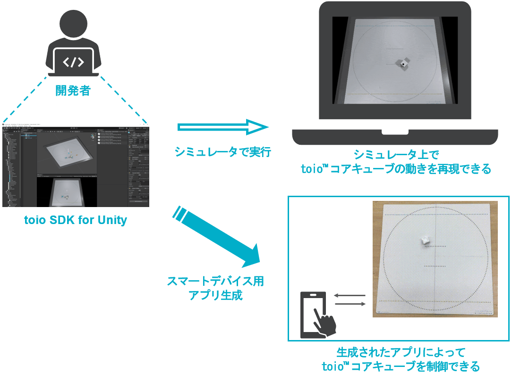

# toio SDK for Unity

## 概要

**toio SDK for Unity (T4U)** は、Unity で toio™コア キューブ（以降キューブ）を制御するためのツールキットです。

toio SDK for Unity を使用することでキューブを使ったアプリを簡単に開発できるようになります。またシミュレータ機能によって、実機を使わずに画面上でキューブの動作を確認できるため、迅速かつ効率的に開発可能です。


<p align="center">
</img>
</p>

<details>
<summary>toio SDK for Unity の一つ大きな特徴は、上図の様に、一つのソースコード（クリック展開）でシミュレータとリアルのキューブの両方を動かすことが出来ます。</summary>

```C#
using UnityEngine;
using toio;

public class Hello_Toio : MonoBehaviour
{
    CubeManager cubeManager;
    Cube cube;

    async void Start()
    {
        // create a cube manager
        cubeManager = new CubeManager();
        // connect to the nearest cube
        cube = await cubeManager.SingleConnect();
    }

    void Update()
    {
        // check connection status and order interval
        if(cubeManager.IsControllable(cube))
        {
            cube.Move(100, 70, 200);
            //         |    |   `--- duration [ms]
            //         |    `------- right motor speed
            //         `------------ left motor speed
        }
    }
}
```

</details>


## システム全体の構成図

<p align="center">
</img>
</p>

ローレベル（左）からハイレベル（右）に説明していきます。
- Simulator：Unity Editor で実行できるシミュレータ
- BLE：スマートデバイスやウェブで、リアルのキューブとブルートゥース通信するモジュール
- Cube：シミュレータとリアルの両方を統一し、キューブを扱うクラス
- CubeHandle：便利な移動機能をまとめたクラス
- Navigator：高度な集団制御を実現したクラス
- CubeManager：複数のキューブと各種の機能を便利に管理するクラス


## 機能一覧

- シミュレータ
  - Unity Editor でキューブを動かせる
  - Drag&Drop、力で引っ張る、押す等のインタラクションが可能
  - 公式又はカスタムのマットを複数枚設置できる
  - トイオ・コレクションと開発者向けの Standard ID を設置できる
  - シミュレータ用に［マット+ライト+カメラ］を便利なワンセットとして用意
- BLE通信モジュール
  - iOS アプリでキューブと通信する
  - ウェブアプリでキューブと通信する
  - （開発中：androidアプリでキューブと通信する）
  - （開発中：MacのUnity EditorでPlay時にキューブと通信する）
- Cube
  - 一つのソースコードで、シミュレータとリアルの両方のキューブを同じく動かせる
  - キューブをスキャン、接続、再接続できる
- CubeHandle（便利な移動機能）
  - キューブを目標位置、角度へ誘導できる
  - キューブがマットから出ないよう、ボーダー制限をかけられる
  - 一回の呼び出しで一定距離の移動や角度の変化が可能
- Navigator（高度な集団制御）
  - ヒューマンライク衝突回避で、複数台のキューブが互いに衝突回避できる
  - ボイドで、複数台のキューブを群れとして動かせる
  - 衝突回避とボイドは組み合わせて同時実行できる
  - 目標に移動する以外に目標から離れるようなナビゲーションもできる


## 動作環境

- Unity 2019 LTS

また、iOS 向けビルドには以下の二つも必要となります。

- Xcode 11
- [CocoaPods](https://cocoapods.org/) (version 1.9 以上)

## 開発手順

1. 開発環境を整える　[→「事前準備」参照](docs/preparation.md)
1. Unity で新規プロジェクトを作り、新規プロジェクトにT4Uを読み込む　[→「toio SDK for Unityのインストール」参照](docs/download_sdk.md)
1. 新しいシーンを作って、シミュレータの Prefab を読み込む（又は既存のサンプルシーンを複製する）　[→「シーン作成」参照](docs/tutorials_basic.md#シーン作成)
1. Unity Editor で Play してシミュレータで動作確認しながらプログラムを作っていく（シーンとスクリプトを編集する）　[→docs/README.md参照](docs/README.md)
1. スマートデバイス向けにビルドしてアプリを作り、端末で動作確認　[→「iOSビルド」参照](docs/build_ios.md)
1. `4` `5` を繰り返してプログラムを仕上げていく

## ドキュメント

インストール、チュートリアル、サンプル紹介、機能解説などの詳細なドキュメントは[ docs/README.md ](docs/README.md)をご参照ください。

## ライセンス

- [LICENSE](LICENSE)
- [Third Party Notices](Third-Party-Notices.md)
