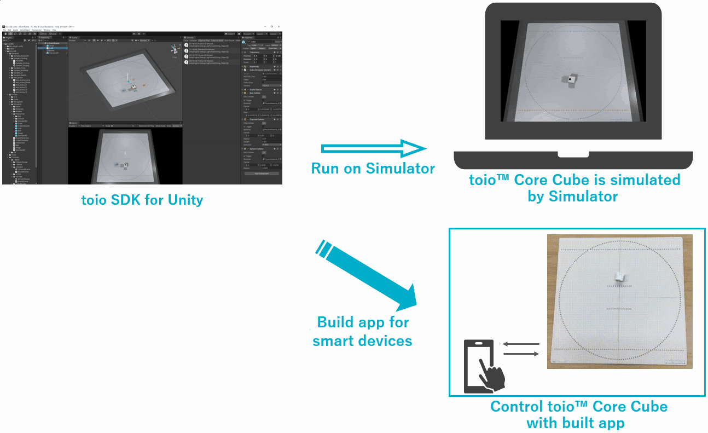

# toio SDK for Unity

> **Switch Language:**　[`日本語`](README.md)　|　`English`

## Overview

**toio SDK for Unity** is a Software Development Kit for controlling toio™ Core Cube (hereafter referred to as Cubes) in Unity.

toio SDK for Unity makes it easy to develop applications that use Cubes. In addition, the simulator function allows you to check the operation of Cube on the screen without using the actual device, so you can develop quickly and efficiently.


<p align="center">

</p>

One of the key features of toio SDK for Unity is that it allows you to run both the simulator and the real Cube with a single source code, as shown below.

```csharp
using UnityEngine;
using toio;

public class Hello_Toio : MonoBehaviour
{
    CubeManager cubeManager;
    Cube cube;

    async void Start()
    {
        // create a cube manager
        cubeManager = new CubeManager();
        // connect to the nearest cube
        cube = await cubeManager.SingleConnect();
    }

    void Update()
    {
        // check connection status and order interval
        if(cubeManager.IsControllable(cube))
        {
            cube.Move(100, 70, 200);
            //         |    |   `--- duration [ms]
            //         |    `------- right motor speed
            //         `------------ left motor speed
        }
    }
}
```


## Feature list

- Simulator
  - Ability to move Cubes in Unity Editor
  - Interactive UI like Drag&Drop, force pull, push and etc.
  - Multiple official or custom mats can be set
  - toio Collection and Standard ID for developers.
  - One useful set of mats, lights, and cameras for simulator
- BLE communication module
  - Communicate with Cube via iOS app
  - Communicating with Cube via Web App
  - Communicate with Cube in Android app
  - Communicate with Cube when playing in Unity Editor on Mac
- Cube
  - One source code to run both simulator and real Cubes in the same way
  - Scan, connect, and reconnect Cubes
- CubeHandle (useful movement feature)
  - Guide Cube to the target position and angle
  - Borders can be restricted to keep Cube from leaving the mat
  - Control Cube for a certain distance or angle with a single call
- Navigator (advanced group control)
  - Human-like collision avoidance allows multiple cubes to avoid colliding with each other
  - Bird-oid allows Cubes to move as a herd
  - Collision avoidance and voids can be combined and run simultaneously
  - In addition to moving to the target, it can also navigate away from the target.
- Visual Scripting
  - Cube, CubeHandle, and Navigator are available in Visual Scripting, a standard since Unity2021.

## Operating Environment

- toio™ Core Cube
- Mat for toio™Core Cube (Play mat included in toio Collection, Simple play mat included in toio™Core Cube (single package), toio play mat for development)
- Mac (macOS ver. 11 or higher)
- Windows 10 (64 bit version only)
- iOS devices (iOS ver. 12 or higher)
- Android device (Android OS 9.0 or higher)
- Unity（2022.3.2f1LTS）
- Unity Visual Scripting(ver 1.8.0)

## Documentation

For details on installation, tutorials, sample introductions, and feature explanations, please refer to the following documents.

- [toio SDK for Unity Documentation](https://morikatron.github.io/toio-sdk-for-unity/docs_EN/)
- [toio SDK for Unity Documentation (Github version)](https://github.com/morikatron/toio-sdk-for-unity/blob/main/docs_EN/README.md)

## Sample applications

- [CubeMarker](https://github.com/morikatron/toio-cube-marker): an online battle game (Japanese)
- [toio-AI-meicu](https://github.com/morikatron/toio-AI-meicu)：AI Experience Content "Challenge the AI Robot 'Maze Cube' at the Toio AI Gym (Beta Version)" (Japanese)

## License

- [LICENSE](https://github.com/morikatron/toio-sdk-for-unity/blob/main/LICENSE)
- [Third Party Notices](Third-Party-Notices.md)
- [Intellectual Property Notice](Trademark-Notices_EN.md)
