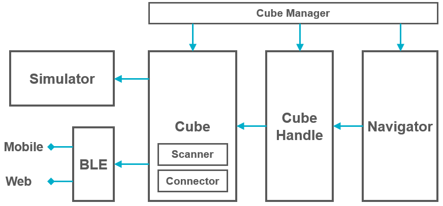

# toio SDK for Unity ドキュメント

## 開発概要

### 【 1 】セットアップ

1. 開発環境を整える [→「事前準備」](preparation.md)
2. Unity で新規プロジェクトを作り、 toio SDK for Unity を読み込む [→「toio SDK for Unity インストール」](download_sdk.md)
3. オプション機能の導入
   - [→「Mac用BLE通信の導入」](usage_macble.md)
   - [→「Unity Visual Scripting向けの設定」](visual_scripting_setting.md)
  

### 【 2 】開発

1. 開発前に確認する [→「シミュレータの操作方法（マットやキューブの設定等）」](development_simulator.md)
2. Assets フォルダの下に開発用フォルダを作成する [→「スクリプトの依存関係」](development_basics.md#1-スクリプトの依存関係)
3. 新しいシーンを作って、シミュレータの Prefab を読み込む [→「シーン作成」](tutorials_basic.md#2-シーン作成)
4. プログラムを作っていく
  

### 【 3 】Unity Editor で動作確認（シミュレータまたは実機に接続）

1. 再生ボタンを押してシミュレータで動作確認する
2. ConnectType を Real (実機)に設定し、再生ボタンを押して実機と接続して動作確認する
    - Macの場合は[BLEプラグインの導入](usage_macble.md)が必要
    - ConnectType の仕様と設定方法についてはサンプル [ConnectType](../toio-sdk-unity/Assets/toio-sdk/Samples/Sample_ConnectType/) を参照
3. 開発とUnity Editorでの動作確認を繰り返し、効率良くプログラムを仕上げていく
  

### 【 4 】ビルド

1. スマートデバイス向けにビルドしてアプリを作り、端末で動作確認
    - [「 iOS ビルド」](build_ios.md) | [「 Android ビルド」](build_android.md) | [「 WebGL ビルド」](build_web.md)
    - Mac と Windows 10 のビルドは[Unity公式ドキュメント](https://docs.unity3d.com/ja/2022.3/Manual/PublishingBuilds.html)を参照してください

 

## チュートリアル

### 基本

- [1. 概要](tutorials_basic.md#1-概要)
- [2. シーン作成](tutorials_basic.md#2-シーン作成)
- [3. 移動する](tutorials_basic.md#3-移動する)
- [4. 音を鳴らす](tutorials_basic.md#4-音を鳴らす)
- [5. LED を発光する](tutorials_basic.md#5-led-を発光する)
- [6. toio IDの読み取り(Position ID & Standard ID)](tutorials_basic.md#6-toio-idの読み取りposition-id--standard-id)
- [7. センサーのイベントを検知](tutorials_basic.md#7-センサーのイベントを検知)
- [8. 複数のキューブを動かす](tutorials_basic.md#8-複数のキューブを動かす)
- [9. CubeManagerクラスを用いたソースコードの簡略化](tutorials_basic.md#9-cubemanagerクラスを用いたソースコードの簡略化)
- [10. 途中接続/途中切断](tutorials_basic.md#10-途中接続--途中切断)
- [11. UI の作成](tutorials_UI.md)
- [12. Unity Visual Scriptingでの利用方法](tutorials_visual_scriptings.md)

### 便利な移動機能 - CubeHandle

- [1. CubeManager を使ったキューブの同期制御](tutorials_cubehandle.md#1-cubemanager-を使ったキューブの同期制御)
- [2. CubeHandle](tutorials_cubehandle.md#2-cubehandle)
  - [2.1. CubeHandle の Move 関数と MoveRaw 関数](tutorials_cubehandle.md#21-cubehandle-の-move-関数と-moveraw-関数)
  - [2.2. キューブとの通信量を抑える One-shot メソッド](tutorials_cubehandle.md#22-キューブとの通信量を抑える-one-shot-メソッド)
  - [2.3. 指定した座標/方向に到達する Closed-Loop メソッド](tutorials_cubehandle.md#23-指定した座標方向に到達する-closed-loop-メソッド)
- [3. Follow TargetPole デモ](tutorials_cubehandle.md#3-follow-targetpole-デモ)

### 集団制御 - Navigator

- [1. CubeNavigator](tutorials_navigator.md#1-cubenavigator)
  - [1.1. CubeManager を使って CubeNavigator を利用する](tutorials_navigator.md#11-cubemanager-を使って-cubenavigator-を利用する)
    - [1.1.1. 非同期でキューブを制御する場合](tutorials_navigator.md#111-非同期でキューブを制御する場合)
    - [1.1.2. 同期でキューブを制御する場合](tutorials_navigator.md#112-同期でキューブを制御する場合)
    - [1.1.3. CubeManager を使わないで CubeNavigator を利用する](tutorials_navigator.md#113-cubemanager-を使わないで-cubenavigator-を利用する)
  - [1.2. CubeNavigator による衝突回避](tutorials_navigator.md#12-cubenavigator-による衝突回避)
    - [1.2.1. 衝突を回避しつつ目標に移動する Navi2Target 関数](tutorials_navigator.md#121-衝突を回避しつつ目標に移動する-navi2target-関数)
    - [1.2.2. 目標から離れる NaviAwayTarget 関数](tutorials_navigator.md#122-目標から離れる-naviawaytarget-関数)
  - [1.3. ボイドによる集団制御](tutorials_navigator.md#13-ボイドによる集団制御)
  - [1.4. ボイド + 衝突回避](tutorials_navigator.md#14-ボイド--衝突回避)

 

## サンプル

### 基礎

- [Sample_ConnectType](../toio-sdk-unity/Assets/toio-sdk/Samples/Sample_ConnectType/)

  接続設定の違いによって、シミュレータとリアルで接続設定が変わるか確認するサンプルです。

- [Sample_ConnectName](../toio-sdk-unity/Assets/toio-sdk/Samples/Sample_ConnectName/)

  指定した Local Name のキューブと接続するサンプル集です。

- [Sample_Circling](../toio-sdk-unity/Assets/toio-sdk/Samples/Sample_Circling/)

  CubeNavigator のモードの違いによって、多数台のキューブの挙動がどのように変わるか確認するサンプルです。

- [Sample_Cross](../toio-sdk-unity/Assets/toio-sdk/Samples/Sample_Cross/)

  CubeNavigator を使って多台数のキューブが衝突回避しながら移動をするサンプルです。

- [Sample_Sensor](../toio-sdk-unity/Assets/toio-sdk/Samples/Sample_Sensor/)

  キューブの各センサ値を検出し、UIに表示するサンプルです。

- [Sample_Motor](../toio-sdk-unity/Assets/toio-sdk/Samples/Sample_Motor/)

  Cube.TargetMove、Cube.AccelerationMove を使ってキューブを動かすサンプルです。

- [Sample_VisualizeNavigator](../toio-sdk-unity/Assets/toio-sdk/Samples/Sample_VisualizeNavigator/)

  CubeNavigator の HLAvoid 計算結果と定義されたすべての Wall を可視化するサンプルです。

### 応用

- [Sample_MultiMat](../toio-sdk-unity/Assets/toio-sdk/Samples/Sample_MultiMat/)

  複数のマットを併せて一枚の大きいマットとして使うサンプルです。

- [Sample_Bluetooth](../toio-sdk-unity/Assets/toio-sdk/Samples/Sample_Bluetooth/)

  低レベルモジュールである BLE インタフェースを直接利用してキューブと通信するサンプルです。

- [Sample_WebGL](../toio-sdk-unity/Assets/toio-sdk/Samples/Sample_WebGL/)

  ブラウザで動作するウェブアプリのサンプル集です。

- [Sample_Scenes](../toio-sdk-unity/Assets/toio-sdk/Samples/Sample_Scenes/)

  リアルのキューブとの接続・シミュレータ上のキューブと相関インスタンスを維持したままに、シーン遷移を扱うサンプルです。

- [Sample_DigitalTwin](../toio-sdk-unity/Assets/toio-sdk/Samples/Sample_MultiMat/)

  リアルキューブの動きをシミュレーターのキューブにリアルタイムに反映する、いわゆる「ディジタルツイン」を実現したサンプルです。

 

## 技術ドキュメント

### システム全体の構成図

ローレベル（左）からハイレベル（右）に説明して行きます。
- Simulator：Unity Editor で実行できるシミュレータ
- BLE：スマートデバイスやウェブで、リアルのキューブとブルートゥース通信するモジュール
- Cube：シミュレータとリアルの両方を統一し、キューブを扱うクラス
- CubeHandle：便利な移動機能をまとめたクラス
- Navigator：高度な集団制御を実現したクラス
- CubeManager：複数のキューブと各種の機能を便利に管理するクラス

### 使い方

- [Cubeクラス](usage_cube.md)
- [シミュレータ](usage_simulator.md)
- [CubeHandleクラス](usage_cubehandle.md)
- [Navigatorクラス](usage_navigator.md)

### 機能説明

- [Cubeクラス](sys_cube.md)
- [BLE(Bluetooth Low Energy)](sys_ble.md)
- [シミュレータ](sys_simulator.md)
- [Navigatorクラス](sys_navigator.md)

 

## FAQ

- [FAQ](FAQ.md)
