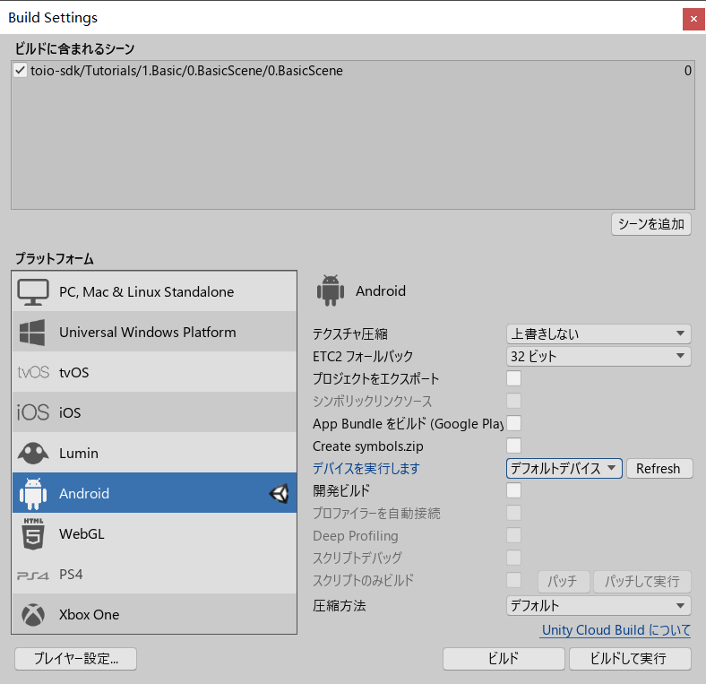
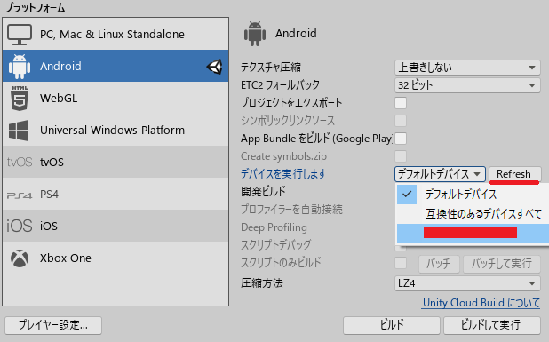
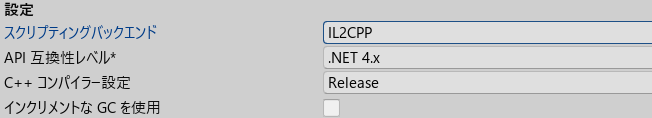
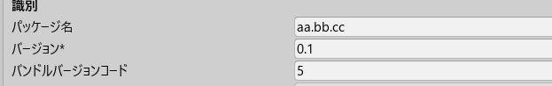
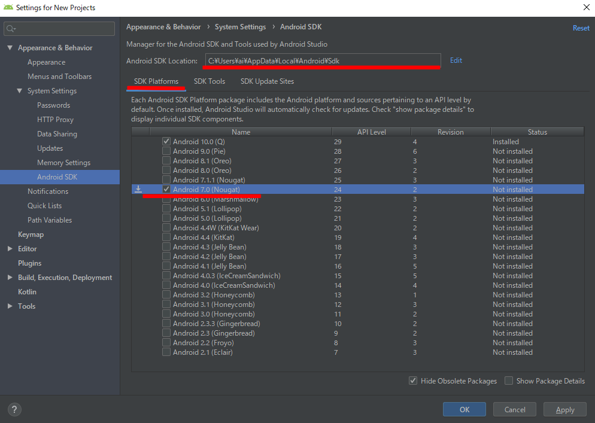
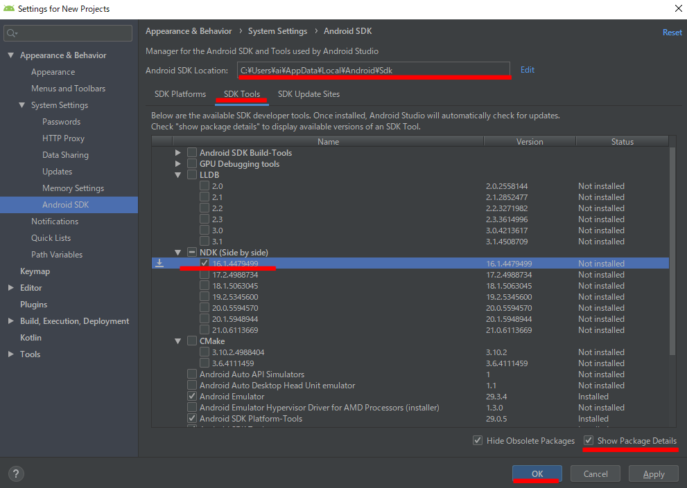
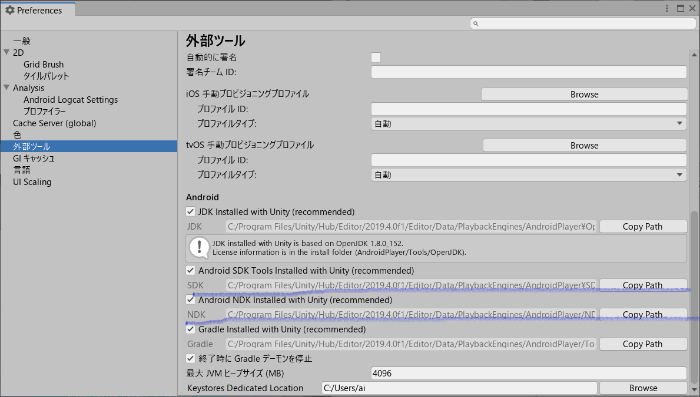

# Androidビルド

ここでは toio SDK for Unity を使ったプロジェクトを Android 向けにビルドする方法を解説します。

## 動作確認済み環境

以下の環境で動作確認をしています。必ずしも合わせる必要はありませんが、自分の環境でうまく行かない場合の参考にしてください。

| ツール・ソフトウェア | 確認バージョン         | 推奨バージョン          |
| -------------------- | ---------------------- | ----------------------- |
| OS                   | Winidows 10            | Winidows 10 以上        |
| Unity                | 2019.4.0f1             | 2019.3 以上             |

スマホ
| 機種名 | OS|
| -- | -- |
| HUAWEI nova 5T　  | Android 9|
| Xiaomi Mi Note 10 Lite| Android 10|

 

## UnityのAndroid Build Supportをチェック

Unity をインストールする時に Android Build Support モジュールを追加しなかった場合は、 Unity Hub を開いて［インストール］タブで、相応のバージョンの右上のメニューの［モジュールを加える］から Android Build Support を加えてください。

 

## ビルドのプラットフォームをアンドロイドに切り替え

ここでは、[toio SDK for Unity のインストール](download_sdk.md)の最後から続けて `Assets/toio-sdk-unity/Assets/toio-sdk/Tutorials/1.Basic/0.BasicScene/` を開いているものとして説明を進めます。

まず、Unity のメニュー【ファイル】→【ビルド設定...】を選択してください。【Build Settings】の【プラットフォーム】のリストから Android を選択し、右下の 【Switch Platform】 ボタンを押してください。

数秒待ち、 Android の右にUnityのアイコンが表示されたら、切り替えが完成です。

 

## スマートフォンの設定

スマートフォンの設定はバリエーションが多いので、[Unity公式ページのAndroid環境の設定](https://docs.unity3d.com/ja/current/Manual/android-sdksetup.html)から引用します。

### 開発者向けオプションを有効にする

USB デバッグを使用できるようにするには、最初に開発者向けオプションを有効にする必要があります。そのためには、デバイスの設定で「ビルド番号」を探します。ビルド番号がどこにあるかは、デバイスによって異なります。Android 設定は通常、設定 > 端末情報 > ビルド番号の順に選ぶと表示されます。デバイスと Android バージョンに関する特有の情報は、ハードウェア製造会社の情報を参照してください。

上記の説明にしたがってビルド番号を探したら、ビルド番号を 7 回タップします。タップするたびに小さなポップアップ画面に「デベロッパーになるまであと X ステップです。」と表示され、X が残りのタップの回数のカウントダウンになります。7 回目のタップで開発者向けオプションがアンロックされます。

注：バージョン 4.2 (Jelly Bean) より古い OS では、開発者向けオプションはデフォルトで有効になっています。

### USBデバッグを有効にする

Settings > Developer options に移動し、USB debugging を有効にします。 
USB でコンピューターに接続すると、Android はデバッグモードになります。 
（PC と接続するとスマートフォン側に「USBデバッグを許可しますか？」というダイアログが表示される場合があります。ダイアログが表示されたら OK をタップしてください）

### 接続の確認

先程の【Build Settings】の右側で、【Refresh】ボタンを押してください。 
その左のデバイスリストに、自分のデバイスがあるかを確認し、選択してください。

 

## IL2CPP を設定

IL2CPP の設定は必須ではないのですが、 
キューブの運動制御などの計算量がかなり多いので、 
Mono より効率のいい IL2CPP をおすすめします。

【Build Settings】の左下にある【プレーヤー設定...】を開いてください。 
（或いは、メニュー【編集】→【プロジェクト設定...】を開き、左側の【player】を選んでください）。 
アンドロイドのアイコンが表示されるタブを選んでください。

【その他の設定】を展開してください。

 

【スクリプティングバックエンド】の【IL2CPP】を選択してください。

 

## Unity 内蔵の環境でビルド

Unity をインストール際に選択した Android Build Support にすでにすべての環境が内蔵されています。 
が、動く場合と動かない場合がありますので、とりあえず試してみましょう。

### パッケージ名を設定

もし同じパッケージ名の他の環境でビルドされたアプリがすでに端末にインストールされたら、インストールが失敗する可能性が高いので、自分のパッケージ名を設定しましょう。

[IL2CPPの設定](build_android.md#IL2CPP-を設定)と同じ、 
【Project Settings】-【Player】-【Androidのアイコンのタブ】-【その他の設定】の中で、パッケージ名を変更してください。

### ビルド

【Build Settings】を開き、右下の【ビルドして実行】を押せば、 
Unity が ビルドし、アプリを端末にインストールし実行するはずです。

成功したら、本マニュアルはここで終わります。おつかれさまです。 
失敗したら、次に進みましょう。

 

## Android SDK をインストール

上記でうまくいかない場合は、以下をお試しください。

### Android Studio のインストール

[Download Android Studio](https://developer.android.com/studio/)からダウンロードしインストールしてください。

普通のソフトウェアのインストールと変わりませんが、もし疑問がある場合は 
公式のマニュアル [Install Android Studio](https://developer.android.com/studio/install) を参照してください。

### Android SDK をインストール

インストール完了後初めてAndroid Studioを起動すると、 
設定とコンポーネントのインストールが実行されます。 
既定設定で進めば良いです。

完了すると、次のタイトル画面になります。 
右下の【Configure】メニューの【SDK Manager】を開いてください。

 

SDKのパスをメモしておいてください。 
【SDK Platform】の下に、必要なバージョンをチェックしてください。

 

次に【SDK Tools】タブに切り替えます。 
右下の【Show Package Details】をチェックしてください。 
【NDK(Side by Side)】の下の妥当なバージョンをチェックしてください。 
（Unity バージョン 2019.1 又は 2019.2 だと、NDK 16 を選びます。[ここを参考に](https://docs.unity3d.com/ja/2019.3/Manual/android-sdksetup.html)） 
【OK】を押して進めばインストールが始まります。

 

## Unity で Android 環境を設定

### SDK と NDK のパス設定

メニュー【編集】→【環境設定...】を開き、 
左側に【外部ツール】を選んでください。

【Android SDK Tools Installed with Unity(recommended)】のチェックを外し、 
先程メモした SDK のパスを設定してください。

【Android NDK Installed with Unity(recommended)】のチェックを外し、 
「SDKのパス」/ndk/「バージョンナンバー」を設定してください。

 

### ビルド

【Build Settings】を開き、右下の【ビルドして実行】を押せば、 
Unity が ビルドし、アプリを端末にインストールし実行するはずです。

アプリが正しくビルドされていれば、iPhone の画面はこのようになります。

最初にアプリケーションを起動したときは「Bluetooth の使用を許可する？」ダイアログが表示されます。ダイアログで許可すると、アプリケーションとキューブとが通信をはじめ、キューブが動き始めます。