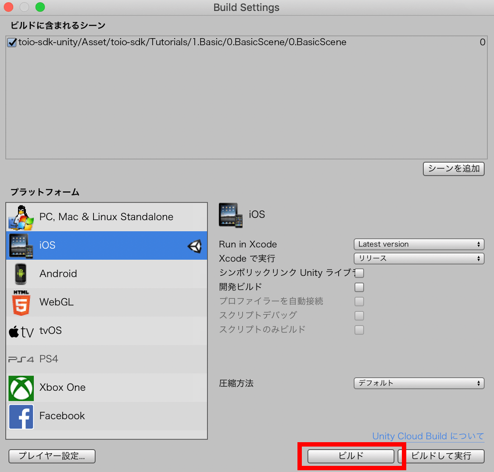

# iOS ビルド

ここでは toio SDK for Unity を使ったプロジェクトを iOS 向けにビルドする方法を解説します。

## 動作確認済み環境

以下の環境で動作確認をしています。必ずしも合わせる必要はありませんが、自分の環境でうまく行かない場合の参考にしてください。

| ツール・ソフトウェア | 確認バージョン | 推奨バージョン |
| -------------------- | ---------------------- | ----------------------- |
| OS    | macOS 13.4.1 | macOS 11 以上 |
| Unity | 2022.3.2f1 | 2022.3 以上 |
| Xcode | 14.3.1 (14E300c) | 13 以上 |
| iOS   | 12.3.1, 13.2.2 | 11 以上 |

## Unity の iOS Build Support をチェック

Unity をインストールする時に iOS Build Support モジュールを追加しなかった場合は、 Unity Hub を開いて［インストール］タブで、相応のバージョンの右上のメニューの［モジュールを加える］から iOS Build Support を加えてください。

## ビルドプラットフォームを iOS に切り替え

ここでは、[toio SDK for Unity のインストール](download_sdk.md)の最後から続けて `Assets/toio-sdk/Tutorials/1.Basic/0.BasicScene/` を開いているものとして説明を進めます。

まず、Unity のメニュー【ファイル】→【ビルド設定...】を選択してください。【Build Settings】の【プラットフォーム】のリストから iOS を選択し、右下の 【Switch Platform】 ボタンを押してください。

しばらく待ち、iOS の右に Unity のアイコンが表示されたら、切り替え完了です。

## Xcode プロジェクトのビルド

ビルドに含みたいシーンファイルを開いている状態で、Unity のメニュー【ファイル】→【ビルド設定...】を選択してください。次に【Build Settings】の【シーンを追加】ボタンを押します。

すると【ビルドに含まれるシーン】のリストに 0.BasicScene が登録されます。続けて【ビルド】ボタンを押します。

XCode のプロジェクトファイルを保存するダイアログが表示されるので、適当な名前をつけて保存してください。この例では SimpleScene とつけています。

## Xcode でプロジェクトを開く

iOS 用のビルドをするために Xcode でプロジェクトファイル（この例では SimpleScene/Unity-iPhone.xcodeproj ）を開きます。

## Xcode プロジェクトの設定

以下の Unity 公式ページを参考に、Xcode プロジェクトの設定やプロビジョニングプロファイルの設定を行います。

- [iOS 用ゲームの開発について \- Unity マニュアル](https://docs.unity3d.com/ja/2022.3/Manual/iphone-GettingStarted.html)

## Xcode ビルド

Xcode で各種設定を行い、接続した iPhone をポップアップメニューから選択したあと、Xcode の実行ボタンを押すと、ビルドされたアプリケーションが iPhone に転送＆起動されます。

このサンプルでは起動直後にキューブへの接続が始まるので、事前にキューブの電源を入れておくと良いです。

アプリが正しくビルドされていれば、iPhone の画面はこのようになります。

最初にアプリケーションを起動したときは「Bluetooth の使用を許可する？」ダイアログが表示されます。ダイアログで許可すると、アプリケーションとキューブとが通信をはじめ、キューブが動き始めます。
