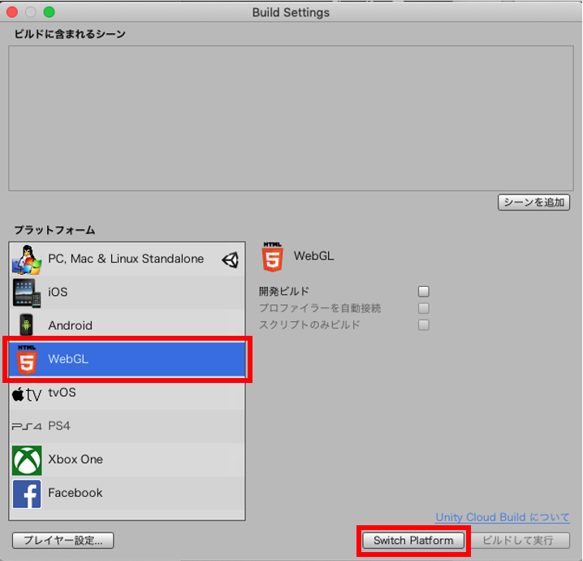
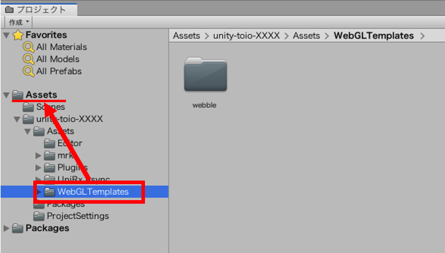
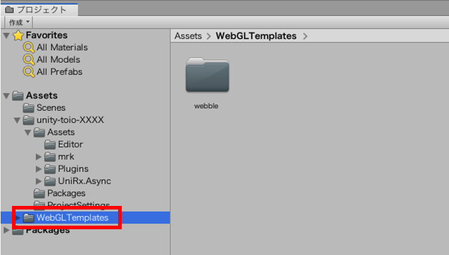
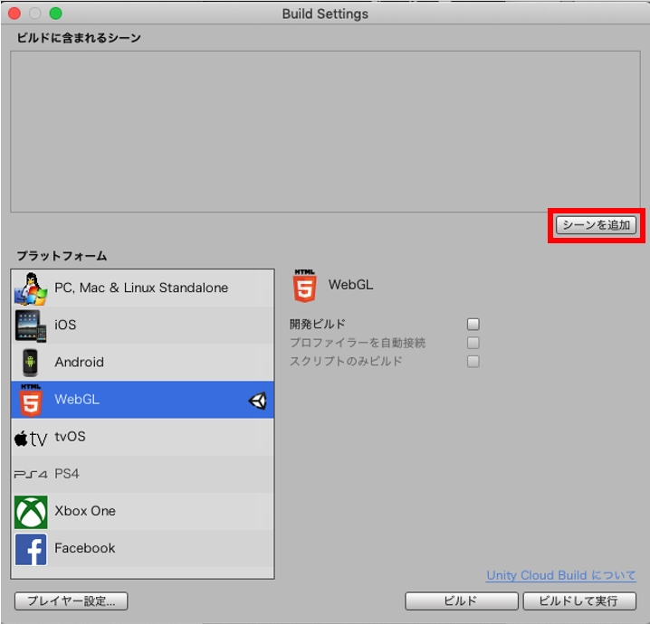
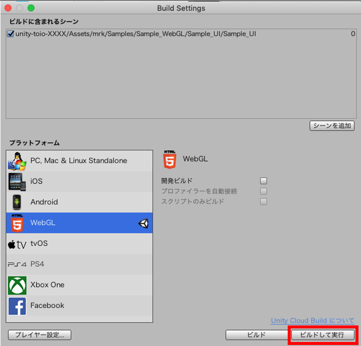

# ウェブアプリビルド

ここでは toio SDK for Unity を使った Unity プロジェクトをブラウザで動作するウェブアプリとしてビルドする方法を解説し、Github Pagesを利用してウェブアプリを公開する手順を簡単に紹介します。

## 目次

- [概要](build_web.md#概要)
- [WebGL ビルド](build_web.md#webgl-ビルド)
- [SNSで共有しよう](build_web.md#SNSで共有しよう)
- [注意事項](build_web.md#注意事項)
<br>

## 概要

本 SDK は Unity エンジンで動作するライブラリです。Unity エンジン は WebGL を使ったウェブアプリのビルドに対応しており、対象プラットフォームを切り替える事でプロジェクトをウェブアプリとしてビルドする事が出来ます。

Unity エンジンの標準機能には Bluetooth 通信機能が存在しないため、そのままウェブアプリとしてビルドしてもキューブとの通信は出来ません。
そのため、[web-bluetooth](https://webbluetoothcg.github.io/web-bluetooth/) というブラウザから Bluetooth 通信制御を行う機能を提供する API を利用し、ウェブアプリで動作する Unity プログラムから Bluetooth 通信を制御出来るプラグインを用意しました。
iOS ビルドと同様に、対象プラットフォームを WebGL にしてビルドをすると自動的にこのプラグインに切り替わりウェブアプリとキューブ間で通信出来る仕組みになっています。

[WebGL ビルド](build_web.md#webgl-ビルド)の章では、ウェブアプリとしてビルドした場合にブラウザ用 Bluetooth プラグインを動かすための設定などを説明します。
[SNSで共有しよう](build_web.md#SNSで共有しよう)の章では、ビルドしたウェブアプリを SNS などを通して世界に公開するための手順を簡単に紹介します。

<br>

## WebGL ビルド

### 動作確認済み環境

以下の環境で動作確認しています。必ずしも合わせる必要はありませんが、自分の環境でうまく行かない場合は参考にしてください。

#### Mac

| ツール・ソフトウェア | 確認バージョン         | 推奨バージョン          |
| -------------------- | ---------------------- | ----------------------- |
| OS                   | MacOS Catalina 10.15.2 | macOS Mojave 10.14 以上 |
| BluetoothR            | 4.2             | 4.2 以上             |
| Unity                | 2019.4.9f1             | 2019.3 以上             |
| ブラウザ(Chrome)       | 85.0.4183.102         | 56 以上             |

#### Windows

| ツール・ソフトウェア | 確認バージョン         | 推奨バージョン          |
| -------------------- | ---------------------- | ----------------------- |
| OS                   | Windows 10 Pro 64bit 1903 | Windows 10 |
| BluetoothR            | 5.0(LMP 9.256)         | 4.2 以上             |
| Unity                | 2019.4.9f1             | 2019.3 以上             |
| ブラウザ(Edge)       | 85.0.564.51         | 79 以上             |
| ブラウザ(Chrome)       | 85.0.4183.102         | 56 以上             |

<br>

その他ブラウザでのウェブアプリ動作環境ついては、依存モジュールとなる [WebGL](https://developer.mozilla.org/ja/docs/Web/API/WebGL_API) および [web-bluetooth](https://webbluetoothcg.github.io/web-bluetooth/) のサポート対象をご確認ください。
- WebGL
  - [WebGL のブラウザー間での互換性](https://docs.unity3d.com/ja/2019.4/Manual/webgl-browsercompatibility.html)
  - [Can I use WebGL ?](https://caniuse.com/?search=WebGL)
- web-bluetooth
  - [Can I use web-bluetooth ?](https://caniuse.com/?search=web-bluetooth)
#### 注記

> 開発時点で確認出来たキューブとの最大同時接続数は、3 台となっています。

### Unity の WebGL Build Support をチェック

Unity Hub を開いて、[インストール] タブで、相応のバージョンの右上のメニューの[モジュールを加える] で WebGL Build Support を入れてください。

### ビルドのプラットフォームを WebGL に切り替え

ここでは、[toio-SDK-for-Unity のインストール](download_sdk.md)が完了して`Assets/toio-sdk-unity/Assets/toio-sdk/Samples/Sample_WebGL/Sample_UI/`を開いているものとして進めます。

Unity のメニュー【ファイル】→【ビルド設定...】を選択してください。次に【Build Settings】の【プラットフォーム】リストの中、WebGL を選択し、右下の 【Switch Platform】 ボタンを押してください。



数十秒待ち、WebGL の右に Unity のアイコンが表示されたら、切り替え完成です。

### WebGLTemplate の適応

用意された WebGL プラグインを使用するために、Unity の Javascript テンプレートを変更します。

1. Unity エディタ上で `Assets/toio-sdk-unity/Assets/WebGLTemplates` ディレクトリを `Assets/` ディレクトリ以下にドラック&ドロップで移動します。



移動後に以下のような状態になっている事を確認してください。



2. Build Settings より、【プレイヤー設定】をクリックして設定ウィンドウを開きます。


3. WebGL の設定ウィンドウより、解像度とプレゼンテーションを開きます。WebGL テンプレート項目の【webble】をクリックします。


以上の操作で WebGL プラグインが使用出来るようになりました。

### ウェブアプリをビルド

ビルドに含みたいシーンファイルを開いている状態で、Unity のメニュー【ファイル】→【ビルド設定...】を選択してください。次に【Build Settings】の【シーンを追加】ボタンを押します。



すると【ビルドに含まれるシーン】のリストに Sample_UI が登録されます。続けて【ビルドして実行】をクリックします。



アプリが正しくビルドされていれば、生成されたディレクトリ構成は以下のようになります。

```
sample_ui
├── Build
│   ├── sample_ui.data.unityweb
│   ├── sample_ui.json
│   ├── sample_ui.wasm.code.unityweb
│   ├── sample_ui.wasm.framework.unityweb
│   └── UnityLoader.js
├── TemplateData
│   ├── UnityProgress.js
│   ├── favicon.ico
│   ├── fullscreen.png
│   ├── progressEmpty.Dark.png
│   ├── progressEmpty.Light.png
│   ├── progressFull.Dark.png
│   ├── progressFull.Light.png
│   ├── progressLogo.Dark.png
│   ├── progressLogo.Light.png
│   ├── style.css
│   ├── webble.js
│   └── webgl-logo.png
└── index.html
```

そして、ウェブページの画面はこのようになるはずです。


中央下にある【Connect】ボタンをクリックすると、キューブに接続します。その他のボタンを押すとキューブを操作する事が出来ます。


<br>

# SNSで共有しよう

Unity エンジンから生成されたウェブアプリをサーバーにアップロードする事で、世界中でウェブアプリを実行する事が出来ます。

### 公開方法は色々

1. 自前もしくはクラウドのウェブサーバーにアップロードし、外部からアクセス出来るようにする

2. ウェブサービスやクラウドのファイルサーバーにアップロードして、色々する事でウェブアプリを動かす

などがあります。

世の中には Unity ゲームを簡単に公開できる[unityroom](https://unityroom.com) というウェブサービスがあります。これが使えると良いのですが、本 SDK では Bluetooth 通信用に独自の javascript コードを動かす必要があるため、残念ながら unityroom は使えません。そこで、そこそこ簡単な手順でこれを実現する Github Pages を紹介します。

### Github Pages の紹介

Github Pages は、ウェブサイトを公開できる静的なホスティングサービスです。
このサービスでは javascript コードを直接取得して実行する事が出来るため、上記で説明した Bluetooth 通信プラグインを動かす事が出来ます。
Github Pages についての詳しい説明は[公式ドキュメント](https://docs.github.com/ja/github/working-with-github-pages/about-github-pages)をご参照ください。

### 公開までの手順

1. [github](https://github.com) にログインして、リポジトリを[作成](https://docs.github.com/ja/github/getting-started-with-github/create-a-repo)します。<br>リポジトリ名は`[ユーザー名].github.io`という名前にします。

2. 作成したリモートリポジトリを[クローン](https://docs.github.com/ja/github/creating-cloning-and-archiving-repositories/cloning-a-repository)します。

3. クローンしたリポジトリのディレクトリに、Unity エンジン から生成されたウェブアプリのディレクトリ(`例：Sample_UI/`)をコピーします。

4. 追加したウェブアプリのディレクトリをリモートリポジトリに[追加](https://docs.github.com/ja/github/managing-files-in-a-repository/adding-a-file-to-a-repository-using-the-command-line)します。

5. ブラウザを開き、アドレスバーに`https://[ユーザー名].github.io/sample_ui`を入力すると、ウェブアプリが開きます。

<br>

## 注意事項

### スキャンはキューブ1台ずつ

[web-bluetooth](https://webbluetoothcg.github.io/web-bluetooth/) に用意されている [navigator.bluetooth.requestDevice](https://webbluetoothcg.github.io/web-bluetooth/#dom-bluetooth-requestdevice) を実行してデバイスをスキャンする際、毎回<b>ユーザーの操作イベントからデバイス1台ずつスキャン</b>する必要があります。そのため、ウェブアプリ化する際に以下を気を付ける必要があります。サンプルシーン集として[Sample_WebGL](../toio-sdk-unity/Assets/toio-sdk/Samples/Sample_WebGL/)もあるので、こちらも参考にしてみてください。

- #### 接続ボタンを用意しよう

ユーザーの操作イベントをトリガーとする必要があるためです。

- #### 1台ずつ接続しよう

繰り返しになりますが、ユーザーの操作イベント1回に付きスキャン1回とする必要があります。<br>
接続プログラムにおいては、`NearScanner`と`CubeManager.MultiConnect`を使った複数台接続が出来なくなります。<br>[Sample_UI on WebGL](../toio-sdk-unity/Assets/toio-sdk/Samples/Sample_WebGL/Sample_UI)の実装を参考に、`NearestScanner`もしくは`CubeManager.SingleConnect`を使用するプログラムへの修正を検討してください。


