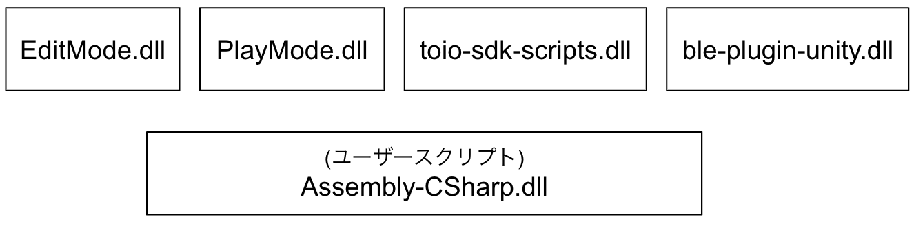
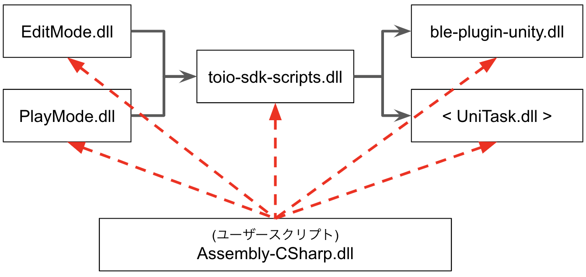
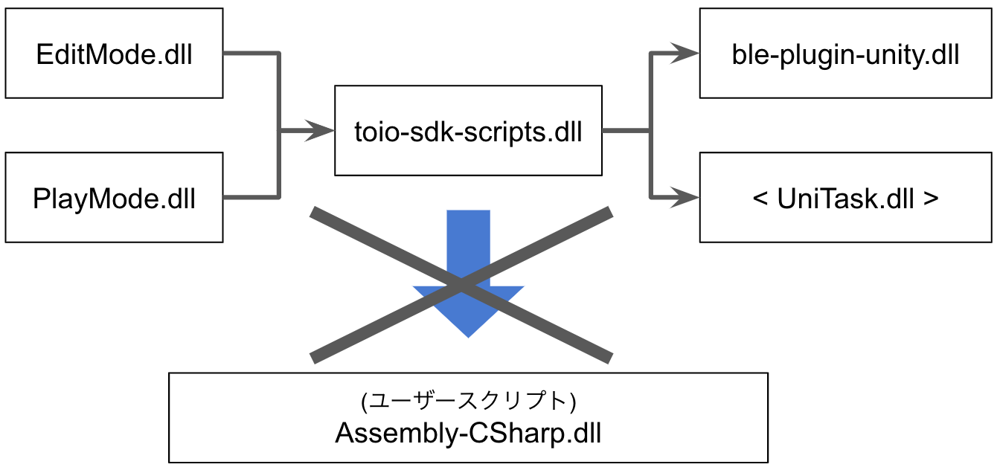

# 開発に関する注意事項

## 目次

- [1. スクリプトの依存関係](development_basics.md#1-スクリプトの依存関係)

<br>

# 1. スクリプトの依存関係

### アセンブリ定義について

本 SDK では Assembly Definition という機能を利用し、スクリプトを複数のアセンブリに分割しています。
この機能を利用して、分割したアセンブリ間の依存関係を設定する事で、コンパイル時間を削減する事が可能です。Assembly Definition の詳細については[【コチラ】](https://docs.unity3d.com/ja/2018.4/Manual/ScriptCompilationAssemblyDefinitionFiles.html)をご参照下さい。

この機能については以下の項目に注意が必要です。

1. アセンブリ定義の無いスクリプトは、基本的に Assembly-CSharp.dll にコンパイルされます。そのため、ユーザーが作成するスクリプトは基本的に Assembly-CSharp.dll に含まれる事となります。

2. 事前に定義した依存関係以外のアセンブリは参照する事が出来ません( Assembly-CSharp.dll を除く)。

3. Assembly-CSharp.dll は全てのアセンブリを参照可能ですが、その他のアセンブリは Assembly-CSharp.dll を参照不可能です。

次の項では、より具体的にアセンブリ定義の機能を説明します。

<br>

### 本 SDK におけるアセンブリ依存関係

アセンブリ分割が行われる際、アセンブリ定義ファイルが置かれているフォルダ内を対象として分割が行われます。本 SDK では下図のような構成でアセンブリ定義ファイルを配置しています。


```
Assets
├── ble-plugin-unity
│   └── ble-plugin-unity.asmdef
└── toio-sdk
    ├── Scripts
    │   └── toio-sdk-scripts.asmdef
    └── Tests
        ├── EditMode
        │   └── EditMode.asmdef
        └── PlayMode
            └── PlayMode.asmdef
```

アセンブリ定義ファイルの配置から、下図のようにアセンブリ分割が行われます。

<div align="center">

</div>

<br>

アセンブリ定義ファイルにはアセンブリ間の依存関係を設定する事が可能です。
本 SDK では下図のようにアセンブリ間の依存関係を設定しています。<br>
なお、UniTask.dll はインストール済みパッケージの物を参照しています。

<div align="center">

</div>

<br>

### toio-sdk/Scripts にはソースコードを置かない

上の項で説明しましたが、下図のように、Assembly-CSharp.dll は全てのアセンブリを参照可能です。

<div align="center">

</div>

<br>

一方で、下図のように、その他のアセンブリは Assembly-CSharp.dll を参照不可能です。

<div align="center">

</div>

<br>

そのため、toio-sdk/Scripts にソースコードを置いてしまうと、ユーザースクリプトを参照出来ずにコンパイルエラーになる場合があります。

このような不具合を未然に防ぐために、Assets フォルダの下に開発用フォルダを作成して、そのフォルダ内に新しいファイルを追加していく事をオススメします。