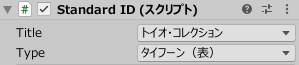

# シミュレータの操作方法

## 目次

- [1. 概要](development_simulator.md#1-概要)
- [2. Mat Prefab](development_simulator.md#2-mat-prefab)
- [3. StandardID Prefab](development_simulator.md#3-standardid-prefab)
- [4. Cube Prefab](development_simulator.md#4-cube-prefab)
- [5. Stage Prefab](development_simulator.md#5-stage-prefab)

 

# 1. 概要

キューブと通信するスマートデバイスのアプリを開発していく際、Unity Editor 上で手軽に動作をチェックする環境があると非常に便利です。
そこで toio SDK for Unity では、テスト用の仮想環境としてシミュレータを用意しています。

本ドキュメントは、toio SDK for Unity を Unity Editor での操作方法を最初に説明するものです。
開発にあたる詳細な使い方（主に API）は、技術ドキュメントの「[使い方 - シミュレータ](usage_simulator.md)」にまとめてありますのでそちらを参照してください。

## 構成

シミュレータは `Assets/toio-sdk/Scripts/Simulator/Resources/` の下にある、以下の 4 つのプリハブから構成されています。

- Mat … 各種[プレイマット](https://toio.github.io/toio-spec/docs/info_position_id)を模したもの
- StandardID … Standard ID を読み取れる各種の[カードやシート](https://toio.github.io/toio-spec/docs/info_standard_id)を模したもの
- Cube … toio™コア キューブを模したもの
- Stage … シミュレーション環境に必要な一通りの機能をセットにしたもの

Mat、StandardID、Cube は実物を模したもので、必要に応じて Unity のシーン上に配置して使ってください。

Stage は、通常一つのマットだけを使う場合、Unity のシーンで必要なものをセットにし、便利機能を加えたものです。
チュートリアルは全て Stage を使っています。

# 2. Mat Prefab

Mat Prefab は各種プレイマットを模したゲームオブジェクトです。

Cube Prefab は Mat Prefab に置くと、 Mat の座標位置と方向を取得することが出来ます。

Mat Prefab はシーンの中に複数枚、水平であれば位置と角度任意で置けます。

## インスペクターでのパラメーター

Unity のインスペクターで、スクリプト Mat.cs の「タイプ」リストに、

- トイコレ付属マット（土俵面）
- トイコレ付属マット（色タイル面）
- キューブ（単体）付属簡易マット
- 開発用マット
- カスタマイズ

のいずれかを選択すると、マットの見た目と座標を変えられます。

| Unity Editor 上での表記 | 正式名称 |
| :-- | :-- |
| トイコレ付属マット（土俵面） | トイオ・コレクション付属のプレイマット(土俵の面) |
| トイコレ付属マット（色タイル面） | トイオ・コレクション付属のプレイマット(色付きタイルの面) | 
| キューブ（単体）付属簡易マット | toio™コア キューブ（単体）付属の簡易プレイマット |
| 開発用マット | toio™開発用プレイマット（仮称） |

各タイプの仕様は、[toio™コア キューブ 技術仕様](https://toio.github.io/toio-spec/docs/info_position_id) と [『開発者向けマット（仮称）』](https://toio.io/blog/detail/20200423-1.html) を参考してください。

# 3. StandardID Prefab

StandardID Prefab は Standard ID を読み取れる各種のカード・シートを模したゲームオブジェクトです。

Cube Prefab を StandardID Prefab の上に載せると、Standard ID と方向を取得することが出来ます。

StandardID Prefab はシーンの中に複数枚、位置と角度任意で置けます。

## インスペクターでのパラメーター

Unity のインスペクターで、スクリプト Mat.cs の「タイトル」を選択してから、特定の「タイプ」のカード・シートを選択して、StandardID を切り替えることが出来ます。

対応できる「タイトル」は以下になります。

- トイオ・コレクション
- 簡易カード

「タイプ」については、[toio™コア キューブ 技術仕様](https://toio.github.io/toio-spec/docs/info_standard_id)を参照してください。

# 4. Cube Prefab

Cube Prefab は toio™コア キューブ を模したゲームオブジェクトです。

> 実際のキューブとは一部機能差があります。 
> 詳細については、[機能の対応状況](usage_cube.md#RealSim-機能表)をご確認下さい。

## CubeSimulator のインスペクター

【シミュレータの設定】と【手動でキューブの状態を変更】との二つの部分に分けられています。

### シミュレータの設定

- `Version`： ファームウェアのバージョン。実行時は変更不可。
- `Motor Tau`： モーターの一次遅れ要素のパラメーター。実行時は変更不可。
- `Delay`： 通信の遅延(指令の送信から取得した座標が変わるまでのラグ)。実行時は変更不可。
- `Force Stop`: チェックすると、モーターの出力を強制的に停止させる。

### 手動でキューブの状態を変更

実行時のみに表示されます。

シミュレータ上でリアルに再現するのが難しい、或いは操作しにくい場合、インスペクターでキューブの状態を変更し、対応イベントを起こすことが出来ます。

- `button 状態`：チェック入れると、ボタンを押したままの状態になります。押された状態ではキューブは動くことが出来ないので、再びキューブを動かしたい場合にはチェックを外しボタンを放した上にする必要があります。また、マウスの操作でボタン状態を変更した場合、この設定が上書きされます。
- `【sloped の変更を手動で行う】`：チェックすると、`sloped 状態` が表示され設定を変更できるようになります。
（通常はシミュレータが毎フレームsloped状態をセットしていますが、この設定が有効な場合はシミュレータがsloped状態をセットしないようになります。）
  - `sloped 状態`：キューブが斜面にいるかを示します。
- `collisionDetected 状態`：衝突を検出したか否かを示します。(現在、シミュレータにはキューブの衝突を検出する機能は実装されていません）

## Cube オブジェクトに対する操作

シミュレータ実行中に、Cube オブジェクトをマウスで操作することが出来ます。

| 操作 | 説明 |
| :--: | :--: |
| 左クリック | Cube のボタンを押す |
| 右クリック | Cube を持ち上げる/キューブを放す |
| 持ち上げ中にホイール操作 | Cube の角度を変更する |
| 右ドラッグ | Cube を力で引っ張る |

詳細は技術ドキュメントの「シミュレータ」[4.5. Cube オブジェクトの操作 (CubeInteraction)](usage_simulator.md#45-Cube-オブジェクトの操作-CubeInteraction) を参照してください。

# 5. Stage Prefab

Stage Prefab は、以下のオブジェクトをセットにしたものです。
- Mat Prefab
- カメラ（マウス操作用の PhysicsRaycaster 付き）
- ライト
- ターゲットポール (後述)
- キューブの脱出を防止する 「テーブル」 と ボーダー
- EventSystem

また、Stage Prefab は以下の 2 つの便利なツールを備えています。
- ターゲットポール
- キューブをフォーカスする

視野がマットにフィットするカメラとライトを内包するため、新規にシーンを作成した場合は、シーンに既にあるカメラとライトを削除してから、Stage Prefab を追加するのをお勧めします。また、Stage は単なる便利なもので、Simulator を使うに必須ではないです。

## Stage に対する操作

| 操作 | 説明 |
| :--: | :--: |
| Ctrl+左クリック | 選択した Cube を[フォーカス](usage_simulator.md#52-キューブをフォーカス)/フォーカスの取り消し |
| Ctrl+右クリック | 指定位置に「[ターゲットポール](usage_simulator.md#51-ターゲットポール)」を設置・取消

詳細は技術ドキュメントの「シミュレータ」[「5.Stage-Prefab」](usage_simulator.md#5-Stage-Prefab)を参照してください。