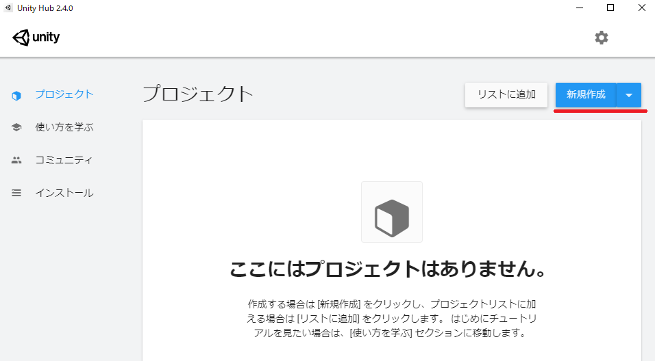
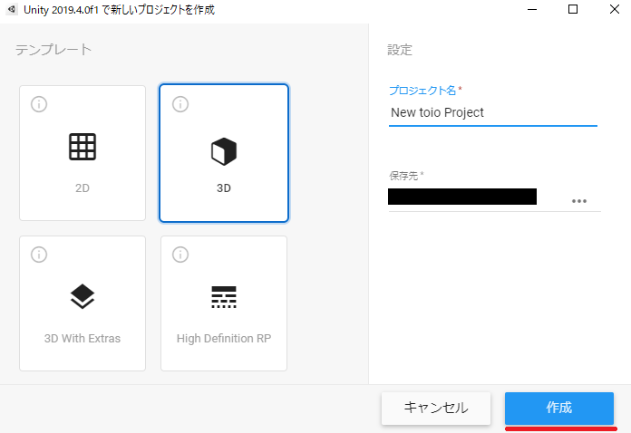
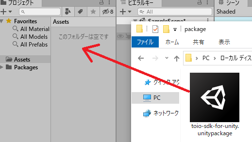

# toio SDK for Unity のインストール

## Unity プロジェクト作成

Unity Hub を開き、右上にある【新規作成】をクリック。

プロジェクト作成画面が開かれたら、以下の設定にします。

- テンプレート：3D
- プロジェクト名：なんでも可(ここでは New toio Project)
- 保存先：なんでも可(ここではデスクトップ)

設定が完了したら、【作成】をクリック。

Unity が立ち上がった事を確認しましょう。

## UniTask のインストール

toio SDK for Unity では、Unity に最適化された非同期処理ライブラリ [UniTask](https://github.com/Cysharp/UniTask) を使用しています。したがって本Unity プロジェクトには UniTask (2.1.0 以降) をインストールする必要があります。 

UniTask のインストールは以下の手順で行います（2021年9月1日現在。Unity 2020.3 LTS）。
1. Unity の [ウィンドウ] メニューから [Package Manager] を選んでPackage Managerを開き
1. [+] アイコンから Add package from git URL... を選び
1. https://github.com/Cysharp/UniTask.git?path=src/UniTask/Assets/Plugins/UniTask を追加する

以下のドキュメントには、UniTaskのインストール手順やスクリーンショットが掲載されていますので、参考にしてください。
* [UniTask の Github リポジトリの説明文](https://github.com/Cysharp/UniTask#install-via-git-url)
* Unity マニュアルの [「Git URL からのインストール」](https://docs.unity3d.com/ja/current/Manual/upm-ui-giturl.html)も参考になります。

## SDK の追加

### 1. unitypackage のダウンロード
[【コチラ】](https://github.com/morikatron/toio-sdk-for-unity/releases/)の最新リリース版の【▼Assets】を開いて【toio-sdk-for-unity.unitypackage】を探し、ダウンロードしてください。

### 2. Unity のプロジェクトにドラッグ&ドロップ
ダウンロードしたフォルダを開いたら、 **【Assets】** フォルダに **【toio-sdk-for-unity.unitypackage】** をドラック&ドロップします。

### 3.サンプルの実行、動作確認
Unity プロジェクトに読み込まれたら、`Assets/toio-sdk/Tutorials/1.Basic/0.BasicScene/`までフォルダを移動し、`0.BasicScene シーンファイル`をダブルクリックで開きます。

シーンファイルが開いたら、エディタ上部にあるプレイボタンをクリックします。

 以下のようにサンプルが動く事（シミュレーター上）を確認してください。
 ※実物のtoio™コア キューブに接続するには[docs/README.mdの「ビルド」](README.md#-3-ビルド)を参照してください。

これで toio SDK for Unity のインストールは完了です。本SDKでは様々なチュートリアルが用意されています。各種チュートリアルについては [チュートリアル(Basic)](tutorials_basic.md) を参照してください。

## Visual Scriptingを利用する場合
toio SDK for UnityをC#ではなくVisual Scriptingで利用したい場合は、上記「サンプルの実行、動作確認」を終えた後、さらに行わなくてはいけない設定、および確認作業があります。

### 1.Unity Visual Scriptingの確認
1. Unity の [ウィンドウ] メニューから [Package Manager] を選んでPackage Managerを開く。
1. 左上が[Packages:in Project]の状態のときに[Visual Scripting]がインストールされていることを確認する。

#### Visual Scriptingがインストールされていない場合
1. Unity の [ウィンドウ] メニューから [Package Manager] を選んでPackage Managerを開く。
1. 左上の[Packages:in Project]アイコンをクリックし、[Unity Registory]を選択する。
1. Visual Scriptingをクリックし、右下の[install] ボタンをクリックする。

[Packages:in Project]の状態でVisual Scriptingが存在していればインストールは完了です。

### 2.toio SDK for UnityをVisual Scriptingで利用できるようにする。
1. [Edit]->[Project Setting]->[Visual Scripting]とクリックする。
1. Node Libraryに[toio-sdk-scripts]を新規に追加する。
1. Type Operationに必要に応じてクラスを新規に追加する。
1. [Regenerate Nodes]をクリックしてノードを再生成する。

Type Operarionに追加するクラスは必要に応じて適宜追加してください。
`Assets/toio-sdk/Tutorials`で対応済みのサンプルを動かすためには以下のクラスを追加する必要があるため、
まずはこれらのクラスをノードとして追加してください。
- [Toio]から
  - Cube
  - Cube Handle
  - Cube Manager
  - Cube Scanner
  - Movement
- [Toio]->[Visual Scripting]から
  - Converter To Byte
  - Visual Script Cube Configration
- [Toio]->[Simulator]から
  - Mat
- [Toio]->[Navigation]から
  - Navigator
- [Enum]から
  - Connect Type

### 3.Visual Scripting版のサンプルの実行、動作確認
Visual Scriptingを利用するために必要な作業を終えたら、Visual Scripting版のサンプルを実行してみましょう。

`Assets/toio-sdk/Tutorials/1.Basic/0.BasicScene/`までフォルダを移動し、`0.BasicScene シーンファイル`をダブルクリックで開きます。

ヒエラルキーの[scene]をクリックします。インスペクター上の[Badic Scene(Script)]に入っているチェックを外し、[Script Machine]にチェックを入れてください。

これでC#で動いていたサンプルがVisual Scriptingで動くようになりました。

エディタ上のプレイボタンを押してC#版と同じ動きをキューブがするかを確認してください。

確認出来たらVisual Scriptingでtoio SDK for Unityを動かす準備は完了です。