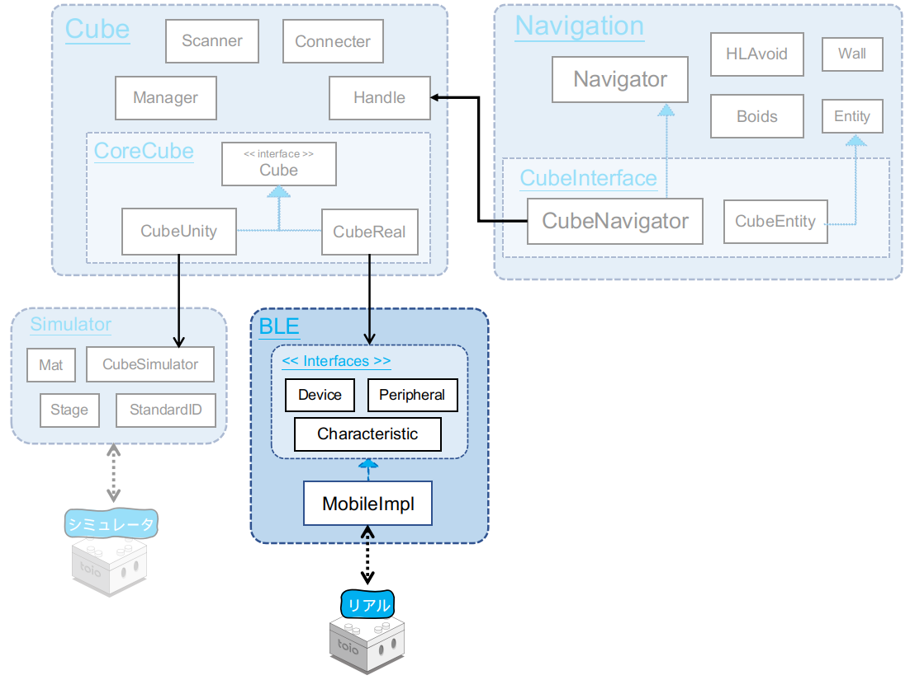
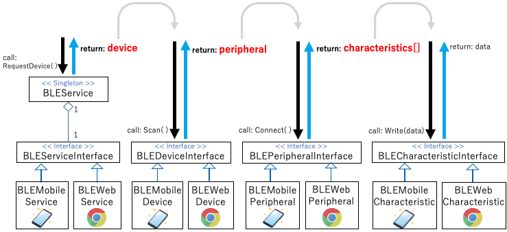

# 技術ドキュメント - 機能説明 - BLE(Bluetooth Low Enegy)

## 目次

- [1. 概説](sys_ble.md#1-概説)
- [2. BLE クラスの構造](sys_ble.md#2-ble-クラスの構造)
- [3. 通信の仕組み](sys_ble.md#3-通信の仕組み)
  - [3.1. 検索と接続](sys_ble.md#31-検索と接続)
  - [3.2. 送信と受信](sys_ble.md#32-送信と受信)

# 1. 概説

<div align="center">

</div>

<br>

BLE モジュール群は、Bluetooth Low Enegy(BLE)の通信機能をインタフェースを介して抽象的に提供するモジュール群です。
全ての BLE クラスをインタフェースを介して実装する事で、通信アーキテクチャとは独立した形で toio™ プログラミングが可能になります。
そのため新たに継承クラスを独自開発する事で BLE 以外の通信モジュールに差し替える事も可能です

<br>

ディレクトリ構成は下図のようになります。

<div align="center">

</div>

<br>

```
BLE  +---------------------------------+ BLEルートディレクトリ
├── interfaces  +----------------------+ インタフェースディレクトリ
│   ├── BLECharacteristicInterface.cs  + Characteristic(機能単位)インタフェース
│   ├── BLEDeviceInterface.cs  +-------+ 端末のBLE機能を提供するインタフェース
│   ├── BLEPeripheralInterface.cs  +---+ Peripheral(接続端末)インタフェース
│   └── BLEServiceInterface.cs  +------+ BLE処理の最初の窓口となるインタフェース
├── mobile  +--------------------------+ モバイル実装ディレクトリ
│   ├── BLEMobileCharacteristic.cs  +--+ Characteristic(機能単位)モバイル実装クラス
│   ├── BLEMobileDevice.cs  +----------+ モバイルのBLE機能を提供するクラス
│   ├── BLEMobilePeripheral.cs  +------+ Peripheral(接続端末)モバイル実装クラス
│   └── BLEMobileService.cs  +---------+ BLE処理の最初の窓口となるモバイル実装クラス
├── unity  +---------------------------+ Unity実装ディレクトリ
│   └── UnityPeripheral.cs  +----------+ Peripheral(GameObject)Unity実装クラス
├── WebGL  +---------------------------+ WebGL実装ディレクトリ
│   ├── Plugins  +---------------------+ WebGL用プラグインディレクトリ
│   │   ├── WebGL  +-------------------+ WebGL用プラグインディレクトリ
│   │   │   └── WebBluetooth.jslib  +--+ WebGLTemplates/webble/webble.jsとやり取りをするスクリプト
│   │   └── WebBluetoothScript.cs  +---+ プラグイン機能を提供するクラス(WebBluetooth.jslibとやり取りをする)
│   ├── BLEWebCharacteristic.cs  +-----+ Characteristic(機能単位)WebGL実装クラス
│   ├── BLEWebDevice.cs  +-------------+ WebGLのBLE機能を提供するクラス
│   ├── BLEWebPeripheral.cs  +---------+ Peripheral(接続端末)WebGL実装クラス
│   ├── BLEWebService.cs  +------------+ BLE処理の最初の窓口となるWebGL実装クラス
└── BLEService.cs  +-------------------+ BLE全体の最初の窓口となるシングルトンクラス
```

<br>

# 2. BLE クラスの構造

<br>

<div align="center">

</div>

<br>

#### BLEService

BLE 機能の最初の窓口となるシングルトンクラス<br>
<u>BLEService.Instance.SetImplement()</u>関数で実装インタンスを入れる事で<br>
内部実装クラスを設定する

実装コード

```csharp
public class BLEService : GenericSingleton<BLEService>
{
    public bool hasImplement { get; private set; }

    public BLEService()
    {
        this.hasImplement = false;
    }

    private BLEServiceInterface impl;

    public void SetImplement(BLEServiceInterface impl)
    {
        this.impl = impl;
        this.hasImplement = true;
    }

    public void RequestDevice(Action<BLEDeviceInterface> action)
    {
        this.impl.RequestDevice(action);
    }
    public async UniTask Enable(bool enable, Action action)
    {
        await this.impl.Enable(enable, action);
    }
    public void DisconnectAll()
    {
        this.impl.DisconnectAll();
    }
}
```

<br>

#### BLEServiceInterface

BLE 処理の最初の窓口となるインタフェース<br>
動作端末の BLE 機能を提供する Device インタフェースを取得する機能を提供する

インタフェースコード

```csharp
public interface BLEServiceInterface
{
    void RequestDevice(Action<BLEDeviceInterface> action);
    void DisconnectAll();
    UniTask Enable(bool enable, Action action);
}
```

<br>

#### BLEDeviceInterface

動作端末の BLE 機能インタフェース<br>主な役目は BLE 機能にアクセスしてスキャン処理を実行すること

インタフェースコード

```csharp
public interface BLEDeviceInterface
{
    void Scan(String[] serviceUUIDs, bool rssiOnly, Action<BLEPeripheralInterface> action);
    void StopScan();
    UniTask Disconnect(Action action);
    UniTask Enable(bool enable, Action action);
}
```

<br>

#### BLEPeripheralInterface

スキャンされた BLE デバイスのインタフェース<br>主な役目はスキャンされた BLE デバイスへの接続処理を実行すること

インタフェースコード

```csharp
public interface BLEPeripheralInterface
{
    string[] serviceUUIDs { get; }
    string device_address { get; }
    string device_name { get; }
    float rssi { get; }
    bool isConnected { get; }

    void Connect(Action<BLECharacteristicInterface> characteristicAction);
    void AddConnectionListener(string key, Action<BLEPeripheralInterface> action);
    void RemoveConnectionListener(string key);
    void ConnectionNotify(BLEPeripheralInterface peri);
}
```

<br>

#### BLECharacteristicInterface

スキャンされた BLE デバイスの機能ごとのインタフェース<br>主な役目は BLE デバイスそれぞれの機能に対して書き込み/読み込み処理を実行すること

インタフェースコード

```csharp
public interface BLECharacteristicInterface
{
    string deviceAddress { get; }
    string serviceUUID { get; }
    string characteristicUUID { get; }

    void ReadValue(Action<string, byte[]> action);
    void WriteValue(byte[] data, bool withResponse);
    void StartNotifications(Action<byte[]> action);
    void StopNotifications();
}
```

# 3. 通信の仕組み

## 3.1. 検索と接続

<br>

<div align="center">

</div>

<br>

### 検索

検索には Scanner クラスを使用します。Scanner クラスの概要は[【コチラ】](sys_cube.md#31-検索scanner)を参照して下さい。<br>この節では Scanner クラスの BLE 処理について解説します。

スキャンは大まかに以下の手順で実行します。

1. RequestDevice 関数を呼び、BLEDeviceInterface 変数を取得します。
2. [CoreCube 識別 ID](https://toio.github.io/toio-spec/docs/ble_communication_overview#キューブの発見-)を対象にスキャンを開始
3. スキャン終了条件(接続数、待機時間)を満たしたらスキャンを終了
4. スキャンにより取得した BLEPeripheralInterface 変数をリターン

<br>

### 接続

接続には Connecter クラスを使用します。[cube ドキュメント](sys_cube.md#32-接続connecter)に殆ど書かれています、ご参照下さい。

BLE 処理として追記するべき点は以下です。

1. Cube 変数の生成直後に[自動通知の購読(cube.StartNotifications)](https://github.com/morikatron/toio-sdk-for-unity/blob/main/toio-sdk-unity/Assets/toio-sdk/Scripts/Cube/CoreCube/Real/CubeReal.cs)を呼び、座標やボタン等の自動通知の購読を開始します。

<br>

## 3.2. 送信と受信

<br>

<div align="center">

</div>
<br>

### 送信

送信呼び出し自体は CubeReal の派生クラスから行われます、[cube ドキュメント](sys_cube.md#4-命令送信)をご参照下さい。<br>

### 受信

接続処理直後に行った[自動通知の購読(cube.StartNotifications)](https://github.com/morikatron/toio-sdk-for-unity/blob/main/toio-sdk-unity/Assets/toio-sdk/Scripts/Cube/CoreCube/Real/CubeReal.cs)により、購読している情報が自動通知されます。
