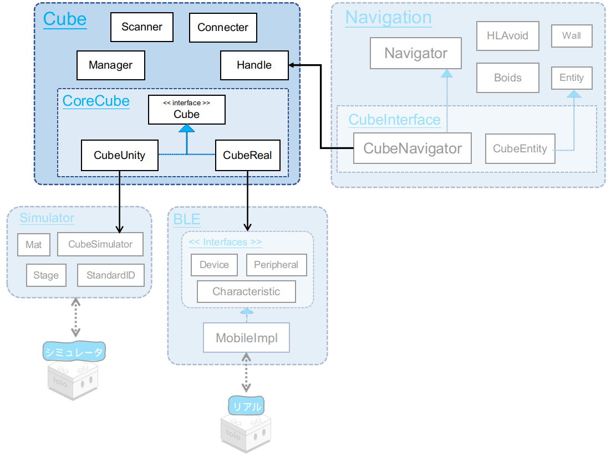
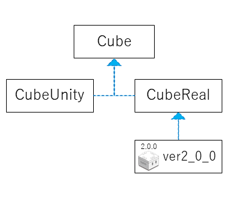
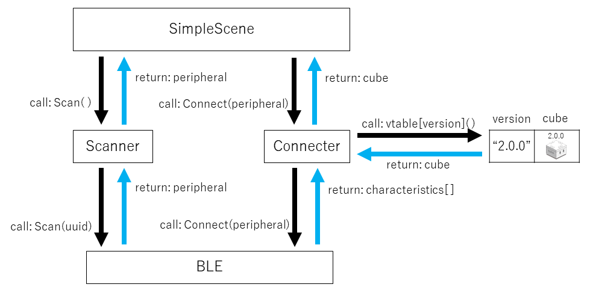
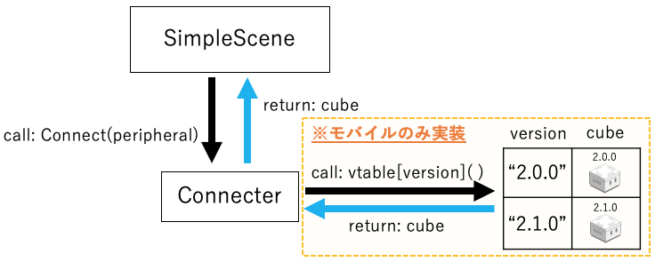

# 技術ドキュメント - 機能説明 - Cube

## 目次

- [1. 概説](sys_cube.md#1-概説)
- [2. Cube クラスの構造](sys_cube.md#2-cube-クラスの構造)
- [3. 接続の仕組み](sys_cube.md#3-接続の仕組み)
  - [3.1. 検索(Scanner)](sys_cube.md#31-検索scanner)
  - [3.2. 接続(Connecter)](sys_cube.md#32-接続connecter)
- [4. 命令送信](sys_cube.md#4-命令送信)
- [5. 機能拡張の方法](sys_cube.md#5-機能拡張の方法)
  - [5.1. Cube クラスに関数を追加するには](sys_cube.md#51-Cube-クラスに関数を追加するには)
  - [5.2. ファームウェアバージョンを追加するには](sys_cube.md#52-ファームウェアバージョンを追加するには)
  - [5.3. 通信プログラムを変更する場合](sys_cube.md#53-通信プログラムを変更する場合)

<br>

# 1. 概説

<div align="center">

</div>

<br>

Cube モジュール群は、Unity システム上で動くキューブ(以下シミュレータ) と 現実のキューブ(以下リアル) を同一のコードで動かす事が出来るマルチプラットフォーム対応モジュールです。

<br>

ディレクトリ構成は下図のようになります。

<div align="center">

</div>

<br>

```
Cube  +-------------------------------+ キューブルートディレクトリ
├── CoreCube  +-----------------------+ コアキューブディレクトリ
│   ├── Real  +-----------------------+ リアル実装ディレクトリ
│   │   ├── Versions  +---------------+ リアル実装のバージョンディレクトリ
│   │   │   └── CubeReal_ver2_0_0.cs  + 2.0.0リアル実装クラス
│   │   └── CubeReal.cs  +------------+ リアル実装抽象クラス
│   ├── Sim    +----------------------+ シミュレータ実装ディレクトリ
│   │   └── CubeUnity.cs  +-----------+ シミュレータ実装クラス
│   ├── Cube.cs  +--------------------+ キューブ抽象クラス
│   └── CubeOrderBalancer.cs  +-------+ 命令送信制御クラス
├── Scanner  +------------------------+ 検索ディレクトリ
│   ├── NearScanner.cs  +-------------+ 複数台検索クラス
│   └── NearestScanner.cs  +----------+ 1台検索クラス
├── CubeConnecter.cs  +---------------+ 接続クラス
├── CubeHandle.cs  +------------------+ 機能拡張クラス
└── CubeManager.cs  +-----------------+ コード簡略化クラス
```

<br>

# 2. Cube クラスの構造

<br>

<div align="center">

</div>
<br>

#### Cube クラス

Cube を操作するためのインタフェースです。<br>
全ての関数・プロパティの中身が未実装となっており、派生クラスに全ての処理を委ねています。<br>
こうする事で実行環境やバージョン毎の内部実装の違いを吸収し、ポリモーフィズムによる抽象的なプログラミングを可能にします。<br>
再利用性を保つために、このクラスには[toio™コア キューブ 技術仕様（通信仕様）](https://toio.github.io/toio-spec/docs/ble_communication_overview.html)以外の機能が存在しません。<br>
toio™コア キューブ 技術仕様（通信仕様）以外の機能を利用/拡張する場合は、[CubeHandle](usage_cubehandle.md), [CubeNavigator](sys_navigator.md)等の拡張クラスを利用します。<br>

実装コード：[Cube.cs](../toio-sdk-unity/Assets/toio-sdk/Scripts/Cube/CoreCube/Cube.cs)

#### CubeUnity

Unity エディタ実行時に動作するシミュレータ用 Cube クラスです。<br>ファームウェアバージョンの解決処理が無いため、1 つのバージョンのみが動作対象になります。<br>

実装コード：[CubeUnity.cs](../toio-sdk-unity/Assets/toio-sdk/Scripts/Cube/CoreCube/Sim/CubeUnity.cs)

#### CubeReal

現実のキューブとの BLE 通信を行う Cube クラスです。<br>最低限の共通処理を除いて、殆どの内部実装を派生クラスで行います。<br>

実装コード：[CubeReal.cs](../toio-sdk-unity/Assets/toio-sdk/Scripts/Cube/CoreCube/Real/CubeReal.cs)

<b>ver2_0_0：</b>

- 実装コード：[CubeReal_ver2_0_0.cs](../toio-sdk-unity/Assets/toio-sdk/Scripts/Cube/CoreCube/Real/Versions/CubeReal_ver2_0_0.cs)
- 通信仕様：https://toio.github.io/toio-spec/docs/2.0.0/about

<br>

# 3. 接続の仕組み

例として、シンプルな Cube 移動コードを示します。<br>このコードを実行すると、Cube へ接続後に移動関数が呼ばれます。Cube はクルクルと回転します。

```C#
using UnityEngine;
using toio;

public class BasicScene : MonoBehaviour
{
    float intervalTime = 0.05f;
    float elapsedTime = 0;
    Cube cube;

    // 非同期初期化
    // C#標準機能であるasync/awaitキーワードを使用する事で、検索・接続それぞれで終了待ちする
    // async: 非同期キーワード
    // await: 待機キーワード
    async void Start()
    {
      	// Bluetoothデバイスを検索
        var peripheral = await new NearestScanner().Scan();
       	// デバイスへ接続してCube変数を生成
        cube = await new CubeConnecter().Connect(peripheral);
    }

    void Update()
    {
        // Cube変数の生成が完了するまで早期リターン
        if (null == cube) { return; }
		// 経過時間を計測
        elapsedTime += Time.deltaTime;

      	// 前回の命令から50ミリ秒以上経過した場合
        if (intervalTime < elapsedTime)
        {
            elapsedTime = 0.0f;
          	// 左モーター速度:50, 右モーター速度:-50, 制御時間:200ミリ秒
            cube.Move(50, -50, 200);
        }
    }
}
```

<br>

この章では、検索接続プログラム部分について解説します。

```C#
async void Start()
{
  // Bluetoothデバイスを検索 (3.1. 検索)
  var peripheral = await new NearestScanner().Scan();
  // デバイスへ接続してCube変数を生成 (3.2. 接続)
  cube = await new CubeConnecter().Connect(peripheral);
}
```

<br>

手早く概要を把握したい方のため、ひとまずこのプログラムの概要図を示します。<br>このプログラムはマルチプラットフォームで動作するため、<br>Scanner モジュール、Connecter モジュールのそれぞれに 2 つの内部実装(リアル実装/シミュレータ実装)が存在します。

<br>

### 検索接続プログラムの概要(リアル実装)

<br>

<div align="center">

</div>

<br>

上の図のような仕組みで、検索・接続を行います。

1. Scanner.Scan 関数を実行して、Peripheral 変数を取得
2. Connecter.Connect 関数を実行して、Characteristic 配列変数を取得
3. Connecter が持つバージョンテーブルを参照して、対応する Cube 変数を取得

<br>

### <u>検索接続プログラムの概要(シミュレータ実装)</u>

<br>

<div align="center">

</div>

<br>

上の図のような仕組みで、検索・接続のダミー処理を行います。

1. Scanner.Scan 関数を実行して、UnityPeripheral 変数を取得
2. Connecter.Connect 関数を実行して、UnityCube 変数を取得

<br>

## 3.1. 検索(Scanner)

<br>

<div align="center">

</div>
<br>

toio SDK for Unity には Bluetooth デバイスの検索モジュールが 2 つあります。

- NearestScanner クラス：
  - Scan 関数：最も信号強度の高いデバイスを戻り値として<b>同期的</b>に返します。
- NearScanner クラス：
  - Scan 関数：信号強度の高い順に指定された<b>複数</b>のデバイスを戻り値として<b>同期的</b>に返します。
  - ScanAsync 関数：信号強度の高い順に指定された<b>複数</b>のデバイスを<b>非同期的</b>にコールバックします。

2 章の始めに示したサンプルコードでは、このうち NearestScanner.Scan を使用して同期的にスキャンをしています。

<br>

### <u>NearestScanner</u>

<b>Scan 関数</b>を呼ぶ事で、最も信号強度の高いデバイスを戻り値として同期的に返します。<br>async/await キーワードでスキャン終了待ちする事で、呼び出し側から見ると同期処理と同じになります。<br>内部実装はシミュレータ実装 と リアル実装の 2 つに分かれており、ビルド対象に応じて内部実装が自動的に変わるため、プラットフォーム毎に別々のコードを書かなくても動作します。<br>
[CubeManager](../toio-sdk-unity/Assets/toio-sdk/Scripts/Cube/CubeManager.cs)に拡張性を持たせる目的で、インタフェースを継承して実装されています。

シミュレータ実装：

- GameObject を生成

リアル実装：

- Bluetooth デバイスを検索

<br>

<details>
<summary>概要コード：（クリック展開）</summary>

```C#
public interface NearestScannerInterface
{
    Task<BLEPeripheralInterface> Scan();
}

public class NearestScanner : NearestScannerInterface
{
#if UNITY_EDITOR
    public async Task<BLEPeripheralInterface> Scan()
    {
        /* return await UnityPeripheral */
    }
#else
    public async Task<BLEPeripheralInterface> Scan()
    {
        /* return await BLEMobilePeripheral */
    }
#endif
}
```

</details>
<br>

実装コード：

- [NearestScanner.cs](../toio-sdk-unity/Assets/toio-sdk/Scripts/Cube/Scanner/NearestScanner.cs)

サンプルコード：

- [CubeManagerScene_RawSingle.cs](../toio-sdk-unity/Assets/toio-sdk/Tutorials/1.Basic/7.CubeManager/CubeManagerScene_RawSingle.cs)

- [CubeManagerScene_Single.cs](../toio-sdk-unity/Assets/toio-sdk/Tutorials/1.Basic/7.CubeManager/CubeManagerScene_Single.cs)

<br>

### <u>NearScanner</u>

同期スキャンを行う Scan 関数、非同期スキャンを行う ScanAsync 関数があります。

<b>Scan 関数</b>を呼ぶ事で、信号強度の高い順に指定された数(satisfiedNum)のデバイスを戻り値として<b>同期的</b>に返します。async/await キーワードでスキャン終了待ちする事で、呼び出し側から見ると同期処理と同じになります。<br>
<b>ScanAsync 関数</b>を呼ぶ事で、信号強度の高い順に指定された数(satisfiedNum)のデバイスを<b>非同期的</b>にコールバックします。Unity コルーチン機能を使うことでフレームをまたいでスキャンを実行し、終了時に指定された関数を呼び出します。この関数は随時接続/切断に対応しています。引数「autoRunning=true」で実行する事で、cube との接続が切れた際に自動的にスキャンを再開します。

NearesetScanner 同様に、内部実装はシミュレータ実装 と リアル実装で分かれており、ビルド対象に応じて内部実装が自動的に変わるため、プラットフォーム毎に別々のコードを書かなくても動作します。<br>
[CubeManager](../toio-sdk-unity/Assets/toio-sdk/Scripts/Cube/CubeManager.cs)に拡張性を持たせる目的で、インタフェースを継承して実装されています。

シミュレータ実装：

- UnityPeripheral(GameObject)を生成

リアル実装：

- Peripheral(Bluetooth デバイス)を検索

<br>

<details>
<summary>概要コード：（クリック展開）</summary>

```C#
public interface NearScannerInterface
{
    Task<BLEPeripheralInterface[]> Scan(float waitSeconds = 3.0f);
    void ScanAsync(MonoBehaviour coroutineObject, Action<BLEPeripheralInterface> callback, bool autoRunning = true);
}

public class NearScanner : NearScannerInterface
{
    private Impl impl;
    public NearScanner(int satisfiedNum)
    {
        // cross-platform implementation.
        this.impl = new Impl(satisfiedNum);
    }

    public async Task<BLEPeripheralInterface[]> Scan(float waitSeconds = 3.0f)
    {
        return await this.impl.Scan(waitSeconds);
    }

    public void ScanAsync(MonoBehaviour coroutineObject, Action<BLEPeripheralInterface> callback, bool autoRunning)
    {
        this.impl.ScanAsync(coroutineObject, callback, autoRunning);
    }

#if UNITY_EDITOR
    /// <summary>
    /// Impl for Unity.
    /// </summary>
    public class Impl
    {
        public virtual async Task<BLEPeripheralInterface[]> Scan(float waitSeconds)
        {
            /* return await UnityPeripheral */
        }

        public virtual void ScanAsync(MonoBehaviour coroutineObject, Action<BLEPeripheralInterface> callback, bool autoRunning)
        {
            /* callback(UnityPeripheral) */
        }
    }
#else
    /// <summary>
    /// Impl for Mobile(iOS, Android).
    /// </summary>
    public class Impl
    {
        public virtual async Task<BLEPeripheralInterface[]> Scan(float waitSeconds)
        {
            /* return await BLEMobilePeripheral */
        }

        public virtual void ScanAsync(MonoBehaviour coroutineObject, Action<BLEPeripheralInterface> callback, bool autoRunning = true)
        {
            /* callback(BLEMobilePeripheral) */
        }
    }
#endif
}
```

</details>
<br>

実装コード：

- [NearScanner.cs](../toio-sdk-unity/Assets/toio-sdk/Scripts/Cube/Scanner/NearScanner.cs)

サンプルコード：

- [CubeManagerScene_RawMulti.cs](../toio-sdk-unity/Assets/toio-sdk/Tutorials/1.Basic/7.CubeManager/CubeManagerScene_RawMulti.cs)

- [CubeManagerScene_Multi.cs](../toio-sdk-unity/Assets/toio-sdk/Tutorials/1.Basic/7.CubeManager/CubeManagerScene_Multi.cs)

- [CubeManagerScene_MultiAsync.cs](../toio-sdk-unity/Assets/toio-sdk/Tutorials/1.Basic/7.CubeManager/CubeManagerScene_MultiAsync.cs)

<br>

## 3.2. 接続(Connecter)

<br>

<div align="center">

</div>
<br>

CubeConnecter の役割は、BLE デバイスへの接続 と <b><u>ファームウェアバージョンの適応(※リアル実装のみ)</u></b>です。<br>内部実装はシミュレータ実装 と リアル実装で分かれており、ビルド対象に応じて内部実装が自動的に変わるため、プラットフォーム毎に別々のコードを書かなくても動作します。async/await キーワードで接続終了待ちする事で、呼び出し側から見ると同期処理と同じになります。<br>
[CubeManager](../toio-sdk-unity/Assets/toio-sdk/Scripts/Cube/CubeManager.cs)に拡張性を持たせる目的で、インタフェースを継承して実装されています。

<b>Connect 関数</b>を呼ぶ事でキューブに接続します。<br>
<b>Disconnect 関数</b>を呼ぶ事で接続済みのキューブとの通信を切断します。<br>

シミュレータ実装：

1. UnityPeripheral(GameObject)から GameObject を取得
2. GameObjet を引数に CubeUnity 変数を生成
   (※シミュレータ実装版ではファームウェアバージョン適応は実装されていません)

リアル実装：

1. Peripheral(Bluetooth デバイス)へ接続して Characteristic(機能)配列を取得
2. ファームウェアバージョンを取得
3. 事前に追加しておいたバージョンテーブルを参照、ファームウェアに適応した Cube 変数(CubeReal_verX_X_X)を生成

<br>

<details>
<summary>概要コード：（クリック展開）</summary>

```C#
public interface CubeConnecterInterface
{
    Task<Cube> Connect(BLEPeripheralInterface peripheral);
    Task<Cube[]> Connect(BLEPeripheralInterface[] peripherals);
    Task ReConnect(Cube cube, BLEPeripheralInterface peripheral);
}

/// <summary>
/// CoreCubeのファームウェアバージョンを参照し, バージョンに応じたCubeクラスを生成.
/// </summary>
public class CubeConnecter : CubeConnecterInterface
{
#if UNITY_EDITOR
    public async Task<Cube> Connect(BLEPeripheralInterface peripheral)
    {
        /* return CubeUnity */
    }

    public async Task<Cube[]> Connect(BLEPeripheralInterface[] peripherals)
    {
        /* return CubeUnity[] */
    }

    public Task ReConnect(Cube cube, BLEPeripheralInterface peripheral)
    {
        return null;
    }
#else
    private Dictionary<string, Cube> versionTable = new Dictionary<string, Cube>();
    public CubeConnecter()
    {/*
        versionTable.add("2.0.0", CubeReal_ver2_0_0)
    */}

    public async Task<Cube> Connect(BLEPeripheralInterface peripheral)
    {/*
        characteristics ← connect(peripheral)
        version ← get_version(characteristics)
        cube ← versionTable[version]
        return cube
    */}

    public async Task<Cube[]> Connect(BLEPeripheralInterface[] peripherals)
    {/*
    	cubes = []
        for i = 1 to peripherals.len do
            characteristics ← connect(peripherals[i])
            version ← get_version(characteristics)
            cube ← versionTable[version]
            cubes.add(cube)
  	    return cubes
    */}

    public async Task ReConnect(Cube cube, BLEPeripheralInterface peripheral)
    {
        /* connect(peripheral) */
    }
#endif
}
```

</details>
<br>

実装コード：

- [toio-sdk/Scripts/Cube/CubeConnecter.cs](../toio-sdk-unity/Assets/toio-sdk/Scripts/Cube/CubeConnecter.cs)

サンプルコード：

- [CubeManagerScene_RawSingle.cs](../toio-sdk-unity/Assets/toio-sdk/Tutorials/1.Basic/7.CubeManager/CubeManagerScene_RawSingle.cs)

- [CubeManagerScene_Single.cs](../toio-sdk-unity/Assets/toio-sdk/Tutorials/1.Basic/7.CubeManager/CubeManagerScene_Single.cs)

<br><br>

# 4. 命令送信

<br>

<div align="center">

</div>

<br>

全ての Cube への関数呼び出しは、継承により内部実装が異なります。<br>シミュレータ用 Cube クラスである CubeUntiy は、CubeSimulator に対して命令を送ります。<br>BLE 通信用 Cube クラスである CubeReal 派生クラスは、BLE に対して byte 配列を送信するように命令を送ります。<br>CubeUnity / CubeReal 派生クラスで内部実装は異なっていますが、<br>共通して命令送信を<b>CubeOrderBalancer</b>クラスに委ねています。

大まかには以下の手順で命令送信します。

1. CubeUnity / CubeReal 派生クラスからの命令を CubeOrderBalancer クラスの命令キューへ追加します。
2. CubeOrderBalancer の Update 関数実行時に、命令キューから 1 つだけ命令を取り出して送信します。

命令送信を CubeOrderBalancer クラスに委ねる背景は以下の 2 つです。

- 短い間隔(約 45ms 以内)で複数の命令を送ると、2 つ目以降の命令が無視される。

- 命令には【必ず実行してほしい命令】と【時々無視しても問題ない命令】の 2 種類がある。

### CubeOrderBalancer

そのため、このクラスは以下の 2 つの機能を提供します。

1. 命令間隔の制御(45ms)

   このクラスは命令キューを持っており、AddOrder 関数で命令を追加出来ます。<br>Update 関数内において、それぞれの Cube の前回の命令から経過時間が 45ms 以上の場合に、命令キューの中から 1 つだけ命令を取り出して送信します。

2. 命令の優先度設定(強 / 弱)

   <b>強い命令：</b>キューに弱い命令と混在していた場合、弱い命令を破棄して優先的に送信されます。複数の強い命令がキューにある場合、先入れ先出し法(FIFO)で強い命令がキューから取り出されて送信されます。送信されなかった強い命令はキューに残り続け、命令間隔の制御により 45ms 以上の間隔を空けた後に送信されます。したがって、単発で重要な命令(音を鳴らす、LED を光らす等)を強い命令にする事で、命令無視される確率を下げる事が出来ます。

   <b>弱い命令：</b>キューに強い命令と混在していた場合、弱い命令は送信されずに破棄されます。複数の弱い命令がキューにある場合、キューの最後の命令だけ送信して、その他の命令は全て破棄します。高頻度で送信する(ナビゲーションなどの)移動命令の場合、命令を多少無視しても問題無い場合があります。こういった多少無視しても問題ない命令を弱い命令にする事で、対照的に優先度の高い強い命令を安定して送信出来ます。

実装コード：[CubeOrderBalancer.cs](../toio-sdk-unity/Assets/toio-sdk/Scripts/Cube/CoreCube/CubeOrderBalancer.cs)

<br>

# 5. 機能拡張の方法

toio SDK for Unity の機能拡張は、次のような方法が考えられます。

## 5.1. Cube クラスに関数を追加するには

[Cube クラスの構造](sys_cube.md#2-cube-クラスの構造)で説明しましたが、Cube クラスには継承関係があります。そのためベースとなる Cube クラスに仮想関数を追加してから派生クラスで関数オーバーライドしていく事で、関数を追加出来ます。

<br>

## 5.2. ファームウェアバージョンを追加するには

1. 新たに追加されたファームウェアバージョンに対応する CubeReal 派生クラスを作成します。
2. CubeConnecter クラスの versionTable メンバ変数に生成関数を登録します。

<br>

## 5.3. 通信プログラムを変更する場合

BLE インタフェースの内部実装を変更する事で、既存の toio™ プログラムに変更を加える事なく通信プログラムだけを変更する事が出来ます。
