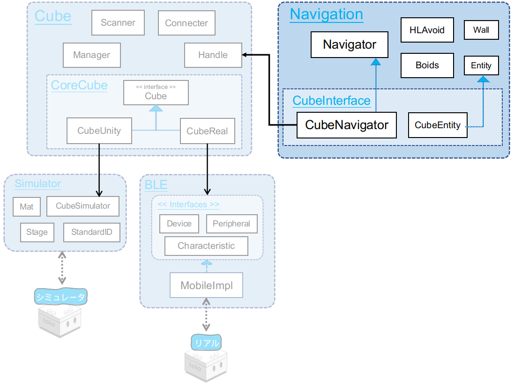
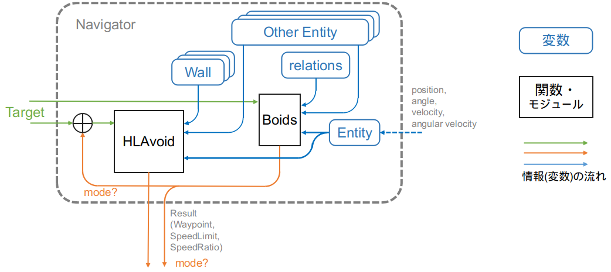
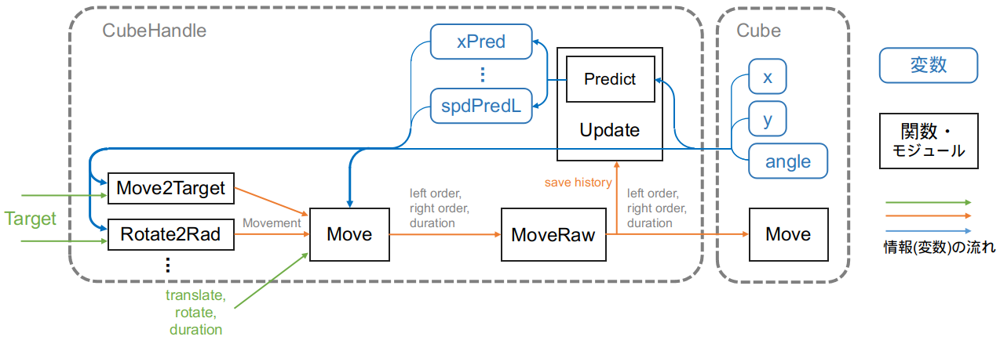

# 技術ドキュメント - 機能説明 - Navigatorクラス

## 目次

- [1. 概説](sys_navigator.md#1-概説)
  - [1.1. クラスダイアグラム](sys_navigator.md#11-クラスダイアグラム)
- [2. Navigator クラス](sys_navigator.md#2-navigator-クラス)
  - [2.1. 制御ブロック図](sys_navigator.md#21-制御ブロック図)
  - [2.2. モード](sys_navigator.md#22-モード)
- [3. CubeNavigator クラス](sys_navigator.md#3-cubenavigator-クラス)
  - [3.1. 制御ブロック図](sys_navigator.md#31-制御ブロック図)
  - [3.2. 内部処理の解説](sys_navigator.md#32-内部処理の解説)
  - [3.3. 拡張について](sys_navigator.md#33-拡張について)
- [4. アルゴリズムの詳細](sys_navigator.md#4-アルゴリズムの詳細)
  - [4.1. ヒューマンライク衝突回避 HLAvoid](sys_navigator.md#41-ヒューマンライク衝突回避-hlavoid)
  - [4.2. ボイド Boids](sys_navigator.md#42-ボイド-boids)

# 1. 概説

<div align="center">

</div>

<br>

Navigator とは、複数のロボット（toio™コア キューブ）が存在する時、お互いのロボットの動きを考慮しながら上手く移動するために作られたアルゴリズムです。

このアルゴリズムは主に「ヒューマンライク衝突回避」(HLAvoid)と「ボイド」(Boids)二つのアルゴリズムに基づいています。

- HLAvoid は自然に回避する手法
- Boids は群れとして、同調した動作をする手法

ディレクトリ構成は下図のようになります。

<div align="center"></div>

```
Navigation  +----------------------+ Navigator 関連ディレクトリ
├── Boids.cs  +--------------------+ ボイドのアルゴリズム実装クラス
├── CubeInterface.cs  +------------+ CubeNavigatorクラスおよびCubeEntityクラス
├── Entities.cs  +-----------------+ Entityクラス
├── HLAvoid.cs  +------------------+ HLAVoid衝突回避のアルゴリズム実装クラス
└── Navigator.cs  +----------------+ Navigatorクラス
```

## 1.1. クラスダイアグラム

toio SDK for Unity の Navigator モジュール群は、 toio™ 関連とは独立して実装されている [Navigator](sys_navigator.md#2-navigator-クラス) クラス(図の 「Cube-independent Navigator」)と、
Navigator と CubeHandle とをつなげるインターフェイスである [CubeNavigator](sys_navigator.md#3-cubenavigator-クラス) クラス および CubeEntity クラス (図の 「Interfavce for Cube」) とで構成されています。

<div align="center"></div>

# 2. Navigator クラス

## 2.1. 制御ブロック図

Navigator クラスの制御ブロック図は以下のようになっています。

<div align="center"></div>

- Entity は仮想の 「ロボット」 を表しています。
  外部から、Entity に状態情報を与える必要があります。
- Boids は "自身の Entity (Entity)"、 "自分以外の Entity（Other Entity リスト）"、 "自分以外の Entity との関係（Relations）" と "目標（Target）" を入力として受け取り、
  制御量として "力のベクトル" と "速度係数" を出力します。
- HLAvoid は "自身の Entity"、 "自分以外の Entity"、 "Wall リスト" 及び "目標" を入力として受け取り、 "ウェイポイント(経路上の地点情報)" と "速度上限" を出力します。
- オレンジ色の出力の流れは、Navigator の[モード](sys_navigator.md#22-モード)によって異なります。

## 2.2. モード

Navigator には 3 つのモード （Navigator.Mode） があります。

- AVOID： 衝突回避のみ
- BOIDS： ボイドのみ
- BOIDS_AVOID： ボイドと衝突回避の組み合わせ

このモードによって、情報の経路は以下のように異なります。

- AVOID： Boids の出力は無効になり、 HLAvoid のみが目標を入力として受けとり、ウェイポイントを出力する
- BOIDS： HLAvoid の出力は無効になり、 Boids のみが目標を入力として受けとり、力ベクトルをウェイポイントとして出力する
- BOIDS_AVOID：
  1. まず Boids が目標を入力として受けとり、力ベクトルを出力する
  2. Boids が出力した力ベクトルを目標に加え、その結果を HLAvoid の入力にする
  3. HLAvoid が出力するウェイポイントを最終的な出力にする

<figure align="center">
    
    <figcaption>各モードの制御ブロック図（AVOID、BOIDS、BOIDS_AVOID）</figcaption>
</figure>
<br>

# 3. CubeNavigator クラス

Navigator クラスを継承し、 CubeHandle を使ってキューブが衝突回避/集団制御を行えるようにしたものが CubeNavigator クラスです。

## 3.1. 制御ブロック図

### 3.1.1. CubeHandle の制御ブロック図

まず最初に CubeHandle の制御ブロック図を以下に示します。

<figure align="center">
  
  <figcaption>CubeHandle 制御ブロック図</figcaption>
</figure>
<br>

CubeHandle では以下のようなことを行います。 (詳細は usage_cubehandle.md を参照してください)

- `CubeHandle.Update` メソッドが Cube の情報を取得し、状態予測を行う
- `CubeHandle.Move2Target` メソッドが、 目標 を入力として受けとり、移動命令を計算する
- 出力された移動命令を `CubeHandle.Move` メソッドもしくは `Movemnet.Exec` メソッドで実行する

### 3.1.2. CubeNavigator の制御ブロック図

次に CubeNavigator の制御ブロック図を以下に示します。

<div align="center"></div>
<br>

CubeNavigator では、 Navigator と CubeHandle を組み合わせて

1. `CubeHandle.Update` メソッドを呼び出し、予測結果と元情報を CubeEntity にセットする (`CubeNavigator.Update` メソッド)
2. Navigator のナビゲーションアルゴリズムを実行する
3. ナビゲーションの結果（ウェイポイント座標、速度）を `CubeHandle.Move2Target` メソッドに与えて移動命令を計算する (`CubeNavigator.Navi2Target, CubeNavigator.NaviAwayTarget` メソッド)
4. 出力された移動命令を `CubeHandle.Move` メソッドもしくは `Movemnet.Exec` メソッドで実行する

という手順でキューブを制御しています。

## 3.2. 内部処理の解説

### 3.2.1. Update

`CubeHandle.Update` メソッドを呼び出し、予測結果と元情報を CubeEntity にセットします。

```csharp
// CubeNavigator.Update
public class CubeNavigator : Navigator
{
    public void Update(bool usePred)
    {
        if (Time.time - updateLastTime < 0.015) return;
        updateLastTime = Time.time;
        this.handle.Update();
        (ego as CubeEntity).Update(usePred);
    }
    ...
}

// CubeEntity.Update
public class CubeEntity : Entity
{
    public void Update(bool usePred=false){
        if (usePred)
        {
            x = handle.xPred;
            y = handle.yPred;
            pos = new Vector(x, y);
            rad = handle.radPred;
            spdL = handle.spdPredL;
            spdR = handle.spdPredR;
            spd = handle.spdPred;
            w = handle.wPred;
            v = handle.vPred;
        }
        else{
            x = handle.x;
            y = handle.y;
            pos = handle.pos;
            rad = handle.rad;
            spdL = handle.spdL;
            spdR = handle.spdR;
            spd = handle.spd;
            w = handle.w;
            v = handle.v;
        }
    }
    ...
}
```

### 3.2.2. Navi2Target, NaviAwayTarget

入力された目標値から Navigator に実装されているアルゴリズムでウェイポイントなどを計算し、その結果を `CubeHandle.Move2Target` に渡します。

```csharp
public virtual Movement Navi2Target(double x, double y, int maxSpd=70, int rotateTime=250, double tolerance=20)
{
    // Navigator のウェイポイント計算
    this.result = base.GetWaypointTo(x, y);
    // 速度を設定
    var spd = Min(this.result.speedLimit, maxSpd*this.result.speedRatio);

    // CubeHandle.Move2Target で移動命令計算
    var mv = handle.Move2Target(this.result.waypoint,
        maxSpd:spd, rotateTime:rotateTime, tolerance:8
    );

    // 到達判定
    if (ego.pos.distTo(new Vector(x,y)) <= tolerance && mv.reached)
        return mv;
    else{
        mv.reached = false; return mv;
    }
}
```

## 3.3. 拡張について

- ナビゲーションの結果（ウェイポイント、速度上限、速度係数）から、モーター指示値までの計算を変更したい
- 到達判定方法を変更したい

などを実現したい場合は、 CubeNavigator を継承し、Navi2Target メソッドと NaviAwayTarget メソッドをオーバーライドしてください。

# 4. アルゴリズムの詳細

以下で紹介するアルゴリズムは Morikatron Engineer Blog でも解説しています。<br>
そちらも参照してください。

[ウロチョロスに用いた集団行動の制御手法(Morikatron Engineer Blog)](https://tech.morikatron.ai/entry/2020/03/04/100000)

## 4.1. ヒューマンライク衝突回避 HLAvoid

ヒューマンライク衝突回避は、要約すると

- 各方向に向かって最大速度で前進して、
- 他のロボットが方向と速度を維持すると どの程度の距離で衝突するかを計算し、
- 衝突する前の領域において目標と一番近いポイントを目指す
  という流れでロボットが他のロボットと衝突をしないように行動するアルゴリズムです。

> 各方向の距離を計算することを「スキャン」と呼びます。

<div align="center">

<figcaption>※ 図は <a href="https://ieeexplore.ieee.org/abstract/document/6630610">元論文</a>から引用</figcaption>
</div>

toio SDK for Unity の HLAvoid クラスは機能としてのメソッドを 2 つ持っています。

```csharp
// 目標にナビゲーションする（ウェイポイント、衝突状態、速度上限）を計算
public (Vector, bool, double) RunTowards(List<Navigator> others, Entity target, List<Wall> walls);
// 目標から逃げる（ウェイポイント、衝突状態、速度上限）を計算
public (Vector, bool, double) RunAway(List<Navigator> others, Entity target, List<Wall> walls);
```

内部関数の呼び出し関係は以下のようになっています。

RunTowards / RunAway

- SampleRads ------------------------- スキャンの方向をサンプリング
- Scan
  - ScanTar ------------------------- 目標のある方向をスキャン
  - ScanOthers
    - \_ScanEntity -------------- 視野内の Entity を各々スキャン
    - CombineScanRes ------ 各スキャン結果を統合
  - ScanWalls
    - \_ScanWall ---------------- 視野内の Wall を各々スキャン
    - CombineScanRes ------ 各スキャン結果を統合
  - CombineScanRes ------------ 各スキャン結果を統合
- スキャンの結果でウェイポイントと速度上限を計算

### 4.1.1. スキャンの結果を表す ScanResult 構造体

```csharp
public struct ScanResult
{
    public bool isCollision;    // 衝突状態
    public double[] rads;       // スキャンの方向
    public double[] dists;      // 距離
    public double[] safety;     // 安全性
    public Vector[] points;     // 方向と距離で決まるポイントの相対座標

    // 初期化済みの ScanResult を作成用
    public static ScanResult init(double[] rads, double maxRange);
    // デバッグ用
    public void print(Action<string> func);
    // rads と dists で points を計算
    public void calcPoints();
}
```

### 4.1.2. スキャンの結果を統合する CombineScanRes メソッド

```csharp
private ScanResult CombineScanRes(List<ScanResult> results, bool isCol, double[] rads);
```

複数の ScanResult を以下のように統合します。

- 各方向の距離の最小値を取る
- 各方向の安全性の最小値を取る

### 4.1.3. アルゴリズム：スキャンの計算方法とウェイポイントの選び方

元論文　[Guzzi, Jérôme, et al. "Human-friendly robot navigation in dynamic environments." 2013 IEEE International Conference on Robotics and Automation. IEEE, 2013.](https://ieeexplore.ieee.org/abstract/document/6630610) <br>
及び [改良版手法の解説ブログ](https://tech.morikatron.ai/entry/2020/03/04/100000)（Morikatron Engineer Blog）を参照してください。

_ScanEntity 実装コード

```csharp
private ScanResult _ScanEntity(Navigator other, double[] rads){
    ScanResult res = ScanResult.init(rads, maxRange);
    var o = other.entity;
    var marginSum = margin + other.avoid.margin;

    // Scan for safe distance to other
    for (int i=0; i<rads.Length; ++i)
    {
        var rad = rads[i];
        var v = Vector.fromRadMag(rad, Max(ego.spd, 10));
        var vUnit = Vector.fromRadMag(rad, 1);

        var dV = v - o.v;
        var dPos = ego.pos - o.pos;

        var a = dV * dV;
        var b = 2 * dV * dPos;
        var c = dPos * dPos - marginSum * marginSum;
        var delta = b * b - 4 * a * c;

        double dist;
        if (delta < 0 || Abs(a) < 1)    // No collision
        {
            dist = maxRange;
        }
        else
        {
            var t1 = (-b - Sqrt(delta)) / 2 / a;
            var t2 = (-b + Sqrt(delta)) / 2 / a;

            if (t2 <= 0)            // No collision in future
                dist = maxRange;
            else if (t1 > 0)        // Collsion in future
                dist = t1 * v.mag;
            else {                   // Collsion Now
                dist = Max(0.1, vUnit * dPos.unit * 100);
                res.isCollision = true;
            }
        }

        res.dists[i] = dist;
    }

    // When Collison, Find available rads.
    if (res.isCollision){
        var dPos = o.pos - ego.pos;
        var colSeverity = Max(0, margin+o.margin - dPos.mag)/margin;

        for (int i=0; i<rads.Length; ++i){
            res.safety[i] = Cos(AbsRad(rads[i] - (-dPos).rad)) * (1 + colSeverity) ;
        }
    }

    return res;
}
```
<br>

RunTowards 実装コード

```csharp
public (Vector, bool, double) RunTowards(List<Navigator> others, Entity target, List<Wall> walls){

    var rads = SampleRads(target);

    var (res, resCol) = Scan(others, target, walls, rads);
    res.calcPoints(); resCol.calcPoints();

    waypointIndex = 0;
    Vector waypoint = Vector.zero;

    // find waypoint by res, which is the scan result of objects NOT in collision
    {
        double minDist = double.MaxValue;
        for (int i=0; i<rads.Length; ++i)
        {
            // nearest point at certain rad
            var nearestMag = Max( Cos((target.pos-ego.pos).rad - rads[i]) * ego.pos.distTo(target.pos) , 1 );
            var mv = res.points[i].clip(nearestMag);
            res.points[i] = mv;

            // distance of waypoint to target
            var dist = (ego.pos + mv).distTo(target.pos);

            // penalty of turning
            // NOTE may cause not turning when target right behind ego
            dist += Max(AbsRad(ego.rad - rads[i]), 0.5) * 0.1;
            dist += Max((AbsRad(ego.rad - rads[i]) - PI/2), 0) * 2;

            // Search Nearest waypoint away from target, with SAFE direction
            if (dist < minDist && resCol.safety[i] > p_waypoint_safety_threshold)
            {
                minDist = dist; waypointIndex = i;
            }
        }

        if (minDist < double.MaxValue){
            waypoint = res.points[waypointIndex];
        }
    }

    // ====  Speed Limit  ====
    double speedLimit = double.MaxValue;
    var waypointRad = rads[waypointIndex];
    // slow down when colliders are close around.
    {
        double minRadius = 1e10;
        for (int i=0; i<rads.Length; ++i){
            var rad = rads[i];
            if (res.dists[i] < 50 &&
                (Rad(rad-ego.rad)>0.1 && Rad(waypointRad-rad)>0.1 ||
                    Rad(ego.rad-rad)>0.1 && Rad(rad-waypointRad)>0.1 ))
            {
                // minimal maximal turning radius
                minRadius = Min(minRadius, (res.dists[i]+20) / (2* Sin(Abs(rad-ego.rad))) );
            }
        }
        speedLimit = Max(8, minRadius * Max(1, Abs(ego.w)));
    }
    // stop when ego.rad is pointing insides colliders.
    if (resCol.isCollision)
    {
        for (int i=0; i<rads.Length; ++i){
            var rad = rads[i];
            if (AbsRad(rad - ego.rad) < PI*2/nsample
                && resCol.safety[i] <= 0
            ){
                speedLimit = 100 * Max(0, resCol.safety[i] * 2 +1);
                break;
            }
        }
    }

    // make result
    res.rads = rads;
    scanResult = res;
    return (waypoint, resCol.isCollision, speedLimit);
}
```

<br>

## 4.2. ボイド Boids

ボイドは鳥の集団行動を擬似するアルゴリズムで、下図のように、三つの簡単なルールで実現されています。

- Separation: 他個体から離れる
- Alignment: 周囲の個体の平均方向に向かう
- Cohesion: 周囲の個体の平均位置に移動する

<div align="center">

<figcaption>※ <a href="http://www.red3d.com/cwr/boids/">Reynolds, Craig. Boids(Webpage)</a>から引用</figcaption>
</div>

toio SDK for Unity の Boids クラスは機能としてのメソッドを 2 つ持っています。

```csharp
// 目標への「引力」を含めて、ボイドの力ベクトルを計算
public Vector Run(List<Navigator> others, Vector tarPos);
// 目標への「引力」なしで、ボイドの力ベクトルを計算
public Vector Run(List<Navigator> others);
```

### 呼び出し関係

#### Run

- Attract -------- 目標の「引力」
- Separate ----- 離れる力
- Cohesion ---- 平均位置に移動する力
- Alignment ---- 平均方向に向かう力
- 重み付け、制限、合力の計算

アルゴリズムのより詳しい説明は [Reynolds, Craig. Boids(Webpage)](http://www.red3d.com/cwr/boids/) を参照してください。
