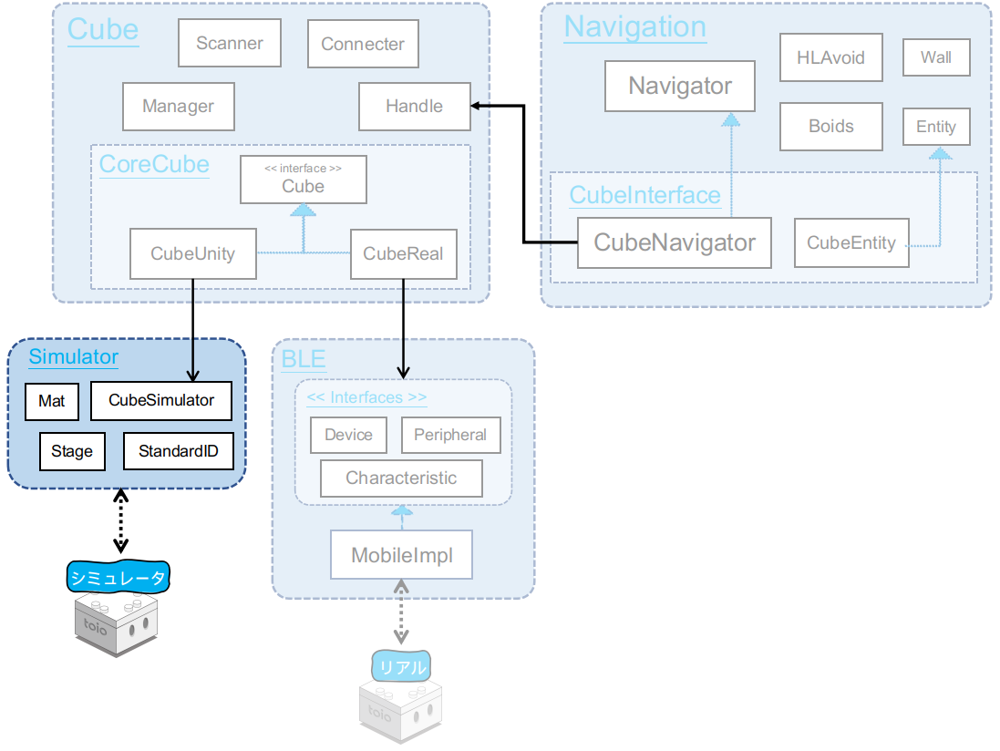
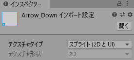

# 技術ドキュメント - 機能説明 - シミュレータ

## 目次

- [1. 概説](sys_simulator.md#1-概説)
- [2. Mat Prefab](sys_simulator.md#2-Mat-Prefab)
  - [2.1 マットの座標単位からメートルへの変換](sys_simulator.md#21-マットの座標単位からメートルへの変換)
  - [2.2 マットタイプの切り替え](sys_simulator.md#22-マットタイプの切り替え)
  - [2.3 マット上の座標と Unity 上の座標との変換](sys_simulator.md#23-マット上の座標と-Unity-上の座標との変換)
- [3. StandardID Prefab](sys_simulator.md#3-StandardID-Prefab)
  - [3.1. スタンダード ID タイプの切り替え](sys_simulator.md#31-スタンダード-ID-タイプの切り替え)
- [4. Cube Prefab](sys_simulator.md#4-Cube-Prefab)
  - [4.1 定数の定義](sys_simulator.md#41-定数の定義)
  - [4.2. 状態の模擬](sys_simulator.md#42-状態の模擬)
  - [4.3. コマンドの実行](sys_simulator.md#43-コマンドの実行)
- [5. Stage Prefab](sys_simulator.md#5-Stage-Prefab)
  - [5.1 ターゲットポール](sys_simulator.md#51-ターゲットポール)
  - [5.2 キューブをフォーカス](sys_simulator.md#52-キューブをフォーカス)

# 1. 概説

<div align="center">

</div>

<br>

Simulator は、toio™コア キューブと通信するスマートデバイスのアプリを開発していく際、Unity Editor 上で手軽に動作チェックができるように作られたテスト用の仮想環境です。

ディレクトリ構成は以下のようになります。

```
Assets/toio-sdk/Scripts/Simulator/  +------+ 直下にスクリプトが置いてある
├── Editor/  +-----------------------------+ インスペクターをカスタマイズする Unity Editor スクリプト
├── Materials/  +--------------------------+ シミュレータのオブジェクトに使われるマテリアル・物理マテリアル
├── Models/  +-----------------------------+ シミュレータのオブジェクトに使われる3Dモデル
└── Resoureces/  +-------------------------+ 直下にプリハブが置いてある
    ├── Mat/  +----------------------------+ 各種マットのテクスチャとマテリアル
    ├── Ocatave/  +------------------------+ Sound 機能に使われた音源ファイル
    └── StandardID/  +---------------------+ 各種スタンダード ID のテクスチャ
        ├── toio_collection/  +------------+ トイオ・コレクション
        └── simple_card/  +----------------+ 簡易カード
```


# 2. Mat Prefab

Mat Prefab には、スクリプト Mat.cs がアタッチされています。

また、Mat.cs のインスペクターはスクリプト Editor/MatEditor.cs によってカスタマイズされています。

## 2.1. マットの座標単位からメートルへの変換

[toio™コア キューブ 技術仕様/通信仕様/各種機能/読み取りセンサー](https://toio.github.io/toio-spec/docs/ble_id)によると、トイオ・コレクション付属のプレイマットの大きさは縦横 410 単位となっています。<br>
また、マットを実際に測定したところ一辺の長さは 56cm = 0.560 m でした。

ここから、 マットの座標情報と距離(メートル)に変換するための係数 `DotPerM` を以下のように定義しています。

```c#
public static readonly float DotPerM = 411f/0.560f; // (410+1)/0.560 dot/m
```

## 2.2. マットタイプの切り替え

インスペクターから matType を変更すると、 Mat.cs の ApplyMatType メソッドが実行され、 座標範囲の変更とマテリアルの切り替えが行われます。

<details>
<summary>実装コード（クリック展開）</summary>

```c#
public enum MatType
{
    toio_collection_front = 0,
    toio_collection_back = 1,
    simple_playmat = 2,
    developer = 3,
    custom = 4  // 座標範囲をカスタマイズ
}

public MatType matType;

// マットのタイプ、座標範囲の変更を反映
internal void ApplyMatType()
{
    // Resize
    if (matType != MatType.custom)
    {
        var rect = GetRectForMatType(matType);
        xMin = rect.xMin; xMax = rect.xMax;
        yMin = rect.yMin; yMax = rect.yMax;
    }
    this.transform.localScale = new Vector3((xMax-xMin+1)/DotPerM, (yMax-yMin+1)/DotPerM, 1);

    // Change material
    switch (matType){
        case MatType.toio_collection_front:
            GetComponent<Renderer>().material = (Material)Resources.Load<Material>("Mat/toio_collection_front");;
            break;
        case MatType.toio_collection_back:
            GetComponent<Renderer>().material = (Material)Resources.Load<Material>("Mat/toio_collection_back");
            break;
        case MatType.simple_playmat:
            GetComponent<Renderer>().material = (Material)Resources.Load<Material>("Mat/simple_playmat");
            break;
        case MatType.developer:
            GetComponent<Renderer>().material = (Material)Resources.Load<Material>("Mat/simple_playmat");
            break;
        case MatType.custom:
            GetComponent<Renderer>().material = (Material)Resources.Load<Material>("Mat/mat_null");
            break;
    }
}
```

</details>

## 2.3. マット上の座標と Unity 上の座標との変換

Unity 上の座標/角度とマット上の座標/角度との相互変換メソッドを用意しています。

> Mat Prefab が水平に配置されている場合にのみ正しく変換可能です。

<details>
<summary>実装コード（クリック展開）</summary>

```c#
// Unity上の角度を本マット上の角度に変換
public int UnityDeg2MatDeg(double deg)
{
    return (int)(deg-this.transform.eulerAngles.y-90+0.49999f)%360;
}
// 本マット上の角度をUnity上の角度に変換
public float MatDeg2UnityDeg(double deg)
{
    return (int)(deg+this.transform.eulerAngles.y+90+0.49999f)%360;
}

// Unity の3D空間座標から、本マットにおけるマット座標に変換。
public Vector2Int UnityCoord2MatCoord(Vector3 unityCoord)
{
    var matPos = this.transform.position;
    var drad = - this.transform.eulerAngles.y * Mathf.Deg2Rad;
    var _cos = Mathf.Cos(drad);
    var _sin = Mathf.Sin(drad);

    // 座標系移動：本マットに一致させ
    var dx = unityCoord[0] - matPos[0];
    var dy = -unityCoord[2] + matPos[2];

    // 座標系回転：本マットに一致させ
    Vector2 coord = new Vector2(dx*_cos-dy*_sin, dx*_sin+dy*_cos);

    // マット単位に変換
    return new Vector2Int(
        (int)(coord.x*DotPerM + this.xCenter + 0.4999f),
        (int)(coord.y*DotPerM + this.yCenter + 0.4999f)
    );
}
// 本マットにおけるマット座標から、Unity の3D空間に変換。
public Vector3 MatCoord2UnityCoord(double x, double y)
{
    var matPos = this.transform.position;
    var drad = this.transform.eulerAngles.y * Mathf.Deg2Rad;
    var _cos = Mathf.Cos(drad);
    var _sin = Mathf.Sin(drad);

    // メーター単位に変換
    var dx = ((float)x - xCenter)/DotPerM;
    var dy = ((float)y - yCenter)/DotPerM;

    // 座標系回転：Unityに一致させ
    Vector2 coord = new Vector2(dx*_cos-dy*_sin, dx*_sin+dy*_cos);

    // 座標系移動：Unityに一致させ
    coord.x += matPos.x;
    coord.y += -matPos.z;

    return new Vector3(coord.x, matPos.y, -coord.y);
}
```

</details>

<br>

# 3. StandardID Prefab

StandardID Prefab には、スクリプト StandardID.cs がアタッチされています。

また、StandardID.cs のインスペクターはスクリプト Editor/StandardIDEditor.cs によってカスタマイズされています。

## 3.1. スタンダード ID タイプの切り替え

スタンダード ID の種類が多いため、個々にマテリアルを用意するのは大変かつ拡張性も悪いため、下図のように画像を Sprite 形式のテクスチャに導入し、スクリプトからメッシュに変換し、オブジェクトのレンダラーに差し替えることで、切り替えを実現しています。

<div align="center">

</div>
<br>

<details>
<summary>実装コード（クリック展開）</summary>

```c#
internal void ApplyStandardIDType()
{
    // Load Sprite
    string spritePath = "StandardID/"+title.ToString()+"/";
    if (title == Title.toio_collection) spritePath += toioColleType.ToString();
    else if (title == Title.simple_card) spritePath += simpleCardType.ToString();
    var sprite = (Sprite)Resources.Load<Sprite>(spritePath);
    GetComponent<SpriteRenderer>().sprite = sprite;

    // Create Mesh
    var mesh = SpriteToMesh(sprite);
    GetComponentInChildren<MeshFilter>().mesh = mesh;

    // Update Mesh Collider
    GetComponentInChildren<MeshCollider>().sharedMesh = null;
    GetComponentInChildren<MeshCollider>().sharedMesh = mesh;

    // Update Size
    float realWidth = 0.05f;
    if (title == Title.toio_collection)
    {
        if ((int)toioColleType > 32) realWidth = 0.03f;
        else if ((int)toioColleType < 21 || (int)toioColleType > 26) realWidth = 0.0575f;
        else    // Skunk
        {
            if (toioColleType == ToioColleType.id_skunk_blue) realWidth = 0.179f;
            else if (toioColleType == ToioColleType.id_skunk_green) realWidth = 0.162f;
            else if (toioColleType == ToioColleType.id_skunk_yellow) realWidth = 0.145f;
            else if (toioColleType == ToioColleType.id_skunk_orange) realWidth = 0.1335f;
            else if (toioColleType == ToioColleType.id_skunk_red) realWidth = 0.1285f;
            else realWidth = 0.1225f; //toioColleType = ToioColleType.id_skunk_brown
        }
    }
    else if (title == Title.simple_card)
    {
        if (simpleCardType == SimpleCardType.Full) realWidth = 0.297f;
        else realWidth = 0.04f;
    }
    var scale = RealWidthToScale(sprite, realWidth);
    this.transform.localScale = new Vector3(scale, scale, 1);

}

public static float RealWidthToScale(Sprite sprite, float realWidth)
{
    return sprite.pixelsPerUnit/(sprite.rect.width/realWidth);
}

// http://tsubakit1.hateblo.jp/entry/2018/04/18/234424
private Mesh SpriteToMesh(Sprite sprite)
{
    var mesh = new Mesh();
    mesh.SetVertices(Array.ConvertAll(sprite.vertices, c => (Vector3)c).ToList());
    mesh.SetUVs(0, sprite.uv.ToList());
    mesh.SetTriangles(Array.ConvertAll(sprite.triangles, c => (int)c), 0);

    return mesh;
}
```

</details>
<br>

# 4. Cube Prefab

Cube Prefab には３つのスクリプトが実装されています。
- `CubeSimulator.cs`：実際のキューブのシミュレーションを実装したもの
  - `CubeSimImpl.cs`：CubeSimulator のバージョン毎の実装のベースクラスとなるもの
  - `CubeSimImpl_v2_0_0.cs`：バージョン 2.0.0 を対応する実装
  - `CubeSimImpl_v2_1_0.cs`：バージョン 2.1.0 を対応する実装
- `CubeSimulatorEditor.cs`：`CubeSimulator.cs`のインスペクターをカスタマイズしたもの
- `CubeInteraction.cs`：シミュレータ上で、Cubeオブジェクトを押したりつかんだりする操作を実装したもの

本章は `CubeSimulator` の各バージョンの実装を紹介します。

## 4.1. 定数の定義

[toio™コア キューブ 技術仕様/ハードウェア仕様/形状・サイズ](https://toio.github.io/toio-spec/docs/hardware_shape)に記載されている寸法と
[Mat.DotPerM 定数](sys_simulator.md#21-マットの座標単位からメートルへの変換) から、左右のタイヤの間隔とキューブのサイズを以下のように定義しています。

```c#
// 左右タイヤの間隔（メートル）
public static readonly float TireWidthM = 0.0266f;
// 左右タイヤの間隔（ドット（マット座標））
public static readonly float TireWidthDot= 0.0266f * Mat.DotPerM;
// キューブのサイズ
public static readonly float WidthM= 0.0318f;
```

[toio™コア キューブ 技術仕様/通信仕様/各種機能/モーター](https://toio.github.io/toio-spec/docs/ble_motor)に記載されているモーターのスペックと、
[toio™コア キューブ 技術仕様/ハードウェア仕様/形状・サイズ](https://toio.github.io/toio-spec/docs/hardware_shape)に記載されているタイヤの直径(0.0125m)から、
マット上の速度と速度指示値の係数を以下のように定義しています。

```c#
// 速度（ドット毎秒）と指示値の比例
// (dot/s)/u = 4.3 rpm/u * pi * 0.0125m / (60s/m) * DotPerM
public static readonly float VDotOverU =  4.3f*Mathf.PI*0.0125f/60 * Mat.DotPerM; // about 2.06
```

## 4.2. 状態の模擬

###  読み取りセンサー

実際のキューブの読み取りセンサーと同じように、 Unity の Physics.Raycast でキューブの底面から「下」へレイを飛ばし、5mm 以内の距離で当たったオブジェクトが Mat である場合、マット座標を取得します；StandardID の場合、Standard ID を取得します。

> マット座標の取得には Mat の座標変換メソッドを利用しています。

```C#
// CubeSimImpl_v2_0_0.cs
protected virtual void SimulateIDSensor()
{
    // 読み取りセンサーを模擬
    // Simuate Position ID & Standard ID Sensor
    RaycastHit hit;
    Vector3 gposSensor = cube.transform.Find("sensor").position;
    Ray ray = new Ray(gposSensor, -cube.transform.up);
    if (Physics.Raycast(ray, out hit)) {
        if (hit.transform.gameObject.tag == "Mat" && hit.distance < 0.005f){
            var mat = hit.transform.gameObject.GetComponent<Mat>();
            var coord = mat.UnityCoord2MatCoord(cube.transform.position);
            var deg = mat.UnityDeg2MatDeg(cube.transform.eulerAngles.y);
            var coordSensor = mat.UnityCoord2MatCoord(gposSensor);
            var xSensor = coordSensor.x; var ySensor = coordSensor.y;
            _SetXYDeg(coord.x, coord.y, deg, xSensor, ySensor);
        }
        else if (hit.transform.gameObject.tag == "StandardID" && hit.distance < 0.005f)
        {
            var stdID = hit.transform.gameObject.GetComponentInParent<StandardID>();
            var deg = stdID.UnityDeg2MatDeg(cube.transform.eulerAngles.y);
            _SetSandardID(stdID.id, deg);
        }
        else _SetOffGround();
    }
    else _SetOffGround();
}
```

Position ID と角度をセットするメソッド `_SetXYDeg` は、変更がある場合にコールバック `IDCallback` を呼び出します。

```c#
// CubeSimImpl_v2_0_0.cs
protected void _SetXYDeg(int x, int y, int deg, int xSensor, int ySensor)
{
    if (this.x != x || this.y != y || this.deg != deg || !this.onMat)
        this.IDCallback?.Invoke(x, y, deg, xSensor, ySensor);
    this.x = x; this.y = y; this.deg = deg;
    this.xSensor = xSensor; this.ySensor = ySensor;
    this.onMat = true;
    this.onStandardID = false;
}
```

Standard ID と角度をセットするメソッド `_SetStandardID` は、変更がある場合にコールバック `StandardIDCallback` を呼び出します。

```c#
// CubeSimImpl_v2_0_0.cs
protected void _SetSandardID(uint stdID, int deg)
{
    if (this.standardID != stdID || this.deg != deg || !this.onStandardID)
        this.standardIDCallback?.Invoke(stdID, deg);
    this.standardID = stdID;
    this.deg = deg;
    this.onStandardID = true;
    this.onMat = false;
}
```

キューブが Mat や StandardID 上から離れた場合は、メソッド `_SetOffGround` がコールバック `positionIDMissedCallback` 或いは `standardIDMissedCallback` を呼び出します。

```c#
// CubeSimImpl_v2_0_0.cs
protected void _SetOffGround()
{
    if (this.onMat)
        this.positionIDMissedCallback?.Invoke();
    if (this.onStandardID)
        this.standardIDMissedCallback?.Invoke();
    this.onMat = false;
    this.onStandardID = false;
}
```

### ボタン

ボタン状態が変更された際、コールバック `buttonCallback` を呼び出します。

```c#
// CubeSimImpl_v2_0_0.cs
protected bool _button;
public override bool button
{
    get {return this._button;}
    internal set
    {
        if (this._button!=value){
            this.buttonCallback?.Invoke(value);
        }
        this._button = value;
        cube._SetPressed(value);
    }
}
```

また、`CubeSimulator._SetPressed` を呼び出して、Cube オブジェクトが押された表現をします。

```c#
// CubeSimulator.cs
internal void _SetPressed(bool pressed)
{
    this.cubeModel.transform.localEulerAngles
            = pressed? new Vector3(-93,0,0) : new Vector3(-90,0,0);
}
```


### 水平検出

Cube オブジェクトの角度が閾値を超えると、`sloped` を true にします。

```c#
// CubeSimImpl_v2_0_0.cs
protected virtual void SimulateMotionSensor()
{
    // 水平検出
    if (cube.isSimulateSloped)
    {
        cube.sloped = Vector3.Angle(Vector3.up, cube.transform.up)>45f;
    }
    ...
}
```

`sloped` が変更された時に、対応コールバック `slopeCallback` を呼び出します。

```c#
// CubeSimImpl_v2_0_0.cs
protected bool _sloped;
public override bool sloped
{
    get {return this._sloped;}
    internal set
    {
        if (this._sloped!=value){
            this.slopeCallback?.Invoke(value);
        }
        this._sloped = value;
    }
}
```

### 衝突検出

衝突検出のシミュレーションは未実装です。

`collisionDetected` がインスペクターで手動で変更された時に、対応コールバック `collisionDetectedCallback` を呼び出します。

```c#
// CubeSimImpl_v2_0_0.cs
protected bool _collisionDetected;
public override bool collisionDetected
{
    get {return this._collisionDetected;}
    internal set
    {
        if (this._collisionDetected!=value){
            this.collisionDetectedCallback?.Invoke(value);
        }
        this._collisionDetected = value;
    }
}
```

### ダブルタップ

> 2.1.0 の機能です。
ダブルタップのシミュレーションは未実装です。

`doubleTap` がインスペクターで手動で変更された時に、対応コールバック `doubleTapCallback` を呼び出します。

```c#
// CubeSimImpl_v2_1_0.cs
protected bool _doubleTap;
public override bool doubleTap
{
    get {return this._doubleTap;}
    internal set
    {
        if (this._doubleTap!=value){
            this.doubleTapCallback?.Invoke(value);
        }
        this._doubleTap = value;
    }
}
```

### 姿勢検出

> 2.1.0 の機能です。
原理は水平検出と同じで、Cube オブジェクトの角度が対応方向に閾値を超えたら、`pose` を対応方向にします。

```c#
// CubeSimImpl_v2_1_0.cs
protected virtual void SimulateMotionSensor()
{
    if(Vector3.Angle(Vector3.up, transform.up)<45f)
    {
        this.pose = Cube.PoseType.up;
    }
    else if(Vector3.Angle(Vector3.up, transform.up)>135f)
    {
        this.pose = Cube.PoseType.down;
    }
    else if(Vector3.Angle(Vector3.up, transform.forward)<45f)
    {
        this.pose = Cube.PoseType.forward;
    }
    else if(Vector3.Angle(Vector3.up, transform.forward)>135f)
    {
        this.pose = Cube.PoseType.backward;
    }
    else if(Vector3.Angle(Vector3.up, transform.right)<45f)
    {
        this.pose = Cube.PoseType.right;
    }
    else if(Vector3.Angle(Vector3.up, transform.right)>135f)
    {
        this.pose = Cube.PoseType.left;
    }
}
```

`pose` が変更された時に、対応コールバック `poseCallback` を呼び出します。

```c#
// CubeSimImpl_v2_1_0.cs
protected Cube.PoseType _pose = Cube.PoseType.up;
public override Cube.PoseType pose {
    get{ return _pose; }
    internal set{
        if (this._pose!=value){
            this.poseCallback?.Invoke(value);
        }
        _pose = value;
    }
}
```

### シェイク検出

> 2.2.0 の機能です。
シェイク検出のシミュレーションは未実装です。

`shake` がインスペクターで手動で変更された時に、対応コールバック `shakeCallback` を呼び出します。

```c#
// CubeSimImpl_v2_2_0.cs
protected bool _shake;
public override bool shake
{
    get {return this._shake;}
    internal set
    {
        if (this._shake!=value){
            this.shakeCallback?.Invoke(value);
        }
        this._shake = value;
    }
}
```

### モーター速度検出

> 2.2.0 の機能です。

モーターのシミュレーションによって計算されたタイヤの速度を変換してモーター速度とします。

```c#
// CubeSimImpl_v2_2_0.cs
protected void SimulateMotorSpeedSensor()
{
    int left = Mathf.RoundToInt(speedTireL/CubeSimulator.VMeterOverU);
    int right = Mathf.RoundToInt(speedTireR/CubeSimulator.VMeterOverU);
    _SetMotorSpeed(left, right);
}
```

値が変更された時に、対応コールバック `motorSpeedCallback` を呼び出します。

```c#
// CubeSimImpl_v2_2_0.cs
protected void _SetMotorSpeed(int left, int right)
{
    left = Mathf.Abs(left);
    right = Mathf.Abs(right);
    if (motorSpeedEnabled)
        if (this.leftMotorSpeed != left || this.rightMotorSpeed != right)
            this.motorSpeedCallback?.Invoke(left, right);
    this.leftMotorSpeed = left;
    this.rightMotorSpeed = right;
}
```

## 4.3. コマンドの実行

### 命令処理の流れ

CubeSimulator.cs は以下の図のようなロジックで [CubeUnity](sys_cube.md#2-cube-クラスの構造) から渡された命令を処理しています。

<div align="center">

</div>

- CubeUnity がメソッドを呼び出す際に、命令と命令をセットした時間をキューに入れる
- 毎フレーム実行される FixedUpdate() の中で以下のように処理する
  - キューから `受け取った時間 + ラグ ＞ 現在時間` を満たす命令をポップし、 Current Order にセットする
  - Current Order の継続時間が終わったかを判断し、是の場合 Current Order をクリアする
  - Current Order を実行する

> Cube Prefab のラグ (Delay) は実環境で実測した値をセットしています。デバイス、環境等によってかわる可能性があります。

### モーター

レイキャストを利用し、タイヤが地面に当たってるかを調査します。

```C#
// CubeSimulator.cs
internal bool offGroundL = true;
internal bool offGroundR = true;
private void SimulatePhysics()
{
    // タイヤの着地状態を調査
    // Check if tires are Off Ground
    RaycastHit hit;
    var ray = new Ray(transform.position+transform.up*0.001f-transform.right*0.0133f, -transform.up); // left wheel
    if (Physics.Raycast(ray, out hit) && hit.distance < 0.002f) offGroundL = false;
    ray = new Ray(transform.position+transform.up*0.001f+transform.right*0.0133f, -transform.up); // right wheel
    if (Physics.Raycast(ray, out hit) && hit.distance < 0.002f) offGroundR = false;
}
```

現在のモーター制御命令の目標速度を Unity 座標系での速度に変換し、デッドゾーンを加え、
強制停止・押された場合によってタイヤ速度を計算してから、着地状態によって Cube 速度を計算し、`CubeSimulator._SetSpeed` に渡します。

```C#
// CubeSimImpl.cs
public virtual void SimulateMotor()
{
    var dt = Time.deltaTime;

    // 目標速度を計算
    // target speed
    float targetSpeedL = motorLeft * CubeSimulator.VDotOverU / Mat.DotPerM;
    float targetSpeedR = motorRight * CubeSimulator.VDotOverU / Mat.DotPerM;
    if (Mathf.Abs(motorLeft) < deadzone) targetSpeedL = 0;
    if (Mathf.Abs(motorRight) < deadzone) targetSpeedR = 0;

    // 速度更新
    // update tires' speed
    if (cube.forceStop || this.button)   // 強制的に停止
    {
        speedTireL = 0; speedTireR = 0;
    }
    else
    {
        speedTireL += (targetSpeedL - speedTireL) / Mathf.Max(cube.motorTau,dt) * dt;
        speedTireR += (targetSpeedR - speedTireR) / Mathf.Max(cube.motorTau,dt) * dt;
    }

    // update object's speed
    // NOTES: simulation for slipping shall be implemented here
    speedL = cube.offGroundL? 0: speedTireL;
    speedR = cube.offGroundR? 0: speedTireR;

    cube._SetSpeed(speedL, speedR);
}
```

現在速度から目標速度までの変化量によって、 Unity の Rigidbody.Addforce で力を与え、 位置と角度を Unity の物理エンジンに更新させます。

```C#
// CubeSimulator.cs
internal void _SetSpeed(float speedL, float speedR)
{
    // 速度変化によって力を与え、位置と角度を更新
    this.rb.angularVelocity = transform.up * (float)((speedL - speedR) / TireWidthM);
    var vel = transform.forward * (speedL + speedR) / 2;
    var dv = vel - this.rb.velocity;
    this.rb.AddForce(dv, ForceMode.VelocityChange);
}
```


#### ※さらなる改善点（現在は未実装の項目）

##### 速度と位置、角度更新の方法
現在の方法では、 Rigidbody.AddForce で確実に目標速度に達するために、マットの摩擦力を 0 に設定し、
本来なら物理法則により生じる 遅れ要素 を目標速度の計算に含めています。<br>
このような物理計算を簡単化したモデルで計算を行っているので、マットを傾けた状態での動作をシミュレーションできません。
もっと正確にモデリングするなら、次のような手順が考えられます：
- モーター制御命令から変換した 目標速度 と 現在速度 の差を、 実際のキューブのファームウェアと同一の制御モジュール（例えば PID）に入力する
- PID の出力した 「電圧」 をモーターモデルに入力する
- モーターモデルの出力した 「電流」 を換算した 「力」 を物理エンジンに与える
- ホイールの Collider、 物理マテリアルなどはなるべくリアルに作成する

### 目標指定付きモーター制御・複数目標指定付きモーター制御

実機のファームウェアの実装が公開されていないため、シミュレータの（複数）目標指定付きモーター制御は、仕様書と実機の動きとを参考に実装されました。その中に推測で作られた部分もあり、実機と差があるかもしれないため、いくつか重要な部分を説明します。

#### 移動タイプが0（回転しながら移動）のケース

`回転しながら移動`の場合、目標がキューブの前方にあるか後方にあるかによって、前進か後退かを決めます。

```c#
// CubeSimImpl_v2_1_0.cs
protected (float, float) TargetMove_MoveControl(ushort x, ushort y, byte maxSpd, Cube.TargetSpeedType targetSpeedType, float acc, Cube.TargetMoveType targetMoveType)
{
    // ...
    Vector2 targetPos = new Vector2(x, y);
    Vector2 pos = new Vector2(this.x, this.y);
    var dpos = targetPos - pos;
    var dir2tar = Vector2.SignedAngle(Vector2.right, dpos);
    var deg2tar = Deg(dir2tar - this.deg);                    // use when moving forward
    var deg2tar_back = (deg2tar+360)%360 -180;                // use when moving backward
    bool tarOnFront = Mathf.Abs(deg2tar) <= 90;
    // ...
    switch (targetMoveType)
    {
        case (Cube.TargetMoveType.RotatingMove):        // 回転しながら移動
        {
            rotate = tarOnFront? deg2tar : deg2tar_back;
            translate = tarOnFront? spd : -spd;
            break;
        }
        // ...
    }
    // ...
}
```

#### モーターの速度変化タイプで加減速があるケース

加速の場合を例として、指令の実行が始まる際に、パスの長さと最大速度によって加速度が計算されます。指令の実行中は、キューブの位置と関係なく、時間経過と加速度によって加速していきます。

```c#
// CubeSimImpl_v2_1_0.cs
protected virtual void TargetMoveInit()
{
    // ...
    this.currMotorTargetCmd.acc = ((float)cmd.maxSpd*cmd.maxSpd-this.deadzone*this.deadzone) * CubeSimulator.VDotOverU/2/dist;
    // ...
}
```

#### ステアリング制御

進行方向と目標への角度に比例して、回転指令値`rotate`が計算されます。

しかし、直接に`rotate`と併進指令値`translate`を合わせると（つまり`rotate`は回転の角速度と比例すると）、併進指令値が大きい場合、回転不足が生じます。逆に、`rotate`と`translate`を掛け算して新しい`rotate`値にすると（つまり`rotate`は回転半径と比例すると）、併進指令値が小さい場合に回転不足が生じます。

なので、`translate`の大きさによって、上記二種類の`rotate`の加重平均を取ることで、回転不足を解消します。

```c#
// CubeSimImpl_v2_1_0.cs
protected void ApplyMotorControl(float translate, float rotate)
{
    var miu = Mathf.Abs(translate / this.maxMotor);
    rotate *= miu * Mathf.Abs(translate/50) + (1-miu) * 1;
    var uL = translate + rotate;
    var uR = translate - rotate;
    // ...
}
```


### サウンド

Unity の AudioSource コンポーネントを利用して MIDI ノートナンバーに応じた音色を再生しています。

#### 基準となる音源の生成

各オクターブの A (A0 から A10 まで) の音色を事前に音声ファイルとして作成しています。

音声は以下の python スクリプトで、1 周期の正弦波をサンプリングした wav ファイルを生成しています。

<details>
<summary>実装コード（クリック展開）</summary>

```python
import numpy as np
import wave
import struct

nsamples = 32
audio_array = [int(-np.cos(2*np.pi*i/nsamples)*127) for i in range(nsamples)]

f_A0 = 440/16
audio = struct.pack("b" * len(audio_array), *audio_array)

for i in range(11):
    f = f_A0 * 2**i

    w = wave.Wave_write(str(12*i+9) + '.wav')
    p = (1, 1, nsamples*f, len(audio), 'NONE', 'not compressed')
    w.setparams(p)
    w.writeframes(audio)
    w.close()
```

</details>
<br>

この音声ファイルを [toio™コア キューブ 技術仕様/通信仕様/各種機能/サウンド](<(https://toio.github.io/toio-spec/docs/ble_sound#midi-note-number-%E3%81%A8-note-name)>) の対応表にしたがって名前を付け、「Assets/toio-sdk/Scripts/Simulator/Resources/Octave」 に配置しています。


#### 再生

あらかじめ用意した A 以外の音階は、 AudioSource の Pitch パラメータを利用して 同じオクターブにある A から変換して再生しています。

```c#
// CubeSimulator.cs
private int playingSoundId = -1;
internal void _PlaySound(int soundId, int volume){
    if (soundId >= 128) { _StopSound(); playingSoundId = -1; return; }
    if (soundId != playingSoundId)
    {
        playingSoundId = soundId;
        int octave = (int)(soundId/12);
        int idx = (int)(soundId%12);
        var aCubeOnSlot = Resources.Load("Octave/" + (octave*12+9)) as AudioClip;
        audioSource.pitch = (float)Math.Pow(2, ((float)idx-9)/12);
        audioSource.clip = aCubeOnSlot;
    }
    audioSource.volume = (float)volume/256;
    if (!audioSource.isPlaying)
        audioSource.Play();
}
```

### ランプ

ランプに光源を配置して発光を表現すると処理が重くなるので、単にマテリアルの色を変えています。

```c#
// CubeSimulator.cs
internal void _SetLight(int r, int g, int b){
    LED.GetComponent<Renderer>().material.color = new Color(r/255f, g/255f, b/255f);
}
```

<br>

# 5. Stage Prefab

Stage Prefab は、

- Mat Prefab
- カメラ　（物理レイキャスタを含め）
- ライト
- ターゲットポール
- キューブの脱出を防止する 「テーブル」 と ボーダー
- EventSystem

をセットにしたものです。

## 5.1. ターゲットポール

マウスの右クリックまたはドラッグすることで ターゲットポールを設置・移動することができ、
開発者はターゲットポールの位置を取得してキューブの制御に利用することが出来ます。

<details>
<summary>実装コード（クリック展開）</summary>

```c#
void Update(){
    // ターゲットポールを移動
    // Moving TargetPole
    if (isDragging)
    {
        RaycastHit hit;
        Ray ray = Camera.main.ScreenPointToRay(Input.mousePosition);

        if (Physics.Raycast(ray, out hit) && targetPole != null) {
            targetPole.position = new Vector3(hit.point.x, targetPole.position.y, hit.point.z);
        }
    }
    ...
}
```

</details>

<br>

プロパティ `tarPoleCoord` でターゲットポールのマット上の座標を取得すると、キューブを動かす時に便利に使えます。


## 5.2. キューブをフォーカス

左クリックした際、マウスカーソル位置からレイを飛ばし、レイが衝突したキューブにスポットライトの焦点を合わせて追従します。

<details>
<summary>実装コード（クリック展開）</summary>

```c#
void Update(){
    ...
    // Keep focusing on focusTarget
    if (focusTarget!=null){
        var tar = new Vector3(0, 0.01f, 0) + focusTarget.position;
        mainLightObj.GetComponent<Light>().transform.LookAt(tar);
        sideLightObj.GetComponent<Light>().transform.LookAt(tar);
    }
    ...
}

private void OnLeftDown()
{
    var camera = Camera.main;
    RaycastHit hit;
    Ray ray = camera.ScreenPointToRay(Input.mousePosition);

    if (Physics.Raycast(ray, out hit)) {
        if (hit.transform.gameObject.tag == "Cube")
            SetFocus(hit.transform);
        else SetNoFocus();
    }
    else SetNoFocus();
}
```

</details>

<br>

プロパティ `focusName` でフォーカスの対象のキューブの名前を取得することが出来ます。<br>
多数のキューブを使った処理のデバッグをする際、個々のキューブの動作をチェックするのに役立ちます。
