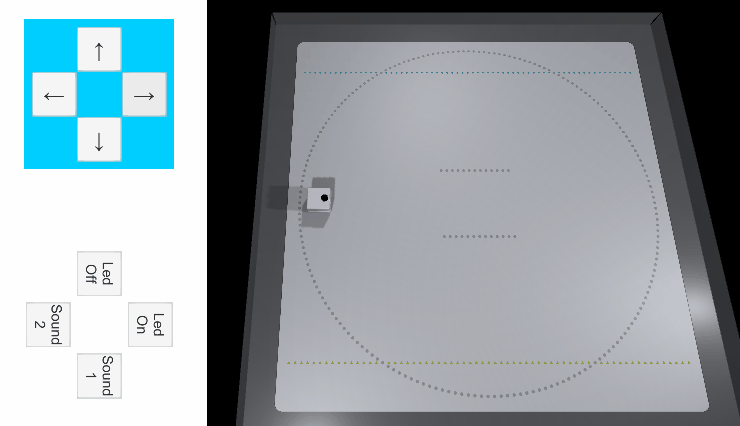
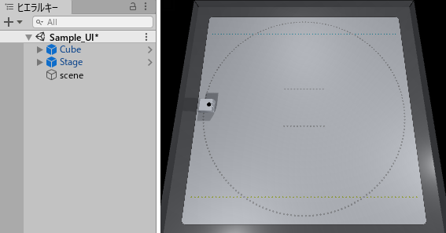
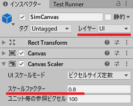
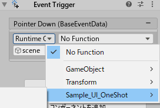
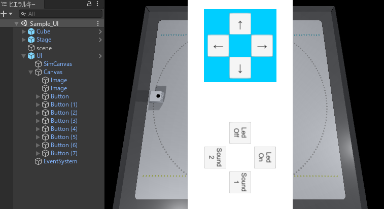

# チュートリアル(UIの作成)

> ※この章で使われている Cube クラスの機能は以下になります。

メソッド | 機能
:--------|:--------|
Cube.PlayPresetSound | 音を鳴らす（[チュートリアル](tutorials_basic.md#4-音を鳴らす)）
Cube.Move | 移動する（[チュートリアル](tutorials_basic.md#3-移動する)）
Cube.TurnOnLightWithScenario<br> Cube.LightOperation | LED を発光する（[チュートリアル](tutorials_basic.md#5-LED-を発光する)）

## 目次
- [1. UI の作成例](tutorials_UI.md#1-UI-の作成例)
    - [1.1. シーン作成](tutorials_UI.md#11-シーン作成)
    - [1.2. UI を作成](tutorials_UI.md#12-UI-を作成)
    - [1.3. シミュレータと UI の同時表示](tutorials_UI.md#13-シミュレータと-UI-の同時表示)
    - [1.4. ボタンの作成と動作対応](tutorials_UI.md#14-ボタンの作成と動作対応)

# 1. UI の作成例

> ※ サンプルファイルは、「Assets/toio-sdk/Tutorials/1.Basic/ex.Sample_UI/」 にあります。

本チュートリアルでは、ユーザーが操作してキューブを動かせるUIの作り方を紹介します。
シミュレータ上の最終結果は以下のようになります。

<div align="center">

</div>

Unity Editor で実行した場合はUIとシミュレータが並列表示され、スマートフォンビルドで実行した場合は、スマートフォンの画面に UI のみが表示されるようになっています。

> Unity Editor上ではUIは右に90度回転した状態で表示されます。

> プロジェクト設定でDefault OrientationをPortraitにしてください。

## 1.1. シーン作成
まず最初にシーンを作成します。  
これは、チュートリアル(Basic)の[「シーン作成」](tutorials_basic.md#2-シーン作成)と同じです。

### ステージの配置方法

1. 「ファイル > 新しいシーン」をクリックして、新しいシーンを作成します。
2. ヒエラルキーにある「Main Camera」と「Directional Light」を削除
3. プロジェクトウィンドウで「Assets/toio-sdk-unity/Assets/toio-sdk/Scripts/Simulator/Resources」フォルダを開きます
4. 「Cube」Prefab ファイル と 「Stage」Prefab ファイルをヒエラルキーにドラック&ドロップします。<br>
※ シーン上でマウス操作すれば「Cube」オブジェクトの移動も出来ます。
5. ヒエラルキー上で右クリック、右クリックメニューから「空のオブジェクトを作成」をクリックし、「scene」という名前にします。
6. 「scene」オブジェクトを選択し、インスペクター上の「コンポーネントを追加」をクリックします。
7. 任意のスクリプト名（例 MyUIScript）を入力して、スクリプトを作成します。
8. 作成したスクリプトを下記サンプルコードに書き換えます。(クラス名はスクリプトファイルと同じ名前にする必要があります)

### サンプルコード
```C#
using System.Collections.Generic;
using UnityEngine;
using toio;

// ファイル名とクラス名は一致させる必要があります
public class MyUIScript : MonoBehaviour
{
    CubeManager cubeManager;
    Cube cube;
    //Cube機能を呼び出します
    async void Start()
    {
        cubeManager = new CubeManager();
        cube = await cubeManager.SingleConnect();
    }

    // 持続時間(durationMs):0にする事で時間無制限となり、一度呼び出すだけで動作し続ける事が出来る。
    // 命令の優先度(order):Cube.ORDER_TYPE.Strongにすることで、一度きりの命令を安全に送信。
    // 【詳細】:
    // 命令の優先度をStrongにすると、内部で命令を命令キューに追加して命令可能フレーム時に順次命令を送る仕組みになっている。
    // 通常は命令前に cubeManager.IsControllable(cube) を呼ぶことで命令可能フレームの確認を行うが、
    // 今回は命令の優先度をStrongにしているため、cubeManager.IsControllable(cube) を呼ばずにそのまま命令キューに追加する。
    // ※ちなみにcubeManager.IsControllable(cube) を呼んで事前に命令可能フレームの確認を行った場合は、パケロスならぬ命令ロスとなる。

    //各動作の制御関数、後でボタンに対応します。
    public void Forward() { cube.Move(60, 60, durationMs:0, order:Cube.ORDER_TYPE.Strong); }
    public void Backward() { cube.Move(-40, -40, durationMs:0, order:Cube.ORDER_TYPE.Strong); }
    public void TurnRight() { cube.Move(60, 30, durationMs:0, order:Cube.ORDER_TYPE.Strong); }
    public void TurnLeft() { cube.Move(30, 60, durationMs:0, order:Cube.ORDER_TYPE.Strong); }
    public void Stop() { cube.Move(0, 0, durationMs:0, order:Cube.ORDER_TYPE.Strong); }
    public void PlayPresetSound1() { cube.PlayPresetSound(1); }
    public void PlayPresetSound2() { cube.PlayPresetSound(2); }
    public void LedOn()
    //ここは三角関数により、色を変化できる機能コード。好きな色を試してみても良い、このままコピーしでも良いです。
    {
        List<Cube.LightOperation> scenario = new List<Cube.LightOperation>();
        float rad = (Mathf.Deg2Rad * (360.0f / 29.0f));
        for (int i = 0; i < 29; i++)
        {
            byte r = (byte)Mathf.Clamp((128 + (Mathf.Cos(rad * i) * 128)), 0, 255);
            byte g = (byte)Mathf.Clamp((128 + (Mathf.Sin(rad * i) * 128)), 0, 255);
            byte b = (byte)Mathf.Clamp(((Mathf.Abs(Mathf.Cos(rad * i) * 255))), 0, 255);
            scenario.Add(new Cube.LightOperation(100, r, g, b));
        }
        cube.TurnOnLightWithScenario(0, scenario.ToArray());
    }
    public void LedOff() { cube.TurnLedOff(); }
}
```

これでシーンの作成は完了です。
ここまでの作業でヒエラルキーとゲームビューは、下のようになるはずです。

<div align="center">
<br>
<a align="center"><b>ヒエラルキー & ゲームビュー</b></a>
</div>


## 1.2. UI を作成
続いてキューブを操作するための UI を作成して行きます。

1. ヒエラルキー上で右クリックし、メニューから「空のオブジェクトを作成」をクリックし、名前を「UI」にします。

2. (Optional) EventSystem は既に Stage に内包されたので、自分で作成する必要がないですが、もし作成する場合は、ヒエラルキー上で右クリックし、「UI -> EventSystem」で作成します。

3. UI のキャンバスを作成します。
    1. 「UI」オブジェクトを選択し、右クリックメニューから「UI -> Canvas」をクリックし、「Canvas」という名前にします。
    2. 「Canvas」のインスペクターの「レイヤー」を「Default」から「UI」に変更します。
    3. 「Canvas Scaler」コンポーネントの「UIスケールモード」を「画面サイズに拡大」に、X を 720 に、Y は 1440 に、「マッチ」を 1 に設定してください。

> 「マッチ」を 1 に設定することで、UI のサイズは画面の高さによって変化してフィットします。

<div  align="center">
</img>
</div>


4. 背景を作成します。
    1. 「Canvas」を選択し、右クリックメニューから「UI -> 画像」をクリックします。名前を「image」にします。
    2. 「image」のインスペクターにある「Rect Transform」コンポーネントの「位置」を全部 0 に、「幅」を 720 に、「高さ」を1440 に設定します。「Image」コンポーネントの「色」を白に設定します。
5. コントロールパネルの背景を作成します。
    1. 「image」を複製します。名前を「image1」にします。
    2. 「image1」のインスペクターにある「Rect Transform」コンポーネントの「位置」を「X:0、Y:400、Z:0」に、「幅」と「高さ」を 500 に設定します。「Image」コンポーネントの「色」を青に設定します。

> これで、UI の基盤が作れました。

<div  align="center">
</img>
</div>

## 1.3. シミュレータと UI の同時表示
スマートデバイスにビルドして実行した場合は、スマートフォンの画面に UI のみが表示され操作パネルとして利用したいですが、シミュレータで実行する場合にはUIとシミュレータの画面を下図のように同時に表示されている必要があります。<br>
これを実現するために、シミュレータ上では同時に見られるようUIを左側に移動する仕組みを作ります。

<div align="center">

</div>


1. シミュレータ用のキャンバスを作成します。
    1. 「UI」オブジェクトを選択して、右クリックメニューから「UI -> Canvas」をクリックします。名前を「SimCanvas」に変更します。
    2. 「SimCanvas」を選択し、インスペクターの「レイヤー」を「Default」から「UI」に変更します。
    3. 「Canvas Scaler」コンポーネントの「スケールファクター」を 0.8 に設定します。

<div  align="center">
</img>
</div>

2. 「UI」オブジェクトを選択し、インスペクター上の「コンポーネントを追加」をクリックします。
3. 任意のスクリプト名（例 MySimUI）を入力して、スクリプトを作成します。
4. 作成したスクリプトを下記サンプルコードに書き換えます。(クラス名はスクリプトファイルと同じ名前にする必要があります)

### サンプルコード
```C#
using UnityEngine;

public class MySimUI : MonoBehaviour
{
    #if UNITY_EDITOR
    private int updateCnt = 0;

    void Update()
    {
        if (updateCnt < 3) updateCnt++;
        if (updateCnt == 2){
            // カメラを左へ移動することで、シミュレーション画面を右に移動します。
            var localPos = Camera.main.transform.localPosition;
            localPos.x = -0.15f; // 移動量
            Camera.main.transform.localPosition = localPos;

            // 「SimCanvas」と親子関係を利用して、相対座標を変え、UI(Canvas)を左に移動します。
            var canvasObj = GameObject.Find("Canvas");
            var simCanvasObj = GameObject.Find("SimCanvas");
            canvasObj.transform.SetParent(simCanvasObj.transform);
            // UIとシミュレーション画面をフィットするために、キャンバスの位置はインスペクターでの
            //「幅」の 720 と SimCanvas の「スケールファクター」の 0.8 によって設定します。
            canvasObj.transform.position = new Vector3(
                720/2 * canvasObj.transform.localScale.x * 0.8f,
                canvasObj.transform.position.y,
                canvasObj.transform.position.z
            );
        }
    }
    #endif
}
```

上記スクリプトでは、以下の三つを実装しています。
    1. シミュレータでのみ実行したい処理なので、#if [UNITY_EDITOR](https://docs.unity3d.com/ja/current/Manual/PlatformDependentCompilation.html) の中でクラスの全ての実装を記述しています。
    2. シミュレータの画面を少し右側に寄せたいため、カメラを左へ移動しています。
    3. 「UI」―「Canvas」の親を「SimCanvas」に設定してから、左端へ移動します。（[Transform.SetParent](https://docs.unity3d.com/ScriptReference/Transform.SetParent.html) を利用）

## 1.4. ボタンの作成と動作対応
最後に操作パネルの各ボタンを作成します。

>  スマートデバイス上で操作パネルが正しく表示されるよう、ここの文字の方向は90度回転します。

1. 「Canvas」オブジェクトを選択し、右クリックメニューから「UI ->Button」をクリックします。名前を「Button0」に変更します。
2. 「Button0」のインスペクターにある「Rect Transform」コンポーネントの「幅」と「高さ」を150に設定し、「回転」のZを-90に設定します。

3. ボタン操作からイベントを発生させる「Event Trigger」コンポーネントを追加し、マウスボタンが押される動作を呼び出したいメソッドに紐づけます。
    1. インスペクター上の「コンポーネントを追加」をクリックし、リストの「イベント -> イベントトリガー」を選択して「Event Trigger」コンポーネントを追加します。
    2. 「Event Trigger」コンポーネントの「新しいイベントタイプを追加」をクリックし、リストの「Pointer Down」を選択してイベントを追加します。
    3. 「Pointer Down」の下にある「✙」をクリックし、追加されたリストにある「⦿」をクリックします。
    4. 「⦿」をクリックすると表示される「select object」ウィンドウの「シーン」タブをクリックし、そこから「scene」オブジェクトを探して選択します。
    5. 同様に「Pointer Up」イベントも追加し、「scene」オブジェクトを選択します。

<div  align="center">
</img>
</div>


4. 「Button0」をコピーし、「Button1」から「Button7」まで貼り付けます。

5.  下の表を参考に、作成した8つのボタンのプロパティーを設定して行きます。
    1. 「Button*」のインスペクターにある「Event Trigger」コンポーネントの 「Pointer Down」および 「Pointer Up」にある「No Function」をクリックし、「MyUIScript( [シーン作成](tutorials_UI.md#11-シーン作成) で設定したスクリプト名)」以下にあるそれぞれのメソッドに設定します。
    します。
    2. ヒエラルキーから「Button*」の子オブジェクトの「Text」を選択します。
    3. インスペクターにある「Text」コンポーネントの「テキスト」と「フォントサイズ」をそれぞれ設定します。

<div  align="center">
</img>
</div>

#### ボタンのプロパティー設定

Button  | Rest Transform位置 |テキスト  | フォントサイズ |Pointer Down  | Pointer up |
:--------|:--------:|:--------:|:--------:|---------|--------|
Button0  | X:0　　 Y:550|←| 72 | TurnLeft() | Stop() |
Button1  | X:150　 Y:400 |↑| 72 | Forward() | Stop() |
Button2  | X:0　　 Y:250 |→| 72 | TurnRight() | Stop() |
Button3  | X:-150　Y:400 |↓| 72 | Backward() | Stop() |
Button4  | X:0　　 Y:-200 |Led Off| 48 | LedOff()  | なし(No Function) |
Button5  | X:150 　Y:-350 |Led On  | 48 | LedOn()  | なし(No Function) |
Button6  | X:0 　　Y:-500 |Sound1 | 48 | PlayPresetSound1()  | なし(No Function) |
Button7  | X:-150　Y:-350 |Sound2  | 48 | PlayPresetSound2()  | なし(No Function) |


ここまで、ボタンの作成は完了します。ヒエラルキーとゲームビューは、下のようになるなずです。

<div  align="center">
</img>
</div>

シミュレータでの実行画面とスマートデバイスでの画面は以下のようになります。

| シミュレータ | スマートフォン |
|:---:|:---:|
|


