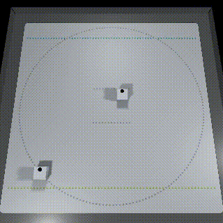

# チュートリアル(CubeHandle)

## 目次

- [1. CubeManager を使ったキューブの同期制御](tutorials_cubehandle.md#1-cubemanager-を使ったキューブの同期制御)
- [2. CubeHandle](tutorials_cubehandle.md#2-cubehandle)
  - [2.1. 基本設定](tutorials_cubehandle.md#21-基本設定)
  - [2.2. Move 関数と MoveRaw 関数](tutorials_cubehandle.md#22-move-関数と-moveraw-関数)
  - [2.3. キューブとの通信量を抑える One-shot メソッド](tutorials_cubehandle.md#23-キューブとの通信量を抑える-one-shot-メソッド)
  - [2.4. 指定した座標/方向に到達する Closed-Loop メソッド](tutorials_cubehandle.md#24-指定した座標方向に到達する-closed-loop-メソッド)
- [3. Follow TargetPole デモ](tutorials_cubehandle.md#3-follow-targetpole-デモ)

## 1. CubeManager を使ったキューブの同期制御

> ※ この章のサンプルファイルは、「Assets/toio-sdk/Tutorials/2.Advanced-CubeHandle/0.BasicScene/」 にあります。<br>
> ※ この章のウェブアプリサンプルは[【コチラ】](https://morikatron.github.io/t4u/cubehandle/basic/)です。

チュートリアル基本編で説明した CubeManager は複数のキューブをそれぞれ任意のタイミング(非同期)で制御するものです。<br>
このような非同期の通信はキューブの移動制御を行う上で問題になる時があり、キューブを指定した一定のタイミング(同期)で制御したい場合があります。

そのような同期制御を行うための仕組みが CubeManager には用意されています。

### 非同期でキューブを制御する場合

CubeManager は自動的に、接続した Cube から CubeHandle を作成して、メンバー変数のリストに入れています。<br>
下記のサンプルコードでは、 Update の中で CubeManager が保持している CubeHandle の制御可能状態を確認してから、制御を行っています。

```csharp
public class HandleBasic : MonoBehaviour
{
    CubeManager cubeManager;
    async void Start()
    {
        cubeManager = new CubeManager();
        await cubeManager.MultiConnect(2);
    }

    void Update()
    {
        foreach (var handle in cubeManager.handles)
        {
            // Controllable になるタイミング（フレーム）はキューブそれぞれ、つまり非同期
            if (cubeManager.IsControllable(handle))
            {
                handle.Update(); // 非同期版の場合、必ずこのメソッドを呼んでください。
                handle.MoveRaw(-50, 50, 1000);
            }
        }
    }
}
```

このサンプルでは制御可能状態は皆それぞれなので、「非同期」になります。

### 同期でキューブを制御する場合

以下のようにすると、すべての handle が、50ms ごとの同じフレームで制御されます。

```csharp
public class HandleBasic : MonoBehaviour
{
    CubeManager cubeManager;
    async void Start()
    {
        cubeManager = new CubeManager();
        await cubeManager.MultiConnect(2);
    }

    void Update()
    {
        // 同期
        if (cubeManager.synced)
        {
            // handle の Update も synced の呼び出し際に内部でやってくれる。
            // 個別の handle を操作できる。
            cubeManager.handles[0].MoveRaw(-50, 50, 1000);
        }
    }
}
```

上記は、単に同期して各 handle を個別に操作しています。

すべての handle を一斉に動かす場合は、syncHandles を使うと便利です。

```csharp
public class HandleBasic : MonoBehaviour
{
    CubeManager cubeManager;
    async void Start()
    {
        cubeManager = new CubeManager();
        await cubeManager.MultiConnect(2);
    }

    void Update()
    {
        // すべてのキューブが controllable になったら、syncHandles が handles を提供
        foreach (var handle in cubeManager.syncHandles)
        {
            // handle の Update も syncHandles の呼び出し際に内部でやってくれる。
            handle.MoveRaw(-50, 50, 1000);
        }
    }
}
```

## 2. CubeHandle

チュートリアル基本編でキューブの移動制御を行っていた Cube クラスは [toio™コア キューブ技術仕様](https://toio.github.io/toio-spec/) に従った基礎機能を提供するクラスで、キューブの移動は左右のモーター制御となっています。
このようなモーターの制御だけで複雑な移動を行うのは大変なので toio SDK for Unity ではキューブの移動制御をより扱いやすくした CubeHandle クラスを用意しています。

CubeHandle クラスは、以下のような移動制御を提供します。

- 前進量、回転量の指定で移動を制御
- 一回の命令で指定した距離を移動、指定した角度回転
- 指定した座標に到達するように移動、指定した方向に到達するように回転

CubeHandle の詳細については[【コチラ】](usage_cubehandle.md)を参照してください。

### 2.1. 基本設定

> 「トイコレ付属マット（土俵面）」をお使いの場合、設定は必須ではないので、直接に次節に進めても構いません。

#### ボーダー

ボーダーから出ないように、CubeHandleはCubeのモーターへの出力を自動的に制限できます。
ボーダーの設定は以下のようにできます。

```csharp
cubeHandle.borderRect = new RectInt(65, 65, 370, 370);
```

既定値は「トイコレ付属マット（土俵面）」に合わせた `RectInt(65, 65, 370, 370)` なので、違うマットを利用する場合は必ず設定を行ってください。

ボーダーに引っかかった（行き過ぎた）場合は、ボーダー外に向かって前進できないが、回転することはできます。キューブをボーダー内へ向かわせてから前進させれば、ボーダー内に戻すことができます。

#### 遅延

CubeHandle は通信遅延を考慮してその影響をなくすように計算しています。
制御の精度を高めたい場合は、遅延の値を実測して設定するのが重要なポイントになります。
CubeHandle の `lag` 変数は、キューブから情報取得する際の遅延とモーター指令を送信してからキューブが受信するまでの遅延を合わせた値に設定します。

```csharp
cubeHandle.lag = 0.13;  // seconds
```

### 2.2. Move 関数と MoveRaw 関数

> ※ この章のサンプルファイルは、「Assets/toio-sdk/Tutorials/2.Advanced-CubeHandle/1.MoveScene/」 にあります。<br>
> ※ この章のウェブアプリサンプルは[【コチラ】](https://morikatron.github.io/t4u/cubehandle/move/)です。

Cube クラスの Move 関数では左右のモーターの出力を指定することでキューブの移動を制御しています。
それに対して、CubeHandle クラスの Move 関数では、 より直感的に扱えるように 直進+回転の量を指定する方式にしています。<br>
そのほか、

- キューブのモーターが回転しないほど移動量が小さかった (この範囲をデッドゾーンと呼びます) 場合、デッドゾーンにある入力を一番近い有効な入力に置き換える
- 未来の軌跡を予測し、継続時間を制限することで、指定した範囲(ボーダー)外へキューブが出ていかないようにする

といった機能もあります。

```csharp
public Movement Move(
    double translate,           // 前進指示値
    double rotate,              // 回転指示値
    int durationMs = 1000,      // 継続時間（ms）
    bool deadzoneBias = false,  // デッドゾーン処理の方法
    bool border = true,         // ボーダー制限のありなし
    Cube.ORDER_TYPE order = Cube.ORDER_TYPE.Weak    // 指示の優先度
    );
// Movement を実行
public Movement Move(Movement mv, bool border = true);
// Movement の継続時間を書き換えて実行
public Movement Move(Movement mv, int durationMs, bool border = true);
// Movement の優先度を書き換えて実行
public Movement Move(Movement mv, Cube.ORDER_TYPE order, bool border = true);
// Movement の継続時間と優先度を書き換えて実行
public Movement Move(Movement mv, int durationMs, Cube.ORDER_TYPE order, bool border = true);
```

また、Cube クラスの Move 関数に相当する関数として MoveRaw も用意しています。

```csharp
// uL 左モーターの指示値、uR 右モーターの指示値、durationMs 継続時間（ms）、order 指示の優先度
public void MoveRaw(double uL, double uR, int durationMs = 1000, Cube.ORDER_TYPE order = Cube.ORDER_TYPE.Weak);
```

以下は Move 関数と MoveRaw 関数を使ったサンプルコードです。

<div align="center"></div>

```csharp
void Update()
{
    elapsedTime += Time.deltaTime;
    if (1.7f < elapsedTime)
    {
        cubeManager.handles[0].Update();
        cubeManager.handles[1].Update();

        if (phase == 0)
        {
            Debug.Log("---------- Phase 0 - 右回転 ----------");

            // MoveRawで右回転：　左モーター指令 50、右モーター指令 -50、継続時間 560
            cubeManager.handles[0].MoveRaw(50, -50, 560);
            // moveで右回転：　前進指令 0、回転指令 50、(希望)継続時間 560
            cubeManager.handles[1].Move(0, 100, 560);
        }
        else if (phase == 1)
        {
            Debug.Log("---------- Phase 1 - 前進 ----------");

            cubeManager.handles[0].MoveRaw(80, 80, 600);
            cubeManager.handles[1].Move(80, 0, 600);
        }
        else if (phase == 2)
        {
            Debug.Log("---------- Phase 2 - デッドゾーン対処 ----------");
            // MoveRaw と move は入力表現が違う。move の方がもっと直感的になっている。
            // MoveRaw はほぼそのままの入力を Cube.move に渡すが、
            // move は【デッドゾーン対処】と【ボーダー制限】を行っている。

            cubeManager.handles[0].MoveRaw(-9, 1, 100);
            cubeManager.handles[1].Move(-4, -10, 100);
        }
        else if (phase == 3)
        {
            Debug.Log("---------- Phase 3 - ボーダー ----------");
            // 緑キューブはボーダー前に止まった。

            cubeManager.handles[0].MoveRaw(100, 100, 1000);
            cubeManager.handles[1].Move(100, 0, 1000);
        }
        else if (phase == 4)
        {
            Debug.Log("---------- Phase 4 - ボーダー ----------");
            // ボーダー制限は、予測モデルによって継続時間を制限することで、後退や回転の場合でも効く。

            cubeManager.handles[1].Move(-80, 30, 2000);
        }

        elapsedTime = 0.0f; phase += 1;
    }
}
```

CubeHandle クラスの Move 関数および MoveRaw 関数が呼び出される度に、キューブに通信で移動するよう指令を送り、受信したキューブが指令に沿って移動します。<br>
CubeHandle では、そのほかに 移動の指令を扱う Movement クラスを一回出力し、それに対して Exec 関数を実行することでも同様の処理が行われます。

```csharp
// Movement を使った移動
Movement mv = handle.HogeMethod(...);
mv.Exec();

// CubeHandle.Move を使った移動
handle.Move(mv);
```

### 2.3. キューブとの通信量を抑える One-shot メソッド

> ※ この章のサンプルファイルは、「Assets/toio-sdk/Tutorials/2.Advanced-CubeHandle/2.OneShotScene/」 にあります。<br>
> ※ この章のウェブアプリサンプルは[【コチラ】](https://morikatron.github.io/t4u/cubehandle/oneshot/)です。

CubeHandle クラスの Closed-loop メソッド（下で説明）は目的に到達するために何度も繰り返し実行する想定です。
処理を実行するたびにキューブと Bluetooth 通信をすることなるため、 移動しながら LED を点滅したり、音を鳴らしたりすると通信量が多くなりすぎてしまいます。

One-shot メソッドは、この問題を解決するための機能で、 目標に達するために一回だけ呼び出せば良いので移動をするのに必要な通信量を抑えることが出来ます。<br>
（Open-Loop なので、結果の保証はありません）

この種類のメソッドは以下の３つあります：

- TranslateByDist(dist, translate) … 速度指令で、指定距離を前進する
- RotateByDeg(Deg, rotate) … 回転指令で、指定角度（度）を回転する
- RotateByRad(Rad, rotate) … 回転指令で、指定角度（弧度）を回転する

```csharp
// dist 距離、translate 前進指示値
public Movement TranslateByDist(double dist, double translate);
// drad 角度（弧度）、rotate 回転指示値
public Movement RotateByRad(double drad, double rotate);
// drad 角度（度）、rotate 回転指示値
public Movement RotateByDeg(double ddeg, double rotate);
```

One-Shot メソッドは Movement インスタンスを返すので、Movement クラスの Exec 関数、 あるいは CubeHandle クラスの Move 関数を使ってキューブを移動させてください。

以下は One-Shot メソッドを使って、2 秒間隔で 100 距離前進と 90 度回転の繰り返すことで正方形を描く例です。

<div align="center"></div>

```csharp
private float elapsedTime = 1.5f;
private int phase = 0;

void Update()
{
    elapsedTime += Time.deltaTime;

    if (2f < elapsedTime) // Every 2 seconds
    {
        cubeManager.handles[0].Update();
        cubeManager.handles[1].Update();

        if (phase == 0)
        {
            // Phase 0: 100距離を前進
            cubeManager.handles[0].TranslateByDist(dist:100, translate:40).Exec();
            cubeManager.handles[1].TranslateByDist(dist:100, translate:80).Exec();//速度を変えてみる
        }
        else if (phase == 1)
        {
            // Phase 1: 90度を回転
            cubeManager.handles[0].RotateByDeg(deg:90, rotate:40).Exec();
            cubeManager.handles[1].RotateByRad(Mathf.PI/2, 20).Exec();//弧度指定も可
            phase = -1;
        }

        elapsedTime = 0.0f; phase += 1;
    }
}
```

### 2.4. 指定した座標/方向に到達する Closed-Loop メソッド

> ※ この章のサンプルファイルは、「Assets/toio-sdk/Tutorials/2.Advanced-CubeHandle/3.ToTargetScene/」 にあります。<br>
> ※ この章のウェブアプリサンプルは[【コチラ】](https://morikatron.github.io/t4u/cubehandle/to_target/)です。

繰り返し実行し続けることで、マットの指定した座標、指定した方向に到達するのが Closed-Loop メソッドです。

- Move2Target(...) … 目標座標に移動する
- Rotate2Target(...) … 目標座標に回転する
- Rotate2Deg(...) … 目標絶対角度（度）に回転する
- Rotate2Rad(...) … 目標絶対角度（弧度）に回転する

この種類のメソッドは目標に達するまで、毎フレーム呼び出し続ける必要があります。

```csharp
public Movement Move2Target(
    double tarX,            // 目標座標ｘ
    double tarY,            // 目標座標ｙ
    double maxSpd = 50,     // 最大速度指示値
    int rotateTime = 250,   // 希望回転時間（ms）
    double tolerance = 8    // 到達判定の閾値
    );
// tarRad 指定角度（弧度）、tolerance 到達判定の閾値(弧度)、rotateTime 希望回転時間（ms）
public Movement Rotate2Rad(double tarRad, double tolerance = 0.15, int rotateTime = 400);
// tarDeg 指定角度（度）、tolerance 到達判定の閾値(度)、rotateTime 希望回転時間（ms）
public Movement Rotate2Deg(double tarDeg, double tolerance = 5, int rotateTime = 400);
// tarX, tarY 指定座標、tolerance 到達判定の閾値(弧度)、rotateTime 希望回転時間（ms）
public Movement Rotate2Target(double tarX, double tarY, double tolerance = 0.1, int rotateTime = 400);
```

Closed-Loop メソッドは Movement インスタンスを返すので、Movement クラスの Exec 関数、 あるいは CubeHandle クラスの Move 関数を使ってキューブを移動させてください。

#### 例１: 指定した座標に移動する

単純に目標座標に移動するなら、すごくシンプルにできます。

```csharp
void Update()
{
    foreach (var handle in cubeManager.syncHandles)
    {
        handle.Move2Target(250, 250).Exec();
    }
}
```

#### 例 2: 指定した座標に移動した後、マットの -90 度方向に向く

Movement クラスの Exec 関数は、実際に実行された Movement インスタンスを返します。<br>
このインスタンスには Move2Target などの関数が目標に達したかの情報も含まれています。

以下の例では、 最初に指定した座標に向かい、目標座標に到達した場合に処理を変え、マットの-90° 方向にキューブを回転させています。

<div align="center"></div>

```csharp
void Update()
{
    foreach (var handle in cubeManager.syncHandles)
    {
        if (phase == 0)
        {
            Movement mv = handle.Move2Target(250, 250).Exec();

            // 目標達成したら、次のフェーズに移る。
            if (mv.reached) phase = 1;
        }
        else if (phase == 1)
        {
            Movement mv = handle.Rotate2Deg(-90).Exec();
            // or equally use Rotate2Rad(-Mathf.PI/2) or Rotate2Target(handle.x, 0)
        }
    }
}
```

## 3. Follow TargetPole デモ

> ※ この章のサンプルファイルは、「Assets/toio-sdk/Tutorials/2.Advanced-CubeHandle/ex.FollowTargetPole/」 にあります。<br>
> ※ この章のウェブアプリサンプルは[【コチラ】](https://morikatron.github.io/t4u/cubehandle/follow_target_pole/)です。

これまで説明してきた機能を使い、 Stage の TargetPole 機能（シミュレータで使える仮想的な目的地）を利用して、`Ctrlを押しながらマウスの右ボタン`でキューブをコントロールしてみましょう。

<div align="center"></div>

まず Stage を取得します。

```csharp
Stage stage;
void Start()
{
    ...
    stage = GameObject.FindObjectOfType<Stage>();
}
```

次に、 TargetPole のマット座標を取得して、 CubeHandle クラスの Move2Target 関数にセットします。

```csharp
void Update()
{
    foreach (var handle in cubeManager.syncHandles)
    {
        Movement mv = handle.Move2Target(stage.targetPoleCoord).Exec();
    }
}
```

これで、 Stage の TargetPole を（マウスでドラッグして）動かすと、それをキューブが追いかけるようになるはずです。
