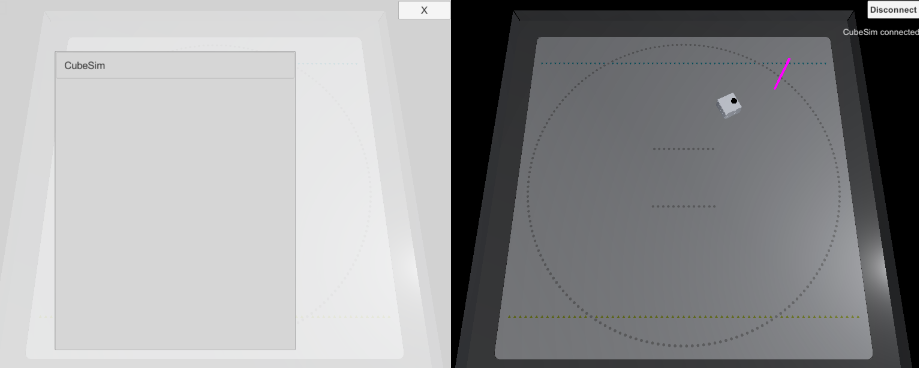

# チュートリアル(テンプレート集)

## 目次

- [1. ローカルネームで接続、CubeHandleで制御](tutorials_templates.md#1-ローカルネームで接続、CubeHandleで制御)

## 1. ローカルネームで接続、CubeHandleで制御

> ※ サンプルファイルは、「Assets/toio-sdk/Tutorials/Templates/Template_ConnectName_CubeHandle/」 にあります。

 

このテンプレートは以下の機能を実装しています。
- GUI上にスキャンしたローカルネームをリストアップし、ユーザーが選択したキューブと接続します。
- PC上では`Ctrl+右クリック`で、スマートデバイスでは`タッチ`で、画面内のマットにターゲットポールを設定します。
- CubeHandleを用いて、ターゲットポールに到達するようにキューブを自動制御します。

#### 関連チュートリアル・サンプル

- ローカルネームで制御：[Sample_ConnectName](../toio-sdk-unity/Assets/toio-sdk/Samples/Sample_ConnectName/README.md)
- CubeHandleの使い方：[チュートリアル(CubeHandle) - 3. Follow TargetPole デモ](tutorials_cubehandle.md#3-follow-targetpole-デモ)

#### ファイル

- `Template_ConnectName_CubeHandle.cs`: メインスクリプト。接続とGUIと制御を実装しています。
- `TouchOperation.cs`: スマットデバイスでのタッチ操作を実装しています。
- `UIScannedCubeItem.prefab`: GUIのキューブリストの項目のプレハブです。
