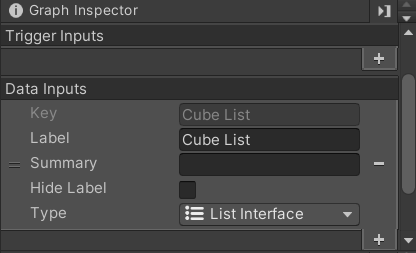
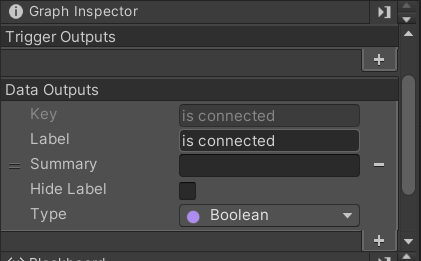
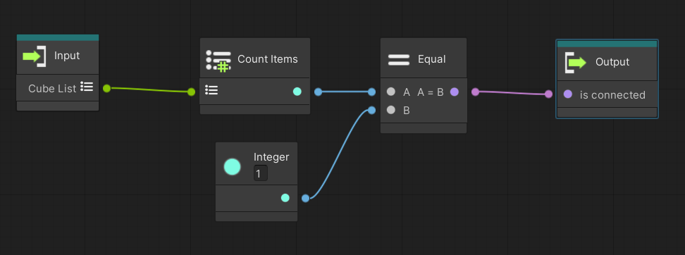
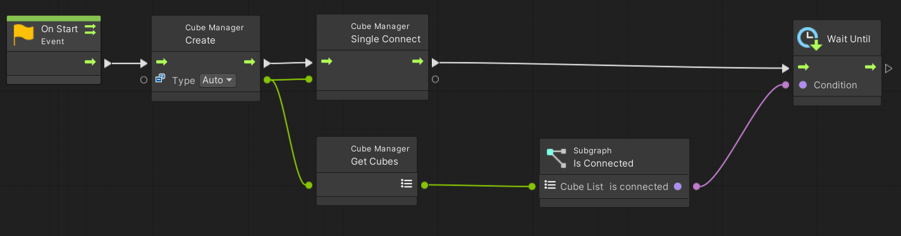

# Visual Scripting向けチュートリアル

## 目次
- [1. 概要](tutorials_visual_scriptings.md#1-概要)
- [2. ステージの配置方法](tutorials_visual_scriptings#2-ステージの配置方法)
- [3. ステージの配置方法](tutorials_visual_scriptings#3-キューブの接続方法)
- [4. 複数のキューブを利用する場合](tutorials_visual_scriptings#4-複数のキューブを利用する場合)
- [5. イベントの検出](tutorials_visual_scriptings#5-イベントの検出)

# 1. 概要
toio SDK for UnityにおけるVisual Scriptingは現在(2022年3月11日)、チュートリアルで利用する全ての機能に対応しております。

Visual Scripting版のサンプルは基本的にC#版のサンプルを再現する形で実装されているため、
本資料は[チュートリアル(Basic)](tutorials_basic.md)のVisual Scripting向け補足資料となっています。

# 2. ステージの配置方法

以下の手順で基礎環境を構築する事が出来ます。

1. 「ファイル > 新しいシーン」をクリックして、新しいシーンを作成します。
2. ヒエラルキー上から「Main Camera」と「Directional Light」を削除
3. プロジェクトウィンドウで「Assets/toio-sdk/Scripts/Simulator/Resources」フォルダを開きます。
4. 「Cube」Prefabファイルと「Stage」Prefabファイルをヒエラルキーにドラック&ドロップします。 
   ※「シーンビュー」に切り替えてマウス操作すれば「Cube」オブジェクトの移動も出来ます。
5. ヒエラルキー上で右クリック、右クリックメニューから「空のオブジェクトを作成」をクリックし、「scene」という名前にします(※名前は自由です)。
6. 「scene」オブジェクトを選択し、インスペクター上から「コンポーネントを追加」->[Visual Scripting]->[Script Machine]をクリックします。
7. プロジェクトビューを右クリックし[Create]->[Visual Scripting]->[Script Graph]を選択して、任意の名前を入力してスクリプトグラフを作成します。
8. 作成したスクリプトグラフのアイコンをドラッグし、sceneオブジェクトで追加したScript MachineコンポーネントのGraphフィールドにドラッグ&ドロップします。
9. インスペクター上の[Edit Graph]が選択可能になるのでクリックするとグラフビューが開き、任意のスクリプトを書くことが出来るようになります。

# 3. キューブの接続方法
Visual Scripting版ではキューブとの接続にCubeManaggerを利用することを推奨しています。

ここでは、`\Assets\toio-sdk\Tutorials\1.Basic\0.BasicScene`のサンプルを例に、キューブを接続、回転させる方法を説明します。

## 1. 変数の初期化
グラフビューを開いたら、まず最初にブラックボードから変数の初期化を行います。
Graph変数で変数名を「cube」と入力し、変数の型はNullに設定します。

## 2. CubeManagerの作成とキューブとの接続
変数の初期化が終わったら次にCubeManagerを利用してキューブの接続を試みます。
グラフビュー上で右クリックをするとノードをグラフビュー上に追加できるので、以下のノードを用意してください。
- [Events]->[Lifecycle]->[On Start]
- [Codebase]->[Toio]->[Cube Manager]->[Create Cube Manager(Type)]
- [Codebase]->[Toio]->[Cube Manager]->[Single Connect]

ノードの追加ができたら以下のようにノード間を接続してください。
また、On StartノードをクリックするとGraph Inspecter上にCoroutineというチェックボックスが表示されるのでこれにチェックを入れてください。

## 3. CubeManagerの接続を確認する
キューブとの接続が開始されたら接続状況を確認するための処理をつくります。
これはCubeManagerクラスが持つCubeリスト(Cubes)が格納しているCubeクラスの数を数えることで確認します。

### Is Connectedサブグラフの作成
処理が少し大きくなるため、[Nesting]->[Subgraph]でサブグラフを追加します。

追加したらサブグラフをダブルクリックしてサブグラフの処理を書いていきます。Graph Inspecter上の(Title)で名前を付けることが出来るので適当な名前を付けておきましょう。今回は「Is Connected」という名前を付けておきます。

このサブグラフではCubeリストを受け取って、格納しているCubeクラスが接続したい数に達しているかどうかを戻します。

以下のノードを追加してください。

- [Collections]->[Count items]
- [Codebase]->[System]->[Integer]->[Integer Literal] (値を1に設定)
- [Logic]->[Equal]

また[Input],[Output]をクリックしてGraph Inspecter上にそれぞれ以下のように設定を行います。

    

ノードの追加、設定が終わったら以下のようにノードを接続します。接続が終わればサブグラフでの作業は終了です。

### Is Connectedサブグラフと他のノードを接続する。
サブグラフの作成が終わったら、このサブグラフを利用してCubeManagerのCubeリストの数が接続したい数に達しているかを調べる処理を書きます。
[Codebase]->[Toio]->[Cube Manager]->[Get Cubes]ノードを追加し、[Is Connected]ノードと接続してください、

## 4. Cubeが接続するまで待機する。
これでCubeManagerがキューブと接続をする処理と、接続状況を確認するための処理が完成しました。

次に、接続が終了するまで処理を待機する処理を書いていきます。
[Time]->[Wait Until]ノードを追加してください。追加したら、以下のノード同士を接続してください。
- [Create Cube Manager(Type)] - [Get Cubes]
- [Single Connect] - [Wait Until]
- [Is Connected] - [Wait Until] (Conditionポート)

以下の図のようになります。

## 5. CubeManagerからCubeを取り出す。
接続が完了したらCubeManagerからCubeクラスを取り出します。以下のノードを追加してください。
- [Variables]->[Graph]->[Set Graph Variable] (Name: cube)
- [Collections]->[First item]

追加したら以下のノード同士を接続します。
- [Wait Until] - [Set Graph Variable]
- [Get Cubes] - [First item]
- [First item] - [Set Graph Variable] (New Valueポート)

これでStartにおける処理は完了です。最終的なノード同士の接続は以下のようになります。

## 6. Updateで接続が出来たかを確認する
StartでCubeManagerを利用した接続処理を書いたので、UpdateでCubeクラスを利用してキューブを動かす処理を作っていきます。

まず最初に、Startの処理が完了したかを確認する処理を作ります。これはcube変数がNullのままの状態かどうかで判別します。

また、接続が確認出来たら場合、キューブに命令を送る時間間隔も設定してあげます。以下のノードを追加してください。

- [Events]->[Lifecycle]->[On Update]
- [Nulls]->[Null Check]
- [Variables]->[Graph]->[Get Graph Variable] (Name: cube)
- [Time]->[Cooldown] (Duration: 0.05)

追加したら以下のように接続を行ってください。これで、接続終了後に0.05sの間隔で命令を送る処理が完成します。

## 7. Cubeを動かす
最後に、Cubeクラスを利用してキューブに命令を送ります。ここではサンプルと同じようにキューブがその場で回転するように動かします。
以下のノードを追加してください。

- [Codebase]->[Toio]->[Cube]->[Move(Left, Right, Duration Ms, Order)] (Left: 50, Right: -50, Duration Ms: 200)
- [Variables]->[Graph]->[Get Graph Variable] (Name: cube)

追加したら以下のように接続してください。
- [Cooldown] (Readyポート) - [Move]
- [Get Graph Variable] (Name: cube) - [Move] (Tragetポート)

これでUpdateの処理は完成です。最終的に、以下のような接続になっているか確認してください。

## 8. 実際に動かす
最後にUnityエディターに戻ってプレイボタンを押し、実際に動かしてみましょう。

以下のように動いていれば正しく動かせたことになります。

他チュートリアルも基本は同じです。

接続を行い、Cubeクラスの機能を利用することで、チュートリアルにある機能は「センサーイベントの検知」以外は全て利用することが可能となっています。

詳しくは実際にサンプルを見て確認してください、

# 4. 複数のキューブを利用する場合
複数のキューブを利用する場合は[Codebase]->[Toio]->[Cube Manager]->[Multi Connect(Cube Num)]を[Single Connect]ノードの代わりに利用してください。

また、[Codebase]->[Toio]->[Cube Manager]->[Multi Connext Async(Cube Num, Coroutine Object, Connect Action, Auto Running)]を利用すると、非同期で接続を行うことも可能です。

詳しくは`\Assets\toio-sdk\Tutorials\1.Basic\6.MultiCube`や`\Assets\toio-sdk\Tutorials\1.Basic\7.CubeManager`を参考にしてください。

# 5. イベントの検出
Visual Scriptingにおけるイベントの検出方法を説明します。

ここでは例として、キューブのボタンが押された時に、音を鳴らすイベントが発生させます。
これは`\Assets\toio-sdk\Tutorials\1.Basic\5.Event`の一部機能を抜粋したものとなっています。

## 1. 準備
まず最初に、本チュートリアルの「2. ステージの配置方法」と「3.キューブの接続方法」を参考に、Startでステージ上のキューブと接続するところまで進めてください。

以下のようなスクリプトまで作れていれば大丈夫です。

## 2. イベント検出の設定を行う
次に、検出したいイベントを設定します。

[Codebase]->[Toio]->[Visual Script]->[Sensor Checker]->[Create Sensor Checker]ノードを追加します。

「今回はキューブのボタンが押された」というイベントを検出したいので[Create Sensor Checker]の[Button Callback]ポートのみにチェックを入れます。

次に[Set Graph Varible] (Name: cube)と[Create Sensor Checker]を接続します。

また、[Create Sensor Checker]のCubeポートにはイベントを発生させたいキューブのCubeクラスを入力してください。

最終的には下図のような接続になります。

これでキューブのボタンが押された際に、イベントが発生するようになりました。

## 3. イベントを作成する
ここまでで、イベントが検出できるようになったので、ここからはイベントが発生した際にどのような操作を行うかの処理を作成していきます。

グラフエディター上で右クリックをして[Events]->[T4u Event]をみると様々なイベントが存在していることが確認できます。

これらのイベントは[Create Sensor Checker]でチェックを入れることが出来る各コールバックに対応しています。また、イベントノードのCubeポートは[Create Sensor Checker]で入力したキューブのCubeクラスを利用することになります。今回はボタンを押した際のイベントを利用したいので以下のノードを追加していきます。

- [Events]->[T4u Event]->[On Press Button]
- [Codebase]->[Toio]->[Cube]->[Play Preset Sound]

追加したら以下のように接続していきます。

- [On Press Button] - [Play Preset Sound]
- [On Press Button] (Cubeポート) - [Play Preset Sound] (Cubeポート)

最終的に以下のような接続になります。

## 4. 動かして確認する
これで必要なスクリプトは完成です。Unityエディターに戻ってプレイボタンを押し、実際に動かしてみましょう。

以下のようにキューブのボタンを左クリックするとグラフエディター上でイベントが発火し、音がなることが確認できると思います。

イベントは他にも種類があり、センサーに対しても様々な設定を施すことができます。

詳しくは`\Assets\toio-sdk\Tutorials\1.Basic\5.Event`に他のイベントの例があるので、そちらを参考にしてください。
