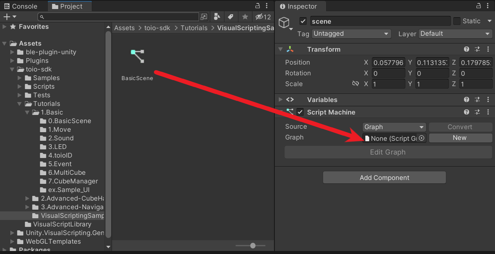
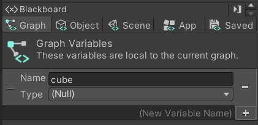
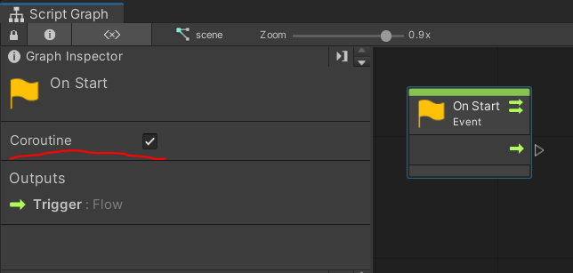
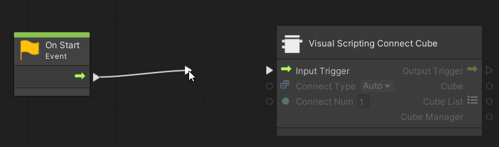
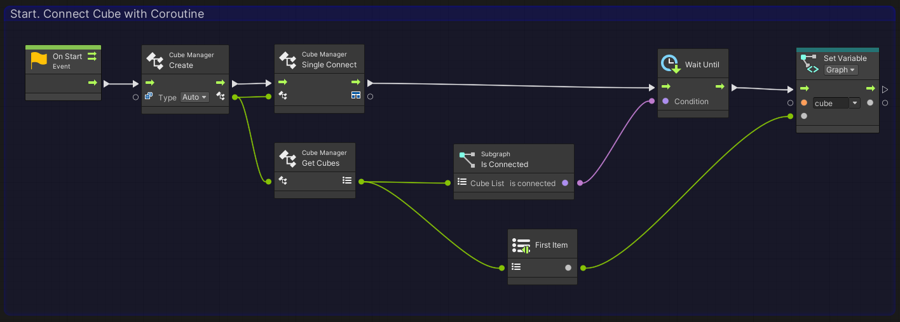
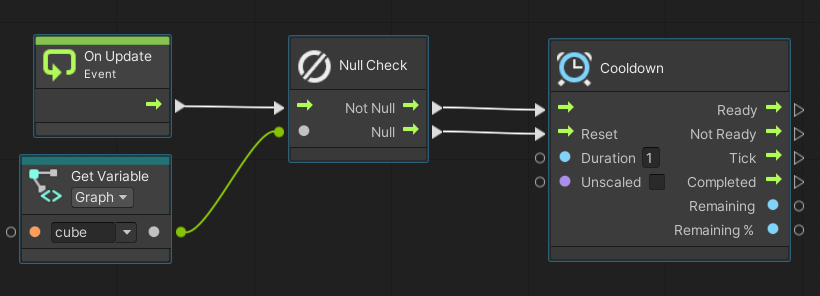
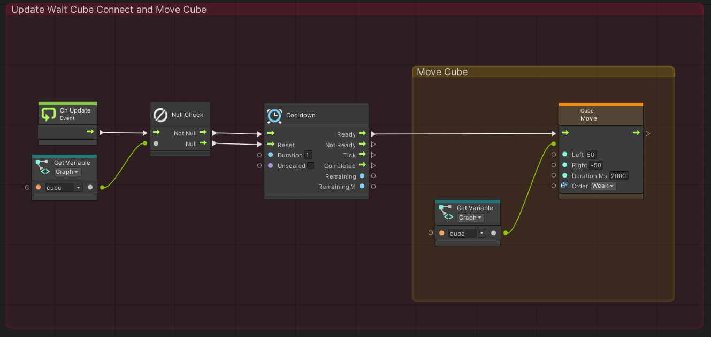
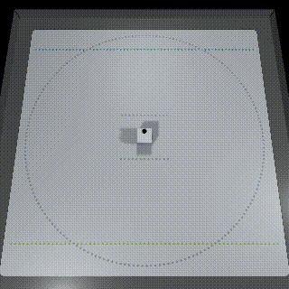
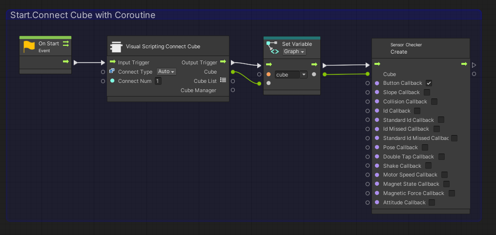

# Visual Scripting向けチュートリアル

## 目次
- [1. 概要](#1-概要)
- [2. ステージの配置方法](#2-ステージの配置方法)
- [3. キューブの接続方法](#3-キューブの接続方法)
- [4. 複数のキューブを利用する場合](#4-複数のキューブを利用する場合)
- [5. イベントの検出](#5-イベントの検出)

# 1. 概要
Unity Visual ScriptingはUnity2021から標準機能として採用されたビジュアルプログラミング言語です。

toio SDK for UnityにおけるVisual Scriptingは現在(2022年3月29日)、チュートリアルで利用する全ての機能に対応しております。

toio SDK for UnityをVisual Scriptingで利用することで、
- C#の知識なしでキューブを動かすプログラムを作成できる。
- 視覚的にプログラムを作ることが出来るため、流れを追いやすい。
- 実行中にプログラムの動きを見ることが出来るため、バグを発見しやすい

といったメリットがあります。

Visual Scripting版のサンプルは基本的にC#版のサンプルを再現する形で実装されているため、
本資料は[チュートリアル(Basic)](tutorials_basic.md)のVisual Scripting向け補足資料となっています。

本資料を読む前に、Visual Scripting向けの初期設定を行っていない方は先に[「コチラ」](visual_scripting_setting.md)を読みながら設定を行ってください。

# 2. ステージの配置方法

以下の手順で基礎環境を構築する事が出来ます。

1. 「ファイル > 新しいシーン」をクリックして、新しいシーンを作成します。
2. ヒエラルキー上から「Main Camera」と「Directional Light」を削除
3. プロジェクトウィンドウで「Assets/toio-sdk/Scripts/Simulator/Resources」フォルダを開きます。
4. 「Cube」Prefabファイルと「Stage」Prefabファイルをヒエラルキーにドラック&ドロップします。 
   ※「シーンビュー」に切り替えてマウス操作すれば「Cube」オブジェクトの移動も出来ます。
5. ヒエラルキー上で右クリック、右クリックメニューから「空のオブジェクトを作成」をクリックし、「scene」という名前にします(※名前は自由です)。
6. 「scene」オブジェクトを選択し、インスペクター上から「コンポーネントを追加」->[Visual Scripting]->[Script Machine]をクリックします。
7. プロジェクトビューを操作してスクリプトグラフ(Visual Scriptingで処理を書くファイル)を保存する場所を作成します。場所や名前などは自由ですが、今回は`\Assets\toio-sdk\Tutorials`以下に`VisualScriptingSample`というフォルダを作成します。
8. 作成したフォルダ内のプロジェクトビュー上で右クリックし[Create]->[Visual Scripting]->[Script Graph]を選択して、「BasicScene」という名前にします(※名前は自由です)。
9. 作成したスクリプトグラフのアイコンをドラッグし、sceneオブジェクトで追加したScript MachineコンポーネントのGraphフィールドにドラッグ&ドロップします。
10. インスペクター上の[Edit Graph]が選択可能になるのでクリックするとグラフビューが開き、任意のスクリプトを書くことが出来るようになります。

# 3. キューブの接続方法
Visual Scripting版ではキューブとの接続にCubeManaggerを利用することを推奨しています。

ここでは、`\Assets\toio-sdk\Tutorials\1.Basic\0.BasicScene`のサンプルを例に、キューブを接続、回転させる方法を説明します。

## キューブの接続方法の全体の流れ
- [1. 変数の初期化](#1-変数の初期化)
- [2. キューブの接続](#2-キューブの接続)
- [3. Updateで接続が出来たかを確認する](#3-updateで接続が出来たかを確認する)
- [4. Cubeを動かす](#4-cubeを動かす)
- [5. 実際に動かす](#5-実際に動かす)

## 1. 変数の初期化
グラフビューを開いたら、まず最初にBlackboardから変数の初期化を行います。

グラフビュー左側にあるGraph変数で変数名を「cube」と入力し、[+]アイコンを押すことで変数を追加できます。変数の型は(Null)に設定します。

## 2. キューブの接続
変数の初期化が終わったら次にキューブの接続を試みます。

Graph Inspectorの右側の黒いエリアを右クリックすると、配置可能なノードの一覧が表示され、追加したいノードを選択することでグラフビュー上にノードを追加することが出来ます。

それでは以下の3つのノードを選択肢して下図のようにグラフビュー上に横に並べてください。
- [Events]->[Lifecycle]->[On Start]
- [T4U]->[Connecter]->[Visual Scripting Connect Cube]
- [Variables]->[Graph]->[Set cube]

また、On StartノードをクリックするとGraph Inspector上にCoroutineというチェックボックスが表示されるのでこれにチェックを入れてください。

ノードの追加が出来たら、ノードとノードを接続します。

ポート(ノードの左右についている三角や円の部分)を左クリックするとマウスポインタまで線が伸びるため、つなげたいポートまで線を伸ばして左クリックを行うとノード間を接続することが可能になります。

グラフビュー上に追加したノード群を以下のように接続します。

Ctrl(Macの場合、command)キーを押しながらグラフビュー上をドラッグすると、ノードを囲む枠を作成することができます。

この枠は、色を付けたり、タイトルを入れることが可能であり、上手く使うことで視認性を上げることできるので積極的に使っていくと良いでしょう。

これでキューブと接続できるようになります。

ここまでのノードを簡単に説明すると[On Start]はプログラム開始時に一度だけ実行される処理となっています。[Visual Scripting Connect Cube]は内部でCubeManagerというクラスを利用して「Connect Num」個のキューブと接続を試み、全てのキューブとの接続が完了するまで待機するノードとなっています。[Set Variable]では[Visual Scripting Connect Cube]で接続したキューブをcubeという名前の変数に保存しています。

つまり、ここまで作成してきたプログラムは、プログラム開始時に1個のキューブと接続を行い、接続が終了するまで待機して、接続したキューブをCubeクラスとしてcubeという変数で保存する処理となっています。

## 3. Updateで接続が出来たかを確認する
Startでキューブの接続処理を書いたので、UpdateではCubeクラスを利用してキューブを動かす処理を作っていきます。

まず最初に、Startの処理が完了したかを確認する処理を作ります。これはcube変数がNullの状態ままかどうかで判別します。

また、接続が確認出来た場合、キューブに命令を送る時間間隔も設定してあげます。

Startで行った操作と同じ要領で、スクリプトグラフ上でノードの追加とノード間の接続を行います。

最初に以下のノードを追加してください。

- [Events]->[Lifecycle]->[On Update]
- [Nulls]->[Null Check]
- [Variables]->[Graph]->[Get Cube]
- [Time]->[Cooldown] 設定値(Duration: 0.05)

追加したら以下のように接続を行ってください。これで、接続終了後に0.05sの間隔で命令を送る処理が完成します。

## 4. Cubeを動かす
最後に、Cubeクラスを利用してキューブに命令を送ります。ここではサンプルと同じようにキューブがその場で回転するように動かします。
以下のノードを追加してください。

- [Codebase]->[Toio]->[Cube]->[Move(Left, Right, Duration Ms, Order)] 設定値(Left: 50, Right: -50, Duration Ms: 200)
- [Variables]->[Graph]->[Get cube]

追加したら「3. Updateで接続が出来たかを確認する」で作成した処理も含めて以下のように接続してください。

これでUpdateの処理は完成です。

## 5. 実際に動かす
最後にUnityエディターに戻ってプレイボタンを押し、実際に動かしてみましょう。

以下のように動いていれば正しく動かせたことになります。

他チュートリアルも基本は同じです。

接続を行い、Cubeクラスの機能を利用することで、チュートリアルにある機能はは全て利用することが可能となっています。

詳しくは実際にサンプルを見て確認してください、

# 4. 複数のキューブを利用する場合
複数のキューブを利用する場合は[T4U]->[Connecter]->[Visual Scripting Connect Cube]ノードで設定できる値「ConnectNum」を利用したいキューブの数に合わせてください。

利用するキューブが1つの場合は「Cube」のポートからCubeクラスを取り出していましたが、「Cube List」のポートから出力させることで「Cubeクラスのリスト」を取り出すことが可能となります。

また、接続時の内部処理としてCubeManagerクラスを利用しているため、「CubeManager」ポートから値を出力することでCubeManagerを利用可能です、

さらに[T4U]->[Connecter]->[Visual Scripting Async Connect Cube]を利用すると、非同期で接続を行うことも出来ます。

詳しくは`\Assets\toio-sdk\Tutorials\1.Basic\6.MultiCube`や`\Assets\toio-sdk\Tutorials\1.Basic\7.CubeManager`を参考にしてください。

# 5. イベントの検出
Visual Scriptingにおけるイベントの検出方法を説明します。

ここでは例として、キューブのボタンが押された時に、音を鳴らすイベントが発生させます。
これは`\Assets\toio-sdk\Tutorials\1.Basic\5.Event`の一部機能を抜粋したものとなっています。

- [1. 準備](#1-準備)
- [2. イベント検出の設定を行う](#2-イベント検出の設定を行う)
- [3. イベントを作成する](#3-イベントを作成する)
- [4. 動かして確認する](#4-動かして確認する)

## 1. 準備
まず最初に、本チュートリアルの「2. ステージの配置方法」と「3.キューブの接続方法」を参考に、Startでステージ上のキューブと接続するところまで進めてください。

以下のようなスクリプトまで作れていれば大丈夫です。

## 2. イベント検出の設定を行う
次に、検出したいイベントを設定します。

[Codebase]->[Toio]->[Visual Script]->[Sensor Checker]->[Create Sensor Checker]ノードを追加します。

「今回はキューブのボタンが押された」というイベントを検出したいので[Create Sensor Checker]の[Button Callback]ポートのみにチェックを入れます。

追加したら「1. 準備」で作成した処理も含めて以下のように接続します。

[Create Sensor Checker]のCubeポートにはイベントを発生させたいキューブのCubeクラスを入力してください。

これでキューブのボタンが押された際に、イベントが発生するようになりました。

## 3. イベントを作成する
これまで作成した処理で、イベントが検出できるようになったので、ここからはイベントが発生した際にどのような操作を行うかの処理を作成していきます。

グラフエディター上で右クリックをして[Events]->[T4u Event]をみると様々なイベントが存在していることが確認できます。

これらのイベントは[Create Sensor Checker]でチェックを入れることが出来る各コールバックに対応しています。また、イベントノードのCubeポートは[Create Sensor Checker]で入力したキューブのCubeクラスを利用することになります。今回はボタンを押した際のイベントを利用したいので以下のノードを追加していきます。

- [Events]->[T4u Event]->[On Press Button]
- [Codebase]->[Toio]->[Cube]->[Play Preset Sound]

追加したら以下のように接続していきます。

これでボタンが押された際にキューブから音が発生するようになりました。

## 4. 動かして確認する
これで必要なスクリプトは完成です。Unityエディターに戻ってプレイボタンを押し、実際に動かしてみましょう。

以下のようにキューブのボタンを左クリックするとグラフエディター上でイベントが発火し、音がなることが確認できると思います。

イベントは他にも種類があり、センサーに対しても様々な設定を施すことができます。

詳しくは`\Assets\toio-sdk\Tutorials\1.Basic\5.Event`に他のイベントの例があるので、そちらを参考にしてください。
