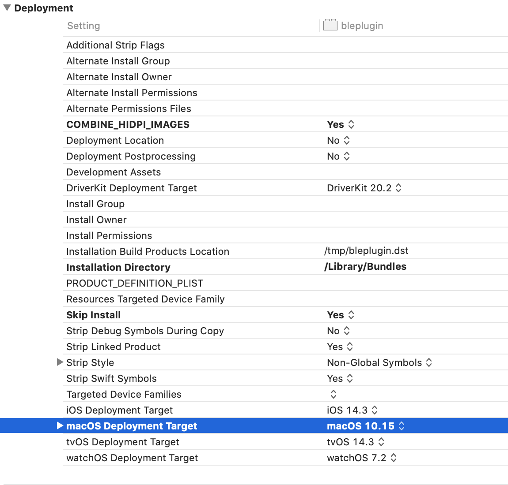
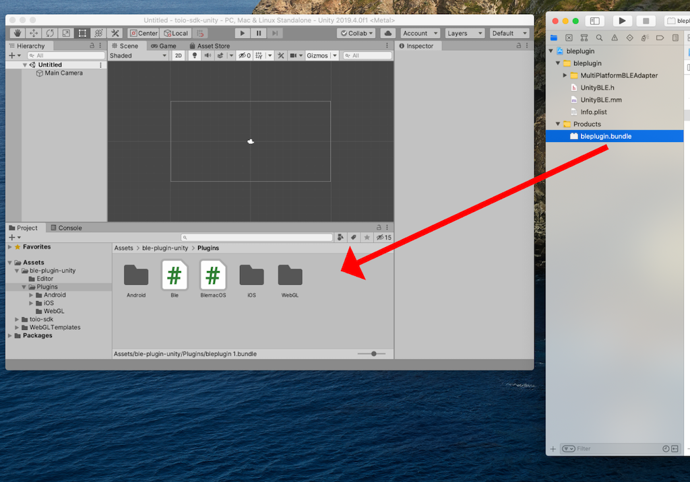

# MacBLE利用方法

通常の場合、<b>リアルのキューブ</b>に接続して動作確認するためにはアプリをビルドする必要が有り、動作確認に時間が掛かります。
MacOS 用の BLE プラグインを利用する事で、アプリをビルドせずに Unity Editor からリアルのキューブに直接接続する事が可能になり、手軽に動作確認が出来ます。

ここでは Mac 上の Unity Editor からリアルのキューブに接続する方法を解説します。

## 目次

- [動作確認済み環境](usage_macble.md#動作確認済み環境)
- [導入方法](usage_macble.md#導入方法)
- [使い方](usage_macble.md#使い方)

 

## 動作確認済み環境

以下の環境で動作確認しています。必ずしも合わせる必要はありませんが、自分の環境でうまく行かない場合は参考にしてください。

| ツール・ソフトウェア   | 確認バージョン          | 推奨バージョン          |
| -------------------- | ---------------------- | ----------------------- |
| OS                   | macOS 13.4.1           | macOS 11 以上           |
| Unity                | 2022.3.2f1             | 2022.3 以上             |
| デバイス              | MacBook Pro 2017       | N/A                    |

 

## 導入方法

事前作業として、画面の左上にあるAppleメニューから「この Mac について」をクリックし、OSバージョンを確認してください。

確認したOSバージョンが <b>10.x</b> <b>11.x</b> <b>12.x</b> の場合は、[ビルド済みのbundleファイルをダウンロードする方法](usage_macble.md#ビルド済みのbundleファイルをダウンロードする方法)を参考に作業を進めてください。
それら以外のOSバージョンの場合は、[自分のPCでbundleファイルをビルドする方法](usage_macble.md#自分のpcでbundleファイルをビルドする方法)を参考に作業を進めてください。

 

### ビルド済みのbundleファイルをダウンロードする方法

#### 1. bundleファイル のダウンロード

[toio/ble-plugin-unity/Releases](https://github.com/toio/ble-plugin-unity/releases) を開き、事前作業で確認したOSバージョンが <b>10.x</b> の場合は`bleplugin_10.bundle.zip`を、<b>11.x</b> または <b>12.x</b> の場合は`bleplugin_11.bundle.zip`をクリックしてダウンロードします。

> 本SDKが v1.5.1 時点では、toio/ble-plugin-unity v1.0.0 リリースを対象にしています。

#### 2. bundleファイル をUnityプロジェクトにドラッグ&ドロップ

Unityプロジェクトを開き、`Assets > ble-plugin-unity > Plugins` までフォルダを移動します。
ダウンロードしたzipファイルを解凍し、bundleファイルをUnityウィンドウへ直接ドラッグ&ドロップします。

 

### 自分のPCでbundleファイルをビルドする方法

#### 1. Xcodeプロジェクト のダウンロード

[toio/ble-plugin-unity](https://github.com/toio/ble-plugin-unity) を開き、【Code】>【Download ZIP】の順でクリックしてリポジトリをダウンロードします。 

#### 2. bundleファイル のビルド

ダウンロードしたzipファイルを解凍して、`bleplugin_projects/macOS/bleplugin/bleplugin.xcodeproj`にあるXcodeプロジェクトファイルを開きます。プロジェクト設定画面を開き、<b>TARGETS</b>リストにある【bleplugin】をクリック後に【Build Settings】タブをクリックし、<b>Deployment</b> 設定を開きます。
Deployment 設定内にある <b>macOS Deployment Target</b> の右列にある【macOS (バージョン値)】をクリックして、事前作業で確認したOSバージョンを選択してください。

上記作業が完了したら、Xcodeの左上にある再生ボタン(:arrow_forward:)をクリックしてビルドを開始し、ビルドが完了するまで待ちます。

#### 3. bundleファイル をUnityプロジェクトにドラッグ&ドロップ

Unityプロジェクトを開き、`Assets > ble-plugin-unity > Plugins` までフォルダを移動します。
ビルドで生成されたbundleファイルを<b>Xcodeウィンドウ</b>からUnityウィンドウへ直接ドラッグ&ドロップします。

 

## 使い方

[Cubeの接続設定](usage_cube.md#4-cubeの接続設定) をご参照ください。

手軽に動作確認したい場合は、サンプルプロジェクトの [Sample_ConnectType](../toio-sdk-unity/Assets/toio-sdk/Samples/Sample_ConnectType/) を動かしてみてください。

もし[ビルド済みのbundleファイルをダウンロードする方法](usage_macble.md#ビルド済みのbundleファイルをダウンロードする方法)に従ってもうまく動作しなかった場合は、[自分のPCでbundleファイルをビルドする方法](usage_macble.md#自分のpcでbundleファイルをビルドする方法)を試してください。