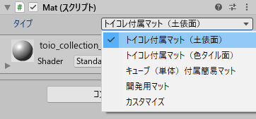
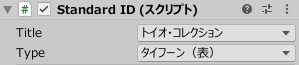
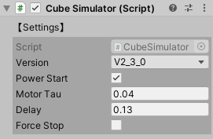
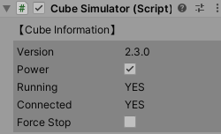
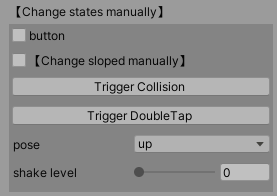
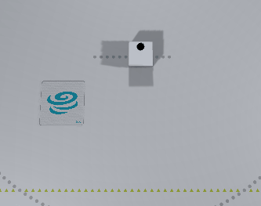
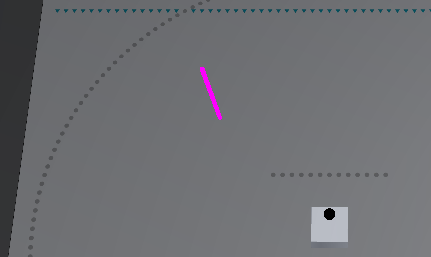
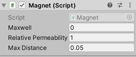

# 技術ドキュメント - 使い方 - シミュレータ

## 目次

- [1. 概説](usage_simulator.md#1-概説)
- [2. Mat Prefab](usage_simulator.md#2-Mat-Prefab)
  - [2.1. インスペクターでのパラメーター](usage_simulator.md#21-インスペクターでのパラメーター)
  - [2.2. 定数](usage_simulator.md#22-定数)
  - [2.3. 列挙型](usage_simulator.md#23-列挙型)
  - [2.4. メソッド](usage_simulator.md#24-メソッド)
- [3. StandardID Prefab](usage_simulator.md#3-StandardID-Prefab)
  - [ 3.1. インスペクターでのパラメーター](usage_simulator.md#31-インスペクターでのパラメーター)
- [4. Cube Prefab](usage_simulator.md#4-Cube-Prefab)
  - [4.1. CubeSimulator のインスペクター](usage_simulator.md#41-CubeSimulator-のインスペクター)
  - [4.2. CubeSimulator の定数](usage_simulator.md#42-CubeSimulator-の定数)
  - [4.3. CubeSimulator のプロパティ](usage_simulator.md#43-CubeSimulator-のプロパティ)
  - [4.4. CubeSimulator のメソッド](usage_simulator.md#44-CubeSimulator-のメソッド)
  - [4.5. Cube オブジェクトの操作 (CubeInteraction)](usage_simulator.md#45-Cube-オブジェクトの操作-CubeInteraction)
- [5. Stage Prefab](usage_simulator.md#5-Stage-Prefab)
  - [5.1. ターゲットポール](usage_simulator.md#51-ターゲットポール)
  - [5.2. キューブをフォーカス](usage_simulator.md#52-キューブをフォーカス)
- [6. Magnet Prefab](#6-Magnet-Prefab)
  - [6.1. インスペクターでのパラメーター](#61-インスペクターでのパラメーター)
  - [6.2. メソッド](#62-メソッド)
  - [6.3. 磁石を自作](#63-磁石を自作)

# 1. 概説

Simulator は、toio™コア キューブ (以降、キューブ) と通信するスマートデバイスのアプリを開発していく際、Unity Editor 上で手軽に動作チェックができるように作られたテスト用の仮想環境です。

Simulator は `Assets/toio-sdk/Scripts/Simulator/Resources/` の下にある、以下の 4 つの prefab から構成されています。

- Mat … 各種プレイマットを模したもの
- StandardID … Standard ID を読み取れる各種のカード・シートを模したもの
- Cube … toio™コア キューブを模したもの
- Stage … シミュレーション環境に必要な一通りの機能をセットにしたもの

Simulator に実装されたクラスは全て `toio.Simulator` 名前空間に属しています。

# 2. Mat Prefab

Mat Prefab は各種プレイマットを模したゲームオブジェクトです。

Cube Prefab は Mat Prefab に置くと、 Mat の座標位置と方向を取得することが出来ます。

Mat Prefab はシーンの中に複数枚、水平であれば位置と角度任意で置けます。

## 2.1. インスペクターでのパラメーター

<div align="center"></div>

Unity のインスペクターで、スクリプト Mat.cs の「タイプ」リストに、

- トイコレ付属マット（土俵面）
- トイコレ付属マット（色タイル面）
- 簡易マット・開発用マット（表面）1~6
- 開発用マット（裏面）
- カスタマイズ

のいずれかを選択すると、マットの見た目と座標を変えられます。

| Unity Editor 上での表記 | 正式名称 |
| :-- | :-- |
| トイコレ付属マット（土俵面） | トイオ・コレクション付属のプレイマット(土俵の面) |
| トイコレ付属マット（色タイル面） | トイオ・コレクション付属のプレイマット(色付きタイルの面) |
| 簡易マット | toio™コア キューブ（単体）付属の簡易プレイマット |
| 開発用マット | toio™開発用プレイマット（仮称） |

 > ※ toio™開発用プレイマット（仮称）#1 ~ #6 の表面は、toio™コア キューブ（単体）付属の簡易プレイマットと同じ仕様なので、一つのタイプ「簡易マット・開発用マット（表面）1~6」にまとめています。

各タイプの仕様は、[toio™コア キューブ 技術仕様](https://toio.github.io/toio-spec/docs/hardware_position_id) と [『開発者向けマット（仮称）』](https://toio.io/blog/detail/20200423-1.html) を参考にしてください。

## 2.2. 定数

```c#
// マット単位とメートルの比例
public static readonly float DotPerM = 411f/0.560f; // (410+1)/0.560 dot/m
```

## 2.3. 列挙型

### MatType

マットのタイプ

```c#
toio_collection_front = 0,  // トイコレ付属マット（土俵面）
toio_collection_back = 1,   // トイコレ付属マット（色タイル面）
simple_playmat = 2,         // キューブ（単体）付属簡易マット
developer = 3,              // 開発用マット
custom = 4                  // 座標範囲をカスタマイズ
```

### DeveloperMatType

開発用マットの番号

```c#
_1, _2, _3, _4, _5, _6, _7, _8, _9, _10, _11, _12
```

## 2.4. メソッド

### GetRectForMatType

```c#
public static RectInt GetRectForMatType(MatType matType, DeveloperMatType devMatType=default);
```

指定タイプのマットの座標範囲を持つ RectInt を取得します。

- matType
  - 定義：マットのタイプ
  - 範囲：`MatType.custom` 以外
- devMatType
  - 定義：開発用マットの番号（matType が `MatType.developer` の場合のみ有効）
- 戻り値
  - 定義：座標範囲を持つ RectInt

### UnityDeg2MatDeg

```c#
public int UnityDeg2MatDeg(double deg);
```

Unity 上の角度を本マット上の角度に変換します。

- deg
  - 定義：Unity 上の角度（度）
  - 範囲：任意
- 戻り値
  - 定義：本マット上の角度（度）

### MatDeg2UnityDeg

```c#
public float MatDeg2UnityDeg(double deg);
```

本マット上の角度を Unity 上の角度に変換します。

- deg
  - 定義：本マット上の角度（度）
  - 範囲：任意
- 戻り値
  - 定義：Unity 上の角度（度）

### UnityCoord2MatCoord

```c#
public Vector2Int UnityCoord2MatCoord(Vector3 unityCoord);
```

Unity の 3D 空間座標から、本マットにおけるマット座標に変換します。

- unityCoord
  - 定義：Unity 上の座標
  - 範囲：任意
- 戻り値
  - 定義：本マット上の座標

### MatCoord2UnityCoord

```c#
public Vector3 MatCoord2UnityCoord(double x, double y);
```

本マットにおけるマット座標から、Unity の 3D 空間座標に変換します。

- x
  - 定義：本マット上のｘ座標
  - 範囲：任意
- y
  - 定義：本マット上のｙ座標
  - 範囲：任意
- 戻り値
  - 定義：Unity 上の 3D 座標


# 3. StandardID Prefab

StandardID Prefab は Standard ID を読み取れる各種のカード・シートを模したゲームオブジェクトです。

Cube Prefab を StandardID Prefab の上に載せると、Standard ID と方向を取得することが出来ます。

StandardID Prefab はシーンの中に複数枚、位置と角度任意で置けます。

## 3.1. インスペクターでのパラメーター

<div align="center"></div>

Unity のインスペクターで、スクリプト Mat.cs の「タイトル」を選択してから、特定の「タイプ」のカード・シートを選択して、StandardID を切り替えることが出来ます。

対応できる「タイトル」は以下になります。

- トイオ・コレクション
- 簡易カード

「タイプ」については、[toio™コア キューブ 技術仕様](https://toio.github.io/toio-spec/docs/hardware_standard_id)を参照してください。


## 3.2. メソッド

### UnityDeg2MatDeg

```c#
public int UnityDeg2MatDeg(double deg);
```

Unity 上の角度を本 StandardID 上の角度に変換します。

- deg
  - 定義：Unity 上の角度（度）
  - 範囲：任意
- 戻り値
  - 定義：本 StandardID 上の角度（度）

### MatDeg2UnityDeg

```c#
public float MatDeg2UnityDeg(double deg);
```

本 StandardID 上の角度を Unity 上の角度に変換します。

- deg
  - 定義：本 StandardID 上の角度（度）
  - 範囲：任意
- 戻り値
  - 定義：Unity 上の角度（度）


# 4. Cube Prefab

Cube Prefab は toio™コア キューブ を模したゲームオブジェクトです。

Cube Prefab は二つのスクリプトを持っています。
- `CubeSimulator`：実際のキューブのシミュレーションを実装したもの
- `CubeInteraction`：シミュレータ上で、Cubeオブジェクトを押したりつかんだりする操作を実装したもの

> 実際のキューブとは一部機能差があります。<br>
> 詳細については、[機能の対応状況](usage_cube.md#RealSim-機能表)をご確認下さい。

Cube Prefab はシーンの中に複数台配置することが出来ます。 （ Cube Prefab が他のオブジェクトと重ならないように配置してください。）

## 4.1. CubeSimulator のインスペクター

【シミュレータの設定】と【手動でキューブの状態を変更】との二つの部分に分けられています。

### シミュレータの設定（非実行時）

<div align="center"></div>

- `Version`： ファームウェアのバージョン。
- `Power Start`： キューブ電源の初期状態。
- `Motor Tau`： モーターの一次遅れ要素のパラメーター。
- `Delay`： 通信の遅延(指令の送信から取得した座標が変わるまでのラグ)。
- `Force Stop`: チェックすると、モーターの出力を強制的に停止させる。

### シミュレータの情報（実行時）

<div align="center"></div>

- `Version`： ファームウェアのバージョン。変更不可。
- `Power`： キューブの電源。
- `Running`： 起動されて、接続可能な状態。
- `Connected`： 接続されたか否か。
- `Force Stop`: チェックすると、モーターの出力を強制的に停止させる。

### 手動でキューブの状態を変更（実行時）

<div align="center"></div>

>接続された状態のみに表示されます。

シミュレータ上でリアルに再現するのが難しい、或いは操作しにくい場合、インスペクターでキューブの状態を変更し、対応イベントを起こすことが出来ます。

- `button`： チェックを入れると、ボタンを押したままの状態になります。押された状態ではキューブは動くことが出来ません。また、マウスの操作でボタン状態を変更した場合、この設定が上書きされます。
- `【Change sloped Manually】`： チェックすると、`sloped` が表示され設定を変更できるようになります。
（通常はシミュレータが毎フレームsloped状態をセットしていますが、この設定が有効な場合はシミュレータが `sloped` をセットしないようになります。）
  - `sloped`： キューブが斜面にいるかを示します。
- `Trigger Collision`： 衝突を発生させるボタンです。(現在、ゲームエンジンで物理的な衝突シミュレーションは実装されていません）
- `Trigger DoubleTap`： ダブルタップを発生させるボタンです。（現在、ゲームエンジンで物理なダブルタップ・シミュレーションは実装されていません）
- `pose`： キューブの姿勢を表示・変更できます。
- `shake level`： シェイクの強さを示します。（現在、シミュレータにはキューブがシェイクされたことを検出する機能は実装されていません）
- `【Change Magnetic Sensor Manually】`： チェックすると、`magnet state`と`magnetic force` が表示され設定を変更できるようになります。この場合、シーンの中に存在する Magnet Prefab からの磁力は受けません。
  - `magnet state`： いずれかの状態を選択すると、相応な磁力がキューブに与えられます。通知タイプが `Magnet State` でない場合、与えられる磁力は変更されますが、表示される `magnet state` は `None` のままになります。
  - `magnetic force`： 入力した磁力をキューブの磁気センサーに与えます。`Cube.magneticForce` には等しくありません。

## 4.2. CubeSimulator の定数

```c#
// 左右タイヤの間隔（メートル）
public static readonly float TireWidthM = 0.0266f;
// 左右タイヤの間隔（ドット（マット座標））
public static readonly float TireWidthDot= 0.0266f * Mat.DotPerM;
// キューブのサイズ
public static readonly float WidthM= 0.0318f;
// 速度（ドット毎秒）と指示値の比例
public static readonly float VDotOverU =  4.3f*Mathf.PI*0.0125f/60 * Mat.DotPerM; // about 2.06
```

## 4.3. CubeSimulator のプロパティ

```c#
public bool power { get; set; }                 // 電源
public bool isRunning { get; private set; }     // 稼働中か否か
public int maxMotor { get; }                    // モーター指令最大値
public int deadzone { get; }                    // モーター指令デッドゾーン
public int x { get; internal set; }             // マット上のｘ座標
public int y { get; internal set; }             // マット上のｙ座標
public int deg { get; internal set; }           // マット上の角度（度）
public int xSensor { get; internal set; }       // 読み取りセンサーのマット上のｘ座標
public int ySensor { get; internal set; }       // 読み取りセンサーのマット上のｙ座標
public uint standardID { get; internal set; }   // 読み取った Standard ID
public bool onMat { get; internal set; }        // Mat 上にあるか
public bool onStandardID { get; internal set; }   // StandardID 上にあるか
public bool isGrounded { get {return onMat || onStandardID; } } // Mat 又は StandardID 上にあるか
```

## 4.4. CubeSimulator のメソッド

Cube クラスから利用するためのメソッドなので、エンドユーザーが直接使用する必要はありません。

## 4.5. Cube オブジェクトの操作 (CubeInteraction)

CubeInteraction クラスは、Unity の EventSystem をベースに、Cube オブジェクトを押したりつかんだりする操作を実装したクラスです。

### 使用方法

> Stage Prefab を使う場合は、既に操作できるようになっていますのでスキップしてください。

- シーンの中に、`EventSystem` が一つ含まれていることを確認します；
  - 作成方法：メニューの「GameObject」>「UI」>「Event System」を押します。
- カメラに `Physics Raycaster` コンポーネントを追加してください；
  - 追加方法：カメラのインスペクターで、「Add Compnent」で `Physics Raycaster` を見つけて追加します。

### Cube オブジェクトを左クリックで押す

Cube オブジェクトを`左クリック`すると、対象の Cube オブジェクトの[底面のボタン](https://toio.github.io/toio-spec/docs/ble_button)を押すことができます。

> マウスの左ボタンを押し続けている間、Cube オブジェクトの底面ボタンは押され続けます。

<div align="center"></div>

### Cube オブジェクトを右クリックで持ち上げる/おろす
Cube オブジェクトを`右クリック`することで対象の Cube オブジェクトをマットから持ち上げ、その状態で場所や角度を変えることが出来ます。

- Cube オブジェクトを`右クリック`すると、対象の Cube オブジェクトをマットから持ち上げることができます
- 持ち上げた状態で`マウスを動かす`と、対象の Cube オブジェクトを任意の場所に移動させることが出来ます
- 持ち上げた状態で`マウスホイールを回す`と、対象の Cube オブジェクトの向きを変えられます
- 持ち上げた状態で再度`右クリック`すると、対象の Cube オブジェクトを Mat 上におろすことができます

<div align="center"></div>

### Cube オブジェクトを右ドラッグで引っ張る

対象の Cube オブジェクトを `右ドラッグ` することで、Cube オブジェクトを引っ張って動かすことが出来ます。<br>
右ドラッグを開始すると、マウスカーソルと Cube オブジェクトの間に黒いベクトルが表示され、そのベクトルに比例した力が Cube オブジェクトに加わります。

<div align="center"></div>

# 5. Stage Prefab

Stage Prefab は、

- Mat Prefab
- カメラ（マウス操作用の PhysicsRaycaster 付き）
- ライト
- ターゲットポール (後述)
- キューブの脱出を防止する 「テーブル」 と ボーダー
- EventSystem

をセットにしたものです。

また、Stage Prefab は以下の 2 つの便利なツールを備えています。
- ターゲットポール
- キューブをフォーカスする

視野がマットにフィットするカメラとライトを内包するため、新規にシーンを作成した場合は、シーンに既にあるカメラとライトを削除してから、Stage Prefab を追加するのをお勧めします。

※本 Prefab に実装された操作機能は、`CubeInteraction` に基づいてあります。

## 5.1. ターゲットポール

ターゲットポールは、 ピンク色の棒です。（設置する前には見えない状態にしています。）

<div align="center"></div>

Ctrl キーを押したままに、任意のオブジェクトにマウスの右ボタンを押すことで、ターゲットポールを設置することができます。<br>
オブジェクトの無い所に同じ操作を行うと、ターゲットポールが消えます。

開発者はターゲットポールの位置を取得してキューブの制御に利用することが出来ます。

```c#
public bool targetPoleActive { get; }      // ターゲットポールが設置されたか？
public Vector2Int targetPoleCoord { get; } // ターゲットポールのマット座標を取得
```

ターゲットポールを使ってキューブを操作する具体的な方法については [チュートリアル](tutorials_cubehandle.md#Follow-TargetPole-デモ) で紹介しています。

## 5.2. キューブをフォーカス

Ctrl キーを押したままに、キューブを左クリックすると、フォーカスされます。<br>
キューブ以外に同じ操作を行うと、フォーカスが外されます。

<div align="center"></div>

フォーカスの対象を取得することで、特定のキューブの操作やデバッグが容易になります。

### プロパティ

```c#
// フォーカス対象の名前（Unityヒエラルキーでの名前）
public string focusName { get; }
```

### SetFocus

```c#
public void SetFocus(Transform transform);
```

手動でフォーカス対象を設定します。

- transform
  - 定義：フォーカスの対象

### SetNoFocus

```c#
public void SetNoFocus();
```

フォーカスをキャンセルします。

<br>

# 6. Magnet Prefab

Magnet Prefab は[仕様書](https://toio.github.io/toio-spec/docs/hardware_magnet#磁石の仕様)に規定された標準の磁石を模したゲームオブジェクトです。

Magnet Prefab を Cube Prefab の付近に置くことで、磁気センサーをリアルのように作動させることが出来ます。

<div align="center"></div>

## 6.1. インスペクターでのパラメーター

<div align="center"></div>

- `Maxwell`：スクリプトがアタッチされたオブジェクトの位置に置く磁荷
- `Relative Permeability`：相対透磁率
- `Max Distance`：磁場を計算する範囲

Magnet Prefab 自身（一番上の親オブジェクト）には磁荷が定義されておらず、複数の子オブジェクトに Magnet.cs がアタッチされ磁荷が定義されています。それらの磁荷によって、四角い磁石の磁場が擬似されています。

## 6.2. メソッド

### GetSelfH

```c#
public Vector3 GetSelfH(Vector3 pos);
```

定義された磁荷が指定位置に生成した磁場ベクトルを計算します。
自オブジェクトとの距離が `Max Distance` より大きい場合、直接に 0 を戻します。

- pos
  - 定義：位置
  - 範囲：任意
- 戻り値
  - 定義：磁場ベクトル

### SumUpH

```c#
public Vector3 SumUpH(Vector3 pos);
```

自オブジェクト及び子オブジェクトに含まれるすべての磁荷が指定位置に生成した合成磁場ベクトルを計算します。
自オブジェクトとの距離が `Max Distance` より大きい場合、直接に 0 を戻します。

- pos
  - 定義：位置
  - 範囲：任意
- 戻り値
  - 定義：磁場ベクトル

## 6.3. 磁石を自作

以下の手順で Magnet Prefab を自作できます。

- 親オブジェクトに Magnet.cs をアタッチします。磁荷は 0 にするのをおすすめします。
- 子オブジェクトを作成し、Magnet.cs をアタッチし、磁荷を設定します。すべての磁荷の和が 0 であるようにしてください。
- 親オブジェクトのタグを `t4u_Magnet` に変更します。これで CubeSimulator に認識されるようになります。子オブジェクトのタグは設定しないでください。

