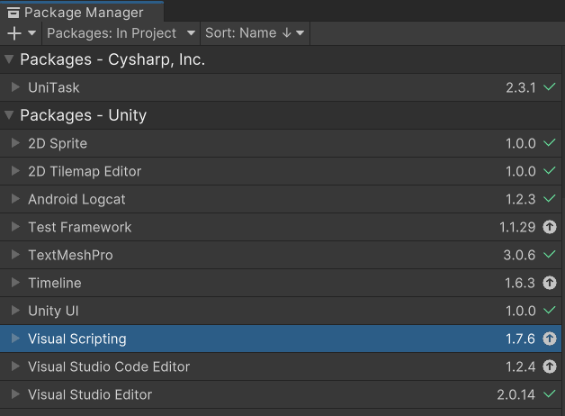
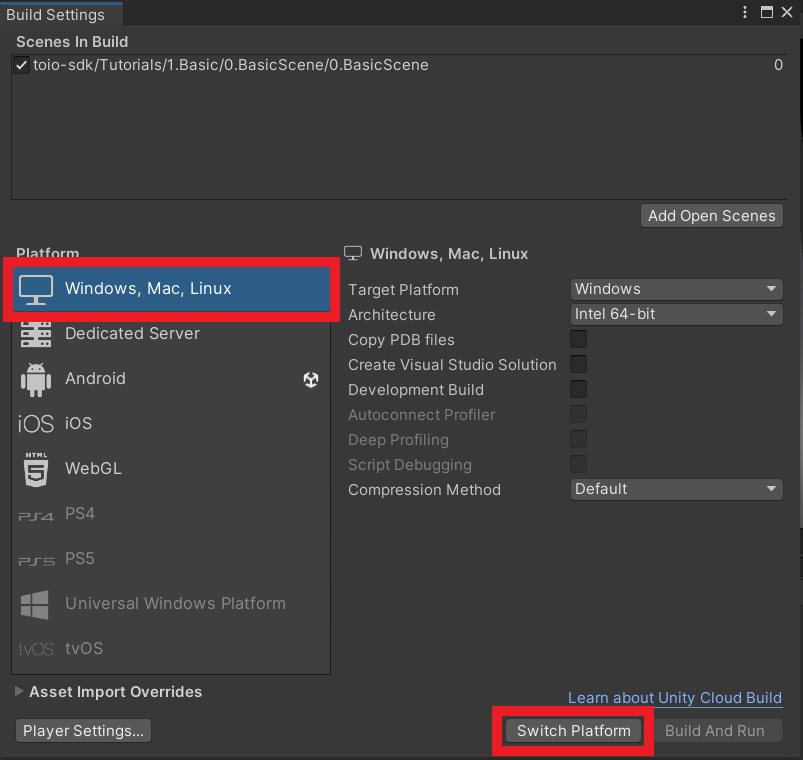
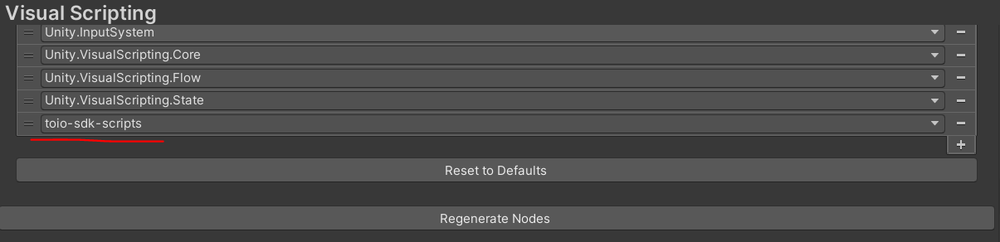
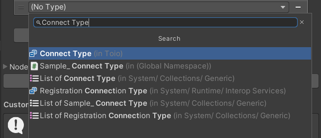
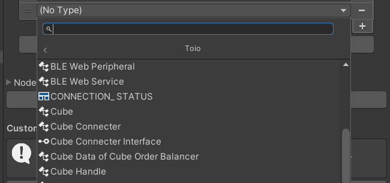
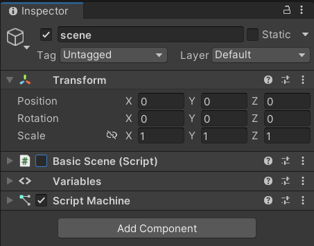

# Unity Visual Scriptingを利用する場合
toio SDK for UnityをC#ではなくVisual Scriptingで利用したい場合は、[「toio SDK for Unity インストール」](download_sdk.md)を完了した後、さらに行わなくてはいけない設定、および確認作業があります。

Unity Visual Scriptingのバージョンは1.7.6で動作を確認しています。

## 目次
  - [1. Unity Visual Scriptingの確認](#1-unity-visual-scriptingの確認)
    - [Visual Scriptingがインストールされていない場合](#visual-scriptingがインストールされていない場合)
  - [2. ビルドのプラットフォームをPCにする](#2-ビルドのプラットフォームをpcにする)
  - [3. toio SDK for UnityをVisual Scriptingで利用できるようにする。](#3-toio-sdk-for-unityをvisual-scriptingで利用できるようにする)
  - [4. Visual Scripting版のサンプルの実行、動作確認](#4-visual-scripting版のサンプルの実行動作確認)

## 1. Unity Visual Scriptingの確認
1. Unity の [ウィンドウ] メニューから [Package Manager] を選んでPackage Managerを開く。
1. 左上が[Packages:in Project]の状態のときに[Visual Scripting]がインストールされていることを確認する。

### Visual Scriptingがインストールされていない場合
1. Unity の [ウィンドウ] メニューから [Package Manager] を選んでPackage Managerを開く。
1. 左上の[Packages:in Project]アイコンをクリックし、[Unity Registory]を選択する。
1. Visual Scriptingをクリックし、右下の[install] ボタンをクリックする。

[Packages:in Project]の状態でVisual Scriptingが存在していればインストールは完了です。

## 2. ビルドのプラットフォームをPCにする
ビルド設定をPCに設定します。この設定を行わないとCubeクラス等、一部表示されないノードがあります。
ビルド自体はios,android,WebGLでも可能ですが、Visual Scriptingでプログラムを作成している際はビルド時のプラットフォームをPCにしてください。
1. [File]->[Build Setting]をクリックする。
1. [Platform]のリストから[Windows, Mac, Linux]を選択肢して[Switch Platform]をクリックする。

[Switch Platform]を押して数秒待ち、[Windows, Mac, Linux]の横にUnityのアイコンが表示されていれば成功です。

## 3. toio SDK for UnityをVisual Scriptingで利用できるようにする。
1. [Edit]->[Project Setting]->[Visual Scripting]とクリックする。
2. Node Libraryに[toio-sdk-scripts]を新規に追加する。
   1. [Node Library]をクリックすると現在利用できるライブラリーの一覧が表示されるので、[+]アイコンを押す。
   2. (No Assembly)と表示されたタブが追加されるので、タブをクリックし[toio-sdk-scripts]を選択する。

3. Type Optionsに必要に応じてクラスを新規に追加する
   1. [Type Options]をクリックすると現在利用できるノードの一覧が表示されるので、[+]アイコンを押す。
   2. (No Type)と表示されたタブが追加されるので、タブをクリックして必要なクラスを選択する。(以下は`Assets/toio-sdk/Tutorials`のサンプルを全て動かすために必要な全てのノードです。)
      - [Toio]から
         - CONNECTION_STATUS
         - Cube
         - Cube Handle
         - Cube Manager
         - Movement
      - [Toio]->[Visual Scripting]から
         - Converter To Byte
         - Sensor Checker
         - Visual Script Cube Configration
      - [Toio]->[Simulator]から
         - Mat
      - [Toio]->[Navigation]から
         - Navigator
      - [(Enums)]から
         - Connect Type
      - [UnityEngine]から
         - Wait for Seconds RealTime
4. [Regenerate Nodes]をクリックしてノードを再生成する。

以下のように、「Regenerates Nodes Completed」のメッセージが表示されればtoio SDK for UnityをVisual Scriptingで利用できるようにするための設定は完了です。

  

### ＊[Connect Type]の追加方法について

> ノード追加時、Connect Typeと検索すると下画像のように[Connect Type (in Toio)]と表示され、[Toio]のリストに配置されているように表示されます。 
> 

>  しかし[Toio]のリストには[Connect Type]のノードは存在していません。
> 

>  これはConnect Typeの型がEnumでありながら[Toio]というリストにプログラム上では属している影響でこのようになっています。[(Enums)]リストに属している[Connect Type]とConnect Typeで検索した際の[Connect Type (in Toio)]は同一のノードとなっているので、どちらの方法で追加しても問題ありません。

## 4. Visual Scripting版のサンプルの実行、動作確認
Visual Scriptingを利用するために必要な作業を終えたら、Visual Scripting版のサンプルを実行してみましょう。

`Assets/toio-sdk/Tutorials/1.Basic/0.BasicScene/`までフォルダを移動し、`0.BasicScene シーンファイル`をダブルクリックで開きます。

ヒエラルキーの[scene]をクリックします。インスペクター上の[Basic Scene(Script)]に入っているチェックを外し、[Script Machine]にチェックを入れてください。

これでC#で動いていたサンプルがVisual Scriptingで動くようになりました。

エディタ上のプレイボタンを押してC#版と同じ動きをキューブがするかを確認してください。

確認出来たらVisual Scriptingでtoio SDK for Unityを動かす準備は完了です。

[Unity Visual Scripting向けチュートリアル](tutorials_visual_scriptings.md)に各種チュートリアルがあるのでtoio SDK for UnityのVisual Scriptingでの使い方を確認してください。
