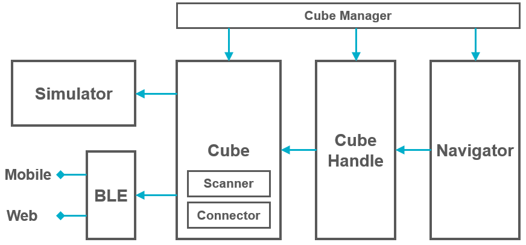

# toio SDK for Unity Documentation

## Development Overview

### [1] Setup

1. Prepare the development environment ["Preparation"](preparation.md)
2. Create a new project in Unity and load toio SDK for Unity ["toio SDK for Unity Installation"](download_sdk.md)
3. Optional
   - ["Install BLE plugin for Mac"](usage_macble.md)
   - ["Setting of Visual Scripting"](visual_scripting_setting.md)
  

### [2] Development

1. Check before development ["How to operate Simulator (Settings for mats and cubes, etc.)"](development_simulator.md).
2. Create a development folder under the Assets folder ["Script Dependencies"](development_basics.md#1-script-dependencies).
3. Create a new scene and load Simulator's Prefab ["Creating Scenes"](tutorials_basic.md#2-creating-scenes).
4. Programming.
  

### [3] Verifying program in Unity Editor (Connect to simulator or actual device)

1. Press the Play button to verify operation in the simulator.
2. Set ConnectType to Real (actual device), press the Play button, and connect to the actual device to verify operation.
    - [Set up Mac BLE](usage_macble.md) first if using Mac
    - For specifications and how to set ConnectType, refer to the sample [ConnectType](../toio-sdk-unity/Assets/toio-sdk/Samples/Sample_ConnectType/README_EN.md).
3. Repeat the development and operation verification in Unity Editor to efficiently finalize your program.
  

### [4] Build

1. Build an app for a smart device and verify that it works on the device.
    - ["iOS Build"](build_ios.md) | ["Android Build"](build_android.md) | ["WebGL Build"](build_web.md)
    - For Mac or Windows 10 build, please refer to [Unity's official document](https://docs.unity3d.com/ja/2022.3/Manual/PublishingBuilds.html).

 

## Tutorial

### Basics

- [1. Overview](tutorials_basic.md#1-overview)
- [2. Creating Scenes](tutorials_basic.md#2-creating-scenes)
- [3. Move](tutorials_basic.md#3-move)
- [4. Make a sound](tutorials_basic.md#4-make-a-sound)
- [5. Light up LED](tutorials_basic.md#5-light-up-led)
- [6. Read toio ID(Position ID & Standard ID)](tutorials_basic.md#6-read-toio-idposition-id--standard-id)
- [7. Detect sensors' events](tutorials_basic.md#7-Detect-sensors-events)
- [8. Move multiple Cubes](tutorials_basic.md#8-move-multiple-cubes)
- [9. Simplifying the source code using CubeManager class](tutorials_basic.md#9-simplifying-the-source-code-using-cubemanager-class)
- [10. Connection/disconnection on the way](tutorials_basic.md#10-connectiondisconnection-on-the-way)
- [11. Creating UI](tutorials_UI.md)
- [12. How to use in Visual Scripting](tutorials_visual_scriptings.md)
### Easily control the movement of the cube - CubeHandle

- [1. Basic Usage](tutorials_cubehandle.md#1-Basic-Usage)
- [2. Functions](tutorials_cubehandle.md#2-Functions)
  - [2.1. Basic Settings](tutorials_cubehandle.md#21-Basic-Settings)
  - [2.2. CubeHandle's Move function and MoveRaw function](tutorials_cubehandle.md#22-cubehandles-move-function-and-moveraw-function)
  - [2.3. One-shot method to reduce the amount of communication with Cube](tutorials_cubehandle.md#23-one-shot-method-to-reduce-the-amount-of-communication-with-cube)
  - [2.4. Closed-Loop method to reach the specified coordinates/direction](tutorials_cubehandle.md#24-closed-loop-method-to-reach-the-specified-coordinatesdirection)
- [3. Follow TargetPole Demo](tutorials_cubehandle.md#3-follow-targetpole-demo)

### Group control - Navigator

- [1. Overview](tutorials_navigator.md#1-overview)
- [2. Basic Usage](tutorials_navigator.md#2-Basic-Usage)
- [3. Avoiding Collisions with CubeNavigator](tutorials_navigator.md#3-avoiding-collisions-with-cubenavigator)
    - [3.1. Basic Settings](tutorials_navigator.md#31-Basic-Settings)
    - [3.2. Navi2Target function to move to the target while avoiding collision](tutorials_navigator.md#32-navi2target-function-to-move-to-the-target-while-avoiding-collision)
    - [3.3. Move away from the target NaviAwayTarget function](tutorials_navigator.md#33-Move-away-from-the-target-NaviAwayTarget-function)
- [4. Population Control with Boids](tutorials_navigator.md#4-population-control-with-boids)
- [5. Boids + Conflict Avoidance](tutorials_navigator.md#5-boids--conflict-avoidance)

### Templates

- [1. Connecting with Local Name and Controlling with CubeHandle](tutorials_templates.md#1-Connecting-with-Local-Name-and-Controlling-with-CubeHandle)

 

## Sample

### Basics

- [Sample_ConnectType](../toio-sdk-unity/Assets/toio-sdk/Samples/Sample_ConnectType/README_EN.md)

  This sample is to check if the connection settings are different between Simulator and the real environment.

- [Sample_ConnectName](../toio-sdk-unity/Assets/toio-sdk/Samples/Sample_ConnectName/README_EN.md)

  This is a collection of samples for connecting to a cube with the specified Local Name.

- [Sample_Circling](../toio-sdk-unity/Assets/toio-sdk/Samples/Sample_Circling/README_EN.md)

  This is a sample to see how the behavior of many Cubes changes depending on the mode of CubeNavigator.

- [Sample_Cross](../toio-sdk-unity/Assets/toio-sdk/Samples/Sample_Cross/README_EN.md)

  This is a sample of how to use CubeNavigator to move multiple Cubes with avoiding collisions.

- [Sample_Sensor](../toio-sdk-unity/Assets/toio-sdk/Samples/Sample_Sensor/README_EN.md)

  This is a sample that detects each sensor value of Cube and displays it on UI.

- [Sample_Motor](../toio-sdk-unity/Assets/toio-sdk/Samples/Sample_Motor/README_EN.md)

  This is a sample of moving Cube using Cube.TargetMove and Cube.AccelerationMove.

- [Sample_VisualizeNavigator](../toio-sdk-unity/Assets/toio-sdk/Samples/Sample_VisualizeNavigator/README_EN.md)

  This is an example of visualizing the results of HLAvoid calculation of CubeNavigator and all defined walls.

### Application

- [Sample_MultiMat](../toio-sdk-unity/Assets/toio-sdk/Samples/Sample_MultiMat/README_EN.md)

  This is a sample of using multiple mats together as one large mat.

- [Sample_Bluetooth](../toio-sdk-unity/Assets/toio-sdk/Samples/Sample_Bluetooth/README_EN.md)

  This is a sample of communicating with Cube by directly using BLE interface, which is a low-level module.

- [Sample_WebGL](../toio-sdk-unity/Assets/toio-sdk/Samples/Sample_WebGL/README_EN.md)

  This is a collection of sample web applications that run in a browser.

- [Sample_Scenes](../toio-sdk-unity/Assets/toio-sdk/Samples/Sample_Scenes/README_EN.md)

  This sample handles scene transitions while maintaining the connection with the real Cube and the correlated instance with Cube on Simulator.

- [Sample_DigitalTwin](../toio-sdk-unity/Assets/toio-sdk/Samples/Sample_DigitalTwin/README_EN.md)

  These samples demonstrate a "Digital Twin," where the movements of a real cube are reflected in real-time on a simulator cube.

 

## Technical Documents

### Diagram of the entire system

Explain from low level (left) to high level (right).
- Simulator: A simulator that can be run in Unity Editor
- BLE: A module for bluetooth communication with the real Cube on smart devices or web browser
- Cube: A class that unifies both Simulator and the real world and handles Cube
- CubeHandle: A class that summarizes useful movement functions
- Navigator: A class that provides advanced group control
- CubeManager: A class that usefully manages multiple cubes and various functions

### How to use

- [Cube Class](usage_cube.md)
- [Simulator](usage_simulator.md)
- [CubeHandle class](usage_cubehandle.md)
- [Navigator class](usage_navigator.md)

### Function Description

- [Cube Class](sys_cube.md)
- [BLE(Bluetooth Low Energy)](sys_ble.md)
- [Simulator](sys_simulator.md)
- [Navigator class](sys_navigator.md)

 

## FAQ

- [FAQ](FAQ.md)
