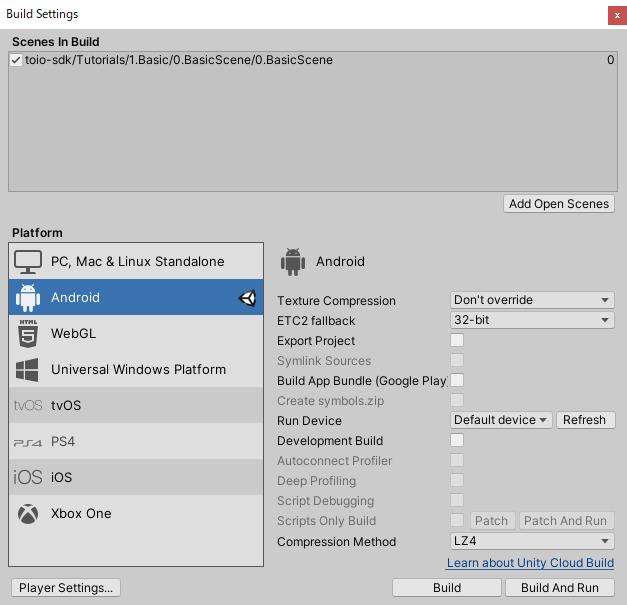
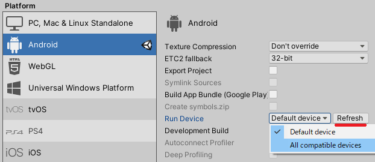
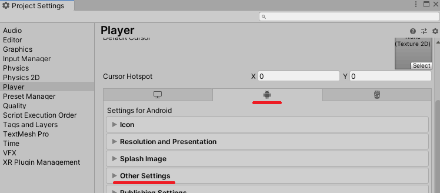
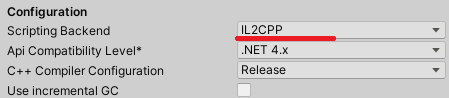
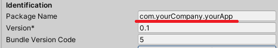
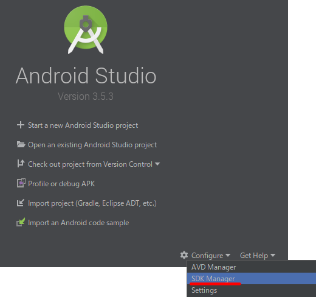
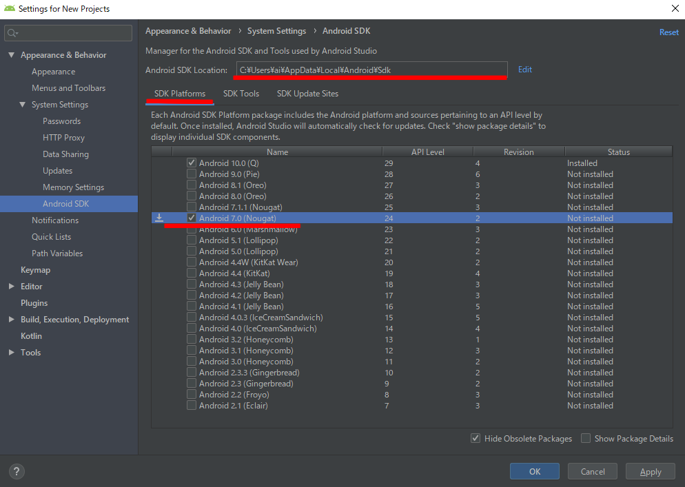
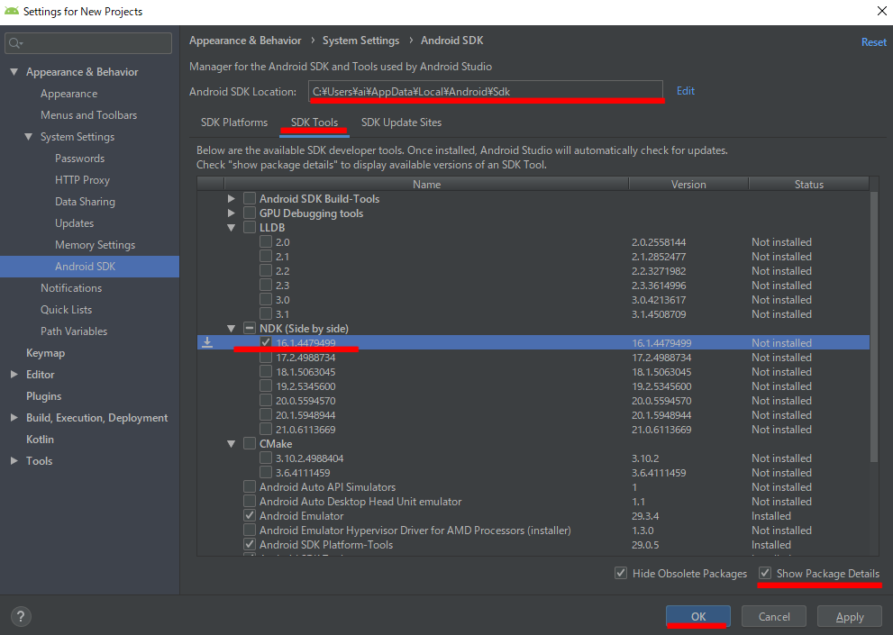
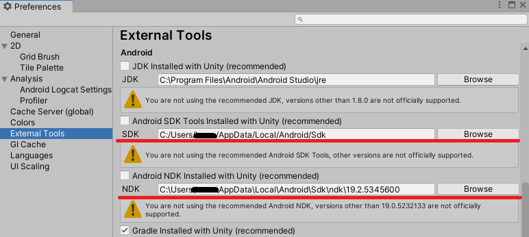

# Android Build

This section explains how to build a project using toio SDK for Unity for Android.

## Tested Environment

The following environments have been tested. You don't necessarily have to match them, but you can use them as a reference if things don't work in your environment.

| Tools/Software | Confirmed Version | Recommended Version
| -------------------- | ---------------------- | ----------------------- |
| OS | Winidows 10 | Winidows 10 or higher |
| Unity | 2022.3.2f1 | 2022.3 or higher |

Mobile Phone

| Model Name | OS |
| -- | -- |
| HUAWEI nova 5T | Android 9 |
| Xiaomi Mi Note 10 Lite | Android 10 |

#### Compatibility:

Starting from Android 12 (API Level 31), [new Bluetooth permissions](https://developer.android.com/about/versions/12/features/bluetooth-permissions) have been added.

The AndroidManifest.xml in toio SDK for Unity's Assets/Plugins/Android has been updated to support Android 12. Therefore, if you build with an SDK version lower than Android 11 (API Level 30), you will encounter an error.

For Unity 2021 and earlier versions, the built-in Android SDK is lower than Android 11 (API Level 30). To resolve this, please refer to [Install the Android SDK](#Install-the-Android-SDK) and install Android SDK, or replace the AndroidManifest.xml with the one that supports Android 11 (API Level 30) or below from [toio SDK for Unity v1.5.1](https://github.com/morikatron/toio-sdk-for-unity/tree/v1.5.1).

 

## Check Android Build Support in Unity

If you didn't add the Android Build Support module when you installed Unity, open Unity Hub, go to the [Installs] tab, and add Android Build Support from the [Add Modules] menu in the upper right corner of the appropriate version.

 

## Switch the build platform to Android

In this section, we will assume that you have opened `Assets/toio-sdk/Tutorials/1.Basic/0.BasicScene/` by continuing from the end of [Installing toio SDK for Unity](download_sdk.md).

First, select [File] -> [Build Settings...] from Unity menu. in Unity menu. Under Build Settings, select Android from the Platform list and click the Switch Platform button on the bottom right.

Wait a few seconds, and when Unity icon appears to the right of Android, the switch is complete.

 

## Smart Phone Settings

There are many variations of smartphone settings, so I will quote from [Android environment settings on the official Unity page](https://docs.unity3d.com/2021.3/Documentation/Manual/android-sdksetup.html).

### Enable Developer Options

To enable USB debugging, you must enable Developer options on your device. To do this, find the build number in your device’s Settings menu. The location of the build number varies between devices; for stock Android, it’s usually Settings > About phone > Build number. For specific information on your device and Android version, refer to your hardware manufacturer.

After you navigate to the build number using the instructions above, tap on the build number seven times. A pop-up notification saying “You are now X steps away from being a developer” appears, with “X” being a number that counts down with every additional tap. On the seventh tap, Developer options are unlocked.

Note: On Android versions prior to 4.2 (Jelly Bean), the Developer options are enabled by default.

### Enable USB debugging

Go to Settings > Developer options (or, if this does not work, on some devices the path is Settings > System > Developer options), and check the USB debugging checkbox. Android now enters debug mode when it is connected to a computer via USB.

(When connecting to a PC, the smartphone may display a dialog box asking "Do you want to allow USB debugging dialog may appear. Tap "OK" when the dialog is displayed.)

### Check the connection

On the right side of the Build Settings window, click the Refresh button. 
Check if your device is in the device list on the left and select it.

 

## Configure IL2CPP

Setting IL2CPP is not mandatory, but we recommend IL2CPP, which is more efficient than Mono, since it is quite computationally intensive for controlling the motion of Cube.

Open [Player Settings...] in the lower left corner of [Build Settings]. at the bottom left of [Build Settings]. 
(Or, open the menu [Edit] -> [Project Settings...]) and select "player" on the left side). 
Select the tab with the Android icon.

Expand [Other Settings].

 

Select [IL2CPP] in [Scripting Backend].

 

## Build with Unity's built-in environment

All the environments are already built into the Android Build Support that you selected when installing Unity. 
However, it may or may not work, so let's try it out anyway.

### Set the package name

If an app built in another environment with the same package name is already installed on your device, there is a good chance that the installation will fail, so set your own package name.

Same as [Configure IL2CPP](build_android.md#configure-il2cpp), in [Project Settings] - [Player] - [Android icon tab] - [Other Settings], change the package name.

### Build

Open [Build Settings] and click [Build and Run] on the bottom right corner. Unity will build and install the app on your device and run it.

If successful, this manual will end here. Thank you for your time. 
If it fails, let's move on.

 

## Install the Android SDK

If the above does not work, please try the following

## Install Android Studio

Download and install it from [Download Android Studio](https://developer.android.com/studio/).

If you have any questions, please refer to the official manual [Install Android Studio](https://developer.android.com/studio/install).

### Install the Android SDK

The first time you run Android Studio after the installation is complete, it will run the configuration and component installation. 
You can proceed with the default settings.

Once completed, you will see the following title screen. 
Open [SDK Manager] in the [Configure] menu in the lower right corner.

 

Make a note of the path to the SDK. 
Under [SDK Platforms], check the version you need.

 

Next, switch to the [SDK Tools] tab. 
Check [Show Package Details] in the lower right corner. 
Check the appropriate version under [NDK (Side by Side)]. 
(For Unity version 2022.3, select NDK 23. [Refer to here](https://docs.unity3d.com/2022.3/Documentation/Manual/android-sdksetup.html))
 
Press "OK" to proceed and the installation will begin.

 

## Set up Android environment in Unity.

### SDK and NDK path settings

Open the menu [Edit] -> [Preferences...]. and select [External Tools] on the left side.

Uncheck [Android SDK Tools Installed with Unity (recommended)] and set the path to the SDK you wrote down earlier.

Uncheck [Android NDK Installed with Unity(recommended)] and set the [SDK path] /ndk/ [Version number].

 

### Build

Open [Build Settings] and click [Build and Run] on the bottom right corner. Unity will build and install the app on your device and run it.

If the app has been built correctly, the screen on your phone will look like this.

When you start the application for the first time, the "Allow use of Bluetooth? dialog will be displayed. If you allow it in the dialog, the application will start communicating with Cube and Cube will start running.