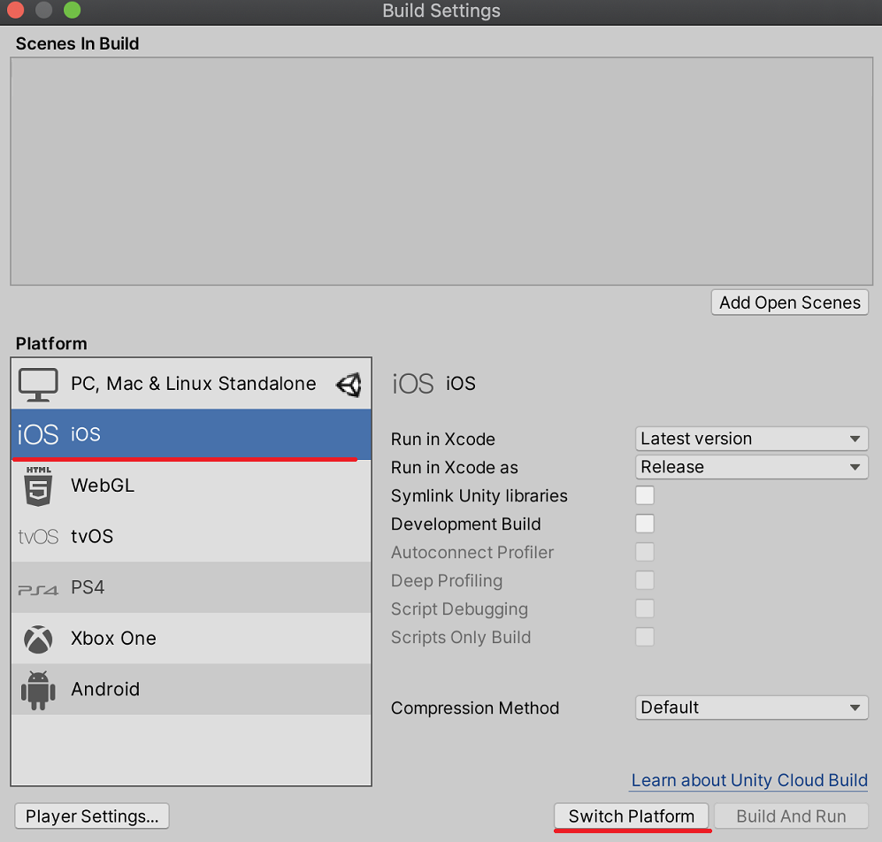
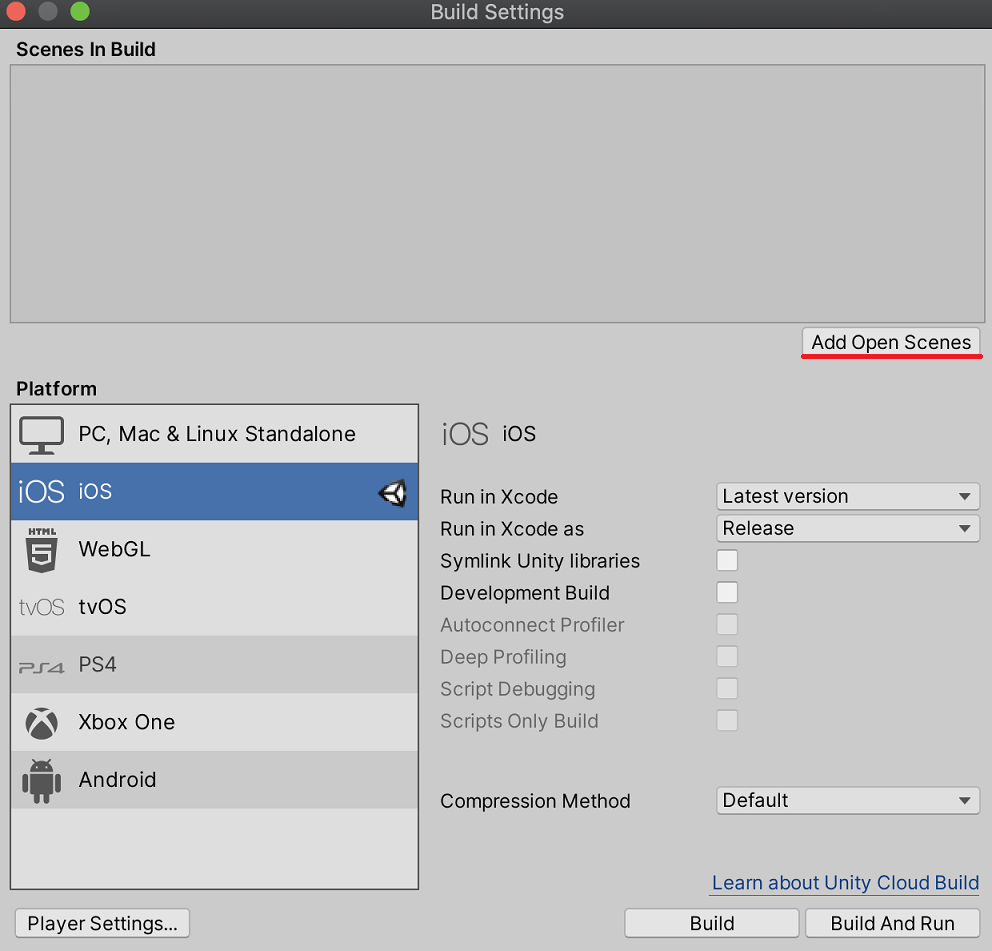
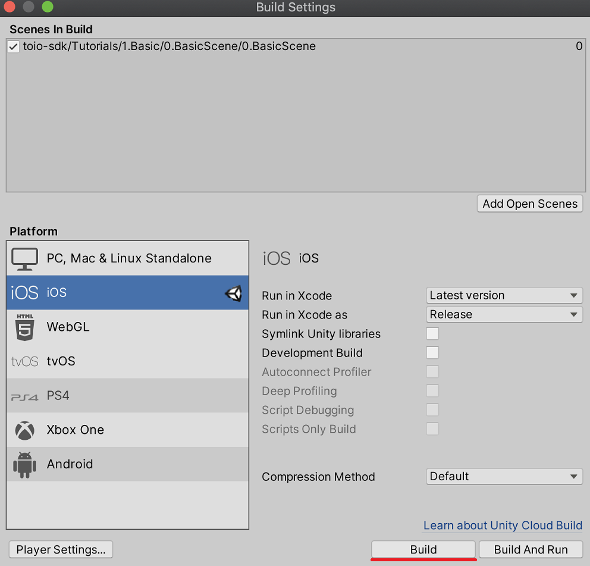
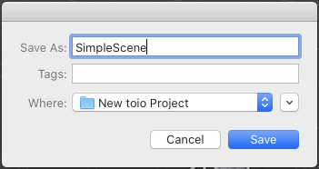
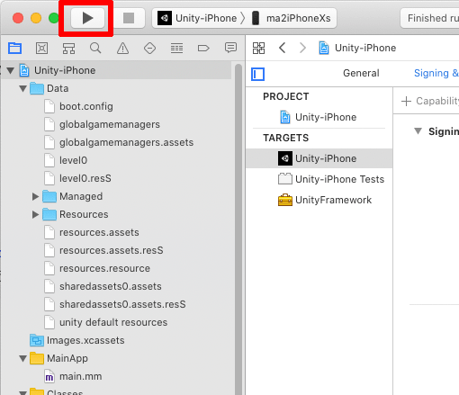
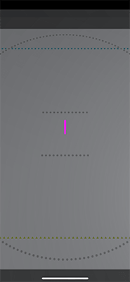

# iOS Build

This section describes how to build a project using toio SDK for Unity for iOS.

## Tested Environment

The following environments have been tested. You don't necessarily have to match them, but you can use them as a reference if things don't work in your environment.

| Tools/Software | Confirmed Version | Recommended Version
| -------------------- | ---------------------- | ----------------------- |
| OS | macOS Catalina 10.15.5 | macOS Mojave 10.14 or higher |
| Unity | 2020.3.17f1 | 2020.3 or higher | | Xcode | 11.5
| Xcode | 11.5 (11E608c) | 11 or above
| Unity | 2020.3.17f1 | 2020.3 or above | Xcode | 11.5 (11E608c) | 11 or above | iOS | 12.3.1, 13.2.2 | 11 or above

## Check Unity's iOS Build Support

If you did not add the iOS Build Support module when you installed Unity, open Unity Hub, go to the Install tab, and add iOS Build Support from the Add Module menu in the upper right corner of the appropriate version.

## Switch the build platform to iOS

We will assume that you have opened `Assets/toio-sdk/Tutorials/1.Basic/0.BasicScene/` by continuing from the end of [Installing toio SDK for Unity](download_sdk.md).

First, select [File] -> [Build Settings...] from Unity menu.In [Build Settings], select [iOS] from the [Platform] list and click the [Switch Platform] button on the bottom right.

Wait for a while, and when Unity icon appears to the right of iOS, the switch is finished.

## Build the Xcode project

With the scene file you want to include in the build open, select [File] -> [Build Settings...] from Unity menu. Next, click the [Add Open Scenes] button.

BasicScene will be added to the list of "Scenes In Build". Click on the [Build] button.

You will be prompted to save the XCode project file, give it an appropriate name and save it. In this example, we have named it "SimpleScene".

## Open the project in Xcode

Open the project file (SimpleScene/Unity-iPhone.xcodeproj in this example) in Xcode to build for iOS.

## Configure the Xcode project

Configure the Xcode project settings and provisioning profile settings with reference to the following Unity official page.

- [Developing Games for iOS - Unity Manual](https://docs.unity3d.com/2020.3/Documentation/Manual/iphone-GettingStarted.html)

## Xcode Build

After configuring various settings in Xcode and selecting the connected iPhone from the pop-up menu, press the Run button in Xcode to transfer the built application to the iPhone and launch it.

In this sample, the connection to Cube will start immediately after startup, so it is recommended to turn on Cube beforehand.

If the app was built correctly, the iPhone will display the following screen.

When you start the application for the first time, the "Allow use of Bluetooth?" dialog will be displayed. If you allow it in the dialog, the application will start communicating with Cube and Cube will start running.
