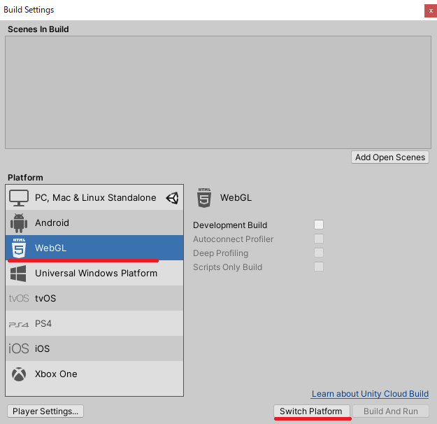
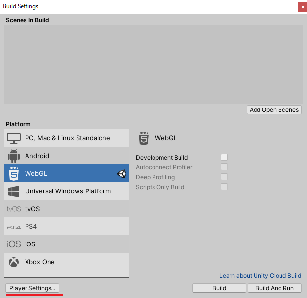
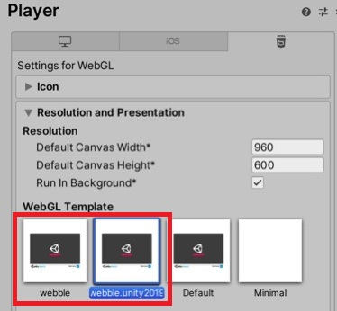
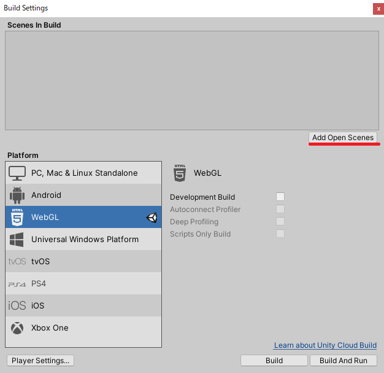
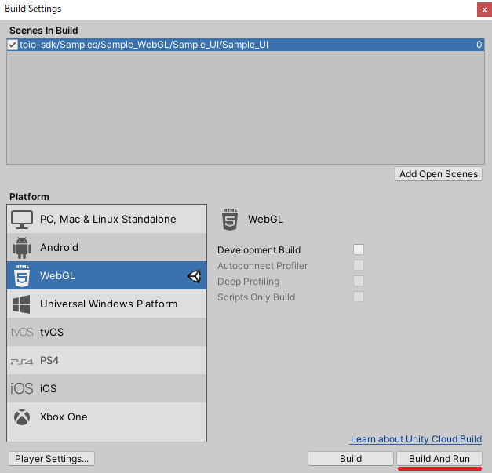
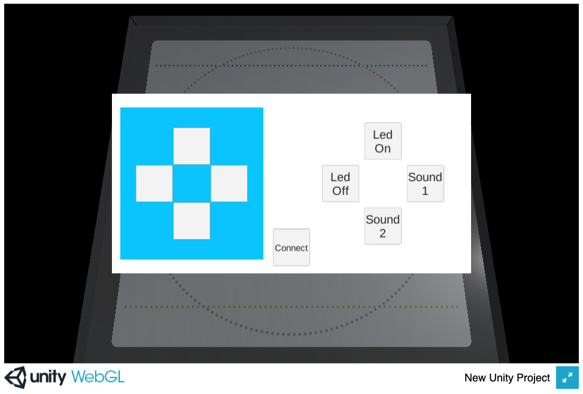

# Web App Build

This section explains how to build a Unity project using toio SDK for Unity as a web app that runs in a browser, and briefly introduces the steps to publish a web app using Github Pages.

## Contents

- [Overview](build_web.md#overview)
- [WebGL Build](build_web.md#webgl-build)
- [Share on SNS](build_web.md#share-on-sns)
- [Notes](build_web.md#notes-1)
<br>

## Overview

This SDK is a library that runs on Unity engine, which supports building web apps using WebGL, so you can build your project as a web app by switching the target platform.

Unity Engine does not support Bluetooth communication, so if you build your project as a web app, it will not be able to communicate with Cube.
Therefore, you can use [web-bluetooth](https://webbluetoothcg.github.io/web-bluetooth/), which is an API that provides a function to control Bluetooth communication from a browser, as a plugin to control Bluetooth communication from a Unity program running in a web app. For this reason, we prepared a plug-in that can control Bluetooth communication from Unity programs running in web apps using web-bluetooth, an API that provides the function to control Bluetooth communication from a browser.
As with the iOS build, if you build on WebGL as the target platform, it will automatically switch to this plugin and allow communication between the web app and Cube.

In the [WebGL Build](build_web.md#webgl-build) chapter, we will explain the settings to run Bluetooth plugin for the browser when built as a web app.
In the [Share on SNS](build_web.md#share-on-sns) chapter, we will briefly introduce the steps to publish the built web app to the world through SNS and so on.

<br>

## WebGL build

## Tested environment

The following environments have been tested. You don't necessarily have to match them, but if they don't work in your environment, please refer to them.

#### Mac

| Tools & Software | Confirmed Version | Recommended Version
| -------------------- | ---------------------- | ----------------------- |
| OS | MacOS Catalina 10.15.2 | macOS Mojave 10.14 or higher
| Bluetooth® | 4.2 | 4.2 or higher | | Unity
| Unity | 2021.3.0f1 | 2021.3 or higher
| Browser (Chrome) | 85.0.4183.102 | 56 or higher

To check the version of BlueTooth®, go to About This Mac > System Report > Bluetooth > LMP Version from Apple menu.

#### Windows

| Tools & Software | Confirmed Version | Recommended Version
| -------------------- | ---------------------- | ----------------------- |
| OS | Windows 10 Pro 64bit 1903 | Windows 10 | BluetoothR
| Bluetooth® | 5.0 (LMP 9.256) | 4.2 or higher
| Unity | 2021.3.0f1 | 2021.3 or higher
| Browser (Edge) | 85.0.564.51 | 79 or higher
| Browser (Chrome) | 85.0.4183.102 | 56 or higher

<br>

For other browsers, please refer to [WebGL](https://developer.mozilla.org/docs/Web/API/WebGL_API) and [web-bluetooth](https://webbluetoothcg.github.io/web-bluetooth/).
- WebGL
  - [WebGL Browser Compatibility](https://docs.unity3d.com/2021.3/Documentation/Manual/webgl-browsercompatibility.html)
  - [Can I use WebGL ?](https://caniuse.com/?search=WebGL)
- web-bluetooth
  - [Can I use web-bluetooth ?](https://caniuse.com/?search=web-bluetooth)
#### Notes

> The maximum number of simultaneous connections to Cube that we have confirmed at the time of development is 3.
<br>
> On Windows PCs, we have confirmed a problem with multiple connections. Please check [here](build_web.md#unstable-multi-unit-connection-using-windows-pc).

### Check for WebGL Build Support in Unity

Open Unity Hub, go to the Install tab, and in the top right menu of the appropriate version, under Add Module, add WebGL Build Support.

### Switch build platform to WebGL

We will assume that you have completed the [toio SDK for Unity installation](download_sdk.md) and opened `Assets/toio-sdk/Samples/Sample_WebGL/Sample_UI/`. Let's proceed as follows.

Select [File] -> [Build Settings...] from Unity menu. in Unity menu. Next, in the Platform list under Build Settings, select WebGL and click the Switch Platform button at the bottom right.



Wait for a few tens of seconds, and when Unity icon appears to the right of WebGL, the switch is complete.

### Adaptation of WebGLTemplate

In order to use the provided WebGL plugin, we will modify Unity's Javascript template.

1. From Build Settings, click [Player Settings...] to open the settings window.



2. In WebGL Settings window, open Resolution and Presentation, and click [webble] for Unity 2020 or later, or [webble.unity2019] for Unity 2019 in WebGL Template.



WebGL plugin is now ready to use.

### Build a web app

With the scene file you want to include in the build open, select [File] -> [Build Settings...] from Unity menu. Next, click the [Add Open Scenes] button.



Then, Sample_UI will be added to the list of "Scenes in Build". Click "Build And Run" to continue.



If the app has been built correctly, the generated directory structure will look like this

```
sample_ui
├── Build
│   ├── web.data.br
│   ├── web.framework.js.br
│   ├── web.loader.js
│   └── web.wasm.br
├── TemplateData
│   ├── favicon.ico
│   ├── fullscreen-button.png
│   ├── progress-bar-empty-dark.png
│   ├── progress-bar-empty-light.png
│   ├── progress-bar-full-dark.png
│   ├── progress-bar-full-light.png
│   ├── style.css
│   ├── webble.js
│   ├── webgl-logo.png
│   ├── unity-logo-dark.png
│   └── unity-logo-light.png
└── index.html
```

And the screen of the web page should look like this.



Click the [Connect] button at the bottom center to connect to Cube. You can control Cube by clicking the other buttons.

### Resolving errors due to compression format

The following errors may occur depending on the server environment that hosts the application.

```
Unable to parse XXXXXX.js.gz! This can be happen if build compression was enabled
but web server hosting the content was misconfigured to not serve the file with
HTTP Response Header "Content-Encoding: gzip" present...
```

In this case, set [File] -> [Build Settings...] -> [Player Settings...] -> [Publishing Settings...] -> [Compression Format] to "Disabled".

<br>

# Share on SNS

By uploading a web app generated by Unity engine to a server, you can run your web app around the world.

### There are many ways to publish

1. Upload to your own or a cloud web server and make it accessible from the outside.

2. Running a web app by uploading it to a web service or a cloud file server and doing stuff.

...and more.

There is a web service called [unityroom](https://unityroom.com) that makes it easy to publish Unity games. It would be nice if we could use it, but unfortunately we can't use unityroom because this SDK requires us to run our own javascript code for Bluetooth communication. So, here are some Github Pages that make this happen with a few simple steps.

### Introduction to Github Pages

Github Pages is a static hosting service that allows you to publish your website.
This service allows you to directly retrieve and execute javascript code, so you can run Bluetooth communication plugin described above.
For a detailed explanation of Github Pages, please refer to the [official documentation](https://docs.github.com/en/pages/getting-started-with-github-pages/about-github-pages).

### Steps to publish

1. Login to [github](https://github.com) and [create](https://docs.github.com/en/get-started/quickstart/create-a-repo) a repository. <br> The repository name should be `[username].github.io`.

2. [Clone](https://docs.github.com/en/github/creating-cloning-and-archiving-repositories/cloning-a-repository-from-github/cloning-a-repository) the remote repository you created.

3. Copy the web app directory generated by Unity engine (`e.g. Sample_UI/`) into the cloned repository directory.

4. [Add](https://docs.github.com/en/github/managing-files-in-a-repository/managing-files-using-the-command-line/adding-a-file-to-a-repository-using-the-command-line) the directory of the added web app to the remote repository.

5. Open a browser and type `https://[username].github.io/sample_ui` in the address bar to open the web app.

<br>

## Notes.

### Scan one Cube at a time.

When scanning devices by running [navigator.bluetooth.requestDevice](https://webbluetoothcg.github.io/web-bluetooth/#dom-bluetooth-requestdevice) provided in [web-bluetooth](https://webbluetoothcg.github.io/web-bluetooth/), it is necessary to scan <b>one device at a time</b> from the user's operation event every time. Therefore, you need to take care of the following when you make it into a web app. We also have a sample scene collection [Sample_WebGL](../toio-sdk-unity/Assets/toio-sdk/Samples/Sample_WebGL/README_EN.md), which you can refer to here.

- #### Let's have a connection button.

This is because it needs to be triggered by a user operation event.

- #### Let's connect them one at a time.

Again, it should be one scan per user operation event.<br>
In the connection program, multiple unit connections using `NearScanner` and `CubeManager.MultiConnect` will be disabled.<br>
Please consider modifying your program to use `NearestScanner` or `CubeManager.SingleConnect`, referring to the implementation in [Sample_UI on WebGL](../toio-sdk-unity/Assets/toio-sdk/Samples/Sample_WebGL/Sample_UI/README_EN.md).

### Unstable multi-unit connection using Windows PC

We have confirmed that a communication error occurs when connecting to the second or later Cube when running a web application that connects to multiple Cubes using a Windows PC browser (Edge, Chrome).