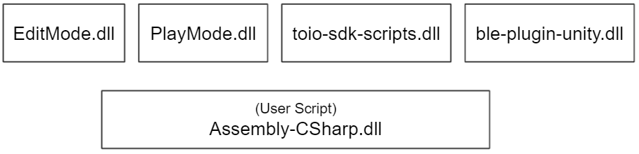
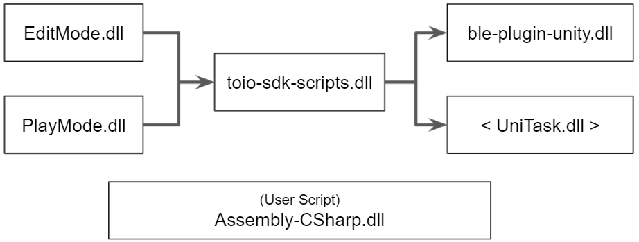
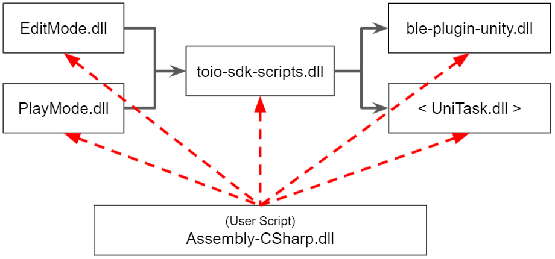
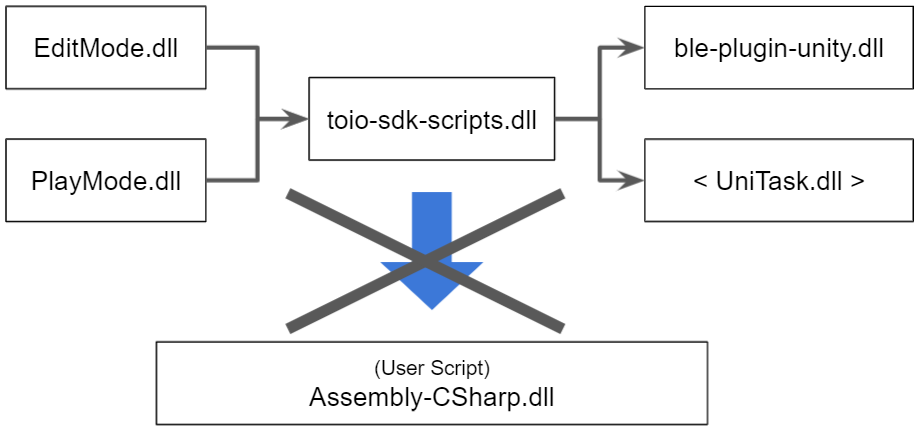

# Notes on Development

## Table of Contents

- [1. Script dependencies](development_basics.md#1.script-dependencies)

<br>

# 1.Script dependencies

### About Assembly Definition

This SDK uses a feature called Assembly Definition to divide a script into multiple assemblies.
For more details on Assembly Definition, please refer to [here](https://docs.unity3d.com/ja/2018.4/Manual/ScriptCompilationAssemblyDefinitionFiles.html).

The following items should be noted about this function.

1. Scripts that do not have assembly definitions are basically compiled into Assembly-CSharp.dll. Therefore, user-created scripts will basically be included in Assembly-CSharp.dll.

2. Assemblies other than those with pre-defined dependencies cannot be referenced (except for Assembly-CSharp.dll).

3. Assembly-CSharp.dll can refer to all assemblies, but other assemblies cannot refer to Assembly-CSharp.dll.

In the next section, we will explain the function of assembly definition in more detail.

<br>

### Assembly dependencies in this SDK

When an assembly is split, the split is performed on the folder where the assembly definition file is placed. In this SDK, assembly definition files are arranged in the configuration shown below.


```
Assets
├── ble-plugin-unity
│   └── ble-plugin-unity.asmdef
└── toio-sdk
    ├── Scripts
    │   └── toio-sdk-scripts.asmdef
    └── Tests
        ├── EditMode
        │   └── EditMode.asmdef
        └── PlayMode
            └── PlayMode.asmdef
```

When an assembly is split, the split is performed on the folder where the assembly definition file is placed. In this SDK, assembly definition files are arranged in the configuration shown below.

<div align="center">

</div>

<br>

It is possible to set dependencies between assemblies in the assembly definition file.
In this SDK, the dependencies between assemblies are set as shown in the figure below.
Note that UniTask.dll refers to the one in the installed package.

<div align="center">

</div>

<br>

### Do not put the source code in toio-sdk/Scripts

As explained in the section above, Assembly-CSharp.dll can reference all assemblies, as shown in the figure below.

<div align="center">

</div>

<br>

On the other hand, as shown in the figure below, other assemblies cannot refer to Assembly-CSharp.dll.

<div align="center">

</div>

<br>

Therefore, if you put the source code in toio-sdk/Scripts, you may not be able to refer to the user script and may get a compilation error.

To prevent such problems, we recommend that you create a development folder under the Assets folder, and add new files in that folder.