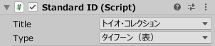
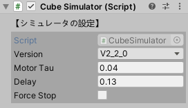

# How to operate Simulator (Settings for mats and cubes, etc.)

## Table of Contents

- [1. Overview](development_simulator.md#1-overview)
- [2. Mat Prefab](development_simulator.md#2-mat-prefab)
- [3. StandardID Prefab](development_simulator.md#3-standardid-prefab)
- [4. Cube Prefab](development_simulator.md#4-cube-prefab)
- [5. Stage Prefab](development_simulator.md#5-stage-prefab)

 

# 1. Overview

When developing an application for a smart device that communicates with Cube, it is very useful to have an environment to easily check the behavior of the application in Unity Editor.
Therefore, toio SDK for Unity provides a simulator as a virtual environment for testing.

This document is the first step in explaining how to use toio SDK for Unity with Unity Editor.
Please refer to [Usage - Simulator](usage_simulator.md) in the technical documentation for detailed usage (mainly API) for development.

## Composition

Simulator consists of the following four prefabs under `Assets/toio-sdk/Scripts/Simulator/Prefabs/`.

- Mat … Various imitations of [Play mat](https://toio.github.io/toio-spec/en/docs/hardware_position_id)
- StandardID … Imitation of various [cards or sheets](https://toio.github.io/toio-spec/en/docs/hardware_standard_id) that can be read for Standard ID
- Cube … Imitation of toio™Core Cube
- Stage … A set of functions required for a simulation environment.

Mat, StandardID, and Cube are mock-ups of the real thing, and can be placed in Unity scene as needed.

A Stage is a set of things you need in your Unity scene, usually if you only use one mat, plus some convenience features.
All of the tutorials use Stage.

# 2. Mat Prefab

Mat Prefab is a game object that resembles various play mats.

Cube Prefab can be placed in Mat Prefab to get the coordinate position and orientation of the Mat.

You can place multiple Mat Prefab in a scene, at any position and angle, as long as they are horizontal.

## Inspector

  
  

In Unity's Inspector, from the "Type" list of the script Mat.cs

- Play mat(sumo ring)
- Play mat(Colored tiles)
- Simple play mat
- toio play mat for development
- Customize

from the "Type" list of the script Mat.cs in Unity inspector to change the mat's appearance and coordinates.

For specifications of each type, please refer to [toio™ Core Cube Technical Specifications](https://toio.github.io/toio-spec/en/docs/hardware_position_id)  and ["Developer's Mat (tentative name)"](https://toio.io/blog/detail/20200423-1.html).

If the changes are not automatically reflected, please click the "Refresh" button to update.

For customization instructions, please refer to ["How to Use - Simulator"](usage_simulator.md#21-inspector).

# 3. StandardID Prefab

The StandardID Prefab is a game object that resembles various card sheets that can read Standard IDs.

If you place Cube Prefab on top of a StandardID Prefab, you can get the Standard ID and orientation.

You can place multiple StandardID Prefabs in a scene, at any position and angle.

## Inspector

In Unity inspector, you can select the "Title" of the script Mat.cs, and then select a card sheet of a specific "Type" to switch the StandardID.

The supported "Titles" are as follows

- toio Collection
- Simple card

For more information about "Type", please refer to [toio™ Core Cube Technical Specifications](https://toio.github.io/toio-spec/en/docs/hardware_standard_id).

If the changes are not automatically reflected, please click the "Refresh" button to update.

# 4. Cube Prefab

Cube Prefab is a game object that resembles a toio™ Core Cube.

> There are some functional differences from the actual Cube. 
> For details, please check [Functionality Support](usage_cube.md#realsim-function-table).

## Inspector in CubeSimulator

It is divided into two parts: [Simulator Settings] and [Manually Change Cube Status].

### Setting up Simulator

- `Version`： BLE protocol version. Cannot be changed at runtime.
- `Motor Tau`： Parameter for the primary delay element of the motor. Cannot be changed at runtime.
- `Delay`： Communication delay (the lag between the transmission of the command and the change in the acquired coordinates). Cannot be changed at runtime.
- `Force Stop`: When checked, it will forcibly stop the output of the motor.

### Manually change the state of Cube

It is displayed only at runtime.

Since it is too difficult to reproduce realistically in simulation, you can use the inspector to change the state of Cube and trigger the corresponding events.

- `button state`: If checked, the button will be kept pressed. If you want to move Cube again, you need to uncheck the box and release the button. Also, if you change the button state by mouse operation, this setting will be overwritten.
- `[Change sloped manually]`: If checked, the  `sloped state` will be displayed and the setting can be changed.
(Normally, Simulator sets the `sloped state` every frame, but if this setting is enabled, Simulator will not set the `sloped state`).
  - `sloped state`: Indicates if Cube is on a slope.
- `collisionDetected state`: Indicates whether a collision has been detected or not. (Currently, Simulator does not implement the function to detect the collision of Cube).

## Operations on Cube Objects

While Simulator is running, you can manipulate Cube objects with the mouse.

| Operation | Description |
| :--: | :--: |
| Left click | Press the button on Cube |
| Right click | Lift Cube / Release Cube |
| Wheel while lifting | Change the angle of Cube  |
| Right drag | Pulling Cube by force  |

For more information, please refer to the technical document "Simulator" [4.5. Cube Object Manipulation (CubeInteraction)](usage_simulator.md#45-manipulating-cube-objects-cubeinteraction).

# 5. Stage Prefab

The Stage Prefab is a set of the following objects
- Mat Prefab
- Camera (with PhysicsRaycaster for mouse control)
- Lights
- Target pole (see below)
- A "table" and border to prevent Cube from escaping
- EventSystem

In addition, the Stage Prefab has the following two useful tools
- Target Pole
- Focusing Cube

If you create a new scene, it is recommended that you delete the cameras and lights already in the scene before adding the Stage Prefab, since the field of view encompasses the cameras and lights that fit into the mat. Also, Stage is just a convenience, not a requirement to use Simulator.

## Operations on Stage

| Operation | Description |
| :--: | :--: |
| Ctrl+Left click | [Focus](usage_simulator.md#52-focus-on-cube) on the selected Cube / Unfocus |
| Ctrl+right click | Set and cancel "[Target Pole](usage_simulator.md#51-target-pole)" at the specified position. |

For more information, please refer to "Simulator" ["5. Stage-Prefab"](usage_simulator.md#5-stage-prefab) in the technical documentation.
