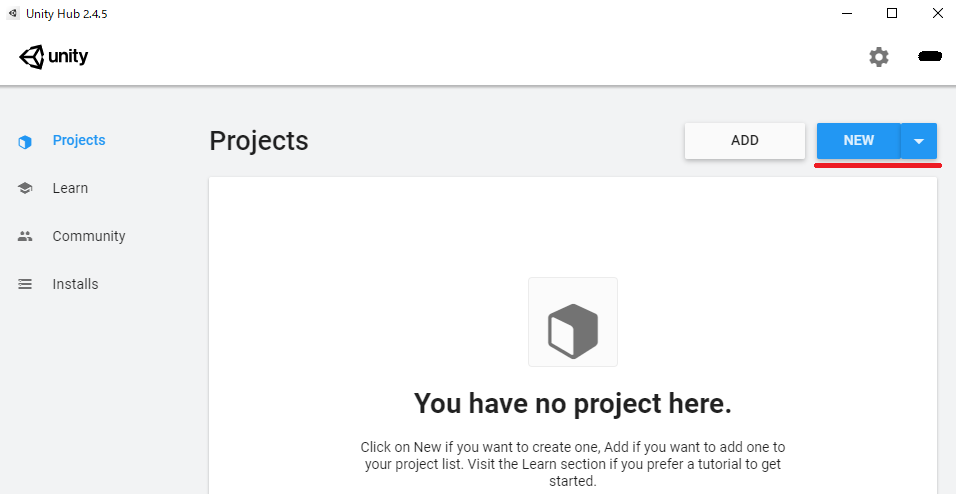
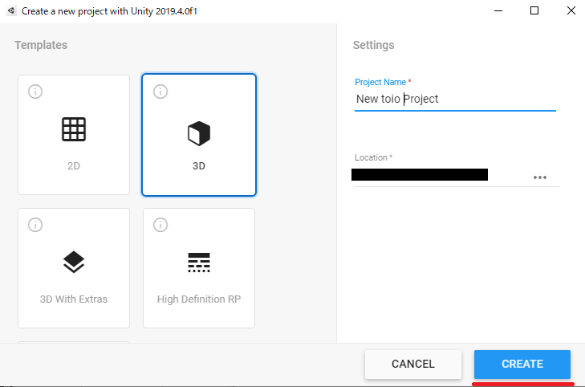
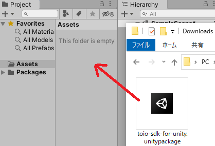
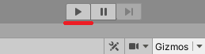

# Install toio SDK for Unity

## Unity Project Creation

Open Unity Hub and click [Create New] in the upper right corner.

When the project creation screen opens, set the following settings.

- Template: 3D
- Project Name: Any (in this case New toio Project)
- Save in: Any (in this case, Desktop)

After completing the settings, click [Create].

Make sure that Unity is up and running.

## Install UniTask

toio SDK for Unity uses Unity-optimized asynchronous processing library [UniTask](https://github.com/Cysharp/UniTask) . Therefore, you need to install UniTask (2.0.0 or later) in this Unity project. 

To install UniTask, follow the steps below (as of September 24, 2020; Unity 2019.4 LTS).
1. In Unity, go to the Window menu and select Package Manager to open the Package Manager. 1.
1. click the [+] icon and select Add package from git URL... and select
1. add https://github.com/Cysharp/UniTask.git?path=src/UniTask/Assets/Plugins/UniTask

The following document contains installation instructions and screenshots of UniTask for your reference.
* [Description of the UniTask Github repository](https://github.com/Cysharp/UniTask#install-via-git-url)
* * You can also refer to Unity manual ["Installing from a Git URL"](https://docs.unity3d.com/ja/current/Manual/upm-ui-giturl.html).

## Adding the SDK

### 1. download unitypackage
Open [Assets] of the latest release version of [Click here](https://github.com/morikatron/toio-sdk-for-unity/releases/), find and download [toio-sdk-for-unity.unitypackage].

### 2. Drag and drop to Unity project
After opening the downloaded folder, drag and drop **[toio-sdk-for-unity.unitypackage]** into the **[Assets]** folder.

### 3.Run samples and check operation
Once loaded into your Unity project, navigate to the `Assets/toio-sdk/Tutorials/1.Basic/0.BasicScene/` folder and double-click on `0.BasicScene scene file` to open it.

Once the scene file is open, click on the Play button at the top of the editor.

 Make sure that the sample works (on Simulator) as shown below.  
 To connect to the real toio™ Core Cube, please refer to [docs_EN/README.md "Build"](README.md#3-build).

This completes the installation of toio SDK for Unity. There are various tutorials available for this SDK. For more information about the tutorials, please refer to [Tutorial (Basic)](tutorials_basic.md) .