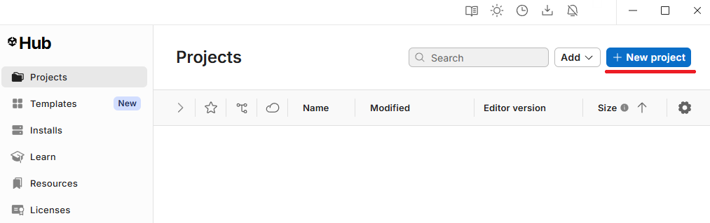
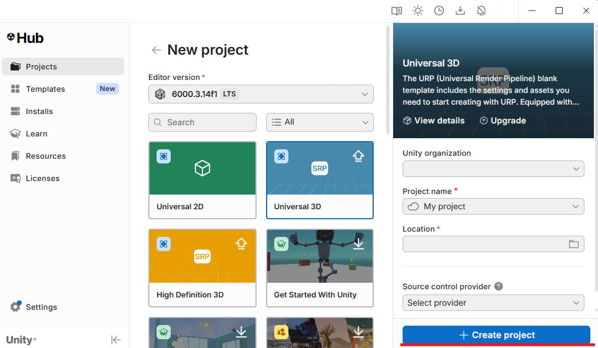
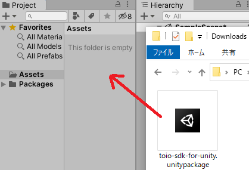
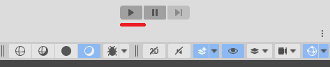
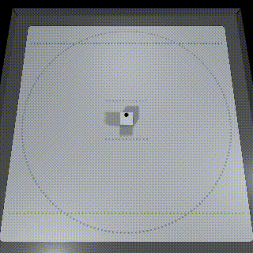

# Install toio SDK for Unity

## Unity Project Creation

Open Unity Hub and click [New project] in the upper right corner.

When the project creation screen opens, set the following settings.

- Template: `Universal 3D`
- Project Name: Anything is possible (in this case My Project)
- Save in: Anything is possible (in this case, Desktop)

After completing the settings, click [Create project].

Make sure that Unity is up and running.

## Install UniTask

toio SDK for Unity uses Unity-optimized asynchronous processing library [UniTask](https://github.com/Cysharp/UniTask) . Therefore, you need to install UniTask (2.1.0 or later) in this Unity project. 

To install UniTask, follow the steps below (as of June 1, 2026; Unity 6000.3.14f1 LTS).
1. In Unity, go to the [Window] -> [Package Management] menu and select [Package Manager] to open the Package Manager.
1. Click the [+] icon and select [Add package from git URL...]
1. Add the url below
    - https://github.com/Cysharp/UniTask.git?path=src/UniTask/Assets/Plugins/UniTask

The following document contains installation instructions and screenshots of UniTask for your reference.
* [Description of the UniTask Github repository](https://github.com/Cysharp/UniTask#install-via-git-url)
* You can also refer to Unity manual ["Installing from a Git URL"](https://docs.unity3d.com/Manual/upm-ui-giturl.html).

## Adding the SDK

### 1. download unitypackage
Open [Assets] of the latest release version of [Click here](https://github.com/morikatron/toio-sdk-for-unity/releases/), find and download [toio-sdk-for-unity.unitypackage].

### 2. Drag and drop to Unity project
After opening the downloaded folder, drag and drop **[toio-sdk-for-unity.unitypackage]** into the **[Assets]** folder.

#### Migrating to the Universal Render Pipeline (URP)

If you import [toio-sdk-for-unity.unitypackage] (version 1.7.0 or later) into a project that uses the legacy Built-in Render Pipeline, materials such as the simulator's cube prefab will not render correctly (e.g., appearing pink). To resolve this issue, we recommend migrating your entire project to the Universal Render Pipeline (URP).

The general migration steps are as follows:

- Install URP: Install the Universal RP package from the Package Manager.
- Convert Assets: Open `Window -> Rendering -> Render Pipeline` Converter, search for assets using the built-in format, and convert them.
- Configure URP: Assign the URP Asset in your project settings (Graphics and Quality).
- Fine-tuning: Adjust parameters such as light intensity and material settings as needed after the migration.

For more detailed instructions, please refer to the [Official Unity Documentation](https://docs.unity3d.com/Manual/urp/upgrading-from-birp.html).

### 3.Run samples and check operation
Once loaded into your Unity project, navigate to the `Assets/toio-sdk/Tutorials/1.Basic/0.BasicScene/` folder and double-click on `0.BasicScene scene file` to open it.

Once the scene file is open, click on the Play button at the top of the editor.

 Make sure that the sample works (on Simulator) as shown below.
 To connect to the real toio™ Core Cube, please refer to [docs_EN/README.md "Build"](README.md#3-build).

This completes the installation of toio SDK for Unity. There are various tutorials available for this SDK. For more information about the tutorials, please refer to [Tutorial (Basic)](tutorials_basic.md) .