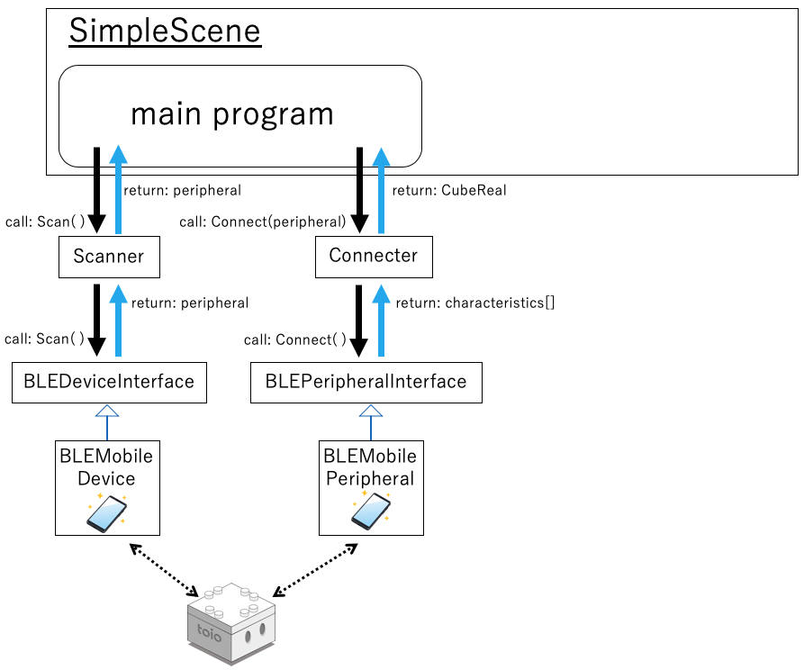

# Technical Document - Function Description - BLE(Bluetooth Low Enegy)

## Table of Contents

- [1. Overview](sys_ble.md#1-overview)
- [2. Structure of BLE class](sys_ble.md#2-structure-of-ble-class)
- [3. How Communication Works](sys_ble.md#3-how-communication-works)
  - [3.1. Search and connect](sys_ble.md#31-search-and-connect)
  - [3.2. Send and Receive](sys_ble.md#32-send-and-receive)

# 1. Overview

<div align="center">

</div>

<br>

BLE module group is a group of modules that provide Bluetooth Low Enegy (BLE) communication functions in an abstract manner via an interface.
By implementing all BLE classes through the interface, toio™ programming can be done independently of the communication architecture.
Therefore, it is possible to replace them with communication modules other than BLE by developing new inheritance classes.

<br>

The directory structure is as shown in the figure below.

<div align="center">

</div>

<br>

```
BLE  +---------------------------------+ BLE root directory
├── interfaces  +----------------------+ interface directory
│   ├── BLECharacteristicInterface.cs  + Characteristic (functional unit) interface
│   ├── BLEDeviceInterface.cs  +-------+ Interface that provides BLE functionality for terminals
│   ├── BLEPeripheralInterface.cs  +---+ Peripheral (connection terminal) interface
│   └── BLEServiceInterface.cs  +------+ Interface as the first point of contact for BLE processing
├── mobile  +--------------------------+ Mobile Implementation Directory
│   ├── BLEMobileCharacteristic.cs  +--+ Characteristic (functional unit) mobile implementation class
│   ├── BLEMobileDevice.cs  +----------+ Class that provides BLE functionality for mobile devices
│   ├── BLEMobilePeripheral.cs  +------+ Peripheral (connected terminal) mobile implementation class
│   └── BLEMobileService.cs  +---------+ Mobile implementation class that is the first point of contact for BLE processing
├── unity  +---------------------------+ Unity Implementation Directory
│   └── UnityPeripheral.cs  +----------+ Peripheral(GameObject)Unity implementation class
├── WebGL  +---------------------------+ WebGL Implementation Directory
│   ├── Plugins  +---------------------+ Plug-in directory for WebGL
│   │   ├── WebGL  +-------------------+ Plug-in directory for WebGL
│   │   │   └── WebBluetooth.jslib  +--+ Script that interacts with WebGLTemplates/webble/webble.js
│   │   └── WebBluetoothScript.cs  +---+ Class that provides plug-in functionality (interacts with WebBluetooth.jslib)
│   ├── BLEWebCharacteristic.cs  +-----+ Characteristic (functional unit) WebGL implementation class
│   ├── BLEWebDevice.cs  +-------------+ Class that provides BLE functionality for WebGL
│   ├── BLEWebPeripheral.cs  +---------+ Peripheral (connected terminal) WebGL implementation class
│   ├── BLEWebService.cs  +------------+ WebGL implementation class that serves as the first window for BLE processing
└── BLEService.cs  +-------------------+ Singleton class, the first point of contact for the entire BLE
```

<br>

# 2. Structure of BLE class

<br>

<div align="center">

</div>

<br>

#### BLEService

Singleton class as the first window for BLE functionality<br>
<u>BLEService.Instance.SetImplement()</u>Set the internal implementation class by putting the implementation instance in the function.

Implementation code

```csharp
public class BLEService : GenericSingleton<BLEService>
{
    public bool hasImplement { get; private set; }

    public BLEService()
    {
        this.hasImplement = false;
    }

    private BLEServiceInterface impl;

    public void SetImplement(BLEServiceInterface impl)
    {
        this.impl = impl;
        this.hasImplement = true;
    }

    public void RequestDevice(Action<BLEDeviceInterface> action)
    {
        this.impl.RequestDevice(action);
    }
    public async UniTask Enable(bool enable, Action action)
    {
        await this.impl.Enable(enable, action);
    }
    public void DisconnectAll()
    {
        this.impl.DisconnectAll();
    }
}
```

<br>

#### BLEServiceInterface

Interface that serves as the first window for BLE processing<br>
It provides a function to acquire the Device interface that provides BLE function of the operating terminal.

Interface code

```csharp
public interface BLEServiceInterface
{
    void RequestDevice(Action<BLEDeviceInterface> action);
    void DisconnectAll();
    UniTask Enable(bool enable, Action action);
}
```

<br>

#### BLEDeviceInterface

BLE function interface of the operating terminal<br>
Its main role is to access BLE functions and perform scanning operations.

Interface code

```csharp
public interface BLEDeviceInterface
{
    void Scan(String[] serviceUUIDs, bool rssiOnly, Action<BLEPeripheralInterface> action);
    void StopScan();
    UniTask Disconnect(Action action);
    UniTask Enable(bool enable, Action action);
}
```

<br>

#### BLEPeripheralInterface

Interface for scanned BLE devices<br>Its main role is to perform the connection process to the scanned BLE device.

Interface code

```csharp
public interface BLEPeripheralInterface
{
    string[] serviceUUIDs { get; }
    string device_address { get; }
    string device_name { get; }
    float rssi { get; }
    bool isConnected { get; }

    void Connect(Action<BLECharacteristicInterface> characteristicAction);
    void AddConnectionListener(string key, Action<BLEPeripheralInterface> action);
    void RemoveConnectionListener(string key);
    void ConnectionNotify(BLEPeripheralInterface peri);
}
```

<br>

#### BLECharacteristicInterface

Interface for each function of the scanned BLE device<br>The main role is to perform write/read operations for each function of BLE device.

Interface code

```csharp
public interface BLECharacteristicInterface
{
    string deviceAddress { get; }
    string serviceUUID { get; }
    string characteristicUUID { get; }

    void ReadValue(Action<string, byte[]> action);
    void WriteValue(byte[] data, bool withResponse);
    void StartNotifications(Action<byte[]> action);
    void StopNotifications();
}
```

# 3. How Communication Works

## 3.1. Search and connect

<br>

<div align="center">

</div>

<br>

### Search

For an overview of the Scanner class, refer to [here](sys_cube.md#31-search-scanner).<br>This section describes BLE processing of the Scanner class.

The scan roughly follows the steps below.

1. Call the RequestDevice function to obtain the BLDeviceInterface variable.
2. Start scanning for [CoreCube Identification ID](https://toio.github.io/toio-spec/en/docs/ble_communication_overview#discovering-the-cube-).
3. End the scan when the conditions (number of connections, waiting time) are met
4. Return BLEPeripheralInterface variable obtained by scanning

<br>

### Connect

The Connecter class is used for the connection. Please refer to the [cube documentation](sys_cube.md#32-connecter), which describes most of the details.

The following points should be added to BLE process.

1. Immediately after Cube variable is created, it calls [Subscribe to automatic notifications (cube.StartNotifications)](https://github.com/morikatron/toio-sdk-for-unity/blob/main/toio-sdk-unity/Assets/toio-sdk/Scripts/Cube/CoreCube/Real/CubeReal.cs) to start subscribing to automatic notifications such as coordinates and buttons.

<br>

## 3.2. Send and Receive

<br>

<div align="center">

</div>
<br>

### Send

The sending call itself is made from a derived class of CubeReal, see [cube documentation](sys_cube.md#4-send-command).<br>

### Receive

The subscribed information will be automatically notified by [Subscribe to automatic notifications (cube.StartNotifications)](https://github.com/morikatron/toio-sdk-for-unity/blob/main/toio-sdk-unity/Assets/toio-sdk/Scripts/Cube/CoreCube/Real/CubeReal.cs) done immediately after the connection process.
