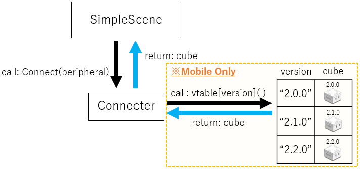

# Technical Document - Function Description - Cube class

## Table of Contents

- [1. Overview](sys_cube.md#1-overview)
- [2. Structure of Cube class](sys_cube.md#2-structure-of-cube-class)
- [3. How the Connection Works](sys_cube.md#3-how-the-connection-works)
  - [3.1. Search (Scanner)](sys_cube.md#31-search-scanner)
  - [3.2. Connecter](sys_cube.md#32-connecter)
- [4. Send command](sys_cube.md#4-send-command)
- [5. How to extend functionality](sys_cube.md#5-how-to-extend-functionality)
  - [5.1. How to add a function to Cube class](sys_cube.md#51-how-to-add-a-function-to-cube-class)
  - [5.2. How to add a BLE protocol version](sys_cube.md#52-how-to-add-a-BLE-protocol-version)
  - [5.3. To change the communication program](sys_cube.md#53-to-change-the-communication-program)

<br>

# 1. Overview

<div align="center">

</div>

<br>

Cube modules are multi-platform modules that allow you to run Cube running on Unity system (Simulator) and a real Cube (the real) with the same code.

<br>

The directory structure is as shown in the figure below.

<div align="center">

</div>

<br>

```
Cube  +-------------------------------+ Cube-root directory
├── CoreCube  +-----------------------+ Core Cube Directory
│   ├── Real  +-----------------------+ Real Implementation Directory
│   │   ├── Versions  +---------------+ Version directory of real implementation
│   │   │   ├── CubeReal_ver2_0_0.cs  + 2.0.0 Real Implementation Class
│   │   │   ├── CubeReal_ver2_1_0.cs  + 2.1.0 Real Implementation Class
│   │   │   ├── CubeReal_ver2_2_0.cs  + 2.2.0 Real Implementation Class
│   │   │   ├── CubeReal_ver2_3_0.cs  + 2.3.0 Real Implementation Class
│   │   │   └── CubeReal_ver2_4_0.cs  + 2.4.0 Real Implementation Class
│   │   └── CubeReal.cs  +------------+ Real implementation abstract class
│   ├── Sim    +----------------------+ Simulator Implementation Directory
│   │   └── CubeUnity.cs  +-----------+ Simulator implementation class
│   ├── Cube.cs  +--------------------+ Cube abstract class
│   └── CubeOrderBalancer.cs  +-------+ Instruction send control class
├── CubeConnecter.cs  +---------------+ Connection class
├── CubeHandle.cs  +------------------+ Extended functionality class
├── CubeManager.cs  +-----------------+ Code Simplification Class
└── CubeScanner.cs  +-----------------+ Search class
```

<br>

# 2. Structure of Cube class

<br>

<div align="center">

</div>
<br>

#### Cube Class

This is the interface for operating Cube.<br>
The contents of all functions and properties are not yet implemented, and all processing is left to the derived class.<br>
By doing so, it absorbs differences in internal implementation between execution environments and versions, and enables abstract programming with polymorphism.<br>
To maintain reusability, there is no functionality in this class other than [toio™ Core Cube Technical Specification (Communication Specification)](https://toio.github.io/toio-spec/en/docs/ble_communication_overview).<br>
To use/extend functions other than toio™ Core Cube technical specifications (communication specifications), use extension classes such as [CubeHandle](usage_cubehandle.md), [CubeNavigator](sys_navigator.md), etc.<br>

Implementation Code:[Cube.cs](https://github.com/morikatron/toio-sdk-for-unity/blob/main/toio-sdk-unity/Assets/toio-sdk/Scripts/Cube/CoreCube/Cube.cs)

#### CubeUnity

This is Cube class for Simulator that runs when Unity editor is executed.<br>There is no BLE protocol version resolution, so only one version will work.<br>

Implementation Code:[CubeUnity.cs](https://github.com/morikatron/toio-sdk-for-unity/blob/main/toio-sdk-unity/Assets/toio-sdk/Scripts/Cube/CoreCube/Sim/CubeUnity.cs)

#### CubeReal

This is Cube class that handles BLE communication with the real cube.<br>Most of the internal implementation is done in the derived class, except for the minimum common processing.<br>

Implementation Code:[CubeReal.cs](https://github.com/morikatron/toio-sdk-for-unity/blob/main/toio-sdk-unity/Assets/toio-sdk/Scripts/Cube/CoreCube/Real/CubeReal.cs)

<b>ver2_0_0:</b>

- Implementation Code:[CubeReal_ver2_0_0.cs](https://github.com/morikatron/toio-sdk-for-unity/blob/main/toio-sdk-unity/Assets/toio-sdk/Scripts/Cube/CoreCube/Real/Versions/CubeReal_ver2_0_0.cs)
- Communication Specifications: https://toio.github.io/toio-spec/en/docs/2.0.0/about

<b>ver2_1_0:</b>

- Implementation Code:[CubeReal_ver2_1_0.cs](https://github.com/morikatron/toio-sdk-for-unity/blob/main/toio-sdk-unity/Assets/toio-sdk/Scripts/Cube/CoreCube/Real/Versions/CubeReal_ver2_1_0.cs)
- Communication Specifications: https://toio.github.io/toio-spec/en/docs/2.1.0/about

<b>ver2_2_0:</b>

- Implementation Code:[CubeReal_ver2_2_0.cs](https://github.com/morikatron/toio-sdk-for-unity/blob/main/toio-sdk-unity/Assets/toio-sdk/Scripts/Cube/CoreCube/Real/Versions/CubeReal_ver2_2_0.cs)
- Communication Specifications: https://toio.github.io/toio-spec/en/docs/2.2.0/about

<b>ver2_3_0:</b>

- Implementation code: [CubeReal_ver2_3_0.cs](https://github.com/morikatron/toio-sdk-for-unity/blob/main/toio-sdk-unity/Assets/toio-sdk/Scripts/Cube/CoreCube/Real/Versions/CubeReal_ver2_3_0.cs)
- Communication specifications: https://toio.github.io/toio-spec/en/docs/2.3.0/about

<b>ver2_4_0:</b>

- Implementation code: [CubeReal_ver2_4_0.cs](https://github.com/morikatron/toio-sdk-for-unity/blob/main/toio-sdk-unity/Assets/toio-sdk/Scripts/Cube/CoreCube/Real/Versions/CubeReal_ver2_4_0.cs)
- Communication specifications: https://toio.github.io/toio-spec/en/docs/about

<br>

# 3. How the Connection Works

As an example, here is a simple Cube move code.<br>When this code is executed, the move function will be called after connecting to Cube.

```csharp
using UnityEngine;
using toio;

public class SimpleScene : MonoBehaviour
{
    float intervalTime = 0.05f;
    float elapsedTime = 0;
    Cube cube;

    // Asynchronous initialization
    // By using the async/await keyword, which is a standard C# feature, it waits for the end of each search and connection
    // async: Asynchronous keyword
    // await: Standby keyword
    async void Start()
    {
      	// Search for Bluetooth devices
        var peripheral = await new CubeScanner().NearestScan();
       	// Connect to devices and generate Cube variables
        cube = await new CubeConnecter().Connect(peripheral);
    }

    void Update()
    {
        // Early return until Cube variable generation is complete
        if (null == cube) { return; }
        // Measure the elapsed time
        elapsedTime += Time.deltaTime;

      	// If more than 50 milliseconds have passed since the last command
        if (intervalTime < elapsedTime)
        {
            elapsedTime = 0.0f;
            // Left motor speed: 50, Right motor speed: -50, Control time: 200 msec
            cube.Move(50, -50, 200);
        }
    }
}
```

<br>

In this chapter, we will discuss the search connection program part.

```csharp
async void Start()
{
  // Search for Bluetooth devices (3.1. Search)
  var peripheral = await new CubeScanner().NearestScan();
  // Connect to the device and create Cube variables (3.2. Connect)
  cube = await new CubeConnecter().Connect(peripheral);
}
```

<br>

For those of you who want to get a quick overview, here is a quick diagram of the program.<br>Since this program runs on multiple platforms, there are two internal implementations (real implementation/simulator implementation) for the Scanner module and the Connector module respectively.

<br>

### Overview of the search connection program (real implementation)

<br>

<div align="center">

</div>

<br>

The mechanism shown in the figure above is used for searching and connecting.

1. Scanner.Scan function to obtain the Peripheral variable.
2. Connecter.Connect function to get the Characteristic array variable.
3. Get the corresponding Cube variable by referring to the version table held by Connecter

<br>

### <u>Overview of the search connection program (simulator implementation)</u>

<br>

<div align="center">

</div>

<br>

The mechanism shown in the figure above is a dummy process for searching and connecting.

1. Scanner.Scan function to get UnityPeripheral variable.
2. Connecter.Connect function to get UnityCube variables.

<br>

## 3.1. Search (Scanner)

<br>

<div align="center">

</div>
<br>

toio SDK for Unity has one module to search for Bluetooth devices.

CubeScanner class:
- NearestScan function:The device with the highest signal strength is returned synchronously as the return value.
- NearScan function:It synchronously returns multiple devices specified in order of increasing signal strength as the return value.
- StartScan function: Initiates an asynchronous and continuous scan. The results are returned via a callback.
- StopScan function: Interrupts the scan that was started with StartScan.

### <u>CubeScanner</u>

By calling the <b>NearestScan function</b>, the device with the highest signal strength is returned as the return value in a <b>synchronous</b> manner. <br>By using the async/await keywords to wait for the scan to finish, it is the same as synchronous processing from the caller's perspective.

Calling the <b>NearScan function</b> will return <b>synchronously</b> a specified number of devices in the order of increasing signal strength (satisfiedNum) as the return value. This is the same as the synchronous process.

The <b>StartScan function</b> is an asynchronous function that can run scans in the background if called without awaiting. The list of scanned cubes is received and processed in the form of a callback.

Calling the <b>StopScan function</b> will interrupt the scan.

The internal implementation is divided into simulator implementation and real implementation, and the connection method can be specified by the constructor parameters. In the basic configuration, the internal implementation automatically changes depending on the build target, so you do not need to write separate code for each platform. If you want to specify the connection method explicitly, please refer to [Cube Connection Settings](usage_cube.md#4-cube-connection-settings).<br>
It is implemented by inheriting the interface for the purpose of extensibility to [CubeManager](https://github.com/morikatron/toio-sdk-for-unity/blob/main/toio-sdk-unity/Assets/toio-sdk/Scripts/Cube/CubeManager.cs).

Simulator Implementation:

- Search for GameObjects created from Simulator's Cube prefab

Real Implementation:

- Search for Bluetooth devices

Interface Code

```csharp
public interface CubeScannerInterface
{
    bool isScanning { get; }
    UniTask<BLEPeripheralInterface> NearestScan(float waitSeconds = 0f);
    UniTask<BLEPeripheralInterface[]> NearScan(int satisfiedNum, float waitSeconds = 3.0f);
    UniTask StartScan(Action<BLEPeripheralInterface[]> onScanUpdate, Action onScanEnd = null, float waitSeconds = 10f);
    void StopScan();
}

```

<br>

## 3.2. Connecter

<br>

<div align="center">

</div>
<br>

CubeConnecter's role is to connect to BLE device and <b><u>adapt the BLE protocol version (real implementation only)</u></b>.<br>The internal implementation is divided into simulator implementation and real implementation, and the internal implementation changes automatically depending on the build target, so you don't need to write separate code for each platform. async/await keyword is used to wait for the end of the connection, which is the same as synchronous processing from the caller's point of view. The following is an example.<br>
[CubeManager](https://github.com/morikatron/toio-sdk-for-unity/blob/main/toio-sdk-unity/Assets/toio-sdk/Scripts/Cube/CubeManager.cs) is implemented by inheriting its interface for the purpose of extensibility.

Connect to Cube by calling the <b>Connect function</b>.<br>
By calling the <b>disconnect function</b>, we can disconnect the communication with the connected Cube.<br>

Simulator implementation:

1. Get a GameObject from UnityPeripheral(GameObject)
2. Create CubeUnity variable with GameObjet as argument
   (BLE protocol version adaptation is not implemented in Simulator version)

Real implementation:

1. Connect to Peripheral (Bluetooth device) and get Characteristic (function) array
2. Get the BLE protocol version
3. Refer to the version table that was added in advance, and generate Cube variables (CubeReal_verX_X_X) that are adapted to the BLE protocol

<br>

Summary Code

```csharp
public interface CubeConnecterInterface
{
    Task<Cube> Connect(BLEPeripheralInterface peripheral);
    Task<Cube[]> Connect(BLEPeripheralInterface[] peripherals);
    Task ReConnect(Cube cube, BLEPeripheralInterface peripheral);
}

/// <summary>
/// It refers to the BLE protocol version of CoreCube and generates Cube class according to the version.
/// </summary>
public class CubeConnecter : CubeConnecterInterface
{
#if UNITY_EDITOR
    public async Task<Cube> Connect(BLEPeripheralInterface peripheral)
    {
        /* return CubeUnity */
    }

    public async Task<Cube[]> Connect(BLEPeripheralInterface[] peripherals)
    {
        /* return CubeUnity[] */
    }

    public Task ReConnect(Cube cube, BLEPeripheralInterface peripheral)
    {
        return null;
    }
#else
    private Dictionary<string, Cube> versionTable = new Dictionary<string, Cube>();
    public CubeConnecter()
    {/*
        versionTable.add("2.0.0", CubeReal_ver2_0_0)
        versionTable.add("2.1.0", CubeReal_ver2_1_0)
        versionTable.add("2.2.0", CubeReal_ver2_2_0)
    */}

    public async Task<Cube> Connect(BLEPeripheralInterface peripheral)
    {/*
        characteristics ← connect(peripheral)
        version ← get_version(characteristics)
        cube ← versionTable[version]
        return cube
    */}

    public async Task<Cube[]> Connect(BLEPeripheralInterface[] peripherals)
    {/*
    	cubes = []
        for i = 1 to peripherals.len do
            characteristics ← connect(peripherals[i])
            version ← get_version(characteristics)
            cube ← versionTable[version]
            cubes.add(cube)
  	    return cubes
    */}

    public async Task ReConnect(Cube cube, BLEPeripheralInterface peripheral)
    {
        /* connect(peripheral) */
    }
#endif
}
```

<br>

Implementation Code:

- [toio-sdk/Scripts/Cube/CubeConnecter.cs](https://github.com/morikatron/toio-sdk-for-unity/blob/main/toio-sdk-unity/Assets/toio-sdk/Scripts/Cube/CubeConnecter.cs)

Sample Code:

- [CubeManagerScene_RawSingle.cs](https://github.com/morikatron/toio-sdk-for-unity/blob/main/toio-sdk-unity/Assets/toio-sdk/Tutorials/1.Basic/7.CubeManager/CubeManagerScene_RawSingle.cs)

- [CubeManagerScene_Single.cs](https://github.com/morikatron/toio-sdk-for-unity/blob/main/toio-sdk-unity/Assets/toio-sdk/Tutorials/1.Basic/7.CubeManager/CubeManagerScene_Single.cs)

<br><br>

# 4. Send command

<br>

<div align="center">

</div>

<br>

All function calls to Cube class have different internal implementations depending on inheritance.<br>CubeUntiy, Cube class for simulator, sends instructions to CubeSimulator.<br>CubeReal derived class, which is Cube class for BLE communication, sends commands to BLE to send byte arrays.<br>Although the internal implementations of CubeUnity / CubeReal derived classes are different, they commonly delegate instruction transmission to the <b>CubeOrderBalancer</b> class.

Roughly speaking, the following procedure is used to send commands.

1. Add instructions from CubeUnity / CubeReal derived classes to the instruction queue of CubeOrderBalancer class.
2. When executing the Update function of CubeOrderBalancer, only one instruction is taken from the instruction queue and sent.

There are two reasons for delegating instruction transmission to CubeOrderBalancer class.

- If multiple instructions are sent at short intervals (within about 45 ms), the second and subsequent instructions will be ignored.

- There are two types of instructions: "instructions that must be executed" and "instructions that can be ignored from time to time without any problem.

### CubeOrderBalancer

Therefore, this class provides the following two functions

1. Control of instruction interval (45ms)

   This class has an instruction queue, and instructions can be added using the AddOrder function.<br>In the Update function, if the elapsed time since the last instruction of the respective Cube is 45ms or more, it will retrieve one instruction from the instruction queue and send it.

2. Set the priority of the command (strong/weak)

   <b>Strong instructions:</b> If there are weak instructions and weak instructions in the queue, the weak instructions are discarded and sent first. If there are multiple strong instructions in the queue, the strong instructions are taken out of the queue and sent using the first-in first-out (FIFO) method. Strong instructions that are not sent will continue to remain in the queue and will be sent after an interval of 45ms or more by controlling the instruction interval. Therefore, the probability of an instruction being ignored can be reduced by using a strong instruction for a single, important instruction (sound, LED light, etc.).

   <b>Weak instructions:</b> If the queue is mixed with strong instructions, the weak instructions will not be sent and will be discarded. If there are multiple weak instructions in the queue, only the last instruction in the queue will be sent, and all other instructions will be discarded. In the case of movement instructions (such as navigation) that are sent frequently, it may not be a problem to ignore some instructions. By making these instructions that can be ignored as weak instructions, strong instructions with high priority can be sent stably in contrast.

Implementation Code:[CubeOrderBalancer.cs](https://github.com/morikatron/toio-sdk-for-unity/blob/main/toio-sdk-unity/Assets/toio-sdk/Scripts/Cube/CoreCube/CubeOrderBalancer.cs)

<br>

# 5. How to extend functionality

There are several possible ways to extend the functionality of toio SDK for Unity.

## 5.1. How to add a function to Cube class

As explained in [Structure of Cube Class](sys_cube.md#2-structure-of-cube-class), Cube class has an inheritance relationship.Therefore, functions can be added by adding virtual functions to the base Cube class and then overriding the functions in derived classes.

<br>

## 5.2. How to add a BLE protocol version

1. Create CubeReal derived class that corresponds to the newly added BLE protocol version.
2. Register the generating function in the versionTable member variable of CubeConnecter class.

<br>

## 5.3. To change the communication program

By changing the internal implementation of BLE interface, only the communication program can be changed without making any changes to the existing toio™ program.
