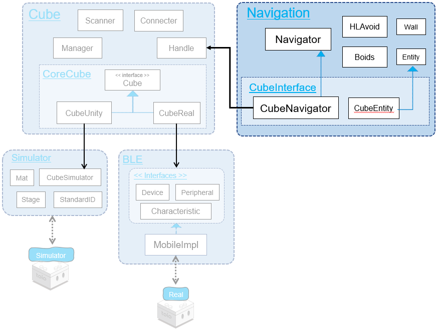
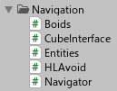
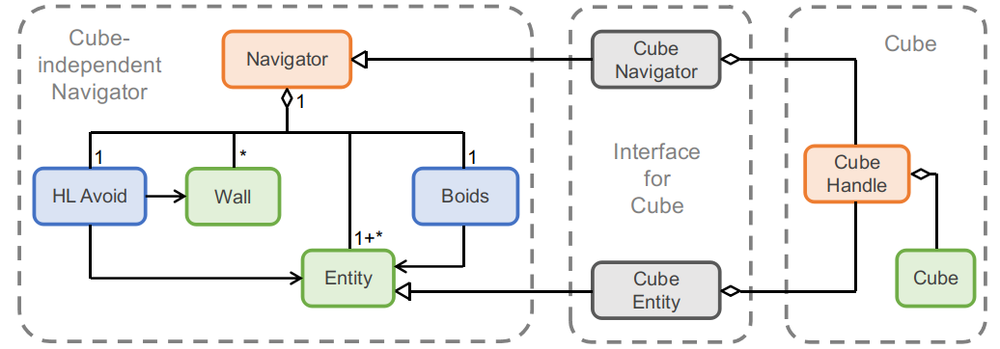
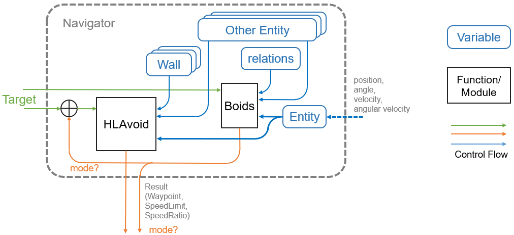
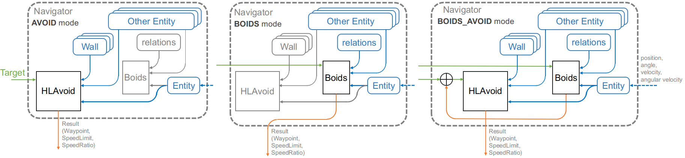
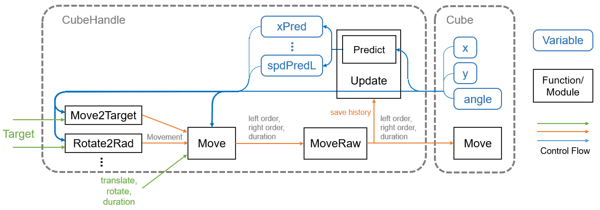
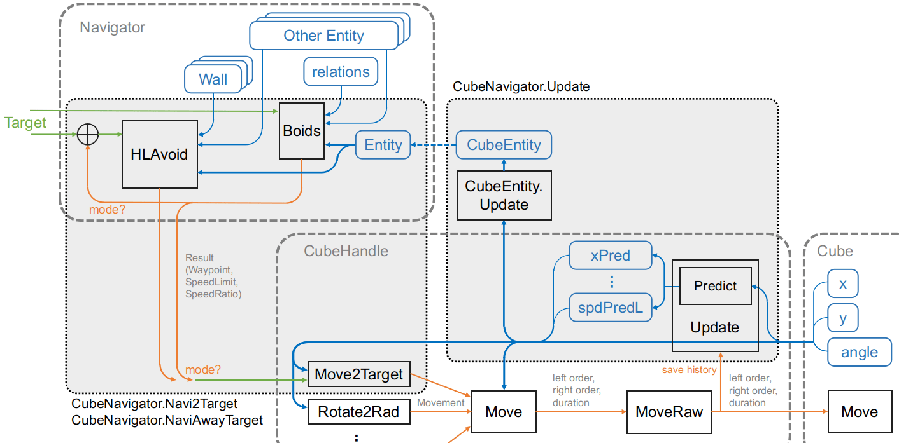
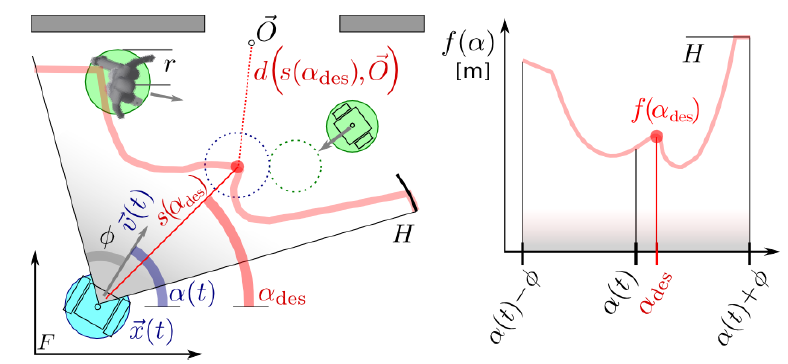

# Technical Document - Function Description - Navigator class

## Table of Contents

- [1. Overview](sys_navigator.md#1-overview)
  - [1.1. Class Diagram](sys_navigator.md#11-class-diagram)
- [2. Navigator class](sys_navigator.md#2-navigator-class)
  - [2.1. Control block diagram](sys_navigator.md#21-control-block-diagram)
  - [2.2. Mode](sys_navigator.md#22-mode)
- [3. CubeNavigator class](sys_navigator.md#3-cubenavigator-class)
  - [3.1. Control block diagram](sys_navigator.md#31-control-block-diagram)
  - [3.2. Explanation of internal processing](sys_navigator.md#32-explanation-of-internal-processing)
  - [3.3. About expansion](sys_navigator.md#33-about-expansion)
- [4. Algorithm Details](sys_navigator.md#4-algorithm-details)
  - [4.1. Human-like collision avoidance HLAvoid](sys_navigator.md#41-human-like-collision-avoidance-hlavoid)
  - [4.2. Boids](sys_navigator.md#42-boids)

# 1. Overview

<div align="center">

</div>

<br>

Navigator is an algorithm designed for multiple robots (toio™Core Cube) to move well in the presence of each other while taking into account the movements of other robots.

This algorithm is mainly based on two algorithms: "Human Like Collision Avoidance" (HLAvoid) and "Boids".

- HLAvoid is a natural avoidance method.
- Boids is a method of synchronized behavior as a group.

The directory structure is as shown in the figure below.

<div align="center"></div>

```
Navigation  +----------------------+ Navigator Related Directories
├── Boids.cs  +--------------------+ Boyd's algorithm implementation class
├── CubeInterface.cs  +------------+ CubeNavigator class and CubeEntity class
├── Entities.cs  +-----------------+ Entity class
├── HLAvoid.cs  +------------------+ HLAVoid Collision Avoidance Algorithm Implementation Class
└── Navigator.cs  +----------------+ Navigator class
```

## 1.1. Class Diagram

Navigator module of toio SDK for Unity consists of the [Navigator](sys_navigator.md#2-navigator-class) class("Cube-independent Navigator" in the figure), which is implemented independently of toio™, and the [CubeNavigator](sys_navigator.md#3-cubenavigator-class) and CubeEntity classes(Figure "Interfavce for Cube") , which are the interfaces between Navigator and CubeHandle.

<div align="center"></div>

# 2. Navigator class

## 2.1. Control block diagram

The control block diagram of Navigator class is shown below.

<div align="center"></div>

- An Entity represents a virtual "robot".
  From the outside, we need to provide state information to the Entity.
- Boids receives "its own Entity(Entity)", "other Entities(Other Entity list)", "relationship with other Entities（Relations)", and "target(Target)" as inputs, and outputs "force vector" and "velocity coefficient" as control quantities.
- HLAvoid receives "its own Entity", "other Entities", "Wall list", and "Target" as input, and outputs "waypoints (information on points on the route)" and "speed limit".
- The orange output flow varies depending on the [Mode](sys_navigator.md#22-mode) of the Navigator.

## 2.2. Mode

There are three Navigator modes (Navigator.Mode).

- AVOID： Collision avoidance only
- BOIDS： Boids only
- BOIDS_AVOID： Combination of Boids and collision avoidance

Depending on this mode, the path of the information differs as follows

- AVOID： The output of Boids is disabled and only HLAvoid takes the target as input and outputs a waypoint.
- BOIDS： The output of HLAvoid is disabled and only Boids takes the target as input and outputs the force vector as a waypoint.
- BOIDS_AVOID：
  1. First, Boids take the target as input and output a force vector
  2. Apply the force vector output by Boids to the target and use the result as input to HLAvoid
  3. Make the waypoint output by HLAvoid the final output.

<figure align="center">
    
    <figcaption>Control block diagram for each mode（AVOID、BOIDS、BOIDS_AVOID）</figcaption>
</figure>
<br>

# 3. CubeNavigator class

CubeNavigator class inherits from Navigator class and uses CubeHandle to allow Cube to avoid collisions and control groups.

## 3.1. Control block diagram

### 3.1.1. Control block diagram of CubeHandle

First of all, the control block diagram of CubeHandle is shown below.

<figure align="center">
  
  <figcaption>CubeHandle control block diagram</figcaption>
</figure>
<br>

CubeHandle does the following. (See usage_cubehandle.md for details.)

- `CubeHandle.Update` method gets information about Cube and predicts its state
- `CubeHandle.Move2Target` The method takes the target as input and computes the move instruction.
- Execute the output move instruction with the `CubeHandle.Move` or `Movemnet.Exec` method.

### 3.1.2. Control block diagram of CubeNavigator

次に CubeNavigator の制御ブロック図を以下に示します。

<div align="center"></div>
<br>

CubeNavigator uses a combination of Navigator and CubeHandle to control Cube using the following procedure.

1. Call the `CubeHandle.Update` method to set the prediction result and source information to CubeEntity (`CubeNavigator.Update` method)
2. Running the Navigator's navigation algorithm
3. Give the navigation result (waypoint coordinates, speed) to the `CubeHandle.Move2Target` method to calculate the move instruction (`CubeNavigator.Navi2Target, CubeNavigator.NaviAwayTarget` methods)
4. Execute the output move instruction with the `CubeHandle.Move` or `Movemnet.Exec` method.

## 3.2. Explanation of internal processing

### 3.2.1. Update

Call the `CubeHandle.Update` method to set the prediction result and source information to CubeEntity.

```c#
// CubeNavigator.Update
public class CubeNavigator : Navigator
{
    public void Update(bool usePred)
    {
        if (Time.time - updateLastTime < 0.015) return;
        updateLastTime = Time.time;
        this.handle.Update();
        (ego as CubeEntity).Update(usePred);
    }
    ...
}

// CubeEntity.Update
public class CubeEntity : Entity
{
    public void Update(bool usePred=false){
        if (usePred)
        {
            x = handle.xPred;
            y = handle.yPred;
            pos = new Vector(x, y);
            rad = handle.radPred;
            spdL = handle.spdPredL;
            spdR = handle.spdPredR;
            spd = handle.spdPred;
            w = handle.wPred;
            v = handle.vPred;
        }
        else{
            x = handle.x;
            y = handle.y;
            pos = handle.pos;
            rad = handle.rad;
            spdL = handle.spdL;
            spdR = handle.spdR;
            spd = handle.spd;
            w = handle.w;
            v = handle.v;
        }
    }
    ...
}
```

### 3.2.2. Navi2Target, NaviAwayTarget

It calculates waypoints, etc., from the input target value using the algorithm implemented in Navigator, and passes the result to `CubeHandle.Move2Target`.

```c#
public virtual Movement Navi2Target(double x, double y, int maxSpd=70, int rotateTime=250, double tolerance=20)
{
    // Navigator waypoint calculation
    this.result = base.GetWaypointTo(x, y);
    // Set speed
    var spd = Min(this.result.speedLimit, maxSpd*this.result.speedRatio);

    // CubeHandle.Move2Target calculates the move instruction
    var mv = handle.Move2Target(this.result.waypoint,
        maxSpd:spd, rotateTime:rotateTime, tolerance:8
    );

    // Achievement Decision
    if (ego.pos.distTo(new Vector(x,y)) <= tolerance && mv.reached)
        return mv;
    else{
        mv.reached = false; return mv;
    }
}
```

## 3.3. About expansion

- Want to change the calculation from the navigation result (waypoint, upper speed limit, speed factor) to the motor indication value.
- Want to change the method for determining arrival.

If you want to achieve these, inherit from CubeNavigator and override the Navi2Target and NaviAwayTarget methods.

# 4. Algorithm Details

The algorithms described below are also explained in the Morikatron Engineer Blog.<br>
Please refer to that as well.

[A Method for Controlling Collective Behavior Used in Urochoros(Morikatron Engineer Blog)](https://tech.morikatron.ai/entry/2020/03/04/100000)

## 4.1. Human-like collision avoidance HLAvoid

To summarize HLAvoid.

- If the robot moves forward at maximum speed in each direction, and the other robot maintains its direction and speed.
- Calculate how far away the other robots will collide if they maintain their direction and speed.
- Calculate the distance at which the other robot will collide with the robot if it maintains its direction and speed, and aim at the point closest to the target in the area before the collision.
  This is the algorithm that prevents the robot from colliding with other robots.

> Calculating the distance in each direction is called "Scanning".

<div align="center">

<figcaption>The figure is taken from  <a href="https://ieeexplore.ieee.org/abstract/document/6630610">Meta-Thesis</a>.</figcaption>
</div>

HLAvoid class in toio SDK for Unity has two methods as functions.

```c#
// Calculate navigation to target (waypoints, collision conditions, speed limits)
public (Vector, bool, double) RunTowards(List<Navigator> others, Entity target, List<Wall> walls);
// Calculate escape from target (waypoint, collision state, speed limit)
public (Vector, bool, double) RunAway(List<Navigator> others, Entity target, List<Wall> walls);
```

The calling relationship of the internal functions is as follows.

RunTowards / RunAway

- SampleRads ------------------------- Sampling scan direction
- Scan
  - ScanTar ------------------------- Scan in the direction of the target.
  - ScanOthers
    - \_ScanEntity -------------- Scan each Entity in the field of view
    - CombineScanRes ------ Merge each scan result
  - ScanWalls
    - \_ScanWall ---------------- Scan each Wall in the field of view
    - CombineScanRes ------ Merge each scan result
  - CombineScanRes ------------ Merge each scan result
- Calculate waypoints and speed limits based on scan results.

### 4.1.1. ScanResult structure representing the result of the scan.

```c#
public struct ScanResult
{
    public bool isCollision;    // Collision status
    public double[] rads;       // Scanning direction
    public double[] dists;      // Distance
    public double[] safety;     // Safety
    public Vector[] points;     // Relative coordinates of points determined by direction and distance.

    // For creating an initialized ScanResult.
    public static ScanResult init(double[] rads, double maxRange);
    // For debugging
    public void print(Action<string> func);
    // Calculate points with rads and dists
    public void calcPoints();
}
```

### 4.1.2. CombineScanRes method to merge the results of a scan

```c#
private ScanResult CombineScanRes(List<ScanResult> results, bool isCol, double[] rads);
```

Merge multiple ScanResult as follows.

- Take the minimum value of distance in each direction
- Take the minimum value of safety in each direction

### 4.1.3. Algorithm: How to calculate scans and how to choose waypoints

See orignal thesis [Guzzi, Jérôme, et al. "Human-friendly robot navigation in dynamic environments." 2013 IEEE International Conference on Robotics and Automation. IEEE, 2013.](https://ieeexplore.ieee.org/abstract/document/6630610) <br>
and see [Blog explaining the improved method](https://tech.morikatron.ai/entry/2020/03/04/100000).

<details>
<summary>_ScanEntity Implementation Code</summary>

```c#
private ScanResult _ScanEntity(Navigator other, double[] rads){
    ScanResult res = ScanResult.init(rads, maxRange);
    var o = other.entity;
    var marginSum = margin + other.avoid.margin;

    // Scan for safe distance to other
    for (int i=0; i<rads.Length; ++i)
    {
        var rad = rads[i];
        var v = Vector.fromRadMag(rad, Max(ego.spd, 10));
        var vUnit = Vector.fromRadMag(rad, 1);

        var dV = v - o.v;
        var dPos = ego.pos - o.pos;

        var a = dV * dV;
        var b = 2 * dV * dPos;
        var c = dPos * dPos - marginSum * marginSum;
        var delta = b * b - 4 * a * c;

        double dist;
        if (delta < 0 || Abs(a) < 1)    // No collision
        {
            dist = maxRange;
        }
        else
        {
            var t1 = (-b - Sqrt(delta)) / 2 / a;
            var t2 = (-b + Sqrt(delta)) / 2 / a;

            if (t2 <= 0)            // No collision in future
                dist = maxRange;
            else if (t1 > 0)        // Collsion in future
                dist = t1 * v.mag;
            else {                   // Collsion Now
                dist = Max(0.1, vUnit * dPos.unit * 100);
                res.isCollision = true;
            }
        }

        res.dists[i] = dist;
    }

    // When Collison, Find available rads.
    if (res.isCollision){
        var dPos = o.pos - ego.pos;
        var colSeverity = Max(0, margin+o.margin - dPos.mag)/margin;

        for (int i=0; i<rads.Length; ++i){
            res.safety[i] = Cos(AbsRad(rads[i] - (-dPos).rad)) * (1 + colSeverity) ;
        }
    }

    return res;
}
```

</details>

<br>

<details>
<summary>RunTowards Implementation Code</summary>

```c#
public (Vector, bool, double) RunTowards(List<Navigator> others, Entity target, List<Wall> walls){

    var rads = SampleRads(target);

    var (res, resCol) = Scan(others, target, walls, rads);
    res.calcPoints(); resCol.calcPoints();

    waypointIndex = 0;
    Vector waypoint = Vector.zero;

    // find waypoint by res, which is the scan result of objects NOT in collision
    {
        double minDist = double.MaxValue;
        for (int i=0; i<rads.Length; ++i)
        {
            // nearest point at certain rad
            var nearestMag = Max( Cos((target.pos-ego.pos).rad - rads[i]) * ego.pos.distTo(target.pos) , 1 );
            var mv = res.points[i].clip(nearestMag);
            res.points[i] = mv;

            // distance of waypoint to target
            var dist = (ego.pos + mv).distTo(target.pos);

            // penalty of turning
            // NOTE may cause not turning when target right behind ego
            dist += Max(AbsRad(ego.rad - rads[i]), 0.5) * 0.1;
            dist += Max((AbsRad(ego.rad - rads[i]) - PI/2), 0) * 2;

            // Search Nearest waypoint away from target, with SAFE direction
            if (dist < minDist && resCol.safety[i] > p_waypoint_safety_threshold)
            {
                minDist = dist; waypointIndex = i;
            }
        }

        if (minDist < double.MaxValue){
            waypoint = res.points[waypointIndex];
        }
    }

    // ====  Speed Limit  ====
    double speedLimit = double.MaxValue;
    var waypointRad = rads[waypointIndex];
    // slow down when colliders are close around.
    {
        double minRadius = 1e10;
        for (int i=0; i<rads.Length; ++i){
            var rad = rads[i];
            if (res.dists[i] < 50 &&
                (Rad(rad-ego.rad)>0.1 && Rad(waypointRad-rad)>0.1 ||
                    Rad(ego.rad-rad)>0.1 && Rad(rad-waypointRad)>0.1 ))
            {
                // minimal maximal turning radius
                minRadius = Min(minRadius, (res.dists[i]+20) / (2* Sin(Abs(rad-ego.rad))) );
            }
        }
        speedLimit = Max(8, minRadius * Max(1, Abs(ego.w)));
    }
    // stop when ego.rad is pointing insides colliders.
    if (resCol.isCollision)
    {
        for (int i=0; i<rads.Length; ++i){
            var rad = rads[i];
            if (AbsRad(rad - ego.rad) < PI*2/nsample
                && resCol.safety[i] <= 0
            ){
                speedLimit = 100 * Max(0, resCol.safety[i] * 2 +1);
                break;
            }
        }
    }

    // make result
    res.rads = rads;
    scanResult = res;
    return (waypoint, resCol.isCollision, speedLimit);
}
```

</details>

<br>

## 4.2. Boids

Boids is an algorithm that simulates the collective behavior of birds, and it is implemented with three simple rules, as shown in the figure below.

- Separation: Separation from other individuals.
- Alignment: Moving in the average direction of surrounding individuals.
- Cohesion: Move to the average position of the surrounding individuals.

<div align="center">

<figcaption>Adapted from  <a href="http://www.red3d.com/cwr/boids/">Reynolds, Craig. Boids(Webpage)</a>.</figcaption>
</div>

Boids class in toio SDK for Unity has two methods as functions.

```c#
// Calculate the force vector of the void, including the "gravitational force" to the target.
public Vector Run(List<Navigator> others, Vector tarPos);
// Calculate the force vector of the void without "attraction" to the target.
public Vector Run(List<Navigator> others);
```

### Accessorial relation

#### Run

- Attract -------- "Gravitational pull" of goals
- Separate ----- Power of separation
- Cohesion ---- Force to move to average position
- Alignment ---- Force toward the mean direction
- Calculation of weighting, limits, and combined forces

For a more detailed description of the algorithm, see [Reynolds, Craig. Boids(Webpage)](http://www.red3d.com/cwr/boids/) .
