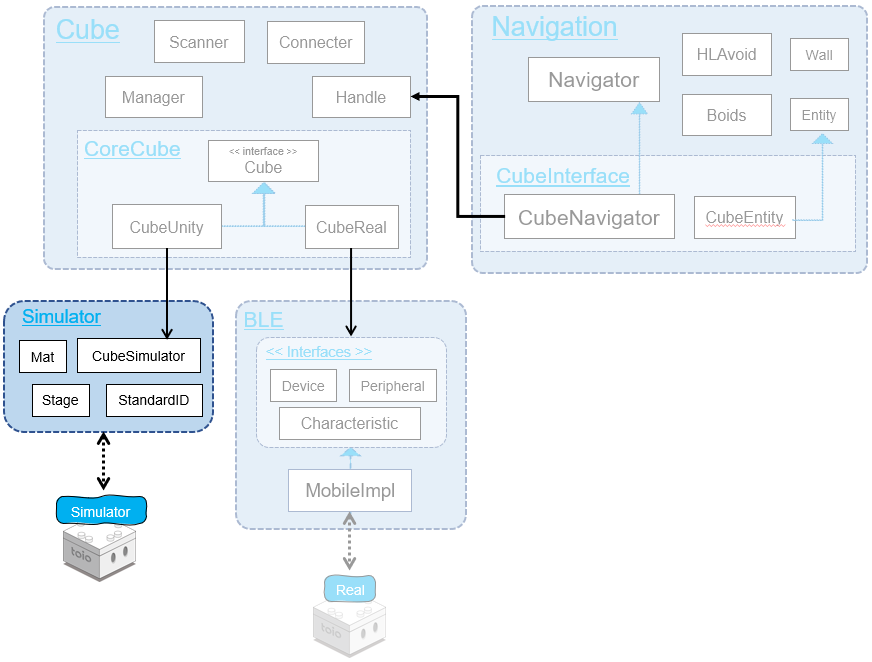
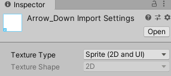

# Technical Document - Function Description - Simulator

## Table of Contents

- [1. Overview](sys_simulator.md#1-overview)
- [2. Mat Prefab](sys_simulator.md#2-mat-prefab)
  - [2.1 Conversion from mat coordinate units to meters](sys_simulator.md#21-conversion-from-mat-coordinate-units-to-meters)
  - [2.2 Switching mat type](sys_simulator.md#22-switching-mat-type)
  - [2.3 Converting the coordinates on the mat to the coordinates in Unity](sys_simulator.md#23-converting-the-coordinates-on-the-mat-to-the-coordinates-in-unity)
- [3. StandardID Prefab](sys_simulator.md#3-standardid-prefab)
  - [3.1. Switching between standard ID types](sys_simulator.md#31-switching-between-standard-id-types)
- [4. Cube Prefab](sys_simulator.md#4-cube-prefab)
  - [4.1 Definition of constants](sys_simulator.md#41-definition-of-constants)
  - [4.2. Simulated state](sys_simulator.md#42-simulated-state)
  - [4.3. Executing commands](sys_simulator.md#43-executing-commands)
- [5. Stage Prefab](sys_simulator.md#5-stage-prefab)
  - [5.1 Target pole](sys_simulator.md#51-target-pole)
  - [5.2 Focus on Cube](sys_simulator.md#52-focus-on-cube)

# 1. Overview

<div align="center">

</div>

<br>

Simulator is a virtual environment for testing that allows you to easily check the operation of Unity Editor when developing applications for smart devices that communicate with toio™ Core Cube.

Directory structure looks like this

```
Assets/toio-sdk/Scripts/Simulator/  +------+ There's a script directly underneath
├── Editor/  +-----------------------------+ Unity Editor script to customize the Inspector
├── Materials/  +--------------------------+ Materials and physical materials used for objects in Simulator
├── Models/  +-----------------------------+ 3D models used for objects in Simulator
└── Resoureces/  +-------------------------+ Prefab is placed directly below it
    ├── Mat/  +----------------------------+ Various mat textures and materials
    ├── Ocatave/  +------------------------+ Sound files used for the Sound function
    └── StandardID/  +---------------------+ Various standard ID textures
        ├── toio_collection/  +------------+ Toio Collection
        └── simple_card/  +----------------+ Simple card
```


# 2. Mat Prefab

Mat Prefab has the script Mat.cs attached to it.

Also, the Mat.cs inspector is customized by the script Editor/MatEditor.cs.

## 2.1. Conversion from mat coordinate units to meters

According to [toio™ Core Cube Technical specifications / Communication specifications / Various functions / Reading sensor](https://toio.github.io/toio-spec/en/docs/ble_id), the size of the playmat included with toio collection is 410 units in length and width.<br>
The actual measurement of the mat was 56 cm = 0.560 m per side.

From here, we define the coordinate information of the mat and the factor `DotPerM` to convert it to distance (meters) as follows

```c#
public static readonly float DotPerM = 411f/0.560f; // (410+1)/0.560 dot/m
```

## 2.2. Switching mat type

When you change the matType from the Inspector, the ApplyMatType method in Mat.cs will be executed to change the coordinate range and switch the material.

<details>
<summary>Implementation code (Click to expand)</summary>

```c#
public enum MatType
{
    toio_collection_front = 0,
    toio_collection_back = 1,
    simple_playmat = 2,
    developer = 3,
    custom = 4  // Customize the coordinate range.
}

public MatType matType;

// Reflect changes in mat type and coordinate range.
internal void ApplyMatType()
{
    // Resize
    if (matType != MatType.custom)
    {
        var rect = GetRectForMatType(matType);
        xMin = rect.xMin; xMax = rect.xMax;
        yMin = rect.yMin; yMax = rect.yMax;
    }
    this.transform.localScale = new Vector3((xMax-xMin+1)/DotPerM, (yMax-yMin+1)/DotPerM, 1);

    // Change material
    switch (matType){
        case MatType.toio_collection_front:
            GetComponent<Renderer>().material = (Material)Resources.Load<Material>("Mat/toio_collection_front");;
            break;
        case MatType.toio_collection_back:
            GetComponent<Renderer>().material = (Material)Resources.Load<Material>("Mat/toio_collection_back");
            break;
        case MatType.simple_playmat:
            GetComponent<Renderer>().material = (Material)Resources.Load<Material>("Mat/simple_playmat");
            break;
        case MatType.developer:
            GetComponent<Renderer>().material = (Material)Resources.Load<Material>("Mat/simple_playmat");
            break;
        case MatType.custom:
            GetComponent<Renderer>().material = (Material)Resources.Load<Material>("Mat/mat_null");
            break;
    }
}
```

</details>

## 2.3. Converting the coordinates on the mat to the coordinates in Unity

We have a method to convert between coordinates/angles in Unity and coordinates/angles on the mat.

> Mat Prefab can only be converted correctly if it is placed horizontally.

<details>
<summary>Implementation code (Click to expand)</summary>

```c#
// Converting angles in Unity to angles on the main mat
public int UnityDeg2MatDeg(double deg)
{
    return (int)(deg-this.transform.eulerAngles.y-90+0.49999f)%360;
}
// Convert the angle on this mat to the angle in Unity.
public float MatDeg2UnityDeg(double deg)
{
    return (int)(deg+this.transform.eulerAngles.y+90+0.49999f)%360;
}

// Convert from Unity's 3D space coordinates to mat coordinates in this mat.
public Vector2Int UnityCoord2MatCoord(Vector3 unityCoord)
{
    var matPos = this.transform.position;
    var drad = - this.transform.eulerAngles.y * Mathf.Deg2Rad;
    var _cos = Mathf.Cos(drad);
    var _sin = Mathf.Sin(drad);

    // Coordinate system shift: Match to this mat
    var dx = unityCoord[0] - matPos[0];
    var dy = -unityCoord[2] + matPos[2];

    // Coordinate system rotation: Match the main mat
    Vector2 coord = new Vector2(dx*_cos-dy*_sin, dx*_sin+dy*_cos);

    // Convert to mat units
    return new Vector2Int(
        (int)(coord.x*DotPerM + this.xCenter + 0.4999f),
        (int)(coord.y*DotPerM + this.yCenter + 0.4999f)
    );
}
// Convert the mat coordinates in this mat to Unity's 3D space.
public Vector3 MatCoord2UnityCoord(double x, double y)
{
    var matPos = this.transform.position;
    var drad = this.transform.eulerAngles.y * Mathf.Deg2Rad;
    var _cos = Mathf.Cos(drad);
    var _sin = Mathf.Sin(drad);

    // Convert to meters
    var dx = ((float)x - xCenter)/DotPerM;
    var dy = ((float)y - yCenter)/DotPerM;

    // Coordinate system rotation: Match to Unity
    Vector2 coord = new Vector2(dx*_cos-dy*_sin, dx*_sin+dy*_cos);

    // Coordinate System Shift: Match Unity
    coord.x += matPos.x;
    coord.y += -matPos.z;

    return new Vector3(coord.x, matPos.y, -coord.y);
}
```

</details>

<br>

# 3. StandardID Prefab

StandardID Prefab has the script StandardID.cs attached to it.

Also, the inspector in StandardID.cs is customized by the script Editor/StandardIDEditor.cs.

## 3.1. Switching between standard ID types

Because of the large number of standard IDs, it would be difficult to prepare materials for each of them and scalability would be poor. Therefore, as shown in the figure below, switching is achieved by introducing the image into a Sprite texture, converting it from script to mesh, and replacing it with the object renderer.

<div align="center">

</div>
<br>

<details>
<summary>Implementation code (Click to expand)</summary>

```c#
internal void ApplyStandardIDType()
{
    // Load Sprite
    string spritePath = "StandardID/"+title.ToString()+"/";
    if (title == Title.toio_collection) spritePath += toioColleType.ToString();
    else if (title == Title.simple_card) spritePath += simpleCardType.ToString();
    var sprite = (Sprite)Resources.Load<Sprite>(spritePath);
    GetComponent<SpriteRenderer>().sprite = sprite;

    // Create Mesh
    var mesh = SpriteToMesh(sprite);
    GetComponentInChildren<MeshFilter>().mesh = mesh;

    // Update Mesh Collider
    GetComponentInChildren<MeshCollider>().sharedMesh = null;
    GetComponentInChildren<MeshCollider>().sharedMesh = mesh;

    // Update Size
    float realWidth = 0.05f;
    if (title == Title.toio_collection)
    {
        if ((int)toioColleType > 32) realWidth = 0.03f;
        else if ((int)toioColleType < 21 || (int)toioColleType > 26) realWidth = 0.0575f;
        else    // Skunk
        {
            if (toioColleType == ToioColleType.id_skunk_blue) realWidth = 0.179f;
            else if (toioColleType == ToioColleType.id_skunk_green) realWidth = 0.162f;
            else if (toioColleType == ToioColleType.id_skunk_yellow) realWidth = 0.145f;
            else if (toioColleType == ToioColleType.id_skunk_orange) realWidth = 0.1335f;
            else if (toioColleType == ToioColleType.id_skunk_red) realWidth = 0.1285f;
            else realWidth = 0.1225f; //toioColleType = ToioColleType.id_skunk_brown
        }
    }
    else if (title == Title.simple_card)
    {
        if (simpleCardType == SimpleCardType.Full) realWidth = 0.297f;
        else realWidth = 0.04f;
    }
    var scale = RealWidthToScale(sprite, realWidth);
    this.transform.localScale = new Vector3(scale, scale, 1);

}

public static float RealWidthToScale(Sprite sprite, float realWidth)
{
    return sprite.pixelsPerUnit/(sprite.rect.width/realWidth);
}

// http://tsubakit1.hateblo.jp/entry/2018/04/18/234424
private Mesh SpriteToMesh(Sprite sprite)
{
    var mesh = new Mesh();
    mesh.SetVertices(Array.ConvertAll(sprite.vertices, c => (Vector3)c).ToList());
    mesh.SetUVs(0, sprite.uv.ToList());
    mesh.SetTriangles(Array.ConvertAll(sprite.triangles, c => (int)c), 0);

    return mesh;
}
```

</details>
<br>

# 4. Cube Prefab

There are three scripts implemented in Cube Prefab.
- `CubeSimulator.cs`：Implementation of a simulation of a real cube.
  - `CubeSimImpl.cs`：The base class for the implementation of each version of CubeSimulator.
  - `CubeSimImpl_v2_0_0.cs`：Implementation to support version 2.0.0
  - `CubeSimImpl_v2_1_0.cs`：Implementation to support version 2.1.0
  - `CubeSimImpl_v2_2_0.cs`：Implementation to support version 2.2.0
- `CubeSimulatorEditor.cs`：A customized version of the `CubeSimulator.cs` inspector
- `CubeInteraction.cs`：Implemented operations of pushing and grabbing Cube objects on Simulator.

This chapter introduces the implementation of each version of `CubeSimulator`.

## 4.1. Definition of constants

From the dimensions listed in [toio™ Core Cube Technical specifications/Hardware specifications/Shape and size](https://toio.github.io/toio-spec/en/docs/hardware_shape) and [Mat.DotPerM constants](sys_simulator.md#21-conversion-from-mat-coordinate-units-to-meters), the distance between the left and right tires and the size of Cube are defined as follows

```c#
// Distance between left and right tires (meters)
public static readonly float TireWidthM = 0.0266f;
// Distance between left and right tires (dots (mat coordinates))
public static readonly float TireWidthDot= 0.0266f * Mat.DotPerM;
// Cube Size
public static readonly float WidthM= 0.0318f;
```

Based on the motor specs listed in [toio™ Core Cube Technical Specifications / Communication Specifications / Various Functions / Motors](https://toio.github.io/toio-spec/en/docs/ble_motor) and the tire diameter (0.0125m) listed in [toio™ Core Cube Technical specifications/Hardware specifications/Shape and size](https://toio.github.io/toio-spec/en/docs/hardware_shape), The coefficients of the speed on the mat and the speed indication are defined as follows.

```c#
// Proportional to the speed (dots per second) and the indicated value
// (dot/s)/u = 4.3 rpm/u * pi * 0.0125m / (60s/m) * DotPerM
public static readonly float VDotOverU =  4.3f*Mathf.PI*0.0125f/60 * Mat.DotPerM; // about 2.06
```

## 4.2. Simulated state

###  Readout sensor

Raycast a ray "down" from the bottom of Cube, and if the object hit within 5mm is a Mat, get the Mat coordinates; if it is a StandardID, get the Standard ID If it is a StandardID, get the StandardID.

> To get the mat coordinates, we use the Mat coordinate conversion method.

```C#
// CubeSimImpl_v2_0_0.cs
protected virtual void SimulateIDSensor()
{
    // Simulate a reading sensor
    // Simuate Position ID & Standard ID Sensor
    RaycastHit hit;
    Vector3 gposSensor = cube.transform.Find("sensor").position;
    Ray ray = new Ray(gposSensor, -cube.transform.up);
    if (Physics.Raycast(ray, out hit)) {
        if (hit.transform.gameObject.tag == "Mat" && hit.distance < 0.005f){
            var mat = hit.transform.gameObject.GetComponent<Mat>();
            var coord = mat.UnityCoord2MatCoord(cube.transform.position);
            var deg = mat.UnityDeg2MatDeg(cube.transform.eulerAngles.y);
            var coordSensor = mat.UnityCoord2MatCoord(gposSensor);
            var xSensor = coordSensor.x; var ySensor = coordSensor.y;
            _SetXYDeg(coord.x, coord.y, deg, xSensor, ySensor);
        }
        else if (hit.transform.gameObject.tag == "StandardID" && hit.distance < 0.005f)
        {
            var stdID = hit.transform.gameObject.GetComponentInParent<StandardID>();
            var deg = stdID.UnityDeg2MatDeg(cube.transform.eulerAngles.y);
            _SetSandardID(stdID.id, deg);
        }
        else _SetOffGround();
    }
    else _SetOffGround();
}
```

The method `_SetXYDeg` to set the Position ID and angle calls the callback `IDCallback` if there are any changes.

```c#
// CubeSimImpl_v2_0_0.cs
protected void _SetXYDeg(int x, int y, int deg, int xSensor, int ySensor)
{
    if (this.x != x || this.y != y || this.deg != deg || !this.onMat)
        this.IDCallback?.Invoke(x, y, deg, xSensor, ySensor);
    this.x = x; this.y = y; this.deg = deg;
    this.xSensor = xSensor; this.ySensor = ySensor;
    this.onMat = true;
    this.onStandardID = false;
}
```

The method `_SetStandardID` to set the Standard ID and angle calls the callback `StandardIDCallback` if there are any changes.

```c#
// CubeSimImpl_v2_0_0.cs
protected void _SetSandardID(uint stdID, int deg)
{
    if (this.standardID != stdID || this.deg != deg || !this.onStandardID)
        this.standardIDCallback?.Invoke(stdID, deg);
    this.standardID = stdID;
    this.deg = deg;
    this.onStandardID = true;
    this.onMat = false;
}
```

The method `_SetOffGround` will call the callbacks `positionIDMissedCallback` or `standardIDMissedCallback` if Cube leaves the Mat or StandardID.

```c#
// CubeSimImpl_v2_0_0.cs
protected void _SetOffGround()
{
    if (this.onMat)
        this.positionIDMissedCallback?.Invoke();
    if (this.onStandardID)
        this.standardIDMissedCallback?.Invoke();
    this.onMat = false;
    this.onStandardID = false;
}
```

### Button

Calls the `buttonCallback` callback when the button state is changed.

```c#
// CubeSimImpl_v2_0_0.cs
protected bool _button;
public override bool button
{
    get {return this._button;}
    internal set
    {
        if (this._button!=value){
            this.buttonCallback?.Invoke(value);
        }
        this._button = value;
        cube._SetPressed(value);
    }
}
```

It also calls `CubeSimulator._SetPressed` to represent Cube object being pressed.

```c#
// CubeSimulator.cs
internal void _SetPressed(bool pressed)
{
    this.cubeModel.transform.localEulerAngles
            = pressed? new Vector3(-93,0,0) : new Vector3(-90,0,0);
}
```


### Horizontal detection

If the angle of Cube object exceeds the threshold, set `sloped` to true.

```c#
// CubeSimImpl_v2_0_0.cs
protected virtual void SimulateMotionSensor()
{
    // Horizontal detection
    if (cube.isSimulateSloped)
    {
        cube.sloped = Vector3.Angle(Vector3.up, cube.transform.up)>45f;
    }
    ...
}
```

Invoke the motion sensor callback via `InvokeMotionSensorCallback` when `sloped` is changed.

```c#
// CubeSimImpl_v2_0_0.cs
protected bool _sloped;
public override bool sloped
{
    get {return this._sloped;}
    internal set
    {
        if (this._sloped!=value){
            this._sloped = value;
            this.InvokeMotionSensorCallback();
        }
    }
}
```

### Collision detection

> Simulation of collision detection is not yet implemented.

When a collision is manually generated in the inspector, `TriggerCollision` is called, which calls the motion sensor callback via `InvokeMotionSensorCallback`.

```c#
// CubeSimImpl_v2_0_0.cs
protected bool _collisonDetected = false;
internal override void TriggerCollision()
{
    this._collisonDetected = true;
    this.InvokeMotionSensorCallback();
}
```

### Double Tap

> This is a feature of 2.1.0.
Double-tap simulation is not yet implemented.

When a double-tap is pressed manually in the inspector, `TriggerDoubleTap` is called, which calls the motion sensor callback via `InvokeMotionSensorCallback`.

```c#
// CubeSimImpl_v2_1_0.cs
protected bool _doubleTapped = false;
internal override void TriggerDoubleTap()
{
    this._doubleTapped = true;
    this.InvokeMotionSensorCallback();
}
```

### Attitude detection

> This is a feature of 2.1.0.
The principle is the same as the horizontal detection: if the angle of Cube object exceeds the threshold in the corresponding direction, the `pose` is set to the corresponding direction.

```c#
// CubeSimImpl_v2_1_0.cs
protected virtual void SimulateMotionSensor()
{
    if(Vector3.Angle(Vector3.up, transform.up)<45f)
    {
        this.pose = Cube.PoseType.up;
    }
    else if(Vector3.Angle(Vector3.up, transform.up)>135f)
    {
        this.pose = Cube.PoseType.down;
    }
    else if(Vector3.Angle(Vector3.up, transform.forward)<45f)
    {
        this.pose = Cube.PoseType.forward;
    }
    else if(Vector3.Angle(Vector3.up, transform.forward)>135f)
    {
        this.pose = Cube.PoseType.backward;
    }
    else if(Vector3.Angle(Vector3.up, transform.right)<45f)
    {
        this.pose = Cube.PoseType.right;
    }
    else if(Vector3.Angle(Vector3.up, transform.right)>135f)
    {
        this.pose = Cube.PoseType.left;
    }
}
```

Invoke the motion sensor callback through `InvokeMotionSensorCallback` when `pose` is changed.

```c#
// CubeSimImpl_v2_1_0.cs
protected Cube.PoseType _pose = Cube.PoseType.up;
public override Cube.PoseType pose {
    get{ return _pose; }
    internal set{
        if (this._pose != value){
            this._pose = value;
            this.InvokeMotionSensorCallback();
        }
    }
}
```

### Shake detection

> This is a feature of 2.2.0.
Simulation of shake detection is not yet implemented.

Invoke the motion sensor callback via `InvokeMotionSensorCallback` when `shakeLevel` is manually changed in the inspector.

```c#
// CubeSimImpl_v2_2_0.cs
protected int _shakeLevel;
public override int shakeLevel
{
    get {return this._shakeLevel;}
    internal set
    {
        if (this._shakeLevel != value){
            this._shakeLevel = value;
            this.InvokeMotionSensorCallback();
        }
    }
}
```

### Motor speed detection

> This is a feature of 2.2.0.

The tire speed calculated by the motor simulation is converted to the motor speed.

```c#
// CubeSimImpl_v2_2_0.cs
protected void SimulateMotorSpeedSensor()
{
    int left = Mathf.RoundToInt(cube.speedTireL/CubeSimulator.VMeterOverU);
    int right = Mathf.RoundToInt(cube.speedTireR/CubeSimulator.VMeterOverU);
    _SetMotorSpeed(left, right);
}
```

Call the corresponding callback `motorSpeedCallback` when the value is changed.

```c#
// CubeSimImpl_v2_2_0.cs
protected void _SetMotorSpeed(int left, int right)
{
    left = Mathf.Abs(left);
    right = Mathf.Abs(right);
    if (motorSpeedEnabled)
        if (this.leftMotorSpeed != left || this.rightMotorSpeed != right)
            this.motorSpeedCallback?.Invoke(left, right);
    this.leftMotorSpeed = left;
    this.rightMotorSpeed = right;
}
```

### Magnet state detection

> This is a feature of 2.2.0.

CubeSimulator searches for the [Magnet Prefab](#6-Magnet-Prefab) in the scene and calculates the composite magnetic field vector at the location of the magnetic sensor.

```c#
internal Vector3 _GetMagneticField()
{
    if (isSimulateMagneticSensor)
    {
        var magnetObjs = GameObject.FindGameObjectsWithTag("t4u_Magnet");
        var magnets = Array.ConvertAll(magnetObjs, obj => obj.GetComponent<Magnet>());

        Vector3 magSensor = transform.Find("MagneticSensor").position;

        Vector3 h = Vector3.zero;
        foreach (var magnet in magnets)
        {
            h += magnet.SumUpH(magSensor);
        }

        this._magneticField = new Vector3(h.z, h.x, -h.y);
    }
    return this._magneticField;
}
```

Depending on the length and direction of the magnetic field vector, the magnet state transitions.


```c#
// CubeSimImpl_v2_2_0.cs
protected virtual void SimulateMagnetState(Vector3 force)
{
    if (this.magneticMode != Cube.MagneticMode.MagnetState)
    {
        this.magnetState = Cube.MagnetState.None;
        return;
    }

    var e = force.normalized;
    var m = force.magnitude;
    const float orientThreshold = 0.95f;
    Cube.MagnetState state = this.magnetState;

    if (m > 9000 && Vector3.Dot(e, Vector3.forward) > orientThreshold)
        state = Cube.MagnetState.N_Center;
    else if (m > 9000 && Vector3.Dot(e, Vector3.back) > orientThreshold)
        state = Cube.MagnetState.S_Center;
    else if (m > 6000 && Vector3.Dot(e, new Vector3(0, -1, 1).normalized) > orientThreshold)
        state = Cube.MagnetState.N_Right;
    else if (m > 6000 && Vector3.Dot(e, new Vector3(0, 1, 1).normalized) > orientThreshold)
        state = Cube.MagnetState.N_Left;
    else if (m > 6000 && Vector3.Dot(e, new Vector3(0, 1, -1).normalized) > orientThreshold)
        state = Cube.MagnetState.S_Right;
    else if (m > 6000 && Vector3.Dot(e, new Vector3(0, -1, -1).normalized) > orientThreshold)
        state = Cube.MagnetState.S_Left;
    else if (m < 200)
        state = Cube.MagnetState.None;

    _SetMagnetState(state);
}
```

### Magnetic force detection

> This is a feature of 2.3.0.

Convert the magnetic field vector to units for the cube.

```c#
// CubeSimImpl_v2_3_0.cs
protected virtual void SimulateMagneticForce(Vector3 force)
{
    if (this.magneticMode != Cube.MagneticMode.MagneticForce)
    {
        this.magneticForce = Vector3.zero;
        return;
    }

    force /= 450;
    var orient = force.normalized * 10;
    int ox = Mathf.RoundToInt(orient.x);
    int oy = Mathf.RoundToInt(orient.y);
    int oz = Mathf.RoundToInt(orient.z);
    int mag = Mathf.RoundToInt(force.magnitude);
    Vector3 f = new Vector3(ox, oy, oz);
    f.Normalize();
    f *= mag;
    _SetMagneticForce(f);
}
```

### Attitude detection

> This is a feature of 2.3.0.

Converts a Cube Prefab from Euler angles in the Unity coordinate system to Euler angles in the coordinate system defined in the specification. <br>
It also sets the Yaw reference value at startup and implements Yaw error accumulation.

```c#
// CubeSimulator.cs
private void _InitIMU()
{
    this._attitudeYawBias = transform.eulerAngles.y;
}
private void _SimulateIMU()
{
    this._attitudeYawBiasD += (UnityEngine.Random.value-0.5f) * 0.1f;
    this._attitudeYawBiasD = Mathf.Clamp(this._attitudeYawBiasD, -1, 1);
    this._attitudeYawBias += (this._attitudeYawBiasD + UnityEngine.Random.value-0.5f) * 0.01f;
}
internal Vector3 _GetIMU()
{
    var e = transform.eulerAngles;
    float roll = e.z;
    float pitch = e.x;
    float yaw = e.y - this._attitudeYawBias;

    return new Vector3(roll, pitch, yaw);
}
```

The Euler angles and quaternions to be sent to the CubeUnity class are created by the Euler angles of the specification coordinate system. <br>
At the moment (2021.09.01), the quaternions of the real core cube are in a separate coordinate system from the Euler, so we reproduce them in the simulator as well. (Euler's is the one that matches the spec coordinate system.

```c#
// CubeSimImpl_v2_3_0.cs
private float attitudeInitialYaw = 0;
protected virtual void SimulateAttitudeSensor()
{
    var e = cube._GetIMU();
    int cvt(float f) { return (Mathf.RoundToInt(f) + 180) % 360 - 180; }
    var eulers = new Vector3(cvt(e.x), cvt(e.y), cvt(e.z));

    // NOTE Reproducing real firmware's BUG
    var quat = Quaternion.Euler(0, 0, -e.z) * Quaternion.Euler(0, -e.y, 0) * Quaternion.Euler(e.x+180, 0, 0);
    quat = new Quaternion(Mathf.Floor(quat.x*10000)/10000f, Mathf.Floor(quat.y*10000)/10000f,
                            Mathf.Floor(quat.z*10000)/10000f, Mathf.Floor(quat.w*10000)/10000f);

    _SetAttitude(eulers, quat);
}
```

<br>

## 4.3. Executing commands

### Command processing flow

Simulator uses the following logic to process instructions passed from [CubeUnity](sys_cube.md#2-structure-of-cube-class).

- When CubeUnity calls a method in CubeSimulator
  - It starts a coroutine that calls the implementation method after a delay
  - In the implementation method, the received instruction is held in the member variable "running instruction
- In FixedUpdate(), which is executed every frame, the following process is performed
  - Execute the "instruction being executed.
  - Clear the "executing instruction" when it finishes.

> The delay parameter of Cube Prefab is set to the value actually measured in a real environment. It may vary depending on the device, environment, etc.

### Motor

Use Raycast to investigate if the tires are hitting the ground.

```C#
// CubeSimulator.cs
internal bool offGroundL = true;
internal bool offGroundR = true;
private void SimulatePhysics_Input()
{
    // Investigate tire landing conditions.
    // Check if tires are Off Ground
    RaycastHit hit;
    var ray = new Ray(transform.position+transform.up*0.001f-transform.right*0.0133f, -transform.up); // left wheel
    if (Physics.Raycast(ray, out hit) && hit.distance < 0.002f) offGroundL = false;
    ray = new Ray(transform.position+transform.up*0.001f+transform.right*0.0133f, -transform.up); // right wheel
    if (Physics.Raycast(ray, out hit) && hit.distance < 0.002f) offGroundR = false;
}
```

It converts the target speed of the current motor control instruction to the speed in Unity coordinate system, calculates the tire speed depending on if it is forced to stop or pushed, then calculates Cube speed depending on the landing state, and passes it to `CubeSimulator._SetSpeed`.

```C#
// CubeSimulator.cs
private void SimulatePhysics_Output()
{
    // Update tire speed.
    if (this.forceStop || this.button || !this.isConnected)   // Force stop
    {
        speedTireL = 0; speedTireR = 0;
    }
    else
    {
        var dt = Time.fixedDeltaTime;
        speedTireL += (motorTargetSpdL - speedTireL) / Mathf.Max(this.motorTau, dt) * dt;
        speedTireR += (motorTargetSpdR - speedTireR) / Mathf.Max(this.motorTau, dt) * dt;
    }

    // Get Cube's speed depending on its landing status
    // update object's speed
    // NOTES: simulation for slipping shall be implemented here
    speedL = offGroundL? 0: speedTireL;
    speedR = offGroundR? 0: speedTireR;

    // Output
    _SetSpeed(speedL, speedR);
}
```

Depending on the amount of change from the current speed to the target speed, Unity's Rigidbody.Addforce will apply a force to the body, and the position and angle will be updated by Unity's physics engine.

```C#
// CubeSimulator.cs
internal void _SetSpeed(float speedL, float speedR)
{
    // Update position and angle by applying force through velocity change.
    this.rb.angularVelocity = transform.up * (float)((speedL - speedR) / TireWidthM);
    var vel = transform.forward * (speedL + speedR) / 2;
    var dv = vel - this.rb.velocity;
    this.rb.AddForce(dv, ForceMode.VelocityChange);
}
```


#### Further improvements (currently unimplemented items)

##### How to update velocity, position, and angle
AddForce, the frictional force of the mat is set to 0 and the delay factor, which is normally caused by the laws of physics, is included in the calculation of the target speed.<br>
Since we are using a simplified model for these physical calculations, we cannot simulate the behavior of the mat when it is tilted.
For a more accurate modeling, the following steps could be considered：
- Input the difference between the target speed and the current speed converted from the motor control command into the same control module (e.g. PID) as the actual cube firmware.
- Input the output "voltage" of the PID into the motor model.
- The "current" output of the motor model is converted to "power" and fed to the physics engine.
- Make the wheel's collider, physics materials, etc. as realistic as possible.

### Motor control with target specification

Since the firmware implementation of the actual machine has not been released, the motor control with target specification of Simulator was implemented by referring to the specifications and the movements of the actual machine. There are some parts that were created by guessing, and there may be some differences from the actual machine, so we will explain some important parts.

#### Case where the move type is 0 (move while rotating)

In the case of `rotate and move`, you decide whether to move forward or backward depending on whether the target is in front or behind Cube.

```c#
// CubeSimImpl_v2_1_0.cs
protected (float, float) TargetMove_MoveControl(float elipsed, ushort x, ushort y, byte maxSpd, Cube.TargetSpeedType targetSpeedType, float acc, Cube.TargetMoveType targetMoveType)
{
    // ...
    Vector2 targetPos = new Vector2(x, y);
    Vector2 pos = new Vector2(this.x, this.y);
    var dpos = targetPos - pos;
    var dir2tar = Vector2.SignedAngle(Vector2.right, dpos);
    var deg2tar = Deg(dir2tar - this.deg);                    // use when moving forward
    var deg2tar_back = (deg2tar+360)%360 -180;                // use when moving backward
    bool tarOnFront = Mathf.Abs(deg2tar) <= 90;
    // ...
    switch (targetMoveType)
    {
        case (Cube.TargetMoveType.RotatingMove):        // Rotate and move
        {
            rotate = tarOnFront? deg2tar : deg2tar_back;
            translate = tarOnFront? spd : -spd;
            break;
        }
        // ...
    }
    // ...
}
```

#### Case of motor speed change type with acceleration and deceleration

Taking the case of acceleration as an example, when the execution of a directive starts, the acceleration is calculated according to the length of the path and the maximum velocity. During the execution of the directive, the acceleration is based on the passage of time and acceleration, regardless of the position of Cube.

```c#
// CubeSimImpl_v2_1_0.cs
protected virtual void TargetMoveInit()
{
    // ...
    this.currMotorTargetCmd.acc = ((float)cmd.maxSpd*cmd.maxSpd-this.deadzone*this.deadzone) * CubeSimulator.VDotOverU/2/dist;
    // ...
}
```

#### Steering Control

The rotation command value `rotate` is calculated in proportion to the direction of travel and the angle to the target.

However, if you directly combine the `rotate` with the `translate` value (i.e., `rotate` is proportional to the angular velocity of rotation), you will have insufficient rotation when the co-movement command value is large.
On the other hand, if you multiply `rotate` and `translate` to get a new `rotate` value (i.e. `rotate` is proportional to the radius of rotation), you will have under-rotation when the co-movement command is small.

So, depending on the size of the `translate`, we can take a weighted average of the above two types of `rotate` to eliminate the lack of rotation.

```c#
// CubeSimImpl_v2_1_0.cs
protected void ApplyMotorControl(float translate, float rotate)
{
    var miu = Mathf.Abs(translate / this.maxMotor);
    rotate *= miu * Mathf.Abs(translate/50) + (1-miu) * 1;
    var uL = translate + rotate;
    var uR = translate - rotate;
    // ...
}
```


### Sound

We are using Unity's AudioSource component to play a tone according to a MIDI note number.

#### Generating a reference sound source

The tones of A (A0 to A10) in each octave are created as audio files in advance.

The audio is generated by the following python script, which generates a wav file that samples a sine wave of one period.

<details>
<summary>Implementation code (click to expand)</summary>

```python
import numpy as np
import wave
import struct

nsamples = 32
audio_array = [int(-np.cos(2*np.pi*i/nsamples)*127) for i in range(nsamples)]

f_A0 = 440/16
audio = struct.pack("b" * len(audio_array), *audio_array)

for i in range(11):
    f = f_A0 * 2**i

    w = wave.Wave_write(str(12*i+9) + '.wav')
    p = (1, 1, nsamples*f, len(audio), 'NONE', 'not compressed')
    w.setparams(p)
    w.writeframes(audio)
    w.close()
```

</details>
<br>

This audio file is named according to the correspondence table in [toio™ Core Cube Technical Specifications/Communication Specifications/Functions/Sounds](https://toio.github.io/toio-spec/en/docs/ble_sound#midi-note-number-and-note-name) and placed in [Assets/toio-sdk/Scripts/Simulator/Resources/Octave].


#### Playing sounds

Scales other than A, which are prepared in advance, are converted and played back from A in the same octave using the Pitch parameter of AudioSource.

```c#
// CubeSimulator.cs
private int playingSoundId = -1;
internal void _PlaySound(int soundId, int volume){
    if (soundId >= 128) { _StopSound(); playingSoundId = -1; return; }
    if (soundId != playingSoundId)
    {
        playingSoundId = soundId;
        int octave = (int)(soundId/12);
        int idx = (int)(soundId%12);
        var aCubeOnSlot = Resources.Load("Octave/" + (octave*12+9)) as AudioClip;
        audioSource.pitch = (float)Math.Pow(2, ((float)idx-9)/12);
        audioSource.clip = aCubeOnSlot;
    }
    audioSource.volume = (float)volume/256 * 0.5f;
    if (!audioSource.isPlaying)
        audioSource.Play();
}
```

### Lamp

Placing a light source in the lamp to represent the luminescence would make the process too heavy, so we simply change the color of the material.

```c#
// CubeSimulator.cs
internal void _SetLight(int r, int g, int b){
    LED.GetComponent<Renderer>().material.color = new Color(r/255f, g/255f, b/255f);
}
```

<br>

# 5. Stage Prefab

Stage Prefab is a set of the following

- Mat Prefab
- Camera (including physical raycaster)
- Light
- Target pole
- Tables and borders to prevent Cube from escaping
- EventSystem

## 5.1. Target pole

By right-clicking or dragging the mouse, target poles can be placed and moved. The developer can get the position of the target pole and use it to control Cube.

<details>
<summary>Implementation code (click to expand)</summary>

```c#
void Update(){
    // Move the target pole
    // Moving TargetPole
    if (isDragging)
    {
        RaycastHit hit;
        Ray ray = Camera.main.ScreenPointToRay(Input.mousePosition);

        if (Physics.Raycast(ray, out hit) && targetPole != null) {
            targetPole.position = new Vector3(hit.point.x, targetPole.position.y, hit.point.z);
        }
    }
    ...
}
```

</details>

<br>

The property `tarPoleCoord` can be used to get the coordinates of the target pole on the mat, which is useful when moving Cube.


## 5.2. Focus on Cube

When you left-click, the ray will fly from the mouse cursor position and follow Cube that the ray collided with, focusing the spotlight on it.

<details>
<summary>Implementation code (click to expand)</summary>

```c#
void Update(){
    ...
    // Keep focusing on focusTarget
    if (focusTarget!=null){
        var tar = new Vector3(0, 0.01f, 0) + focusTarget.position;
        mainLightObj.GetComponent<Light>().transform.LookAt(tar);
        sideLightObj.GetComponent<Light>().transform.LookAt(tar);
    }
    ...
}

private void OnLeftDown()
{
    var camera = Camera.main;
    RaycastHit hit;
    Ray ray = camera.ScreenPointToRay(Input.mousePosition);

    if (Physics.Raycast(ray, out hit)) {
        if (hit.transform.gameObject.tag == "Cube")
            SetFocus(hit.transform);
        else SetNoFocus();
    }
    else SetNoFocus();
}
```

</details>

<br>

The property `focusName` allows you to get the name of Cube to focus on.<br>
When debugging a process with a large number of Cubes, it is useful to check the behavior of each individual Cube.

<br>

# 6. Magnet Prefab

he Magnet Prefab has the script Magnet.cs attached to it.

The script Magnet.cs is also attached to the child objects that represent the magnetic load contained in the Magnet Prefab, but
However, only the parent object Magnet has the tag `t4u_Magnet`, so CubeSimulator recognizes only the parent object as a single magnet.

Magnet.cs can calculate the vector that the magnetic field defined by itself will place at a given position.

```c#
public Vector3 GetSelfH(Vector3 pos)
{
    var src = transform.position;
    var dpos = pos - src;
    var r = dpos.magnitude;
    if (r > maxDistance) return Vector3.zero;
    return maxwell * 10e-8f / (4 * Mathf.PI * mu * r * r * r) * dpos;
}
```

The synthetic magnetic field defined by Magnet.cs, which is attached to the Magnet Prefab parent object and all child objects, is recursively sought.

```c#
public Vector3 SumUpH(Vector3 pos)
{
    if (Vector3.Distance(pos, transform.position) > maxDistance) return Vector3.zero;

    var magnets = GetComponentsInChildren<Magnet>();
    Vector3 h = Vector3.zero;
    foreach (var magnet in magnets)
    {
        h += magnet.GetSelfH(pos);
    }
    return h;
}
```
