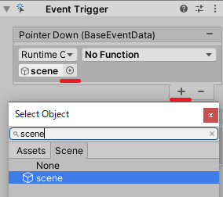

# Tutorial (Creating UI)

> The following is a list of functions of Cube class used in this chapter.

Method | Function
:--------|:--------|
Cube.PlayPresetSound | make a sound([Tutorial](tutorials_basic.md#4-make-a-sound))
Cube.Move | Move([Tutorial](tutorials_basic.md#3-move))
Cube.TurnOnLightWithScenario<br> Cube.LightOperation | Light up LED([Tutorial](tutorials_basic.md#5-light-up-led))

## Table of Contents
- [11. Creating UI](tutorials_UI.md#11-creating-ui)
    - [11.1. Creating Scenes](tutorials_UI.md#111-creating-scenes)
    - [11.2. Creating UI](tutorials_UI.md#112-creating-ui)
    - [11.3. Simultaneous display of simulator and UI](tutorials_UI.md#113-simultaneous-display-of-simulator-and-ui)
    - [11.4. Creating buttons and supporting their behavior](tutorials_UI.md#114-creating-buttons-and-supporting-their-behavior)

# 11. Creating UI

> The sample files can be found in "Assets/toio-sdk/Tutorials/1.Basic/ex.Sample_UI/".

In this tutorial, we will show you how to create UI that allows the user to manipulate and move Cube.
The final result on Simulator will look like this

<div align="center">

</div>

When run in Unity Editor, UI and simulator are displayed in parallel, and when run in the smartphone build, only UI is displayed on the smartphone screen.

> In Unity Editor, UI will be rotated 90 degrees to the right.

> Set the Default Orientation to Portrait in the project settings.

## 11.1. Creating Scenes
The first step is to create a scene.
This is the same as ["Creating Scenes"](tutorials_basic.md#2-creating-scenes) in the tutorial (Basic).

### How to arrange the stage

1. Click "File > New Scene" to create a new scene.
2. Remove "Main Camera" and "Directional Light" from the hierarchy.
3. Open the "Assets/toio-sdk/Scripts/Simulator/Resources" folder in the project window
4. Drag and drop "Cube" Prefab file and "Stage" Prefab file into the hierarchy.<br>
You can also move Cube object with the mouse in the scene.
5. Right-click on the hierarchy, click "Create Empty" from the right-click menu, and name it "scene".
6. Select "scene" object and click "Add Component" in the inspector.
7. Enter any script name (e.g. MyUIScript) to create a script.
8. Rewrite the script you have created with the sample code below. (The class name must be the same as the script file)

### Sample Code
```C#
using System.Collections.Generic;
using UnityEngine;
using toio;

// The file name and class name must match.
public class MyUIScript : MonoBehaviour
{
    CubeManager cubeManager;
    Cube cube;
    //Call Cube function
    async void Start()
    {
        cubeManager = new CubeManager();
        cube = await cubeManager.SingleConnect();
    }

    // Duration (durationMs): 0 for unlimited time, so it can be called once and keep running.
    // Order priority (order): Send a one-time instruction safely by setting Cube.ORDER_TYPE.
    // [Details]:
    // When the instruction priority is set to Strong, the system internally adds instructions to the instruction queue and sends them sequentially during the instruction available frame.
    // IsControllable(cube) before the instruction, but in this case, the priority of the instruction is set to Strong, so we do not call cubeManager. IsControllable(cube) and add it to the instruction queue.
    // IsControllable(cube), it will result in instruction loss instead of packet loss.

    //It corresponds to the control function of each operation and later to the button.
    public void Forward() { cube.Move(60, 60, durationMs:0, order:Cube.ORDER_TYPE.Strong); }
    public void Backward() { cube.Move(-40, -40, durationMs:0, order:Cube.ORDER_TYPE.Strong); }
    public void TurnRight() { cube.Move(60, 30, durationMs:0, order:Cube.ORDER_TYPE.Strong); }
    public void TurnLeft() { cube.Move(30, 60, durationMs:0, order:Cube.ORDER_TYPE.Strong); }
    public void Stop() { cube.Move(0, 0, durationMs:0, order:Cube.ORDER_TYPE.Strong); }
    public void PlayPresetSound1() { cube.PlayPresetSound(1); }
    public void PlayPresetSound2() { cube.PlayPresetSound(2); }
    public void LedOn()
    //Here is a function code that allows you to change the color by a trigonometric function. You can try any color you like, or just copy it.
    {
        List<Cube.LightOperation> scenario = new List<Cube.LightOperation>();
        float rad = (Mathf.Deg2Rad * (360.0f / 29.0f));
        for (int i = 0; i < 29; i++)
        {
            byte r = (byte)Mathf.Clamp((128 + (Mathf.Cos(rad * i) * 128)), 0, 255);
            byte g = (byte)Mathf.Clamp((128 + (Mathf.Sin(rad * i) * 128)), 0, 255);
            byte b = (byte)Mathf.Clamp(((Mathf.Abs(Mathf.Cos(rad * i) * 255))), 0, 255);
            scenario.Add(new Cube.LightOperation(100, r, g, b));
        }
        cube.TurnOnLightWithScenario(0, scenario.ToArray());
    }
    public void LedOff() { cube.TurnLedOff(); }
}
```

This completes the creation of the scene.
After all this work, the hierarchy and game view should look like the one below.

<div align="center">
<br>
<a align="center"><b>Hierarchy & Game View</b></a>
</div>


## 11.2. Creating UI
Next, let's create UI for manipulating Cube.

1. Right-click on the hierarchy, click "Create Empty" from the menu, and name it "UI".

2. (Optional) The EventSystem is already included in the Stage, so you don't need to create it yourself, but if you do, right-click on the hierarchy and select "UI -> Event System" to create it.

3. Create a canvas for UI.
    1. Select "UI" object, and from the right-click menu, click "UI -> Canvas" and name it "Canvas".
    2. Change "Layer" in "Canvas" inspector from "Default" to "UI".
    3. Set "UI Scale Mode" of "Canvas Scaler" component to "Scale with Screen Size", X to 720, Y to 1440, and "Match" to 1.

> By setting "Match" to 1, the size of UI will change depending on the height of the screen to fit.

<div  align="center">
</img>
</div>


4. Create a background.
    1. Select "Canvas" and click "UI -> Image" from the right-click menu. Name it "Image".
    2. Set the Position of the Rect Transform component in the Image inspector to all 0, the Width to 720, and the Height to 1440. Set the "Color" of the "Image" component to white.
5. Create a background for the control panel.
    1. Duplicate "Image". Give it the name "Image1".
    2. Set the "Position" of the "Rect Transform" component in the "Image1" inspector to "X:0, Y:400, Z:0", and the "Width" and "Height" to 500. Set the "Color" of the "Image" component to blue.

> Now we have the foundation for our UI.

<div  align="center">
</img>
</div>

## 11.3. Simultaneous display of simulator and UI
When built and run on a smart device, only UI is displayed on the screen of the smart phone and used as the control panel, but when run on a simulator, UI and Simulator screen must be displayed simultaneously as shown in the figure below.<br>
To achieve this, we will create a mechanism to move UI to the left side so that it can be viewed simultaneously on Simulator.

<div align="center">

</div>


1. Create a canvas for Simulator.
    1. Select the "UI" object and click "UI -> Canvas" from the right-click menu. Rename it to "SimCanvas".
    2. Select "SimCanvas" and change the "Layer" in the inspector from "Default" to "UI".
    3. Set the "Scale Factor" of the "Canvas Scaler" component to 0.8.

<div  align="center">
</img>
</div>

2. Select the "UI" object and click "Add Component" in the inspector.
3. Enter any script name (e.g. MySimUI) to create a script.
4. Rewrite the script you have created with the sample code below. (The class name must be the same as the script file)

### Sample Code
```C#
using UnityEngine;

public class MySimUI : MonoBehaviour
{
    #if UNITY_EDITOR
    private int updateCnt = 0;

    void Update()
    {
        if (updateCnt < 3) updateCnt++;
        if (updateCnt == 2){
            // Moving the camera to the left will move the simulation screen to the right.
            var localPos = Camera.main.transform.localPosition;
            localPos.x = -0.15f; // Amount of movement
            Camera.main.transform.localPosition = localPos;

            // Using the parent-child relationship with "SimCanvas", change the relative coordinates and move UI (Canvas) to the left.
            var canvasObj = GameObject.Find("Canvas");
            var simCanvasObj = GameObject.Find("SimCanvas");
            canvasObj.transform.SetParent(simCanvasObj.transform);
            // To fit UI and the simulation screen, the position of the canvas is set by the "Width" of 720 in the Inspector and the "Scale Factor" of 0.8 in SimCanvas.
            canvasObj.transform.position = new Vector3(
                720/2 * canvasObj.transform.localScale.x * 0.8f,
                canvasObj.transform.position.y,
                canvasObj.transform.position.z
            );
        }
    }
    #endif
}
```

The above script implements the following three things.
    1. Since this is a process that we want to execute only in Simulator, we have written the entire implementation of the class in "#if [UNITY_EDITOR](https://docs.unity3d.com/2019.4/Documentation/Manual/PlatformDependentCompilation.html)".
    2. The camera has been moved to the left because we want Simulator screen to be slightly to the right.
    3. Set the parent of [UI]-[Canvas] to [SimCanvas], and then move it to the left edge.(Using [Transform.SetParent](https://docs.unity3d.com/ScriptReference/Transform.SetParent.html))

## 11.4. Creating buttons and supporting their behavior
Finally, create each button for the control panel.

>  To ensure that the control panel is displayed correctly on the smart device, the text direction here will be rotated 90 degrees.

1. Select the "Canvas" object and click "UI->Button" from the right-click menu. Rename it to "Button0".
2. Set the "Width" and "Height" of the "Rect Transform" component in the inspector of Button0 to 150, and set the "Rotation" Z to -90.

3. Add an "Event Trigger" component that generates events from button operations, and tie the mouse button press behavior to the method you want to call.
    1. Click "Add Component" on the inspector and select "Event -> Event Trigger" in the list to add the "Event Trigger" component.
    2. Click "Add new event type" in the "Event Trigger" component and select "Pointer Down" in the list to add the event.
    3. Click ✙ under "Pointer Down" and then click ⦿ in the added list.
    4. Click on the "select object" window that appears after clicking on ⦿, click on the "scene" tab, and find and select the "scene" object from there.
    5. Similarly, add the "Pointer Up" event and select the "scene" object.

<div  align="center">
</img>
</div>


4. Copy "Button0" and paste it into "Button1" through "Button7".

5.  In the table below, we will set the properties of the eight buttons we have created.
    1. Click "No Function" in "Pointer Down" and "Pointer Up" of the "Event Trigger" component in the "Button*" inspector, and set each method under "MyUIScript(Script name set in [Create Scene](tutorials_UI.md#111-creating-scenes))".
    2. Select the "Text" child object of "Button*" from the hierarchy.
    3. Set the "Text" and "Font Size" of the "Text" component in the Inspector, respectively.

<div  align="center">
</img>
</div>

#### Set the properties of the button.

Button  | Rect Transform Position |Text  | Font size |Pointer Down  | Pointer up |
:--------|:--------:|:--------:|:--------:|---------|--------|
Button0  | X:0　　 Y:550|←| 72 | TurnLeft() | Stop() |
Button1  | X:150　 Y:400 |↑| 72 | Forward() | Stop() |
Button2  | X:0　　 Y:250 |→| 72 | TurnRight() | Stop() |
Button3  | X:-150　Y:400 |↓| 72 | Backward() | Stop() |
Button4  | X:0　　 Y:-200 |Led Off| 48 | LedOff()  | None(No Function) |
Button5  | X:150 　Y:-350 |Led On  | 48 | LedOn()  | None(No Function) |
Button6  | X:0 　　Y:-500 |Sound1 | 48 | PlayPresetSound1()  | None(No Function) |
Button7  | X:-150　Y:-350 |Sound2  | 48 | PlayPresetSound2()  | None(No Function) |


Up to this point, the creation of the button is complete. The hierarchy and game view should look like the one below.

<div  align="center">
</img>
</div>

The execution screen on Simulator and the screen on the smart device will look like the following.

| Simulator | Smart phone |
|:---:|:---:|
|


