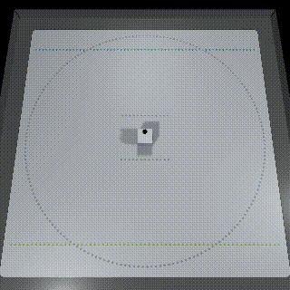
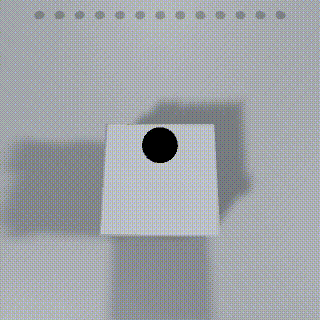
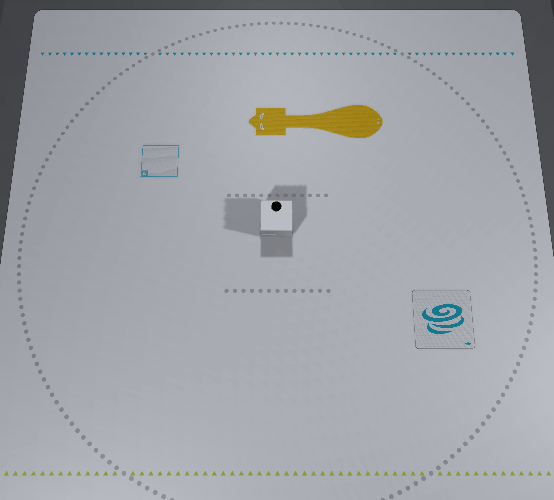
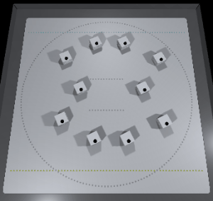
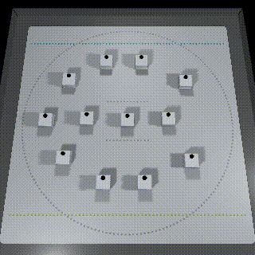

# Tutorial (Basic)

## Table of Contents

- [1. Overview](tutorials_basic.md#1-overview)
- [2. Creating Scenes](tutorials_basic.md#2-creating-scenes)
- [3. Move](tutorials_basic.md#3-move)
- [4. Make a sound](tutorials_basic.md#4-make-a-sound)
- [5. Light up LED](tutorials_basic.md#5-light-up-led)
- [6. Read toio ID(Position ID & Standard ID)](tutorials_basic.md#6-read-toio-idposition-id--standard-id)
- [7. Detect sensors' events](tutorials_basic.md#7-Detect-sensors-events)
- [8. Move multiple Cubes](tutorials_basic.md#8-move-multiple-cubes)
- [9. Simplifying the source code using CubeManager class](tutorials_basic.md#9-simplifying-the-source-code-using-cubemanager-class)
- [10. Connection/disconnection on the way](tutorials_basic.md#10-connectiondisconnection-on-the-way)

# 1. Overview

This SDK allows you to run toio™ Core Cube (Cube) in both simulator and smart device environments with the same source code.
The following explanations are based on the assumption that toio™ Core Cube runs in Simulator environment.


# 2. Creating Scenes

> The sample files for this chapter can be found in "Assets/toio-sdk/Tutorials/1.Basic/0.BasicScene/"<br>
> The web app sample for this chapter is [[here]](https://morikatron.github.io/t4u/basic/basic/).

<div align="center"></div>

### How to arrange the stage

You can build a basic environment by following the steps below.

1. Click "File > New Scene" to create a new scene.
2. Remove Main Camera and Directional Light from the hierarchy.
3. Open the "Assets/toio-sdk/Scripts/Simulator/Resources" folder in the project window.
4. Drag and drop Cube Prefab file and the Stage Prefab file into the hierarchy.<br>
   You can also move Cube object by switching to the Scene View and using the mouse.
5. Right-click on the hierarchy, click "Create Empty Object" from the right-click menu, and name it "scene" (you can name it whatever you want).
6. Select the "scene" object and click "Add Component" in the inspector.
7. Enter any script name (e.g. BasicScene) to create a script.
8. Rewrite the script you have created with the sample code below. (The class name must be the same as the script file)

After completing the above, press the Play button in the editor, and Cube should continue to rotate, just like the sample played at the end of [toio SDK for Unity Download](download_sdk.md).

### Sample Code

```csharp
using UnityEngine;
using toio;

// The file name and class name must match.
public class BasicScene : MonoBehaviour
{
    float intervalTime = 0.05f;
    float elapsedTime = 0;
    Cube cube;

    // Asynchronous initialization
    // Use the async/await keyword, a standard C# feature, to wait for the end of each search and connection
    // async: asynchronous keyword
    // await: wait keyword
    async void Start()
    {
      	// Search for Bluetooth devices
        var peripheral = await new NearestScanner().Scan();
       	// Connect to devices and generate Cube variables
        cube = await new CubeConnecter().Connect(peripheral);
    }

    void Update()
    {
        // Early return until Cube variable generation is complete
        if (null == cube) { return; }
        // Measure the elapsed time
        elapsedTime += Time.deltaTime;

      	// If more than 50 milliseconds have passed since the last command
        if (intervalTime < elapsedTime)
        {
            elapsedTime = 0.0f;
            // Left motor speed: 50, Right motor speed: -50, Control time: 200 msec
            cube.Move(50, -50, 200);
        }
    }
}
```

<br>

# 3. Move

> The sample files for this chapter are located in "Assets/toio-sdk/Tutorials/1.Basic/1.Move/".<br>
> The web app sample for this chapter is [[here]](https://morikatron.github.io/t4u/basic/move/).

<div align="center"></div>

Move method of Cube class can be used to control the motors of Cube.

```csharp
//--------------------------------------------------------
// Motor control with time specification
// https://toio.github.io/toio-spec/en/docs/ble_motor#motor-control-with-specified-duration
//--------------------------------------------------------

// left       | Left motor speed | Range (0~100)
// right      | Right motor speed | Range (0~100)
// durationMs | Duration | Range(0~2550)
// order      | Degree of relative priority | Type (Week, Strong)
cube.Move(int left, int right, int durationMs, ORDER_TYPE order=ORDER_TYPE.Weak);
```

Execution code

```csharp
// The file name and class name must match.
public class MoveScene : MonoBehaviour
{
    float intervalTime = 2.0f;
    float elapsedTime = 0;
    Cube cube;
    bool started = false;
    int phase = 0;

    async void Start()
    {
        var peripheral = await new NearestScanner().Scan();
        cube = await new CubeConnecter().Connect(peripheral);
        started = true;
    }

    void Update()
    {
        if (!started) return;

        elapsedTime += Time.deltaTime;
        if (intervalTime < elapsedTime) // Runs every 2 seconds
        {
            if (phase == 0)
            {
                Debug.Log("---------- Phase 0 - right-handed rotation ----------");
                // Right rotation: Left motor command 50, right motor command -50, duration 1500 ms
                cube.Move(50, -50, 1500);
            }
            else if (phase == 1)
            {
                Debug.Log("---------- Phase 1 - Advancement ----------");
                // Forward with MoveRaw: left motor command 20, right motor command 20, duration 1500ms
                cube.Move(20, 20, 1500);
            }
            else if (phase == 3)
            {
                Debug.Log("---------- Phase 3 - left-handed rotation ----------");
                // Forward with MoveRaw: left motor command 100, right motor command 70, duration 1000ms
                cube.Move(100, 70, 1800);
            }
            else if (phase == 4)
            {
                Debug.Log("---------- Phase 4 - Reversing ----------");
                // Move forward with MoveRaw: left motor command -100, right motor command -100, duration 500
                cube.Move(-100, -100, 500);
            }
            else if (phase == 5)
            {
                Debug.Log("---------- Phase 5 - Left-handed rotation ----------");
                // Forward by move: forward command -100, rotation command 100, (desired) duration 2000
                cube.Move(-100, 100, 2000);
            }
            else if (phase == 6)
            {
                Debug.Log("---------- [Reset] ----------");
                phase = -1;
            }

            elapsedTime = 0.0f;
            phase += 1;
        }
    }
}
```

<br>

# 4. Make a sound

> The sample files for this chapter can be found in "Assets/toio-sdk/Tutorials/1.Basic/2.Sound/".<br>
> The web app sample for this chapter is [[here]](https://morikatron.github.io/t4u/basic/sound/).

You can use PlayPresetSound method of Cube class to play a pre-prepared sound effect from Cube.
For more information about the sound effects available, see [[here]](https://toio.github.io/toio-spec/en/docs/ble_sound/#sound-effect-id).

```csharp
//--------------------------------------------------------
// Play sound effects
// https://toio.github.io/toio-spec/en/docs/ble_sound/#playing-sound-effects
//--------------------------------------------------------

// soundID | ID    | Range (0~10)
// volume  | Volume (sound) | Range (0~255)
// order   | Degree of relative priority | Type (Week, Strong)
cube.PlayPresetSound(int soundId, int volume=255, ORDER_TYPE order=ORDER_TYPE.Strong);
```

If you want to play an arbitrary sound, define the sound you want to play as an array in SoundOperation inner class of Cube class corresponding to the musical note, and play it using PlaySound method of Cube class.

```csharp
//--------------------------------------------------------
// Play MIDI note number
// https://toio.github.io/toio-spec/en/docs/ble_sound/#playing-the-midi-note-numbers
//--------------------------------------------------------

// durationMs  | Duration | Range(10~2550)
// volume      | Vlume (sound)　　 | Range (0~255)
// note_number | Music note　　 | Range (0~128)
new Cube.SoundOperation(int durationMs=0, byte volume=0, byte note_number=0);

// repeatCount | Number of repetitions | Range (0~255)
// operations  | Instruction array　　 | Number of pieces (1~59)
// order       | Priority　　　 | Type (Week, Strong)
cube.PlaySound(int repeatCount, SoundOperation[] operations, ORDER_TYPE order=ORDER_TYPE.Strong);
```

If you run Simulator in Unity, you will hear a sound.

Execution code

```csharp
// The file name and class name must match.
public class SoundScene : MonoBehaviour
{
    float intervalTime = 6.0f;
    float elapsedTime = 0;
    Cube cube;
    bool started = false;

    // Start is called before the first frame update
    async void Start()
    {
        var peripheral = await new NearestScanner().Scan();
        cube = await new CubeConnecter().Connect(peripheral);
        // Play the preset sound source first.
        cube.PlayPresetSound(0);
        started = true;
    }

    // Update is called once per frame
    void Update()
    {
        if (!started) return;

        elapsedTime += Time.deltaTime;
        if (intervalTime < elapsedTime) // Runs every 6 seconds
        {
            elapsedTime = 0.0f;

            // Create a frog song score
            List<Cube.SoundOperation> sound = new List<Cube.SoundOperation>();
            // Duration(milliseconds), Volume(0~100), Notes(0~128)
            sound.Add(new Cube.SoundOperation(durationMs:300, volume:15, note_number:Cube.NOTE_NUMBER.C6));
            sound.Add(new Cube.SoundOperation(durationMs:300, volume:15, note_number:Cube.NOTE_NUMBER.NO_SOUND));
            sound.Add(new Cube.SoundOperation(durationMs:300, volume:15, note_number:Cube.NOTE_NUMBER.C6));
            sound.Add(new Cube.SoundOperation(durationMs:300, volume:15, note_number:Cube.NOTE_NUMBER.NO_SOUND));
            sound.Add(new Cube.SoundOperation(durationMs:300, volume:15, note_number:Cube.NOTE_NUMBER.C6));
            sound.Add(new Cube.SoundOperation(durationMs:300, volume:15, note_number:Cube.NOTE_NUMBER.NO_SOUND));
            sound.Add(new Cube.SoundOperation(durationMs:300, volume:15, note_number:Cube.NOTE_NUMBER.C6));
            sound.Add(new Cube.SoundOperation(durationMs:300, volume:15, note_number:Cube.NOTE_NUMBER.NO_SOUND));
            sound.Add(new Cube.SoundOperation(durationMs:300, volume:15, note_number:Cube.NOTE_NUMBER.C6));
            sound.Add(new Cube.SoundOperation(durationMs:300, volume:15, note_number:Cube.NOTE_NUMBER.D6));
            sound.Add(new Cube.SoundOperation(durationMs:300, volume:15, note_number:Cube.NOTE_NUMBER.E6));
            sound.Add(new Cube.SoundOperation(durationMs:300, volume:15, note_number:Cube.NOTE_NUMBER.F6));
            sound.Add(new Cube.SoundOperation(durationMs:300, volume:15, note_number:Cube.NOTE_NUMBER.E6));
            sound.Add(new Cube.SoundOperation(durationMs:300, volume:15, note_number:Cube.NOTE_NUMBER.D6));
            sound.Add(new Cube.SoundOperation(durationMs:300, volume:15, note_number:Cube.NOTE_NUMBER.C6));
            // Play sheet music
            cube.PlaySound(1, sound.ToArray());
        }
    }
}
```

<br>

# 5. Light up LED

> The sample files for this chapter can be found in "Assets/toio-sdk/Tutorials/1.Basic/3.LED/"<br>
> The web app sample for this chapter is [[here]](https://morikatron.github.io/t4u/basic/led/).

<div align="center"></div>

The TurnLedOn method of Cube class can be used to control the LED on the bottom of Cube.

```csharp
//--------------------------------------------------------
// Turn on/off
// https://toio.github.io/toio-spec/en/docs/ble_light/#turning-the-indicator-on-and-off
//--------------------------------------------------------

// red   | Color Intensity | Range (0~255)
// green | Color Intensity | Range (0~255)
// blue  | Color Intensity | Range (0~255)
// durationMs | Duration | Range(10~2550)
// order | Priority　 | Type (Week, Strong)
cube.TurnLedOn(int red, int green, int blue, int durationMs, ORDER_TYPE order=ORDER_TYPE.Strong);
```

```csharp
//--------------------------------------------------------
// Continuous on/off
// https://toio.github.io/toio-spec/en/docs/ble_light/#repeated-turning-on-and-off-of-indicator
//--------------------------------------------------------

// durationMs | Duration | Range(10~2550)
// red        | Color Intensity | Range (0~255)
// green      | Color Intensity | Range (0~255)
// blue       | Color Intensity | Range (0~255)
new Cube.LightOperation(int durationMs = 0, byte red = 0, byte green = 0, byte blue = 0);

// repeatCount | Number of repetitions | Range (0~255)
// operations  | Instruction array　　 | Number of pieces (1~59)
// order       | Priority　　　 | Type (Week, Strong)
cube.TurnOnLightWithScenario(int repeatCount, Cube.LightOperation[] operations, ORDER_TYPE order=ORDER_TYPE.Strong)
```

Execution code

```csharp
// The file name and class name must match.
public class LEDScene : MonoBehaviour
{
    float intervalTime = 5.0f;
    float elapsedTime = 0;
    Cube cube;
    bool started = false;

    // Start is called before the first frame update
    async void Start()
    {
        var peripheral = await new NearestScanner().Scan();
        cube = await new CubeConnecter().Connect(peripheral);
        // First single flash instruction
        cube.TurnLedOn(255, 0, 0, 2000);
        started = true;
    }

    // Update is called once per frame
    void Update()
    {
        if (!started) return;

        elapsedTime += Time.deltaTime;

        if (intervalTime < elapsedTime) // Runs every 5 seconds
        {
            elapsedTime = 0.0f;
            // Emission scenario
            List<Cube.LightOperation> scenario = new List<Cube.LightOperation>();
            float rad = (Mathf.Deg2Rad * (360.0f / 29.0f));
            for (int i = 0; i < 29; i++)
            {
                byte r = (byte)Mathf.Clamp((128 + (Mathf.Cos(rad * i) * 128)), 0, 255);
                byte g = (byte)Mathf.Clamp((128 + (Mathf.Sin(rad * i) * 128)), 0, 255);
                byte b = (byte)Mathf.Clamp(((Mathf.Abs(Mathf.Cos(rad * i) * 255))), 0, 255);
                scenario.Add(new Cube.LightOperation(100, r, g, b));
            }
            cube.TurnOnLightWithScenario(3, scenario.ToArray());
        }
    }
}
```

<br>

# 6. Read toio ID(Position ID & Standard ID)

> The sample files for this chapter are located in "Assets/toio-sdk/Tutorials/1.Basic/4.toioID/".<br>
> The web app sample for this chapter is [[here]](https://morikatron.github.io/t4u/basic/toio_id/).

For more information about toio ID, see [toio™ Core Cube Technical Specifications](https://toio.github.io/toio-spec/en/docs/ble_id).

<div align="center"></div>

In the figure above, by placing Cube object at a different Standard ID, the LED color is switched and the intensity of the light emission is set by the y coordinate (vertical direction) on the mat.


toio ID can be read directly as a member variable of Cube class.
```csharp
public int x { get; }   // x-coordinate of Position ID
public int y { get; }   // y-coordinate of Position ID
public Vector2 pos { get; } // Position ID that has been converted to a 2D vector
public uint standardId { get; protected set; } // Standard ID
```
> There is other information that can be read directly, please refer to [Cube Class API](usage_cube.md#3-cube-class-api) in the documentation.

Execution code

```csharp
public class toioIDScene : MonoBehaviour
{
    float intervalTime = 0.1f;
    float elapsedTime = 0;
    Cube cube;
    bool started = false;

    async void Start()
    {
        var peripheral = await new NearestScanner().Scan();
        cube = await new CubeConnecter().Connect(peripheral);
        started = true;
    }

    void Update()
    {
        if (!started) return;

        elapsedTime += Time.deltaTime;

        if (intervalTime < elapsedTime) // Runs every 0.1 second.
        {
            elapsedTime = 0.0f;

            // Technique A: Determine the intensity of the emission by the y coordinate
            var strength = (510 - cube.y)/2;
            // Technique B: Determine the intensity of the luminescence at the x-coordinate
            // var strength = (510 - cube.x)/2;
            // Technique C: Determine the intensity of the emission by the distance between pos and the center
            // var strength = (int)(255 - (cube.pos-new Vector2(255,255)).magnitude);

            // Decide the color of the light emission according to the Standard ID (initial value is 0)
            if (cube.standardId == 3670337) // Simple Card "A"
                cube.TurnLedOn(strength, 0, 0, 0);
            else if (cube.standardId == 3670080) // toio collection skunk yellow
                cube.TurnLedOn(0, strength, 0, 0);
            else if (cube.standardId == 3670016) // toio collection card typhoon
                cube.TurnLedOn(0, 0, strength, 0);
            else cube.TurnLedOff();
        }
    }
}
```

<br>

# 7. Detect sensors' events

> The sample files for this chapter can be found in "Assets/toio-sdk/Tutorials/1.Basic/5.Event/"<br>
> The web app sample for this chapter is [[here]](https://morikatron.github.io/t4u/basic/event/).

In the following callbacks, you can describe what happens when a change occurs in Cube (an event is detected).
Each event conforms to toio™ Core Cube Technical Specification, so please refer to that for details.

- Button event: https://toio.github.io/toio-spec/en/docs/ble_button
- Tilt, collision, double-tap, posture, shake event: https://toio.github.io/toio-spec/en/docs/ble_sensor
- Coordinate angle, Standard ID event: https://toio.github.io/toio-spec/en/docs/ble_id
  - To detect this event, you need to move Cube on the mat or Standard ID.
- Motor speed event: https://toio.github.io/toio-spec/en/docs/ble_motor#obtaining-motor-speed-information
- Magnetic sensor events: https://toio.github.io/toio-spec/en/docs/ble_magnetic_sensor

```csharp
// Button event
// https://toio.github.io/toio-spec/en/docs/ble_button
cube.buttonCallback.AddListener("EventScene", OnPressButton);
// Tilt event
// https://toio.github.io/toio-spec/en/docs/ble_sensor/#horizontal-detection
cube.slopeCallback.AddListener("EventScene", OnSlope);
// Collision event
// https://toio.github.io/toio-spec/en/docs/ble_sensor/#collision-detection
cube.collisionCallback.AddListener("EventScene", OnCollision);
// Coordinate angle event
// https://toio.github.io/toio-spec/en/docs/ble_id#position-id
cube.idCallback.AddListener("EventScene", OnUpdateID);        // Update
cube.idMissedCallback.AddListener("EventScene", OnMissedID);  // Lost
// Standard ID Event
// https://toio.github.io/toio-spec/en/docs/ble_id#standard-id
cube.standardIdCallback.AddListener("EventScene", OnUpdateStandardID);       // Update
cube.standardIdMissedCallback.AddListener("EventScene", OnMissedStandardID); // Lost
// Posture event
// https://toio.github.io/toio-spec/docs/ble_sensor#posture-detection
cube.poseCallback.AddListener("EventScene", OnPose);
// Double tap event
// https://toio.github.io/toio-spec/docs/ble_sensor#double-tap-detection
cube.doubleTapCallback.AddListener("EventScene", OnDoubleTap);
// Shake event
// https://toio.github.io/toio-spec/docs/ble_sensor#shake-detection
cube.shakeCallback.AddListener("EventScene", OnShake);
// Motor speed event
// https://toio.github.io/toio-spec/docs/ble_motor#obtaining-motor-speed-information
cube.motorSpeedCallback.AddListener("EventScene", OnMotorSpeed);
// Magnet state event
// https://toio.github.io/toio-spec/docs/ble_magnetic_sensor#magnet-state
cube.magnetStateCallback.AddListener("EventScene", OnMagnetState);
// Magnetic force event
// https://toio.github.io/toio-spec/docs/ble_magnetic_sensor#magnetic-force-detection-
cube.magneticForceCallback.AddListener("EventScene", OnMagneticForce);
// Attitude event
// https://toio.github.io/toio-spec/docs/ble_high_precision_tilt_sensor
cube.attitudeCallback.AddListener("EventScene", OnAttitude);
```

Execution code

```csharp
// The file name and class name must match.
public class EventScene : MonoBehaviour
{
    float intervalTime = 0.05f;
    float elapsedTime = 0;
    Cube cube;
    bool showId = false;

    async void Start()
    {
        var peripheral = await new NearestScanner().Scan();
        cube = await new CubeConnecter().Connect(peripheral);
        // Callback Registration
        cube.buttonCallback.AddListener("EventScene", OnPressButton);
        cube.slopeCallback.AddListener("EventScene", OnSlope);
        cube.collisionCallback.AddListener("EventScene", OnCollision);
        cube.idCallback.AddListener("EventScene", OnUpdateID);
        cube.standardIdCallback.AddListener("EventScene", OnUpdateStandardID);
        cube.idMissedCallback.AddListener("EventScene", OnMissedID);
        cube.standardIdMissedCallback.AddListener("EventScene", OnMissedStandardID);
        cube.poseCallback.AddListener("EventScene", OnPose);
        cube.doubleTapCallback.AddListener("EventScene", OnDoubleTap);
        cube.shakeCallback.AddListener("EventScene", OnShake);
        cube.motorSpeedCallback.AddListener("EventScene", OnMotorSpeed);
        cube.magnetStateCallback.AddListener("EventScene", OnMagnetState);
        cube.magneticForceCallback.AddListener("EventScene", OnMagneticForce);
        cube.attitudeCallback.AddListener("EventScene", OnAttitude);

        // Enable sensors
        await cube.ConfigMotorRead(true);
        await cube.ConfigAttitudeSensor(Cube.AttitudeFormat.Eulers, 100, Cube.AttitudeNotificationType.OnChanged);
        await cube.ConfigMagneticSensor(Cube.MagneticMode.MagnetState);
    }


    void OnCollision(Cube c)
    {
        cube.PlayPresetSound(2);
    }

    void OnSlope(Cube c)
    {
        cube.PlayPresetSound(1);
    }

    void OnPressButton(Cube c)
    {
        if (c.isPressed)
        {
            showId = !showId;
        }
        cube.PlayPresetSound(0);
    }

    void OnUpdateID(Cube c)
    {
        if (showId)
        {
            Debug.LogFormat("pos=(x:{0}, y:{1}), angle={2}", c.pos.x, c.pos.y, c.angle);
        }
    }

    void OnUpdateStandardID(Cube c)
    {
        if (showId)
        {
            Debug.LogFormat("standardId:{0}, angle={1}", c.standardId, c.angle);
        }
    }

    void OnMissedID(Cube cube)
    {
        Debug.LogFormat("Postion ID Missed.");
    }

    void OnMissedStandardID(Cube c)
    {
        Debug.LogFormat("Standard ID Missed.");
    }

    void OnPose(Cube c)
    {
        Debug.Log($"pose = {c.pose.ToString()}");
    }

    void OnDoubleTap(Cube c)
    {
        c.PlayPresetSound(3);
    }

    void OnShake(Cube c)
    {
        if (c.shakeLevel > 5)
            c.PlayPresetSound(4);
    }

    void OnMotorSpeed(Cube c)
    {
        Debug.Log($"motor speed: left={c.leftSpeed}, right={c.rightSpeed}");
    }

    void OnMagnetState(Cube c)
    {
        Debug.Log($"magnet state: {c.magnetState.ToString()}");
    }

    void OnMagneticForce(Cube c)
    {
        Debug.Log($"magnetic force = {c.magneticForce}");
    }

    void OnAttitude(Cube c)
    {
        Debug.Log($"attitude = {c.eulers}");
    }
}
```

<br>

# 8. Move multiple Cubes

> The sample files for this chapter are located in "Assets/toio-sdk/Tutorials/1.Basic/6.MultiCube/".<br>
> The web app sample for this chapter is [[here]](https://morikatron.github.io/t4u/basic/multi_cube/).

<div align="center"></div>

In the previous sample code, we connected to a single cube.<br>
If you change the scanning part to the following code, you will be able to connect to multiple cubes.

```csharp
// Search up to 12 cubes
var peripherals = await new NearScanner(12).Scan();
// Connect to Cube you searched.
cubes = await new CubeConnecter().Connect(peripherals);
```

Execution code

```csharp
// The file name and class name must match.
public class MultiCubeScene : MonoBehaviour
{
    float intervalTime = 0.05f;
    float elapsedTime = 0;
    Cube[] cubes;
    bool started = false;

    async void Start()
    {
        var peripherals = await new NearScanner(12).Scan();
        cubes = await new CubeConnecter().Connect(peripherals);
        started = true;
    }

    void Update()
    {
        if (!started) { return; }

        elapsedTime += Time.deltaTime;
        if (intervalTime < elapsedTime)
        {
            elapsedTime = 0.0f;
            foreach(var cube in cubes)
            {
                cube.Move(60, 20, 200);
            }
        }
    }
}
```

<br>

# 9. Simplifying the source code using CubeManager class

> The sample files for this chapter are located in "Assets/toio-sdk/Tutorials/1.Basic/7.CubeManager/".

We have prepared the following samples so far.

- Scan and Connect
- Cube variable
- Initialization completion flag called started
- Time control variables

However, every time you create a toio™ program, you need to write similar code.

CubeManager class can be used to simplify these routine processes.

### Single unit connection

<div align="center"></div>

#### Before simplification

```csharp
public class CubeManagerScene_RawSingle : MonoBehaviour
{
    float intervalTime = 0.05f;
    float elapsedTime = 0;
    Cube cube;

    async void Start()
    {
        // When using the module directly:
        var peripheral = await new NearestScanner().Scan();
        cube = await new CubeConnecter().Connect(peripheral);
    }

    void Update()
    {
        // When using the module directly:
        if (null == cube) { return; }
        elapsedTime += Time.deltaTime;
        if (intervalTime < elapsedTime)
        {
            elapsedTime = 0.0f;
            cube.Move(50, -50, 200);
        }
    }
}
```

#### After simplification

```csharp
public class CubeManagerScene_Single : MonoBehaviour
{
    CubeManager cubeManager;
    Cube cube;

    async void Start()
    {
        // When a module is used indirectly from CubeManager:
        cubeManager = new CubeManager();
        cube = await cubeManager.SingleConnect();
    }

    void Update()
    {
        // When a module is used indirectly from CubeManager:
        if (cubeManager.IsControllable(cube))
        {
            cube.Move(50, -50, 200);
        }
    }
}
```

### Multiple connections

<div align="center"></div>

#### Before simplification

```csharp
public class CubeManagerScene_RawMulti : MonoBehaviour
{
    float intervalTime = 0.05f;
    float elapsedTime = 0;
    Cube[] cubes;
    bool started = false;

    async void Start()
    {
        // When using the module directly:
        var peripherals = await new NearScanner(12).Scan();
        cubes = await new CubeConnecter().Connect(peripherals);
        started = true;
    }

    void Update()
    {
        // When using the module directly:
        if (!started) { return; }
        elapsedTime += Time.deltaTime;
        if (intervalTime < elapsedTime)
        {
            elapsedTime = 0.0f;
            foreach(var cube in cubes)
            {
                cube.Move(50, -50, 200);
            }
        }
    }
}
```

#### After simplification

```csharp
public class CubeManagerScene_Multi : MonoBehaviour
{
    CubeManager cubeManager;

    async void Start()
    {
        // When a module is used indirectly from CubeManager:
        cubeManager = new CubeManager();
        await cubeManager.MultiConnect(12);
    }

    void Update()
    {
        // When a module is used indirectly from CubeManager:
        foreach(var cube in cubeManager.cubes)
        {
            if (cubeManager.IsControllable(cube))
            {
                cube.Move(50, -50, 200);
            }
        }
    }
}
```

### Disconnect and reconnect repeatedly

#### Before simplification

```csharp
public class CubeManagerScene_RawReconnect : MonoBehaviour
{
    float intervalTime = 0.05f;
    float elapsedTime = 0;
    Cube cube;
    CubeConnecter connecter;

    async void Start()
    {
        // If you use the module directly:
        var peripheral = await new NearestScanner().Scan();
        connecter = new CubeConnecter();
        cube = await connecter.Connect(peripheral);

        // Start a disconnect and reconnect loop.
        if (cube != null) StartCoroutine(LoopConnection());
    }

    IEnumerator LoopConnection()
    {
        yield return new WaitForSeconds(3);

        // Disconnection (when using the module directly)
        connecter.Disconnect(cube);
        yield return new WaitUntil(() => !cube.isConnected);
        yield return new WaitForSeconds(3);

        // Reconnect (when using the module directly)
        connecter.ReConnect(cube);
        yield return new WaitUntil(() => cube.isConnected);

        StartCoroutine(LoopConnection());
    }

    void Update()
    {
        // Rotation (when the module is used directly)
        if (null == cube) { return; }
        elapsedTime += Time.deltaTime;
        if (intervalTime < elapsedTime)
        {
            elapsedTime = 0.0f;
            cube.Move(50, -50, 200);
        }
    }
}
```

#### After simplification

```csharp
public class CubeManagerScene_Reconnect : MonoBehaviour
{
    CubeManager cubeManager;
    Cube cube;

    async void Start()
    {
        // If you use the module indirectly from CubeManager:
        cubeManager = new CubeManager();
        cube = await cubeManager.SingleConnect();

        // Start a disconnect and reconnect loop.
        if (cube != null) StartCoroutine(LoopConnection());
    }

    IEnumerator LoopConnection()
    {
        yield return new WaitForSeconds(3);

        // Disconnection (when CubeManager is used)
        cubeManager.DisconnectAll();    // ALT: cubeManager.Disconnect(cube);
        yield return new WaitUntil(() => !cube.isConnected);
        yield return new WaitForSeconds(3);

        // Reconnect (when CubeManager is used)
        cubeManager.ReConnectAll();     // ALT: cubeManager.ReConnect(cube);
        yield return new WaitUntil(() => cube.isConnected);

        StartCoroutine(LoopConnection());
    }

    void Update()
    {
        // If you use the module indirectly from CubeManager:
        if (cubeManager.IsControllable(cube))
        {
            cube.Move(50, -50, 200);
        }
    }
}
```

<br>

# 10. Connection/disconnection on the way

> The sample files for this chapter are located in "Assets/toio-sdk/Tutorials/1.Basic/7.CubeManager/".

Asynchronous search can be performed by calling ScanAsync method of NearScanner class.

```csharp
nearScanner.ScanAsync(coroutineObject, callback, autoRunning);
```

If you use NearScanner class directly, you will need to add various processes, but by executing the necessary processes inside CubeManager class, you can implement asynchronous connection/disconnection in an easy-to-understand manner.

```csharp
public class CubeManagerScene_MultiAsync : MonoBehaviour
{
    CubeManager cubeManager;

    async void Start()
    {
        cubeManager = new CubeManager();
        // Asynchronous connection at any time
        cubeManager.MultiConnectAsync(
            cubeNum:4,
            coroutineObject:this,
            connectedAction:OnConnected
        );
    }

    void Update()
    {
        foreach (var cube in cubeManager.cubes)
        {
            if (cubeManager.IsControllable(cube))
            {
                cube.Move(50, -50, 200);
            }
        }
    }

    void OnConnected(Cube cube, CONNECTION_STATUS status)
    {
        if (status.IsNewConnected)
        {
            Debug.Log("new-connected!!");
        }
        else if (status.IsReConnected)
        {
            Debug.Log("re-connected!!");
        }
    }
}
```
