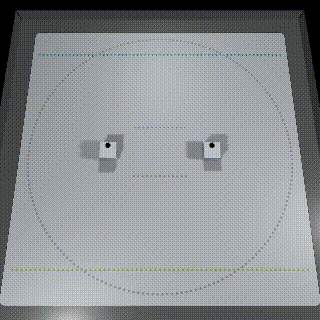
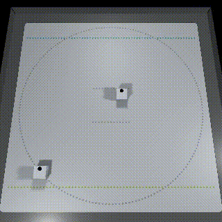
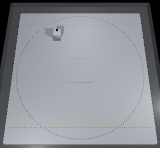
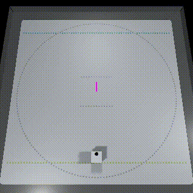

# Tutorial (CubeHandle)

## Table of Contents

- [1. Synchronized control of cubes using CubeManager](tutorials_cubehandle.md#1-synchronized-control-of-cubes-using-cubemanager)
- [2. CubeHandle](tutorials_cubehandle.md#2-cubehandle)
  - [2.1. Basic Settings](tutorials_cubehandle.md#21-Basic-Settings)
  - [2.2. CubeHandle's Move function and MoveRaw function](tutorials_cubehandle.md#22-cubehandles-move-function-and-moveraw-function)
  - [2.3. One-shot method to reduce the amount of communication with Cube](tutorials_cubehandle.md#23-one-shot-method-to-reduce-the-amount-of-communication-with-cube)
  - [2.4. Closed-Loop method to reach the specified coordinates/direction](tutorials_cubehandle.md#24-closed-loop-method-to-reach-the-specified-coordinatesdirection)
- [3. Follow TargetPole Demo](tutorials_cubehandle.md#3-follow-targetpole-demo)

## 1. Synchronized control of cubes using CubeManager

> The sample files for this chapter can be found in "Assets/toio-sdk/Tutorials/2.Advanced-CubeHandle/0.BasicScene/".<br>
> The web app sample for this chapter is [[here]](https://morikatron.github.io/t4u/cubehandle/basic/).

CubeManager described in the basic tutorial controls multiple cubes at arbitrary timing (asynchronous).<br>
This kind of asynchronous communication is sometimes a problem when controlling the movement of Cube, and there are times when you want to control Cube at a certain timing (synchronization) that you specify.

CubeManager provides a mechanism to perform such synchronization control.

### If you are controlling Cube asynchronously

CubeManager automatically creates CubeHandle from the connected Cube and puts it in the list of member variables.<br>
In the following sample code, the controllable state of CubeHandle held by CubeManager is checked in Update before controlling it.

```csharp
public class HandleBasic : MonoBehaviour
{
    CubeManager cubeManager;
    async void Start()
    {
        cubeManager = new CubeManager();
        await cubeManager.MultiConnect(2);
    }

    void Update()
    {
        foreach (var handle in cubeManager.handles)
        {
            // The timing (frame) to become controllable is different for each cube, i.e., asynchronous.
            if (cubeManager.IsControllable(handle))
            {
                handle.Update(); // For the asynchronous version, be sure to call this method.
                handle.MoveRaw(-50, 50, 1000);
            }
        }
    }
}
```

In this sample, everyone has their own controllable state, so it is "asynchronous".

### When controlling Cube with synchronization

If you do the following, all handles will be controlled by the same frame every 50ms.

```csharp
public class HandleBasic : MonoBehaviour
{
    CubeManager cubeManager;
    async void Start()
    {
        cubeManager = new CubeManager();
        await cubeManager.MultiConnect(2);
    }

    void Update()
    {
        // Synchronization
        if (cubeManager.synced)
        {
            // Update of handle is also done internally when synced is called.
            // Individual handles can be manipulated.
            cubeManager.handles[0].MoveRaw(-50, 50, 1000);
        }
    }
}
```

The above simply synchronizes and manipulates each handle individually.

If you want to move all handles at once, it is useful to use syncHandles.

```csharp
public class HandleBasic : MonoBehaviour
{
    CubeManager cubeManager;
    async void Start()
    {
        cubeManager = new CubeManager();
        await cubeManager.MultiConnect(2);
    }

    void Update()
    {
        // When all cubes are controllable, syncHandles provides the handles
        foreach (var handle in cubeManager.syncHandles)
        {
            // Update of handle is also done internally when syncHandles is called.
            handle.MoveRaw(-50, 50, 1000);
        }
    }
}
```

## 2. CubeHandle

Cube class, which controlled the movement of Cube in the basic tutorial, is a class that provides basic functions according to the [toio™ Core Cube Technical Specification](https://toio.github.io/toio-spec/), and Cube movement is controlled by the left and right motors.
Since it is very difficult to perform complex movement by only controlling such a motor, toio SDK for Unity provides CubeHandle class that makes cube movement control easier to handle.

CubeHandle class provides the following movement control.

- Movement is controlled by specifying the amount of forward movement and rotation.
- Move a specified distance and rotate a specified angle with a single command.
- Move a specified distance and rotate a specified angle with a single command.

For more information on CubeHandle, see [[here]](cubehandle.md).

### 2.1. Basic Settings

> If you are using the "Play mat (sumo ring)", settings are not mandatory, so feel free to proceed directly to the next section.

#### Border

CubeHandle can automatically limit the output to the cube's motor to prevent it from going beyond the border. The border can be set as follows:

```csharp
cubeHandle.borderRect = new RectInt(65, 65, 370, 370);
```

The default value is `RectInt(65, 65, 370, 370)`, which corresponds to the "Play mat (sumo ring)", so be sure to set it if you are using a different mat.

If the cube gets stuck on (goes beyond) the border, it cannot move forward towards the outside of the border, but it can rotate. If you make the cube move towards the inside of the border before moving forward, you can bring it back inside the border.

#### Delay

CubeHandle calculates to eliminate the impact considering communication delay. If you want to improve control accuracy, it's crucial to measure and set the delay value. The `lag` variable of CubeHandle is set to the value that combines the delay when obtaining information from the cube and the delay from sending motor commands until the cube receives them.

```csharp
cubeHandle.lag = 0.13;  // seconds
```


### 2.2. CubeHandle's Move function and MoveRaw function

> The sample files for this chapter can be found in "Assets/toio-sdk/Tutorials/2.Advanced-CubeHandle/1.MoveScene/".<br>
> The web app sample for this chapter is [[here]](https://morikatron.github.io/t4u/cubehandle/move/).

Move function of Cube class controls the movement of Cube by specifying the output of the left and right motors.
On the other hand, the Move function of CubeHandle class uses the method of specifying the amount of straight ahead + rotation to make it more intuitive.<br>
In addition, the following functions are also available.

- If the amount of movement is so small that Cube's motor does not rotate (this range is called the dead zone), replace the input in the dead zone with the nearest valid input
- Predict the future trajectory and limit the duration to prevent Cube from moving out of the specified range (border).

```csharp
public Movement Move(
    double translate,           // Advance indication value
    double rotate,              // Rotation indication value
    int durationMs = 1000,      // Duration time (ms)
    bool deadzoneBias = false,  // Dead zone processing methods
    bool border = true,         // With or without border restrictions
    Cube.ORDER_TYPE order = Cube.ORDER_TYPE.Weak    // Priority of instructions
    );
// Execute the Movement
public Movement Move(Movement mv, bool border = true);
// Rewrite the duration of the Movement and execute it.
public Movement Move(Movement mv, int durationMs, bool border = true);
// Rewrite the priority of Movement and execute it.
public Movement Move(Movement mv, Cube.ORDER_TYPE order, bool border = true);
// Rewrite the duration and priority of the Movement and execute it.
public Movement Move(Movement mv, int durationMs, Cube.ORDER_TYPE order, bool border = true);
```

MoveRaw is also provided as a function equivalent to the Move function of Cube class.

```csharp
// uL Indicated value of left motor, uR Indicated value of right motor, durationMs Duration time (ms), order Priority of indication
public void MoveRaw(double uL, double uR, int durationMs = 1000, Cube.ORDER_TYPE order = Cube.ORDER_TYPE.Weak);
```

The following is sample code using the Move function and MoveRaw function.

<div align="center"></div>

```csharp
void Update()
{
    elapsedTime += Time.deltaTime;
    if (1.7f < elapsedTime)
    {
        cubeManager.handles[0].Update();
        cubeManager.handles[1].Update();

        if (phase == 0)
        {
            Debug.Log("---------- Phase 0 - Right-handed rotation ----------");

            // Right rotation with MoveRaw: Left motor command 50, right motor command -50, duration 560
            cubeManager.handles[0].MoveRaw(50, -50, 560);
            // Right rotation by move: forward command 0, rotation command 50, (desired) duration 560
            cubeManager.handles[1].Move(0, 100, 560);
        }
        else if (phase == 1)
        {
            Debug.Log("---------- Phase 1 - Move forward ----------");

            cubeManager.handles[0].MoveRaw(80, 80, 600);
            cubeManager.handles[1].Move(80, 0, 600);
        }
        else if (phase == 2)
        {
            Debug.Log("---------- Phase 2 - Dealing with dead zones ----------");
            // MoveRaw and move have different input representations; move is more intuitive.
            // MoveRaw passes almost verbatim input to Cube.move,
            // However, MOVE is doing [dead zone handling] and [border restriction].

            cubeManager.handles[0].MoveRaw(-9, 1, 100);
            cubeManager.handles[1].Move(-4, -10, 100);
        }
        else if (phase == 3)
        {
            Debug.Log("---------- Phase 3 - Border ----------");
            // The green Cube stopped before the border.

            cubeManager.handles[0].MoveRaw(100, 100, 1000);
            cubeManager.handles[1].Move(100, 0, 1000);
        }
        else if (phase == 4)
        {
            Debug.Log("---------- Phase 4 - Border ----------");
            // Border restriction works even in the case of recession and rotation by limiting the duration through a predictive model.

            cubeManager.handles[1].Move(-80, 30, 2000);
        }

        elapsedTime = 0.0f; phase += 1;
    }
}
```

Each time the Move and MoveRaw functions of CubeHandle class are called, it sends a command to Cube to move via communication, and the received Cube moves according to the command.<br>
CubeHandle also outputs a Movement class that handles movement commands, and executes the Exec function on it.

```csharp
// Moving with Movement
Movement mv = handle.HogeMethod(...);
mv.Exec();

// Move using CubeHandle.
handle.Move(mv);
```

### 2.3. One-shot method to reduce the amount of communication with Cube

> The sample files for this chapter are located in "Assets/toio-sdk/Tutorials/2.Advanced-CubeHandle/2.OneShotScene/".<br>
> The web app sample for this chapter is [[here]](https://morikatron.github.io/t4u/cubehandle/oneshot/).

The closed-loop method of CubeHandle class (explained below) is supposed to be executed repeatedly to reach the goal.
Since each time the process is executed, it will be in Bluetooth communication with Cube, so blinking the LED or playing a sound while moving will require too much communication.

The One-shot method is a solution to this problem, as it requires only one call to reach the target, thus reducing the amount of communication required to make the move.<br>
(This is Open-Loop, so there is no guarantee of results.)

There are three methods of this type：

- TranslateByDist(dist, translate) … Speed command to advance the specified distance.
- RotateByDeg(Deg, rotate) … Rotate the specified angle (degree) with the rotation command.
- RotateByRad(Rad, rotate) … Rotate the specified angle (arc degree) with a rotation command.

```csharp
// dist Distance、translate Advance indication value
public Movement TranslateByDist(double dist, double translate);
// drad Angle (degree of arc), rotate Rotation indication value
public Movement RotateByRad(double drad, double rotate);
// drad Angle (degree), rotate Rotation indication value
public Movement RotateByDeg(double ddeg, double rotate);
```

Since the One-Shot method returns a Movement instance, use the Exec function of the Movement class or the Move function of CubeHandle class to move Cube.

The following is an example of using the One-Shot method to draw a square by repeatedly moving forward 100 distances and rotating 90 degrees at 2-second intervals.

<div align="center"></div>

```csharp
private float elapsedTime = 1.5f;
private int phase = 0;

void Update()
{
    elapsedTime += Time.deltaTime;

    if (2f < elapsedTime) // Every 2 seconds
    {
        cubeManager.handles[0].Update();
        cubeManager.handles[1].Update();

        if (phase == 0)
        {
            // Phase 0: Advance 100 meters.
            cubeManager.handles[0].TranslateByDist(dist:100, translate:40).Exec();
            cubeManager.handles[1].TranslateByDist(dist:100, translate:80).Exec();//Try changing the speed.
        }
        else if (phase == 1)
        {
            // Phase 1: Rotate 90 degrees
            cubeManager.handles[0].RotateByDeg(deg:90, rotate:40).Exec();
            cubeManager.handles[1].RotateByRad(Mathf.PI/2, 20).Exec();//Can be specified in terms of degree of arc
            phase = -1;
        }

        elapsedTime = 0.0f; phase += 1;
    }
}
```

### 2.4. Closed-Loop method to reach the specified coordinates/direction

> The sample files for this chapter are located in "Assets/toio-sdk/Tutorials/2.Advanced-CubeHandle/3.ToTargetScene/".<br>
> The web app sample for this chapter is [[here]](https://morikatron.github.io/t4u/cubehandle/to_target/).

Closed-Loop method is used to reach the specified coordinates and direction of the mat by continuing to execute it repeatedly.

- Move2Target(...) … Move to target coordinates
- Rotate2Target(...) … Rotate to target coordinates
- Rotate2Deg(...) … Rotate to target absolute angle (degrees)
- Rotate2Rad(...) … Rotate to target absolute angle (arc degree)

This type of method needs to be called every frame until the target is reached.

```csharp
public Movement Move2Target(
    double tarX,            // Target coordinate x
    double tarY,            // Target coordinate y
    double maxSpd = 50,     // Maximum speed indication value
    int rotateTime = 250,   // Desired rotation time (ms)
    double tolerance = 8    // Threshold of arrival judgment
    );
// tarRad Specified angle (degree of arc), tolerance Threshold of arrival judgment (arc degree), rotateTime Desired rotation time (ms)
public Movement Rotate2Rad(double tarRad, double tolerance = 0.15, int rotateTime = 400);
// tarDeg Specified angle (degree), tolerance Threshold of arrival judgment (degrees), rotateTime Desired rotation time (ms)
public Movement Rotate2Deg(double tarDeg, double tolerance = 5, int rotateTime = 400);
// tarX, tarY Specified coordinate, tolerance Threshold of arrival judgment (arc degree), rotateTime Desired rotation time (ms)
public Movement Rotate2Target(double tarX, double tarY, double tolerance = 0.1, int rotateTime = 400);
```

Closed-Loop method returns a Movement instance, so you can use the Exec function of the Movement class or the Move function of CubeHandle class to move Cube.

#### Example 1: Move to the specified coordinates

If you simply want to move to the target coordinates, it can be done very simply.

```csharp
void Update()
{
    foreach (var handle in cubeManager.syncHandles)
    {
        handle.Move2Target(250, 250).Exec();
    }
}
```

#### Example 2: Move to the specified coordinates and then turn to the -90 degree direction of the mat

Exec function of Movement class returns Movement instance that was actually executed.<br>
This instance also contains information about whether functions such as Move2Target have reached their targets.

In the following example, we are heading to the first specified coordinate, and when we reach the target coordinate, we change the process and rotate Cube in the -90° direction of the mat.

<div align="center"></div>

```csharp
void Update()
{
    foreach (var handle in cubeManager.syncHandles)
    {
        if (phase == 0)
        {
            Movement mv = handle.Move2Target(250, 250).Exec();

            // Once the goal is achieved, move on to the next phase.
            if (mv.reached) phase = 1;
        }
        else if (phase == 1)
        {
            Movement mv = handle.Rotate2Deg(-90).Exec();
            // or equally use Rotate2Rad(-Mathf.PI/2) or Rotate2Target(handle.x, 0)
        }
    }
}
```

## 3. Follow TargetPole Demo

> ※ The sample files for this chapter can be found in "Assets/toio-sdk/Tutorials/2.Advanced-CubeHandle/ex.FollowTargetPole/".<br>
> The web app sample for this chapter is [[here]](https://morikatron.github.io/t4u/cubehandle/follow_target_pole/).

Using the features we have described so far, let's try to control Cube by using the TargetPole feature of Stage (a virtual destination that can be used in Simulator) by holding down `Ctrl and pressing the right mouse button`.

<div align="center"></div>

First, get the Stage.

```csharp
Stage stage;
void Start()
{
    ...
    stage = GameObject.FindObjectOfType<Stage>();
}
```

Next, get the mat coordinates of the TargetPole and set them to the Move2Target function of CubeHandle class.

```csharp
void Update()
{
    foreach (var handle in cubeManager.syncHandles)
    {
        Movement mv = handle.Move2Target(stage.targetPoleCoord).Exec();
    }
}
```

Now, when you move the Stage's TargetPole (by dragging it with the mouse), Cube should follow it.
