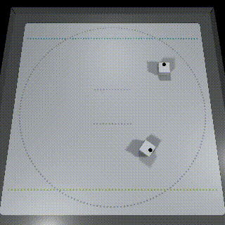
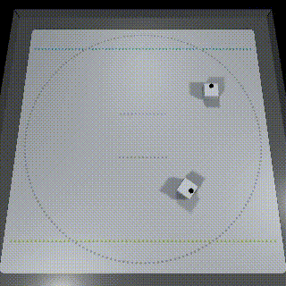
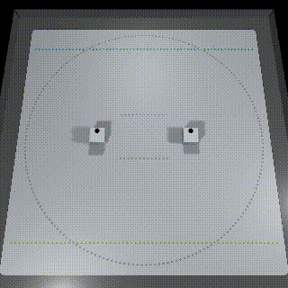
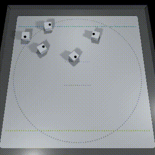
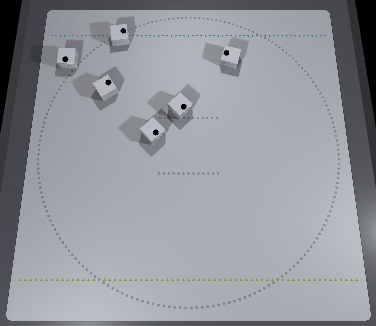
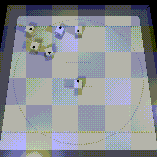

# Tutorial (CubeNavigator)

## Table of Contents

- [1. CubeNavigator](tutorials_navigator.md#1-cubenavigator)
  - [1.1. Using CubeManager with CubeNavigator](tutorials_navigator.md#11-using-cubemanager-with-cubenavigator)
    - [1.1.1. Want to control Cube asynchronously](tutorials_navigator.md#111-want-to-control-cube-asynchronously)
    - [1.1.2. Want to control Cube synchronously](tutorials_navigator.md#112-want-to-control-cube-synchronously)
    - [1.1.3. Using CubeNavigator without CubeManager](tutorials_navigator.md#113-using-cubenavigator-without-cubemanager)
  - [1.2. Avoiding Collisions with CubeNavigator](tutorials_navigator.md#12-avoiding-collisions-with-cubenavigator)
    - [1.2.1. Navi2Target function to move to the target while avoiding collision](tutorials_navigator.md#121-navi2target-function-to-move-to-the-target-while-avoiding-collision)
    - [1.2.2. Move away from the target NaviAwayTarget function](tutorials_navigator.md#121-navi2target-function-to-move-to-the-target-while-avoiding-collision)
  - [1.3. Population Control with Boids](tutorials_navigator.md#13-population-control-with-boids)
  - [1.4. Boids + Conflict Avoidance](tutorials_navigator.md#14-boids--conflict-avoidance)

# 1. CubeNavigator

By using CubeNavigator, multiple Cubes can be successfully moved all together while taking each other's movements into account.

For more information about CubeNavigator, click [here](usage_navigator.md).

## 1.1. Using CubeManager with CubeNavigator

> The sample files for this chapter can be found in "Assets/toio-sdk/Tutorials/2.Advanced-Navigator/0.BasicScene/".<br>
> The web app sample for this chapter is [[here]](https://morikatron.github.io/t4u/navi/basic/).

CubeNavigator is automatically created by CubeManager when Cube is connected and put in the list of member variables.

### 1.1.1. Want to control Cube asynchronously

In the following sample code, CubeNavigator is controlled after confirming its controllable status in Update.

```csharp
public class NavigatorBasic : MonoBehaviour
{
    CubeManager cubeManager;
    async void Start()
    {
        cubeManager = new CubeManager();
        await cubeManager.MultiConnect(2);
    }

    void Update()
    {
        foreach (var navigator in cubeManager.navigators)
        {
            // The timing (frame) at which it becomes controllable is per Cube. In other words, it is asynchronous.
            if (cubeManager.IsControllable(navigator))
            {
                navigator.Update(); // For the asynchronous version, be sure to call this method.
                navigator.handle.MoveRaw(-50, 50, 1000);
            }
        }
    }
}
```

Since everyone's controllable state is different, it is "asynchronous".

### 1.1.2. Want to control Cube synchronously

If you do the following, all navigator will be controlled by the same frame every 50ms.

```csharp
public class NavigatorBasic : MonoBehaviour
{
    CubeManager cubeManager;
    void Start()
    {
        cubeManager = new CubeManager();
        cubeManager.MultiConnect(2);
    }

    void Update()
    {
        // Synchronization
        if (cubeManager.synced)
        {
            // Update of navigator is also done internally when synced is called.
            // Individual navigator can be controlled.
            cubeManager.navigators[0].handle.MoveRaw(-50, 50, 1000);
        }
    }
}
```

The above is simply synchronizing and operating each navigator individually.

If you want to run all navigator at the same time, syncNavigators is useful.

```csharp
public class NavigatorBasic : MonoBehaviour
{
    CubeManager cubeManager;
    async void Start()
    {
        cubeManager = new CubeManager();
        await cubeManager.MultiConnect(2);
    }

    void Update()
    {
        // Once all Cubes are controllable, syncNavigators provides navigators
        foreach (var navigator in cubeManager.syncNavigators)
        {
            // Update of navigator is also done internally when syncNavigators is called.
            navigator.handle.MoveRaw(-50, 50, 1000);
        }
    }
}
```

### 1.1.3. Using CubeNavigator without CubeManager

If you do not use CubeManager, create CubeNavigator instance using Cube class as shown below.

```csharp
public class NavigatorBasic : MonoBehaviour
{
    float intervalTime = 0.05f;
    float elapsedTime = 0;
    List<CubeNavigator> navigators;
    bool started = false;

    async void Start()
    {
        var peripheral = await new NearScanner(2).Scan();
        var cubes = await new CubeConnecter().Connect(peripheral);

        // create navigators
        this.navigators = new List<CubeNavigator>();
        foreach (var cube in cubes)
            // create navigator and add to navigators
            this.navigators.Add(new CubeNavigator(cube));

        this.started = true;
    }

    void Update()
    {
        if (!started) return;

        elapsedTime += Time.deltaTime;

        if (intervalTime < elapsedTime)
        {
            foreach (var navigator in this.navigators)
                // update state of navigator (including internal handle)
                navigator.Update();

            foreach (var navigator in this.navigators)
                // use internal handle to rotate cube
                navigator.handle.MoveRaw(-50, 50, 1000);

            elapsedTime = 0.0f;
        }
    }
}
```

## 1.2. Avoiding Collisions with CubeNavigator

### 1.2.1. Navi2Target function to move to the target while avoiding collision

> ※ The sample files for this chapter can be found in "Assets/toio-sdk/Tutorials/2.Advanced-Navigator/1.Navi2TargetScene/".<br>
> The web app sample for this chapter is [[here]](https://morikatron.github.io/t4u/navi/navi2target/).

To move Cube to the target while avoiding collisions, use Navi2Target function.<br>
This function corresponds to the Move2Target function of CubeHandle class.

```csharp
// x,y Target coordinates, maxSpd Maximum speed, rotateTime Desired rotation time(Reference to CubeHandle usage), tolerance Achieved threshold(Distance to target)
public virtual Movement Navi2Target(double x, double y, int maxSpd=70, int rotateTime=250, double tolerance=20);
```

#### Example 1: Set target coordinates to make two Cubes reciprocate in intersecting directions

In the following example, we have two Cubes moving back and forth, avoiding each other.

<div align="center"></div>

```csharp
public class NavigatorHLAvoid : MonoBehaviour
{
    CubeManager cubeManager;
    void Start()
    {
        cubeManager = new CubeManager();
        cubeManager.MultiConnect(2);
    }

    int navigator0_phase = 0; int navigator1_phase = 0;
    void Update()
    {
        if (cubeManager.synced)
        {
            // navigator 0
            {
                if (navigator0_phase == 0){
                    var mv = cubeManager.navigators[0].Navi2Target(200, 200, maxSpd:50).Exec();
                    if (mv.reached) navigator0_phase = 1;
                }
                else if (navigator0_phase == 1){
                    var mv = cubeManager.navigators[0].Navi2Target(350, 350, maxSpd:50).Exec();
                    if (mv.reached) navigator0_phase = 0;
                }
            }

            // navigator 1
            {
                if (navigator1_phase == 0){
                    var mv = cubeManager.navigators[1].Navi2Target(180, 350).Exec();
                    if (mv.reached) navigator1_phase = 1;
                }
                else if (navigator1_phase == 1){
                    var mv = cubeManager.navigators[1].Navi2Target(330, 180).Exec();
                    if (mv.reached) navigator1_phase = 0;
                }
            }
        }
    }
}
```

#### Example 2: Make one cube ignore the other

By changing the initialization settings, it is also possible to prevent certain Cubes from avoiding collisions.

```csharp
// Methods of CubeNavigator
// Delete all recognizable objects.
public void ClearOther();
```

In the following example, we change the initialization settings in Example 1 so that one cube ignores the other.

<div align="center"></div>

```csharp
async void Start()
{
    cubeManager = new CubeManager();
    await cubeManager.MultiConnect(2);

    // By default, each navigator is able to see all others
    // But you can also manually make a navigator "blind"
    cubeManager.navigators[0].ClearOther();
}
```

> In this example, the lag makes the avoidance a bit unnatural.

#### Example 3: Change the initialization settings in Example 2 to use prediction to reduce the impact of lag

In addition, by changing the initialization settings, you can predict the movement of Cube and reduce the effect of lag to make collision avoidance more natural.<br>

```csharp
// CubeNavigator Member Variables
public bool usePred = false;    // Whether to use CubeHandle predictions
```

The following example uses prediction to reduce the effect of lag by changing the initialization settings in Example 2.

<div align="center"></div>

```csharp
async void Start()
{
    cubeManager = new CubeManager();
    await cubeManager.MultiConnect(2);

    cubeManager.navigators[0].ClearOther();

    // use prediction
    cubeManager.navigators[1].usePred = true;
}
```

### 1.2.2. Move away from the target NaviAwayTarget function

> The sample files for this chapter can be found in "Assets/toio-sdk/Tutorials/2.Advanced-Navigator/2.NaviAwayTargetScene/".<br>
> The web app sample for this chapter is [[here]](https://morikatron.github.io/t4u/navi/navi_away_target/).

With the NaviAwayTarget function, Cube will move away from the target in the opposite direction of the Navi2Target function。<br>
(Move to the farthest point in Cube's field of view.)

```csharp
public virtual Movement NaviAwayTarget(double x, double y, int maxSpd=70, int rotateTime=250);
```

#### Example: playing tag

In the following example, two Cubes are "playing tag".<br>
Cube 0 will chase Cube 1, and Cube 1 will move to escape Cube 0.

In this example, we call the ClearOther function to avoid collision avoidance, because collision avoidance is not a game of tag (you can't catch them).

<div align="center"></div>

```csharp
public class NaviAwayTargetTutorial : MonoBehaviour
{
    CubeManager cubeManager;

    async void Start()
    {
        cubeManager = new CubeManager();
        await cubeManager.MultiConnect(2);
        Debug.Assert(cubeManager.navigators.Count>1, "Need at least 2 cubes.");

        // By default, each navigator is able to see all others
        // But you can also manually make a navigator "blind"
        cubeManager.navigators[0].ClearOther();
        cubeManager.navigators[1].ClearOther();
    }

    void Update()
    {
        if (cubeManager.synced)
        {
            var navi0 = cubeManager.navigators[0];
            var navi1 = cubeManager.navigators[1];

            // navigator 0
            navi0.Navi2Target(navi1.handle.pos, maxSpd:50).Exec();

            // navigator 1
            navi1.NaviAwayTarget(navi0.handle.pos, maxSpd:80).Exec();
        }
    }
}
```

### 1.3. Population Control with Boids

> The sample files for this chapter can be found in "Assets/toio-sdk/Tutorials/2.Advanced-Navigator/3.BoidsScene/".<br>
> The web app sample for this chapter is [[here]](https://morikatron.github.io/t4u/navi/boids/).

"Boids" is an algorithm that simulates the collective behavior of birds and allows Cubes to move as a flock while maintaining a certain distance from each other.

#### Example 1: Moving multiple Cubes together as a Boids

By default, CubeNavigator class is set to only perform collision avoidance.<br>
In order to control by Boids, you need to change this setting first.

Please change the mode member variable of CubeNavigator class from the specified value (AVOID: collision avoidance only) to BOIDS.

```csharp
// Mode of Navigator
public enum Mode : byte
{
    AVOID = 0,
    BOIDS = 1,
    BOIDS_AVOID = 2,
}
// Member Variables of Navigator
public Mode mode = Mode.AVOID;
```

In the following example, multiple Cubes move together as Boids.

<div align="center"></div>

```csharp
public class BoidsTutorial : MonoBehaviour
{
    CubeManager cubeManager;
    async void Start()
    {
        cubeManager = new CubeManager();
        await cubeManager.MultiConnect(5);

        // set to BOIDS only mode
        foreach (var navi in cubeManager.navigators)
            navi.mode = CubeNavigator.Mode.BOIDS;
    }

    void Update()
    {
        // ------ Sync ------
        foreach (var navigator in cubeManager.syncNavigators)
        {
            var mv = navigator.Navi2Target(400, 400, maxSpd:50).Exec();
        }
    }
}
```

> The scattered Cubes were able to swarm together and head for the target together, but they were not stopping well.

#### Example 2: Add Cubes that are not Boids to make them act more like a herd

By adding Cube that is not Boids as a comparison, you can represent the effect of several other individuals acting in a swarm.

By default, all Cubes are recognized as belonging to the same group of Boids, so we need to use the SetRelation function of CubeNavigator class to exclude certain individuals from Boids.

```csharp
// Methods of CubeNavigator
// Set up recognition for others.
public void SetRelation(List<CubeNavigator> others, Relation relation);
public void SetRelation(List<Navigator> others, Relation relation);
public void SetRelation(Navigator other, Relation relation);
```

The following is an example of adding Cube that is not Boids and making it act.<br>
For convenience of explanation, the LEDs of Cubes that are not Boids are lit red, and the other Cubes are lit green.

<div align="center"></div>

```csharp
async void Start()
{
    cubeManager = new CubeManager();
    await cubeManager.MultiConnect(6);
    Debug.Assert(cubeManager.navigators.Count>1, "Need at least 2 cubes.");

    // Choose 1 cube not to be of boids
    CubeNavigator navigatorNotBoids = cubeManager.navigators[0];
#if UNITY_EDITOR
    foreach (var navigator in cubeManager.navigators)
        if ((navigator.cube as CubeUnity).objName == "Cube Not Boids")
            navigatorNotBoids = navigator;
#endif

    // Use LED color to distinguish cubes
    foreach (var navigator in cubeManager.navigators)
    {
        if (navigator == navigatorNotBoids) navigator.cube.TurnLedOn(255,0,0,0); // Red
        else navigator.cube.TurnLedOn(0,255,0,0);  // Green
    }

    // Set to BOIDS only mode, except navigatorNotBoids
    foreach (var navigator in cubeManager.navigators)
        if (navigator != navigatorNotBoids) navigator.mode = CubeNavigator.Mode.BOIDS;

    // By default, all navigators are in one group of boids
    // here, separate Red cube from the group
    navigatorNotBoids.SetRelation(cubeManager.navigators, CubeNavigator.Relation.NONE);
    foreach (var navigator in cubeManager.navigators)
        navigator.SetRelation(navigatorNotBoids, CubeNavigator.Relation.NONE);

    started = true;
}
```

Red Cubes that were not Boids moved straight forward to the target, while Green Cubes next to them waited a bit for their friends behind them before moving toward the target, creating a more natural herd movement.<br>

> Cube in BOIDS mode cannot avoid Cube that is not Boids.<br>
> Therefore, it is not recommended to use BOIDS mode in complex configurations. Please consider BOIDS_AVOID mode specification described below.

### 1.4. Boids + Conflict Avoidance

> The sample files for this chapter can be found in "Assets/toio-sdk/Tutorials/2.Advanced-Navigator/4.BoidsAvoidScene/".<br>
> ※ The web app sample for this chapter is [[here]](https://morikatron.github.io/t4u/navi/boids_avoid/).Connect to two or more units.

By using a combination of Boids and collision avoidance, the swarming properties of Boids and their stable and natural avoidance capabilities can be demonstrated simultaneously.

As in Boids sample, you can set the mode to Boids+Collision Avoidance by setting the mode member variable of CubeNavigator class to BOIDS_AVOID.

#### Example: A swarm of Cubes avoids Cube that is not part of the swarm and heads for the target.

In the following example, a herd of five Cubes heads toward the target, avoiding Cube that is not part of the herd.

<div align="center"></div>

```csharp
public class BoidsAvoidTutorial : MonoBehaviour
{
    CubeManager cubeManager;

    async void Start()
    {
        cubeManager = new CubeManager();
        await cubeManager.MultiConnect(6);
        Debug.Assert(cubeManager.navigators.Count>1, "Need at least 2 cubes.");

        // Choose 1 cube not to be of boids
        navigatorNotBoids = cubeManager.navigators[0];
#if UNITY_EDITOR
        foreach (var navigator in cubeManager.navigators)
            if ((navigator.cube as CubeUnity).objName == "Cube Not Boids")
                navigatorNotBoids = navigator;
#endif

        // Use LED color to distinguish cubes
        navigatorNotBoids.cube.TurnLedOn(255, 0, 0, 0); // Red

        // Set to BOIDS_AVOID mode, except Cube (5) (Red)
        foreach (var navigator in cubeManager.navigators){
            navigator.mode = CubeNavigator.Mode.BOIDS_AVOID;
            navigator.usePred = true;
        }

        // By default, all navigators are in one group of boids
        // here, separate Red cube from the group
        foreach (var navigator in cubeManager.navigators)
            navigator.SetRelation(navigatorNotBoids, CubeNavigator.Relation.NONE);
    }

    void Update()
    {
        // ------ Sync ------
        foreach (var navigator in cubeManager.syncNavigators)
        {
            // Cube (5) stay still
            if (navigator.cube.id != "Cube (5)")
                navigator.Navi2Target(400, 400, maxSpd:50).Exec();
        }
    }
}
```

There is not enough space on the board to see the effects of Boids, but it now stops properly while avoiding collisions.
