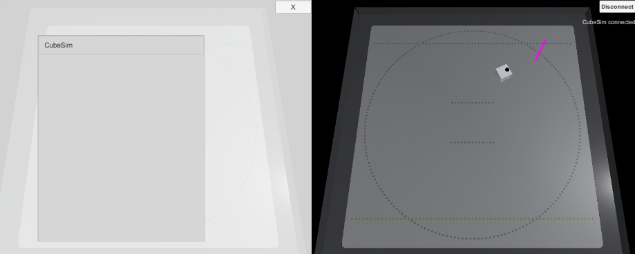

# Tutorial (Templates)

## Table of Contents

- [1. Connecting with Local Name and Controlling with CubeHandle](tutorials_templates.md#1-Connecting-with-Local-Name-and-Controlling-with-CubeHandle)

## 1. Connecting with Local Name and Controlling with CubeHandle

> The sample file is located at Assets/toio-sdk/Tutorials/Templates/Template_ConnectName_CubeHandle/.

 

This template implements the following features:
- Lists the scanned local names on the GUI, allowing the user to select and connect to a cube.
- On a PC, set the target pole on the mat with `Ctrl + right-click`, and on a smart device, use `touch`.
- Automatically controls the cube to reach the target pole using CubeHandle.

#### Related Tutorials and Samples

- Control by Local Name: [Sample_ConnectName](../toio-sdk-unity/Assets/toio-sdk/Samples/Sample_ConnectName/README_EN.md)
- Using CubeHandle: [Tutorial (CubeHandle) - 3. Follow TargetPole Demo](tutorials_cubehandle.md#3-follow-targetpole-demo)

#### Files

- `Template_ConnectName_CubeHandle.cs`: The main script implementing connection, GUI, and control.
- `TouchOperation.cs`: Implements touch operations for smart devices.
- `UIScannedCubeItem.prefab`: The prefab for the cube list items in the GUI.
