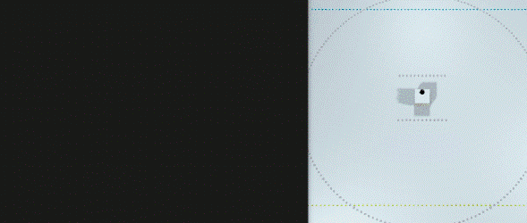
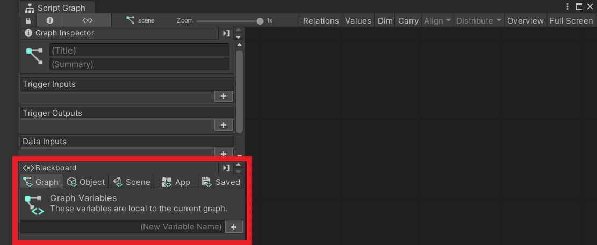
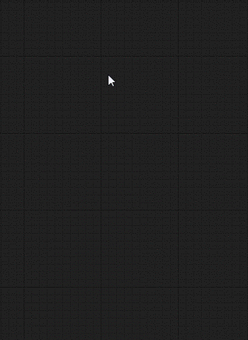
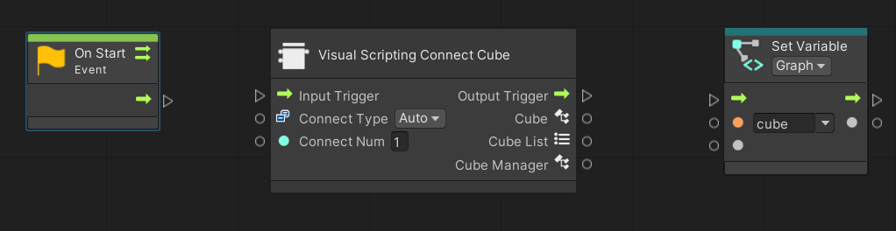
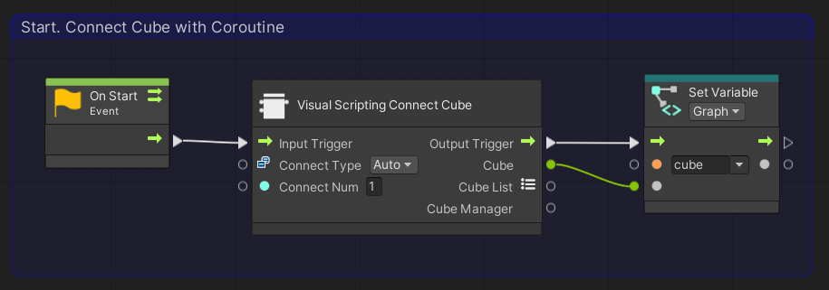
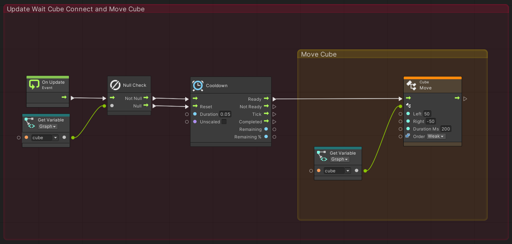
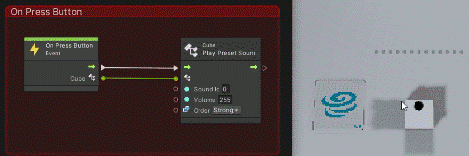

# Tutorial for Visual Scripting

## Table of Contents
- [1.Overview](#1overview)
- [2. How to place the stage](#2-how-to-place-the-stage)
- [3. How to Connect to the cube](#3-how-to-connect-to-the-cube)
- [4.Multiple Cubes](#4multiple-cubes)
- [5. Event detection](#5-event-detection)

# 1.Overview
Uniti Visual Scripting is a visual programming language that has been adopted as a standard feature since Unity 2021.

Visual Scripting in toio SDK for Unity currently (March 29, 2022) supports all features used in the tutorials.

By using the toio SDK for Unity with Visual Scripting,  you can enjoy the following benefits
- You can create programs to move cubes without knowledge of C#.
- The ability to visually program makes it easy to follow the flow of the program.
- it is easy to find bugs because you can see the program in action during execution.

The samples in the Visual Scripting version are basically implemented in a way that reproduces the samples in the C# version.
This document is a supplement to [Tutorial (Basic)](tutorials_basic.md) for Visual Scripting.

Before reading this document, if you have not done the initial setup for Visual Scripting, please read [Click here](visual_scripting_setting.md).

# 2. How to place the stage
The environment can be established by following the steps below.

1. Click [File] -> [New Scene] to create a new scene.
2. Remove Main Camera and Directional Light from the hierarchy.
3. Open the "Assets/toio-sdk/Scripts/Simulator/Resources" folder in the project window.
4. Drag and drop Cube Prefab file and the Stage Prefab file into the hierarchy. 
   You can also move Cube object by switching to the Scene View and using the mouse.
5. Right-click on the hierarchy, click "Create Empty Object" from the right-click menu, and name it "scene" (you can name it whatever you want).
6. Select the "scene" object and click [Add Component]->[Visual Scripting]->[Script Machine] in the inspector.
7. Create a folder for saving Script Graph in the project window(you can name it whatever you want. e.g. `\Assets\toio-sdk\Tutorials\VisualScriptingSample`).
8. Right-click on the project window in the folder you created and click [Create]->[Visual Scripting]->[Script Graph]. Enter any script name (e.g. BasicScene) to create a script.
9. Drag the icon of the script graph you created and drop it into the Graph field of the Script Machine component you added to the scene object.
10. On the inspector, "Edit Graph" will become selectable, click on it to open the graph view, and you can write any script you wish.

# 3. How to Connect to the cube
in Visual Scitpting, it is recommended to use [CubeManager] to connect to the cube.

Here, we explain how to connect and rotate the cubes using the sample from `\Assets\toio-sdk\Tutorials\1.Basic\0.BasicScene` as an example.

## The whole process of connecting cubes
- [1. Initialization of variables](#1-initialization-of-variables)
- [2. Connect to the cubes](#2-connect-to-the-cubes)
- [3 Check to see if the connection has been made in Update.](#3-check-to-see-if-the-connection-has-been-made-in-update)
- [4. Move Cubes](#4-move-cubes)
- [5. Run a program](#5-run-a-program)

## 1. Initialization of variables
First, open a graph view and initialize variables from Blackboard.

Variables can be added by entering the variable name "cube" in the Graph variable on the left side of the graph view and pressing the [+] icon. Set the type of the variable to (Null).

## 2. Connect to the cubes
After initializing the variables, the next step is to try to connect the cube.

When right-click on the area in the right side of Graph Inspector,A list of nodes that can be placed is displayed, and nodes can be added to the graph view by selecting the node you want to add.

Choose the following three nodes and arrange them horizontally on the graph view as shown below.
- [Events]->[Lifecycle]->[On Start]
- [T4U]->[Connecter]->[Visual Scripting Connect Cube]
- [Variables]->[Graph]->[Set cube]

Also, when you click the [On Start] node, a check box called Coroutine will appear on the Graph Inspector, so check this box.

Once the nodes have been added, connect them to each other.

Click on a port (the triangle or circle on the left or right side of a node) will extend the line to the mouse pointer, so that you can connect nodes by extending the line to the port you want to connect and left-clicking.

Connect the added nodes on the graph view as follows.

You can create a frame around a node by holding down the Ctrl (command on Mac) key and dragging it on the graph view.

These frames can be colored and titled, so it is advisable to use them actively since they can increase visibility when used well.

You can now connect to the cube.

To briefly explain the nodes up so far, [On Start] is a process that is run only once at the start of the program. [Visual Scripting Connect Cube] is a node that internally tries to connect to 「Connect Num」 cubes using a class called CubeManager and waits until all connections are made. [Set Variable] saves the cubes connected by [Visual Scripting Connect Cube] to a variable named cube.

In other words, the program we have created so far makes a connection with one cube at the start of the program, waits until the connection is completed, and saves the connected cube as a Cube class with a variable named cube.
## 3 Check to see if the connection has been made in Update.
We have made the process of connecting the cube in Start, So we will use the Cube class in Update to create the process of moving the cube.

First, we will create a process to check if the processing of Start is complete. This is decided whether the cube variable is still null.

We also set the time interval to send commands to the cube when the connection is confirmed.

We will add nodes and make connections between nodes on the graph view in the same way as we did for Start.

First, add the following nodes

- [Events]->[Lifecycle]->[On Update]
- [Nulls]->[Null Check]
- [Variables]->[Graph]->[Get Cube]
- [Time]->[Cooldown] Set Variables(Duration: 0.05)

After added nodes, make the connection as follows This will complete the process of sending commands at intervals of 0.05s after the end of the connection.

## 4. Move Cubes
Finally, the Cube class is used to send commands to the cube. Here, We move the cube so that it rotates in place, as in the sample.
Add the following nodes

- [Codebase]->[Toio]->[Cube]->[Move(Left, Right, Duration Ms, Order)] Set Variables(Left: 50, Right: -50, Duration Ms: 200)
- [Variables]->[Graph]->[Get cube]

After added nodes, connect as follows, including the process created in 「3.Check to see if the connection has been made in Update」.

The process of Update is now complete.

## 5. Run a program
Finally, go back to the Unity editor, press the play button, and actually move in the Unity editor.

If it works as follows, you have done it correctly.

The basics are the same for the other tutorials.

By making connections and using the functions of the Cube class, all the functions in the tutorials are available.

For more details, please see the actual samples.

# 4.Multiple Cubes
If you want to use multiple cubes, set the value "ConnectNum," which can be set in the [T4U]->[Connecter]->[Visual Scripting Connect Cube] node, to the number of cubes you want to use.

If there is only one cube to use, the Cube class was taken from the "Cube" port, but by having it output from the 「Cube List」 port, it is possible to take the Cube class list.

Also, because the CubeManager class is used as the internal process when connecting, the CubeManager can be used by outputting values from the "CubeManager" port.

In addition, using [T4U]->[Connecter]->[Visual Scripting Async Connect Cube], the connection can be made asynchronously.

For more details, please refer to `Assets\toio-sdk\Tutorials\1.Basic\6.MultiCube` and `Assets\toio-sdk\Tutorials\1.Basic\7.CubeManager`.

# 5. Event detection
Describes how to detect events in Visual Scripting.

As an example, we will show you how to create a program that generates a sound event when a button on the cube is pressed.
This is an excerpt of some of the functionality from `Assets\toio-sdk\Tutorials\1.Basic\5.Event`.

- [1. Preparation](#1-preparation)
- [2. Configure event detection settings](#2-configure-event-detection-settings)
- [3. Create event](#3-create-event)
- [4. Run and Confirm.](#4-run-and-confirm)

## 1. Preparation
First of all, please connect  to the cubes based on 「2. How to Place the Stage」 and 「3. How to Connect the Cubes」 in this tutorial, 

It is good if you have made it up to the following script.

## 2. Configure event detection settings
Next, set the events you want to detect.

Add node from [Codebase]->[Toio]->[Visual Script]->[Sensor Checker]->[Create Sensor Checker]

In this case, we want to detect the 「button pressed on the cube」 event, so we check only the 「Button Callback」 port in the [Create Sensor Checker].

Once added, connect as follows, including the process created in "1. Preparation.

In the Cube port of [Create Sensor Checker], enter the Cube class of the cube for which you want to generate events.

Now when a button on the cube is pressed, an event is fired.

## 3. Create event
Now that events can be detected by the process we have created, we will now create the process for what operations will be performed when an event occurs.

Right-click on the graph view and select [Events]->[T4u Event], and you will see that there are various events.

These events correspond to callbacks that can be checked in [Create Sensor Checker]. Also, the Cube port of the event node will use the Cube class of the cube entered in [Create Sensor Checker]. We want to use the event when a button is pressed, so we will add the following node.

- [Events]->[T4u Event]->[On Press Button]
- [Codebase]->[Toio]->[Cube]->[Play Preset Sound]

Once added, connect as follows

The cube now generates a sound when the button is pressed.

## 4. Run and Confirm.
Return to the Unity editor and press the play button to actually run.

You can see that when you click on the cube's button as shown below, an event fires on the graph view and a sound is made.

There are other types of events, and various settings can be applied to sensors.

For more details, please refer to the `Assets\toio-sdk\Tutorials\1.Basic\5.Event` for examples of other events.
