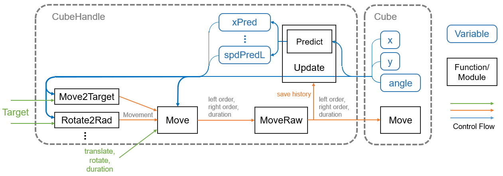

# Technical Documentation - Usage - CubeHandle Class

## Table of Contents

- [1. Outline](usage_cubehandle.md#1-outline)
- [2. CubeHandle class API](usage_cubehandle.md#2-cubehandle-class-api)
  - [2.1. Variable](usage_cubehandle.md#21-variable)
  - [2.2. Movement structure](usage_cubehandle.md#22-movement-structure)
  - [2.3. Basic method](usage_cubehandle.md#23-basic-method)
  - [2.4. One-Shot Method](usage_cubehandle.md#24-one-shot-method)
  - [2.5. Closed-Loop method](usage_cubehandle.md#25-closed-loop-method)

# 1. Outline

Cube class implements the basic functionality as per toio™ specification.<br>
On the other hand, CubeHandle class makes it easier to move Cube from the program.

CubeHandle instances have a one-to-one correspondence with Cube instances, and are instantiated using Cube.

```c#
Cube cube = ...
CubeHandle handle = new CubeHandle(cube);
```

The internal structure of CubeHandle class and its interaction with Cube class is shown in the control block diagram below.

<div align="center">
  
</div>

Let's go through the information flow.

1. When the state of Cube (coordinates and angle) is fetched into CubeHandle by the Update method, it first enters the prediction module to estimate the current velocity, state after lag, etc.
2. Combine the prediction results with the state of Cube and enter the control method
3. One route passes the user-specified target (coordinates, angle, etc.) to the appropriate control method (e.g. Move2Target), which outputs a Movement and passes it to the Move method
4. Move method receives the Movement output from the Move2Target method in Section 3, or another overload with the user-specified forward and rotation indication values and duration, and converts them to left and right indication values and duration in the same format as Cube. Move method, and pass them to the MoveRaw method.
5. The MoveRaw method has the same input format as Cube.Move method, and doesn't mess with the instruction values, it just stores them in the prediction module, and passes them to Cube.Move method for execution

<br>

# 2. CubeHandle class API

Samples using CubeHandle class are introduced in [tutorials](tutorials_cubehandle.md). Please refer to there as well.

## 2.1. Variable

### Constant

```c#
public static double TireWidthDot { get; }      // Distance between left and right wheels (mat coordinates)
public static double VDotOverU { get; }         // Proportional to speed and indication (dot/sec) / cmd
public static double DotPerM { get; }           // Mat units and metric proportions dot/mm
public static readonly float MotorTau = 0.04f;  // First-order delay element of motor sec
public double deadzone { get; }                 // Dead zone of motor indication value (fixed during actualization)
public int maxSpd { get; }                      // Maximum speed indication value (fixed during actualization)
```

### Parameters

```c#
public static double dt = 1.0 / 60 * 3;     // Control cycle 50ms
public static double lag = 0.130;           // Lag

public RectInt borderRect   // Indicates the border range RectInt
```

### Property

```c#
// Current status
public Cube cube { get; }   // Cube
public Vector pos { get; }  // Coordinates
public double x { get; }    // x-coordinate
public double y { get; }    // y-coordinate
public double rad { get; }  // Degree of curvature
public double deg { get; }  // Angle (degrees)
public Vector dir { get; }  // Unit direction vector
public int lagMS { get; }   // Lag (ms)
public int dtMS { get; }    // Limit cycle (ms)
public bool touch { get; }  // Touch state (valid for real only)
public bool lost { get; }   // Lost state (only valid for real)

// Predicted Results
public double spdL, spdR;       // Current speed of left and right tires
public double radPred, xPred, yPred, spdPredL, spdPredR;    // Arctitude after lag, xy coordinates, left-right velocity
public double stopRadPred, stopXPred, stopYPred;    // When issuing a stop instruction, the arc degree and xy coordinate after the stop
public double spd { get; }      // Current Speed Size
public Vector v { get; }        // Current speed vector
public Vector posPred { get; }  // Coordinates after lag
public double spdPred { get; }  // Velocity magnitude after lag
public Vector vPred { get; }    // Velocity vector after lag
public double wPred { get; }    // Angular velocity after lag
public Vector stopPosPred { get; }  // When issuing a stop instruction, the coordinates after the stop
```

<br>

## 2.2. Movement structure

The Movement structure is a structure that integrates the output of the control methods for ease of use.

### Variable

```c#
public CubeHandle handle;   // Whose orders?
public double translate;    // Forward speed indicator value
public double rotate;       // Rotation speed indication value
public int durationMs;      // Duration time (ms)
public bool reached;        // Control method complete?
public bool idle;           // Whether this Movement will be executed
```

### Method

#### Exec

```c#
public Movement Exec(bool border=true);
```

Specify the presence or absence of a border, and execute it by calling Move on the member variable handle.

<br>

## 2.3. Basic method

### SetBorderRect

```c#
public void SetBorderRect(RectInt matRect, int margin=20)
```
Set the border `borderRect` by RectInt and margin, which represent the size of the mat.

> The RectInt of a mat can be usefully obtained by specifying the MatType in the GetRectForMatType method of the Mat class.

### Update

```c#
public void Update();
```

Update the state and predict the destination.

This method is a frame that executes methods other than MoveRaw, and must be executed once before executing them.

### MoveRaw

```c#
public void MoveRaw(
  double uL, double uR,
  int durationMs = 1000,
  Cube.ORDER_TYPE order = Cube.ORDER_TYPE.Weak
  );
```

Move Cube.

- uL
  - Definition: Indicated value of left motor speed
  - Range:
    - [Version 2.0.0] -100 to -10; -9 to 9 is equivalent to 0; 10 to 100
    - [Version 2.1.0, 2.2.0] -115 ~ -8; -7 ~ 7 is equivalent to 0; 8 ~ 115
- uR
  - Definition: Indicated value of right motor speed
  - Range:
    - [Version 2.0.0] -100 to -10; -9 to 9 is equivalent to 0; 10 to 100
    - [Version 2.1.0, 2.2.0] -115 ~ -8; -7 ~ 7 is equivalent to 0; 8 ~ 115
- durationMS
  - Definition: Duration (ms)
  - Range:
    - 0~5 does not mean "no time limit", but sends a 10ms stop command instead
    - 6~9 should be modified to 10ms instead of "no time limit".
    - 10~2550 (accuracy is 10ms, first place is omitted)
  - Default value: 1000
- order
  - Definition : [instruction priority](sys_cube.md#4-send-command)
  - Type : Weak, Strong
  - Default value: Weak

### Move

```c#
public Movement Move(
    double translate,           // Indicated value of forward speed
    double rotate,              // Indicated value of rotation speed
    int durationMs = 1000,      // Duration time (ms)
    bool border = true,         // With or without border restrictions
    Cube.ORDER_TYPE order = Cube.ORDER_TYPE.Weak    // Priority of instructions
    );
```

Move Cube.

- translate
  - Definition : Indicated value of forward speed
  - Range:
    - [Version 2.0.0] -100+Abs(rotate)/2 ~ 100-Abs(rotate)/2
    - [Version 2.1.0, 2.2.0] -115+Abs(rotate)/2 ~ 115-Abs(rotate)/2
  - Explanation: The relationship between the left and right motor indication values (uL, uR) is `translate = (uL + uR)/2`.
- rotate
  - Definition: Indicated value of rotational speed
  - Range:
    - [Version 2.0.0] -100+Abs(rotate)/2 ~ 100-Abs(rotate)/2
    - [Version 2.1.0, 2.2.0] -115+Abs(rotate)/2 ~ 115-Abs(rotate)/2
  - Explanation: The relationship between the left and right motor indication values (uL, uR) is `rotate = uL - uR`.
- durationMS
  - Definition: Duration (ms)
  - Range:
    - 0~5 does not mean "no time limit", but sends a 10ms stop command instead
    - 6~9 should be modified to 10ms instead of "no time limit".
    - 10~2550 (accuracy is 10ms, first place is omitted)
  - Default value: 1000
  - Description: May be smaller due to border restrictions
- border
  - Definition: with or without border restrictions
  - Description: The border range can be set by CubeHanlde public variables.<br>
    `public int RangeX = 370;` `public int RangeY = 370;`
- order
  - Definition : [instruction priority](sys_cube.md#4-send-command)
  - Type : Weak, Strong
  - Default: Weak
- Return value
  - Definition: the actual execution of [Movement](usage_cubehandle.md#22-movement-structure)

#### Overloads

```c#
public Movement Move(
  Movement mv,
  bool border = true,
  Cube.ORDER_TYPE order = Cube.ORDER_TYPE.Weak
  );
```

Run [Movement](usage_cubehandle.md#22-movement-structure)

- mv
  - Definition: Move command
- border
  - Definition: with or without border restrictions
- order
  - Definition : [instruction priority](sys_cube.md#4-send-command)
  - Type : Weak, Strong
  - Default: Weak

```c#
public Movement Move(
  Movement mv,
  int durationMs,
  bool border = true,
  Cube.ORDER_TYPE order = Cube.ORDER_TYPE.Weak
);
```

Rewrite and execute the duration of [Movement](usage_cubehandle.md#22-movement-structure)

- mv
  - Definition: Move command
- durationMS
  - Definition: Duration (ms)
- border
  - Definition: with or without border restrictions
- order
  - Definition : [instruction priority](sys_cube.md#4-send-command)
  - Type : Weak, Strong
  - Default: Weak

### Stop

```c#
public void Stop();
```

Stop Cube.

It is equivalent to moveRaw(0,0,100,Cube.ORDER_TYPE.Strong)

<br>

## 2.4. One-Shot Method

The closed-loop method of CubeHandle class is supposed to be executed repeatedly to reach the goal. Each time the process is executed, Bluetooth communication with Cube is required, so blinking the LED or playing a sound while moving would require too much communication.

The One-shot method is a solution to this problem, as it only needs to be called once to reach the target, thus reducing the amount of communication required to move.
(This is Open-Loop, so there is no guarantee of results.)

### TranslateByDist

```c#
public Movement TranslateByDist(double dist, double translate);
```

Calculates the Movement to move forward or backward at a specified distance at a specified speed.

- dist
  - Definition: distance
  - Range: -2.55 _ Abs(translate) _ `VDotOverU` ~ 2.55 _ Abs(translate) _ `VDotOverU`
- translate
  - Definition: Indicated value of forward speed
  - Range:
    - [Version 2.0.0] -100~-10； 10~100
    - [Version 2.1.0, 2.2.0] -115~-8； 8~115
- Return value
  - Definition: Move command [(Movement)](usage_cubehandle.md#22-movement-structure))

### RotateByRad

```c#
public Movement RotateByRad(double drad, double rotate);
```

Calculates the Movement to rotate the specified angle (arc degree) at the specified rotation speed.

- drad
  - Definition: Angle (radian)
  - Range: -2.55 _ Abs(rotate) _ `VDotOverU`/`TireWidthDot` ~ 2.55 _ Abs(rotate) _ `VDotOverU`/`TireWidthDot`
- rotate
  - Definition: Indicated value of rotational speed
  - Range:
    - [Version 2.0.0] -200~-20; 20~200
    - [Version 2.1.0, 2.2.0] -230~-16; 16~230
- Return value
  - Definition: Move command [(Movement)](usage_cubehandle.md#22-movement-structure)

### RotateByDeg

```c#
public Movement RotateByDeg(double ddeg, double rotate)
```

Calculates the Movement to rotate the specified angle (degrees) at the specified rotation speed.

- drad
  - Definition: Angle (degree)
  - Range: -2.55 _ Abs(rotate) _ `VDotOverU`/`TireWidthDot`_180/pi<br>
    ~ 2.55 _ Abs(rotate) * `VDotOverU`/`TireWidthDot`*180/pi
- rotate
  - Definition: Indicated value of rotational speed
  - Range:
    - [Version 2.0.0] -200~-20; 20~200
    - [Version 2.1.0, 2.2.0] -230~-16; 16~230
- Return value
  - Definition: Move command [(Movement)](usage_cubehandle.md#22-movement-structure)

<br>

## 2.5. Closed-Loop method

The Closed-Loop method is used to reach the specified coordinates and direction of the mat by continuing to execute it repeatedly.

Unlike the One-Shot method, it keeps tracking the target and guarantees results, but it communicates with Cube more frequently, so the transmission volume is higher.

### Move2Target

```c#
public Movement Move2Target(
    double tarX,            // Target x coordinate
    double tarY,            // Target y coordinates
    double maxSpd = 50,     // Maximum speed indication value
    int rotateTime = 250,   // Desired rotation time (ms)
    double tolerance = 8    // Threshold of arrival judgment
    );
```

Calculates the Movement to move to the target coordinates.

- tarX
  - Definition: target x coordinates
  - Range: Any
- tarY
  - Definition: target x coordinates
  - Range: Any
- maxSpd
  - Definition: maximum speed indication
  - Range:
    - [Version 2.0.0] 0~100
    - [Version 2.1.0, 2.2.0] 0~115
  - Default value: 50
  - Description: Decelerates when approaching a target or depending on the state of rotation.
- rotateTime
  - Definition: desired rotation time (ms)
  - Range: 100 ~ 2550
  - Default value: 250
  - Description: Specifies the time to rotate toward the target.<br>
    A smaller value will make it spin faster, while a larger value will make it spin slower. This is not an exact rotation time, but a rough guide.<br>
    If the value is less than 200, the system may become unstable.
- tolerance
  - Definition: Threshold of arrival judgment (distance)
  - Default: 8
  - Explanation: When the distance to the target is less than tolerance, it is considered to be reached.
- return value
  - Definition: Move command [(Movement)](usage_cubehandle.md#22-movement-structure)

#### Overloads

```c#
public Movement Move2Target(Vector pos, double maxSpd = 50, int rotateTime = 250, double tolerance = 8);
public Movement Move2Target(Vector2 pos, double maxSpd = 50, int rotateTime = 250, double tolerance = 8);
public Movement Move2Target(Vector2Int pos, double maxSpd = 50, int rotateTime = 250, double tolerance = 8)
```

- pos
  - Definition: Target coordinates

### Rotate2Rad

```c#
public Movement Rotate2Rad(double tarRad, int rotateTime = 400, double tolerance = 0.1);
```

Calculates the Movement to rotate to the specified angle (arc degree).

- tarRad
  - Definition: Target angle (radian)
  - Range: Any
- rotateTime
  - Definition: desired rotation time (ms)
  - Range: 100 ~ 2550
  - Default value: 400
- tolerance
  - Definition: Threshold of arrival judgment (degree of arc)
  - Default value: 0.1
  - Explanation: When the difference between the target angle (arc degree) and tolerance is less than or equal to tolerance, it is considered to be reached.
- Rreturn value
  - Definition: Move command [(Movement)](usage_cubehandle.md#22-movement-structure)

### Rotate2Deg

```c#
public Movement Rotate2Deg(double tarDeg, int rotateTime = 400, double tolerance = 5);
```

Calculates the Movement to rotate to the specified angle (degrees).

- tarRad
  - Definition: Target angle (degree)
  - Range: Any
- rotateTime
  - Definition: desired rotation time (ms)
  - Range: 100 ~ 2550
  - Default value: 400
- tolerance
  - Definition: Threshold (degree) of arrival judgment
  - Default value: 5
  - Explanation: When the difference between the target angle (degrees) and tolerance is less than or equal to tolerance, it is considered to be reached.
- Return value
  - Definition: Move command [(Movement)](usage_cubehandle.md#22-movement-structure)

### Rotate2Target

```c#
// tarX, tarY Specified coordinates, tolerance Threshold of arrival judgment (arc degree), rotateTime Desired rotation time (ms)
public Movement Rotate2Target(double tarX, double tarY, int rotateTime = 400, double tolerance = 0.1);
```

Calculates the Movement to rotate in the direction of the specified coordinate.

- tarX
  - Definition: target x coordinates
  - Range: Any
- tarY
  - Definition: target y coordinates
  - Range: Any
- rotateTime
  - Definition: desired rotation time (ms)
  - Range: 100 ~ 2550
  - Default value: 400
- tolerance
  - Definition: Threshold of arrival judgment (degree of arc)
  - Default value: 0.1
  - Explanation: When the difference between the target angle (arc degree) and tolerance is less than or equal to tolerance, it is considered to be reached.
- return value
  - Definition: Move command [(Movement)](usage_cubehandle.md#22-movement-structure)
