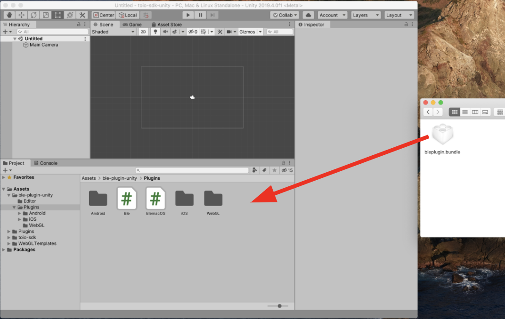
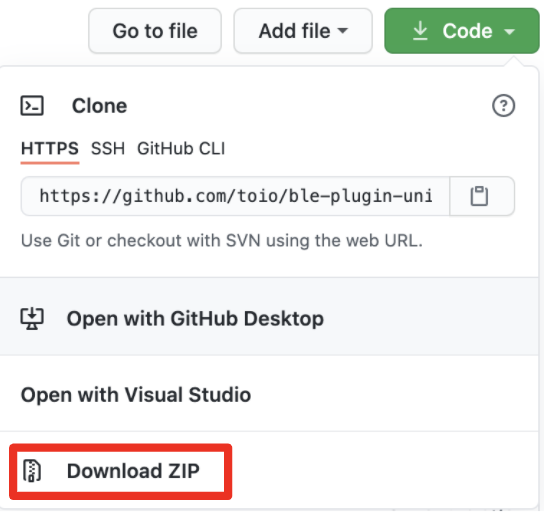
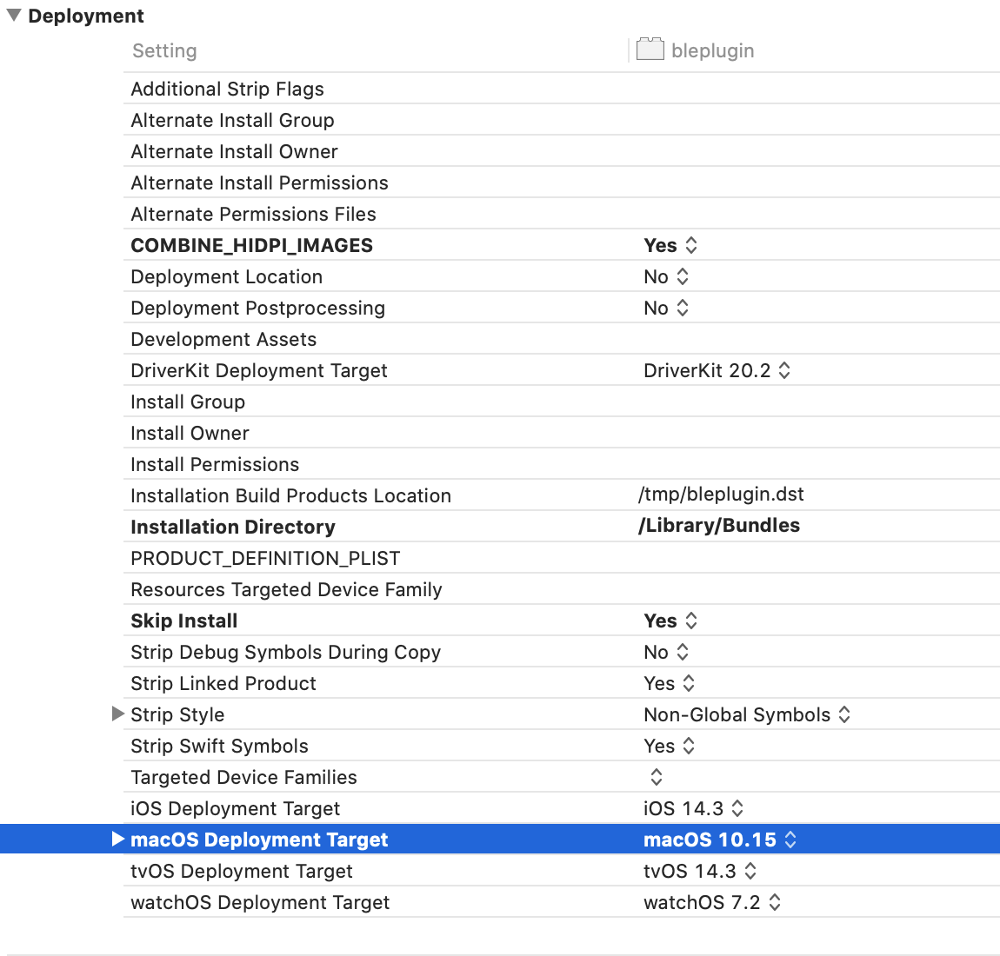
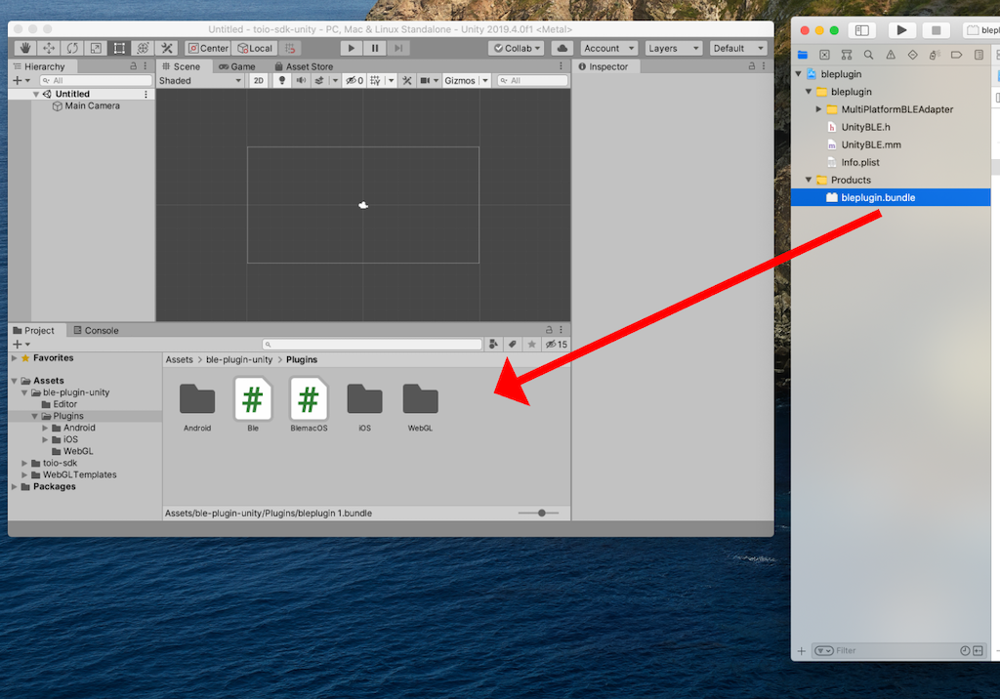

# Technical Documentation - Usage - MacBLE

By using the BLE plugin for macOS, you can connect to a real cube with a built Mac app. It also allows you to connect to a real cube directly from the Unity Editor, making it easy to perform quick functionality checks.

This section explains how to connect to the real cube from the Unity Editor on a Mac.

## Table of Contents

- [Confirmed operating environment](usage_macble.md#confirmed-operating-environment)
- [Import Method](usage_macble.md#import-method)
- [Usage](usage_macble.md#usage)

 

## Confirmed operating environment

We have confirmed that it works in the following environment. You don't necessarily have to match, but if it doesn't work in your environment, please refer to the following.

| Tools and Software | Confirmed version | Recommended version |
| ------------------ | ---------------------- | ----------------------- |
| OS                 | MacOS 13.4.1 | MacOS 11 or higher |
| Unity              | 2022.3.44f1 | 2022.3 or higher |
| XCode              | 14.3.1 | 14 or higher |
| Device             | MacBook Pro 2017 | N/A |

 

## Import Method

As a preliminary step, go to Apple menu in the upper left corner of the screen and click "About this Mac" to check your OS version.

If your OS version is <b>10.x</b> , <b>11.x</b> or <b>12.x</b>, please refer to [How to download a pre-built bundle file](usage_macble.md#how-to-download-a-pre-built-bundle-file).
For other OS versions, please refer to [How to build the bundle file on your own PC](usage_macble.md#how-to-build-the-bundle-file-on-your-own-pc).

 

### How to download a pre-built bundle file

#### 1. Download bundle file

Open [toio/ble-plugin-unity/Releases](https://github.com/toio/ble-plugin-unity/releases) and click on `bleplugin_10.bundle.zip` if your OS version is <b>10.x</b> or `bleplugin_11.bundle.zip` if your OS version is <b>11.x</b> or <b>12.x</b>. If your OS version is <b>10.x</b>, click on `bleplugin_10.bundle.zip`, and if your OS version is <b>11.x</b> <b>12.x</b>, click on `bleplugin_11.bundle.zip` to download.

> As of v1.5.1, this SDK targets the v1.0.0 release.

#### 2. Drag and drop bundle file into your Unity project

Open your Unity project and navigate to the folder `Assets > ble-plugin-unity > Plugins`.
Unzip the downloaded zip file and drag and drop the bundle file directly into the Unity window.

 

### How to build the bundle file on your own PC

#### 1. Download Xcode project

Open [toio/ble-plugin-unity](https://github.com/toio/ble-plugin-unity) and click [Code] > [Download ZIP] to download the repository.  

#### 2. Build bundle file

Unzip the downloaded zip file and open the Xcode project file located at `bleplugin_projects/macOS/bleplugin/bleplugin.xcodeproj`. Open the project settings screen, click on "bleplugin" in the <b>TARGETS</b> list, then click on the "Build Settings" tab and open the <b>Deployment</b> settings.

Click [macOS (version value)] in the right column of <b>macOS Deployment Target</b> in the Deployment settings, and select the OS version that you checked in the prior work.

After completing the above tasks, click the play button (:arrow_forward:) in the upper left corner of Xcode to start the build, and wait until the build is complete.

#### 3. Drag and drop bundle file into your Unity project

Open your Unity project and navigate to the folder `Assets > ble-plugin-unity > Plugins`.
Drag and drop bundle file generated by the build directly from **Xcode window** to Unity window.

 

### Bluetooth Permissions

To connect directly from the Unity Editor, you need to grant Bluetooth permissions to Unity. If you want to connect with a built app, you’ll need to grant Bluetooth permissions to the built app.

From the Apple menu, go to `System Settings > Privacy & Security > Bluetooth`, click the `+` button, select the app from the list, and then click "Open". (Reference: [macOS User Guide](https://support.apple.com/guide/mac-help/mchl211c911f/mac))

## Usage

Please refer to [Cube Connection Settings](usage_cube.md#4-cube-connection-settings).

If you want to check the operation easily, try running the sample project [Sample_ConnectType](../toio-sdk-unity/Assets/toio-sdk/Samples/Sample_ConnectType/README_EN.md).

If following [How to download a pre-built bundle file](usage_macble.md#How-to-download-a-pre-built-bundle-file) does not work, try [How to build the bundle file on your own PC](usage_macble.md#how-to-build-the-bundle-file-on-your-own-pc).
