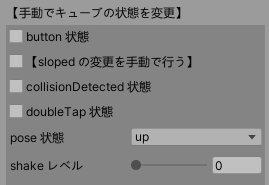

# Technical Documentation - How to Use - Simulator

## Table of Contents

- [1. Outline](usage_simulator.md#1-outline)
- [2. Mat Prefab](usage_simulator.md#2-mat-prefab)
  - [2.1. Parameters in the Inspector](usage_simulator.md#21-parameters-in-the-inspector)
  - [2.2. Constants](usage_simulator.md#22-constants)
  - [2.3. Enumerated types](usage_simulator.md#23-enumerated-types)
  - [2.4. Methods](usage_simulator.md#24-methods)
- [3. StandardID Prefab](usage_simulator.md#3-standardid-prefab)
  - [3.1. Parameters in the Inspector](usage_simulator.md#31-parameters-in-the-inspector)
- [4. Cube Prefab](usage_simulator.md#4-cube-prefab)
  - [4.1. Inspector in CubeSimulator](usage_simulator.md#41-inspector-in-cubesimulator)
  - [4.2. CubeSimulator Constants](usage_simulator.md#42-cubesimulator-constants)
  - [4.3. CubeSimulator Properties](usage_simulator.md#43-cubesimulator-properties)
  - [4.4. CubeSimulator Methods](usage_simulator.md#44-cubesimulator-methods)
  - [4.5. Manipulating Cube Objects (CubeInteraction)](usage_simulator.md#45-manipulating-cube-objects-cubeinteraction)
- [5. Stage-Prefab](usage_simulator.md#5-stage-prefab)
  - [5.1. Target pole](usage_simulator.md#51-target-pole)
  - [5.2. Focus on Cube](usage_simulator.md#52-focus-on-cube)
- [6. Magnet Prefab](#6-Magnet-Prefab)
  - [6.1. Parameters in the Inspector](#61-Parameters-in-the-Inspector)
  - [6.2. Methods](#62-Methods)
  - [6.3. Create your own magnet](#63-Create-your-own-magnet)

# 1. Outline

Simulator is a virtual environment for testing smart device applications that communicate with toio™ Core Cube (Cube).

Simulator consists of the following four prefabs under `Assets/toio-sdk/Scripts/Simulator/Resources/`.

- Mat ... Imitation of various play mats
- StandardID ... Imitates various types of cards/sheets that can read StandardID
- Cube … Imitation of toio™ Core Cube
- Stage … A set of functions required for a simulation environment

All classes implemented in Simulator belong to the `toio.Simulator` namespace.

# 2. Mat Prefab

Mat Prefab is a game object that resembles various play mats.

Cube Prefab can be placed in Mat Prefab to get the coordinate position and orientation of Mat.

You can place multiple Mat Prefabs in the scene, at any position and angle, as long as they are horizontal.

## 2.1. Parameters in the Inspector

<div align="center"></div>

In Unity's Inspector, you can change the look and coordinates of the mat by selecting one of the following in the "Type" list of the script Mat.cs

- Play mat (sumo ring)
- Play mat (colored tiles)
- Simple mat,toio play mat for development 1~6
- toio play mat for development (back side)
- Customize

 > The surface of toio play mat for development #1 ~ #6 has the same specifications as Simple mat, so they are combined into one type "Simple mat,toio play mat for development1~6".

Please refer to [toio™ Core Cube Technical Specifications](https://toio.github.io/toio-spec/en/docs/hardware_position_id) and [toio play mat for development](https://toio.io/blog/detail/20200423-1.html) for the specifications of each type.

## 2.2. Constants

```c#
// Mat units and metric proportions
public static readonly float DotPerM = 411f/0.560f; // (410+1)/0.560 dot/m
```

## 2.3. Enumerated types

### MatType

Mat Type

```c#
toio_collection_front = 0,  // Play mat(sumo ring)
toio_collection_back = 1,   // Play mat(Colored tiles)
simple_playmat = 2,         // Simple mat
developer = 3,              // toio play mat for development
custom = 4                  // Customize the coordinate range.
```

### DeveloperMatType

toio play mat for development number

```c#
_1, _2, _3, _4, _5, _6, _7, _8, _9, _10, _11, _12
```

## 2.4. Methods

### GetRectForMatType

```c#
public static RectInt GetRectForMatType(MatType matType, DeveloperMatType devMatType=default);
```

Gets a RectInt with the coordinate range of the specified type of mat.

- matType
  - Definition: Mat Type
  - Range: Except `MatType.custom`.
- devMatType
  - Definition: Number of the development mat (only valid if matType is `MatType.developer`)
- Return value
  - Definition: RectInt with a range of coordinates

### UnityDeg2MatDeg

```c#
public int UnityDeg2MatDeg(double deg);
```

Converts the angle on Unity to the angle on this mat.

- deg
  - Definition: Angle in degrees on Unity
  - Range: Any
- Return value
  - Definition: Angle (degrees) on this mat

### MatDeg2UnityDeg

```c#
public float MatDeg2UnityDeg(double deg);
```

Convert the angle on this mat to the angle on Unity.

- deg
  - Definition: Angle (degrees) on this mat
  - Range: Any
- Return value
  - Definition: angle in degrees on Unity

### UnityCoord2MatCoord

```c#
public Vector2Int UnityCoord2MatCoord(Vector3 unityCoord);
```

Converts from Unity's 3D spatial coordinates to the mat coordinates in this mat.

- unityCoord
  - Definition: coordinates on Unity
  - Range: Any
- Return value
  - Definition: Coordinates on this mat

### MatCoord2UnityCoord

```c#
public Vector3 MatCoord2UnityCoord(double x, double y);
```

Convert the mat coordinates in this mat to Unity's 3D space coordinates.

- x
  - Definition: x-coordinate on this mat
  - Range: Any
- y
  - Definition: y-coordinate on this mat
  - Range: Any
- Return value
  - Definition: 3D coordinates in Unity


# 3. StandardID Prefab

StandardID Prefab is a game object that resembles various card sheets that can be read for Standard IDs.

If you put Cube Prefab on top of the StandardID Prefab, you can get the Standard ID and orientation.

Multiple StandardID Prefabs can be placed in a scene at any position and angle.

## 3.1. Parameters in the Inspector

<div align="center"></div>

In Unity inspector, you can switch StandardIDs by selecting the "Title" of the script Mat.cs and then selecting a card sheet of a particular "Type".

The following "titles" can be supported.

- toio collection
- Simple card

See [toio™ Core Cube Technical Specifications](https://toio.github.io/toio-spec/en/docs/hardware_standard_id) for "type".


## 3.2. Method

### UnityDeg2MatDeg

```c#
public int UnityDeg2MatDeg(double deg);
```

Converts the angle on Unity to the angle on this StandardID.

- deg
  - Definition: angle in degrees on Unity
  - Range: Any
- Return value
  - Definition: Angle (in degrees) on this StandardID

### MatDeg2UnityDeg

```c#
public float MatDeg2UnityDeg(double deg);
```

Converts the angle on this StandardID to the angle on Unity.

- deg
  - Definition: Angle (in degrees) on this StandardID
  - Range: Any
- Return value
  - Definition: angle in degrees on Unity


# 4. Cube Prefab

Cube Prefab is a game object that resembles toio™ Core Cube.

Cube Prefab has two scripts.
- `CubeSimulator`: A simulation of real Cube is implemented.
- `CubeInteraction`: Implemented operations of pushing and grabbing Cube objects on Simulator.

> There are some functional differences from Real Cube.<br>
> For more details, please see [Feature Support](usage_cube.md#realsim-performance-meter).

Multiple Cube Prefabs can be placed in a scene. (Please make sure that Cube Prefab does not overlap with any other object.)

## 4.1. Inspector in CubeSimulator

Simulator is divided into two parts: "Configuring Simulator" and "Manually changing the state of Cube".

### Configuring Simulator (when not running)

<div align="center"></div>

- `Version`: Firmware version.
- `Power Start`: Initial state of Cube power supply.
- `Motor Tau`: Parameters of the first-order delay element of the motor.
- `Delay`: Communication delay (the lag between the transmission of a command and the change in the acquired coordinates).
- `Force Stop`: When checked, it will forcibly stop the output of the motor.

### Simulator information (runtime)

<div align="center"></div>

- `Version`: Firmware version. Cannot be changed.
- `Power`: Power supply for Cube.
- `Running`: Activated and ready to connect.
- `Connected`: Connected or not.
- `Force Stop`: When checked, it will forcibly stop the output of the motor.

### Manually change the state of Cube (runtime)

<div align="center"></div>

>It is only visible in the connected state.

If it is too difficult to reproduce realistically on Simulator, or too difficult to operate, you can change the state of Cube in the inspector to trigger the corresponding event.

- `button`: If you check the box, the button will be held down. If you want to move Cube again, you will have to uncheck the box and release the button. Also, if you change the button state with the mouse, this setting will be overwritten.
- `[Change sloped manually]`: If checked, the `sloped` will be displayed and you will be able to change the settings.
(Normally, Simulator sets the sloped state for each frame, but if this setting is enabled, Simulator will not set `sloped`.
  - `sloped`: Indicates whether Cube is on a slope.
- `Trigger Collision`: This is the button that generates collision event. (Currently, physical collision simulation is not implemented in the game engine.
- `Trigger DoubleTap`: This is the button that generates the double-tap event. (Currently, physical double-tap simulation is not implemented in the game engine.
- `pose`: You can display and change the attitude of Cube.
- `shake level`: Indicates the strength of the shake. (Currently, Simulator does not have the ability to detect when Cube has been shaken.
- `[Change Magnetic Sensor Manually]`: If checked, `magnet state` and `magnetic force` will be displayed to allow you to change the settings. In this case, the magnetic force generated from the Magnet Prefab in the scene will not be applied.
  - `magnet state`: If you select one of these states, the cube will be given the appropriate magnetic force. If the notification type is not `Magnet State`, the given magnetic force will be changed, but the displayed `magnet state` will remain `None`.
  - `magnetic force`: Apply the entered magnetic force to the cube's magnetic sensor. It is not equal to `Cube.magneticForce`.

## 4.2. CubeSimulator Constants

```c#
// Distance between left and right tires (meters)
public static readonly float TireWidthM = 0.0266f;
// Distance between left and right tires (dots (mat coordinates))
public static readonly float TireWidthDot= 0.0266f * Mat.DotPerM;
// Cube Size
public static readonly float WidthM= 0.0318f;
// Proportional to the speed (dots per second) and the indicated value
public static readonly float VDotOverU =  4.3f*Mathf.PI*0.0125f/60 * Mat.DotPerM; // about 2.06
```

## 4.3. CubeSimulator Properties

```c#
public bool power { get; set; }                 // Power supply
public bool isRunning { get; private set; }     // Whether it's operational or not.
public int maxMotor { get; }                    // Maximum motor command value
public int deadzone { get; }                    // Motor Command Dead Zone
public int x { get; internal set; }             // x-coordinate on the mat
public int y { get; internal set; }             // y-coordinate on the mat
public int deg { get; internal set; }           // Angle on the mat (degrees)
public int xSensor { get; internal set; }       // x-coordinate of the read sensor on the mat
public int ySensor { get; internal set; }       // y-coordinate of the reading sensor on the mat
public uint standardID { get; internal set; }   // Read Standard ID
public bool onMat { get; internal set; }        // Whether or not it is on the mat
public bool onStandardID { get; internal set; }   // Whether it is on StandardID or not.
public bool isGrounded { get {return onMat || onStandardID; } } // Whether it is on Mat or StandardID.
```

## 4.4. CubeSimulator Methods

This method is for use from Cube class, so there is no need for end users to use it directly.

## 4.5. Manipulating Cube Objects (CubeInteraction)

CubeInteraction class is based on Unity's EventSystem and implements operations such as pushing and grabbing Cube object.

### How to use

> If you want to use Stage Prefab, you can skip this step since it is already operational.

- Make sure that the scene contains one `EventSystem`;
  - To create it: Press GameObject > UI > Event System in the menu.
- Add a `Physics Raycaster` component to the camera
  - How to add: In the Camera inspector, under Add Compnent, find and add `Physics Raycaster`.

### Left-click on Cube object to press

By `left-clicking` on Cube object, you can press the [bottom button](https://toio.github.io/toio-spec/en/docs/ble_button) of the target Cube object.

> As long as you hold down the left mouse button, the bottom button of Cube object will remain pressed.

<div align="center"></div>

### Right-click on Cube object to lift or lower it
By `right-clicking` on Cube object, you can lift Cube object off the mat and change its position and angle.

- By `right-clicking` on Cube object, the target Cube object can be lifted off the mat
- `Move the mouse` while lifting the object to move it to the desired location
- `Turn the mouse wheel` while lifting the object to change the orientation of the target Cube object
- By `right-clicking` again while the object is lifted, the target Cube object can be lowered onto Mat

<div align="center"></div>

### Right-drag Cube object to pull it.

By `right-dragging` the target Cube object, you can pull and move Cube object.<br>
When you start right-dragging, a black vector will appear between the mouse cursor and Cube object, and a force proportional to that vector will be applied to Cube object.

<div align="center"></div>

# 5. Stage Prefab

Stage Prefab is a set of the following

- Mat Prefab
- Camera (with PhysicsRaycaster for mouse control)
- Light
- Target pole (see below)
- Tables and borders to prevent Cube from escaping.
- EventSystem

In addition, Stage Prefab has two useful tools
- Target pole
- Focus on Cube

If you create a new scene, it is recommended to delete the cameras and lights already in the scene before adding the Stage Prefab in order to internalize the cameras and lights whose field of view fits the mat.

The operation functions implemented in this Prefab are based on `CubeInteraction`.

## 5.1. Target pole

The target pole is a pink stick. (They are made invisible before installation.)

<div align="center"></div>

You can place a target pole by holding down the Ctrl key and pressing the right mouse button on any object.<br>
If you perform the same operation where there is no object, the target pole will disappear.

The developer can get the position of the target pole and use it to control Cube.

```c#
public bool targetPoleActive { get; }      // Is the target pole in place?
public Vector2Int targetPoleCoord { get; } // Get the mat coordinates of the target pole.
```

The specific way to manipulate Cube using the target pole is described in [tutorials](tutorials_cubehandle.md#3-follow-targetpole-demo).

## 5.2. Focus on Cube

Hold down Ctrl key and left-click on Cube to focus it.<br>
If you perform the same operation on a non-Cube, it will lose focus.

<div align="center"></div>

Getting the object of focus makes it easier to manipulate and debug a particular Cube.

### Property

```c#
// Name of the focus target (in Unity hierarchy)
public string focusName { get; }
```

### SetFocus

```c#
public void SetFocus(Transform transform);
```

Set the focus target manually.

- transform
  - Definition: Target of focus

### SetNoFocus

```c#
public void SetNoFocus();
```

Cancel the focus.

<br>

# 6. Magnet Prefab

The Magnet Prefab is a game object that resembles a standard magnet as specified in the [specifications](https://toio.github.io/toio-spec/en/docs/hardware_magnet/#magnet-specifications).

By placing the Magnet Prefab near the Cube Prefab, you can make the magnetic sensor work as if it were real.

<div align="center"></div>

## 6.1. Parameters in the Inspector

<div align="center"></div>.

- `Maxwell`: The magnetic charge that the script places at the location of the attached object.
- `Relative Permeability`: The relative magnetic permeability.
- `Max Distance`: The range over which the magnetic field is calculated.

The Magnet Prefab itself (the topmost parent object) does not have any magnetic charges defined, but several child objects have Magnet.cs attached to them and have magnetic charges defined. The magnetic field of the square magnet is simulated by these magnetic charges.

## 6.2. Methods

### GetSelfH

```c#
public Vector3 GetSelfH(Vector3 pos);
````

Computes the magnetic field vector generated by the defined magnetic charge at the specified position.
If the distance to the object object is greater than `Max Distance`, it returns 0 directly.

- pos
  - Definition: position
  - Range: arbitrary
- Return value
  - Definition: magnetic field vector

### SumUpH

```c#
public Vector3 SumUpH(Vector3 pos);
```

Computes the composite magnetic field vector generated at the specified position by all magnetic charges contained in own object and child objects.
If the distance to the object object is greater than `Max Distance`, it returns 0 directly.

- pos
  - Definition: position
  - Range: arbitrary
- Return value
  - Definition: magnetic field vector

## 6.3. Create your own magnet

You can create your own Magnet Prefab by following the steps below.

- Attach Magnet.cs to the parent object. It is recommended to set the magnetic load to 0.
- Create a child object, attach Magnet.cs to it, and set the magnetic charge. Make sure that the sum of all the magnetic charges is 0.
- Change the tag of the parent object to `t4u_Magnet`. It will now be recognized by CubeSimulator. Do not set the tag for the child object.
