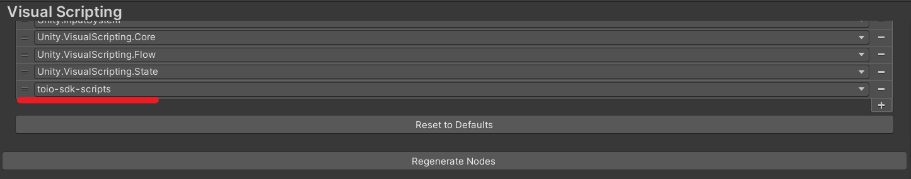
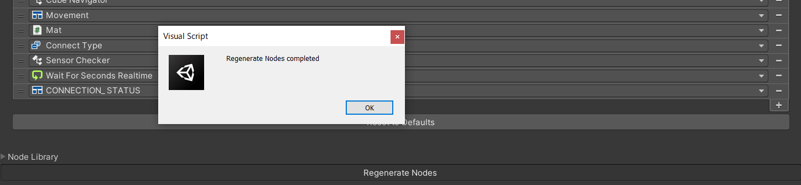

# When using Unity Visual Scripting
If you want to use toio SDK for Unity with Visual Scripting instead of C#, there are additional settings and confirmations you need to do after completing ["toio SDK for Unity Installation"](download_sdk.md).

We assume that version of Unity Visual Scripting is 1.7.6.

## Table of Contents
  - [1. Confirm Unity Visual Scripting](#1-confirm-unity-visual-scripting)
    - [How to install Visual Scripting](#how-to-install-visual-scripting)
  - [2.Make build platform PC](#2make-build-platform-pc)
  - [3. Make toio SDK for Unity available to Unity Visual Scripting](#3-make-toio-sdk-for-unity-available-to-unity-visual-scripting)
  - [4. Run and test Sample of Visual Scripting](#4-run-and-test-sample-of-visual-scripting)

## 1. Confirm Unity Visual Scripting
1. Open the Package Manager by selecting [Package Manager] from the [Window] menu in Unity.
2. Make sure [Visual Scripting] is installed when the upper left is in [Packages:in Project].

### How to install Visual Scripting
1. Open the Package Manager by selecting [Package Manager] from the [Window] menu in Unity.
1. Click [Packages:in Project] in the upper left tab and select [Unity Registory].
1. Click Visual Scripting, then click the [install] button in the lower right corner.

The installation is complete if Visual Scripting is exist in the [Packages:in Project] state.

## 2.Make build platform PC
Set build settings to PC.Without this setting, some nodes, such as the Cube class, will not be displayed.
Builds can be done on IOS, android, and WebGL, but if you are programming with Visual Scripting, please make sure that the build platform is PC.
1. Click [File]->[Build Setting]
2. Select [Windows, Max, Linux] from list of [Platform] and Click [Swithc Platform]

Click [Switch Platform] and wait a second,If you see the Unity icon next to [Windows, Mac, Linux], you have succeeded.

## 3. Make toio SDK for Unity available to Unity Visual Scripting

1. Click [Edit]->[Project Setting]->[Visual Scripting].
2. Add [toio-sdk-scripts] to Node Library.
   1. Click [Node Library] to see the list of currently available libraries and press the [+] icon.
   2. A tab labeled (No Asseembly) will be added, click on it and select [toio-sdk-scripts]. 

3. Add Classes to Type Options as necessary.
   1. Click [Type Options] to see the list of currently available nodes and press the [+] icon.
   2.  A tab labeled (No Type) will be added, click on it and select class you need.(The Nodes below are all the classes needed to run all the tutorials.)
       - [Toio]
         - CONNECTION_STATUS
         - Cube
         - Cube Handle
         - Cube Manager
         - Movement
      - [Toio]->[Visual Scripting]
         - Converter To Byte
         - Sensor Checker
         - Visual Script Cube Configration
      - [Toio]->[Simulator]
         - Mat
      - [Toio]->[Navigation]
         - Cube Navigator
         - Wall
      - [(Enums)]
         - Connect Type
      - [UnityEngine]
         - Wait for Seconds RealTime
4. Click [Regenerate Nodes].

If the message 「Regenerates Nodes Completed」 is displayed, the configuration to make the toio SDK for Unity available for use with Visual Scripting is complete.

  

### ＊How to Add [Connect Type]

> When adding a node, a search for Connect Type will display "Connect Type (in Toio)" as shown in the image below, and the node will appear as if it were placed in the [Toio] list. 
> 

>  However, there is no [Connect Type] node in the [Toio] list.
> 

> This is due to the fact that the type of Connect Type is Enum, but programmatically belongs to the list [Toio]. The [Connect Type] in the [Enums] list and the [Connect Type (in Toio)] when searching by Connect Type are the same node, so it does not matter which method you use to add it.

## 4. Run and test Sample of Visual Scripting
You have completed the necessary work to use Visual Scripting, run the sample of Visual Scripting version.

Move to `Assets/toio-sdk/Tutorials/1.Basic/0.BasicScene/` and Open `0.BasicScene` with double click

Click [scene] on hierarchy.On the inspector, uncheck the check box of [Basic Scene (Script)] and check the check box of [Script Machine].

Now the samples that were running in C# will run in Visual Scripting.

Click on the play button on the editor to see if the cube moves the same way as the C# version.

Once confirmed, you are ready to run the toio SDK for Unity with Visual Scripting.

Please refer to [Tutorials for Unity Visual Scripting](tutorials_visual_scriptings.md) for various tutorials on how to use toio SDK for Unity with Visual Scripting.
