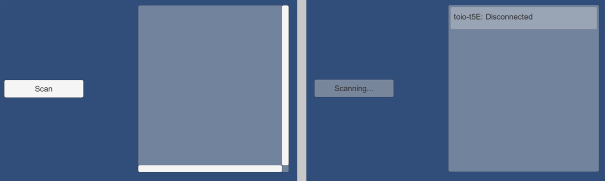

## Sample_ConnectName_BasicUI

このサンプルは、スキャンしたキューブのLocal Nameを画面にリストアップし、ユーザーが選択して接続・切断するサンプルです。

<div align="center">

</div>
<br>

【Scan】ボタンを押してキューブのスキャンを開始します。
スキャンは10秒ほど継続します。スキャンされたキューブはリストに表示されます。
電源オフなどでキューブが見つからなくなった場合は、リストから消えるようになっています。

スキャンされたキューブのリスト項目をクリックして、該当Local Nameのキューブと接続できます。

### 技術要点

スキャンのコールバックで、スキャンされた peripherals を保存し、`Update`関数でGUIのリストの更新を行っています。
以下が主な更新コードです。

```csharp
void Update ()
{
    // ...
    // Display scanned items
    foreach (var peripheral in this.scannedPeripherals) {
        if (peripheral == null) continue;
        var item = TryGetCubeItem(peripheral);
        item.transform.SetSiblingIndex(idx++);
        addrsToRemove.Remove(peripheral.device_address);
    }
    // ...
}
```
※ 接続したキューブはスキャンされないので、表示するには別の処理が必要なので、詳しくはサンプルコードを参照してください。


### 注意事項

スキャンされたキューブが電源オフにされた場合、すぐには`OnScanUpdate`が返答したリストから消えません。
その状態で接続しようとしますと、基本的にタイムアウトになります。
しかしiOS/MacOSの場合、2回タイムアウトするとBLEデバイス自体へのアクセスができなくなる不具合が発生する可能性があります。

### 関連資料

- インスペクターで `ConnectType` (リアルとシミュレーターのどちらのキューブと接続するか) を設定できます。
`ConnectType` に関しては、[Sample_ConnectType](../../Sample_ConnectType/README.md)を参考にしてください。
- UIの作り方に関しては、[チュートリアル(UIの作成)](../../../../../../docs/tutorials_UI.md)を参考にしてください。
