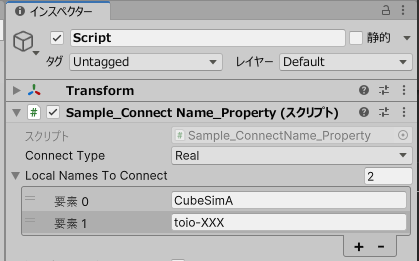

## Sample_ConnectName_Property

このサンプルは、事前にUnityエディタのインスペクターで接続するキューブの Local Name を設定し、実行時にスキャンできたキューブに接続するサンプルです。

<div align="center">

</div>
<br>

実行・ビルド前に：
- インスペクターで接続先`ConnectType`を設定します。`ConnectType`に関しては[Sample_ConnectType](../../Sample_ConnectType/README.md)を参照してください。
- インスペクターの「Local Names To Connect」項目で、接続したいキューブの Local Name を追加できます。（シミュレーターキューブの Local Name はゲームオブジェクトの名称になります。）

実行時：
- 実行開始時に自動的に設定したLocal Nameのキューブを検索して接続します。

### 技術要点

スキャンを開始し、スキャン結果を受け取るコールバック `OnScan` を設定します。

```csharp
new CubeScanner(this.connectType).StartScan(OnScan).Forget();
```

実行時にスキャンされたペリフェラルリストの中で、名前が `localNamesToConnect` に存在し、且つ今接続中でないものを選出し、接続をします。

```csharp
async void OnScan(BLEPeripheralInterface[] peripherals) {
    // ...

    foreach (var peri in peripherals) {
        if (!this.localNamesToConnect.Contains(peri.device_name)) continue;
        if (this.connectingNames.Contains(peri.device_name)) continue;

        // Connect cube ...
    }
}
```

### 関連資料

- インスペクターで `ConnectType` (リアルとシミュレーターのどちらのキューブと接続するか) を設定できます。
`ConnectType` に関しては、[Sample_ConnectType](../../Sample_ConnectType/README.md)を参考にしてください。
