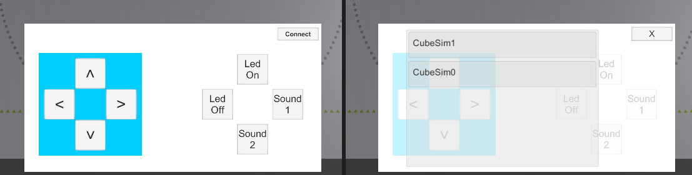

## Sample_ConnectName_UI

このサンプルは、スキャンしたキューブをUI上にリストアップし、選択したキューブを接続して、UIで操作を行えるサンプルです。

 

UI 右上のの【Connect】ボタンを押して、接続画面を開きます。同時にスキャンが開始されます。
スキャンされたキューブのローカルネームはリストに表示されますので、接続したいものをクリックして接続します。
接続完了すれば、UI上の操作ボタンでキューブを制御することができます。

### 関連資料

- インスペクターで `ConnectType` (リアルとシミュレーターのどちらのキューブと接続するか) を設定できます。
`ConnectType` に関しては、[Sample_ConnectType](../../Sample_ConnectType/README.md)を参考にしてください。
- UIの作り方に関しては、[チュートリアル(UIの作成)](../../../../../../docs/tutorials_UI.md)を参考にしてください。
