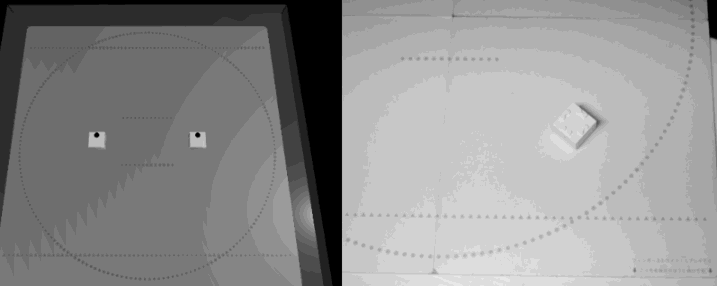
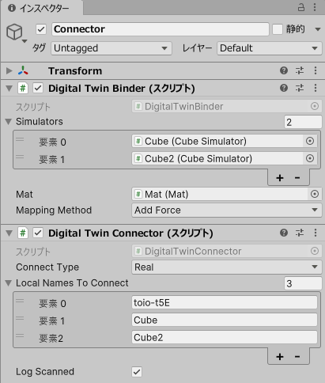

## Sample_DigitalTwin

This sample implements a so-called "Digital Twin", which reflects the movements of a real cube in real time to a simulator cube.

 

There are three scripts:
- `DigitalTwinBinder.cs`: Script implementing the "Digital Twin" function
- `DigitalTwinConnecter.cs`: Script for connecting to the cube
- `Sample_DigitalTwin.cs`: Main script controlling the connected cube

### Usage of the Sample

#### Case A: Connect to a real cube and reflect its movements on the digital twin in the simulator.
1. Set `Connect Type` in `Sample_DigitalTwin.cs` to `Real`.
1. Add the local names of the cubes you want to connect to in `Local Names To Connect`.
1. (Optional) Configure the settings for specifying and mapping simulator cubes to be used as digital twins in `DigitalTwinBinder.cs`.

#### Case B: Connect to a simulator cube without using a digital twin
1. Set `Connect Type` in `Sample_DigitalTwin.cs` to `Simulator`.
1. Add the local names (object names) of the cubes you want to connect to in `Local Names To Connect`.

#### Example

In this diagram, a real cube named "toio-t5E" and simulator cubes named "Cube" and "Cube2" are added as connection targets. At the same time, the simulator cubes "Cube" and "Cube2" are set as digital twins to reflect the movements of the real cube. When the Connect Type is Real, it connects to "toio-t5E" and only "Cube" acts as a digital twin. However, when the Connect Type is Simulator, both "Cube" and "Cube2" are connected.

 

### Parameters of `DigitalTwinBinder.cs`

- `Simulators`: Simulator cubes reproducing real cubes
- `Mat`: Mat where simulator cubes are placed
- `Mapping Method`: Method for mapping coordinates and angles
  - `Direct`: Set the coordinates and angles of the real cube directly to the simulator cube
    - High real-time performance
    - The information is noisy, and the simulator cube appears to vibrate
  - `AddForce`: Apply force to the simulator cube towards the coordinates and angles of the real cube
    - Slight delay may be felt
    - Vibration is suppressed
    - If the objects on the simulator collide, a more stable movement is expected
