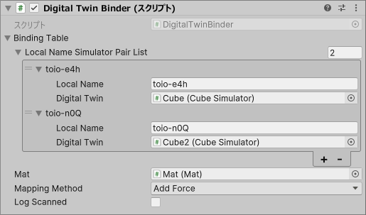

## Sample_DigitalTwin

This sample implements a so-called "Digital Twin", which reflects the movements of a real cube in real time to a simulator cube.

 

There are three scripts:
- `DigitalTwinBinder.cs`: Script implementing the connection of real cube's local name and specified simulator, and reflecting its movements
- `Sample_DigitalTwin.cs`: Main script controlling the connected cube

### Usage of the Sample

 

In the inspector of the GameObject `Binder`, set the local name of the real cube you want to connect to in the `Binding Table`, along with the simulator cube where you want to replicate its movements.

In this example, if you can connect to a real cube with the local name `toio-e4h`, its movements will be replicated in a simulator cube named `Cube`; if you can connect to `toio-n0Q`, the movements will be replicated in `Cube2`. If a connection cannot be established, the corresponding simulator will not move. It will not connect to cubes with local names not listed in the settings.

Set other parameters (refer to the next section) as desired and execute/build.

### Parameters of `DigitalTwinBinder.cs`

- `Binding Table`: Table of real cube's local name and specified simulator
- `Mat`: Mat where simulator cubes are placed
- `Mapping Method`: Method for mapping coordinates and angles
  - `Direct`: Set the coordinates and angles of the real cube directly to the simulator cube
    - High real-time performance
    - The information is noisy, and the simulator cube appears to vibrate
  - `AddForce`: Apply force to the simulator cube towards the coordinates and angles of the real cube
    - Slight delay may be felt
    - Vibration is suppressed
    - If the objects on the simulator collide, a more stable movement is expected
