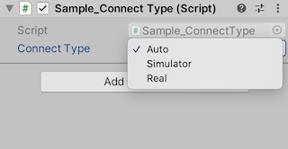

## Sample_ConnectType

This sample is to check if the connection settings are different between Simulator and the real environment.

You can change the way you connect to Cube by switching the Connect Type in Unity's Inspector.